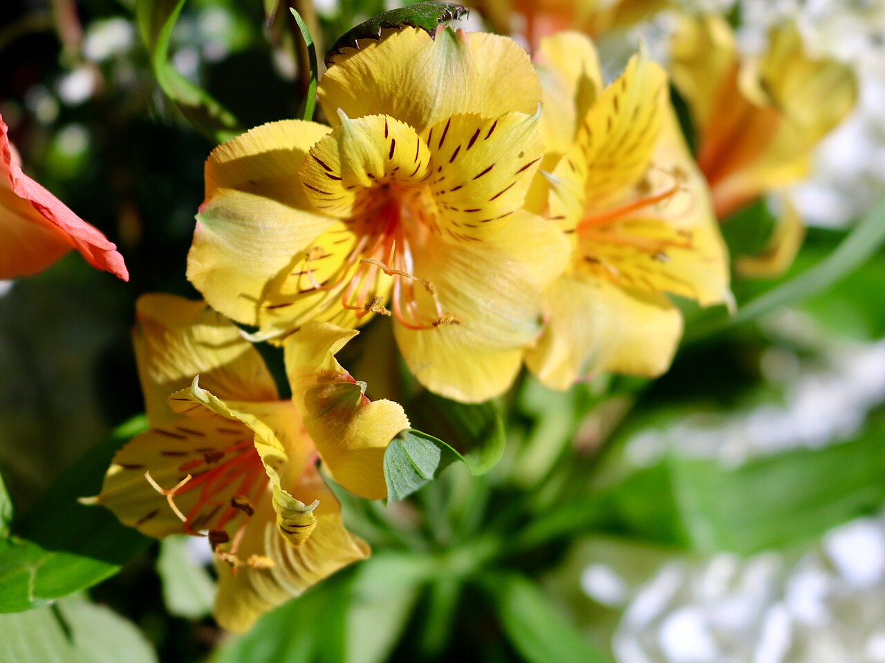
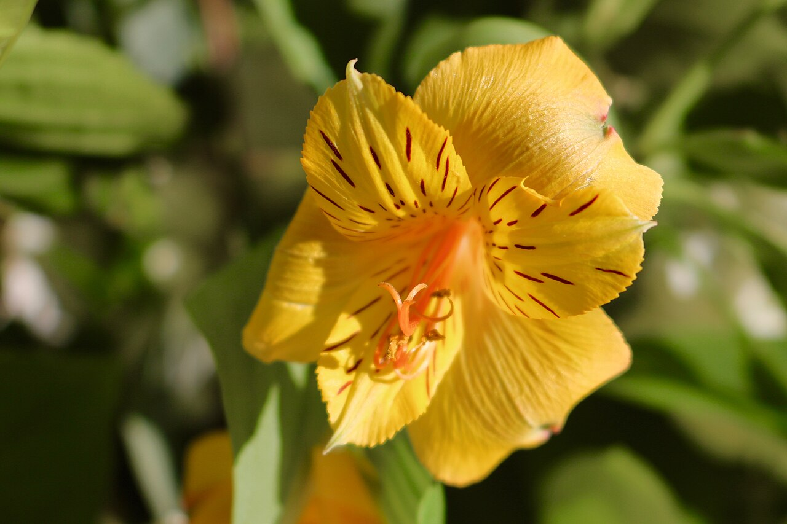
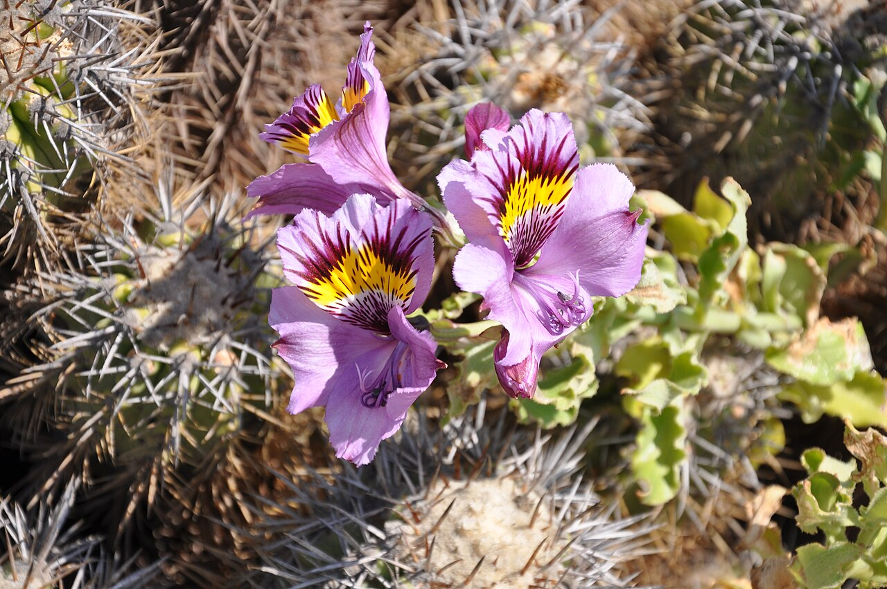
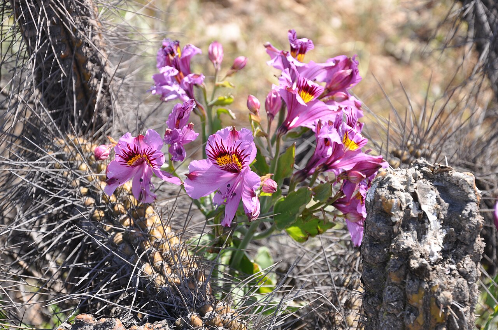

# Alstroemeria

> The "Peruvian lily" — an Andean native whose twisted leaves make it the
> florist's emblem of friendship and devotion, and one of the longest-lasting
> flowers in the vase.

## Botanical identity
- **Common name(s):** Alstroemeria; Peruvian lily; Lily of the Incas; Inca lily
- **Scientific name:** *Alstroemeria* spp.
- **Family:** Alstroemeriaceae
- **Type:** Form flower (small, clustered, lily-like) — often used as a filler/
  secondary

## Native region & origin
- **Native to:** **South America** — chiefly the **Andes** (Peru, Chile,
  Brazil, Argentina). Chilean and Brazilian species are the main breeding stock.
- **Now cultivated in:** Colombia, the Netherlands, and worldwide as a top cut
  flower.
- **Domestication / spread notes:** Named by **Linnaeus** after his friend
  **Baron Clas Alströmer**, who collected its seeds in the 1750s. Modern florist
  alstroemeria is a 20th-century hybridization achievement.

## Visual identification (for reading a photo)
- **Bloom form:** Clusters of small, **lily-like trumpets** (several open per
  stem), each with **streaks, freckles, and flares** in the throat.
- **Size:** Small individual blooms; airy clustered heads.
- **Petals:** Six tepals — the upper ones typically marked with dark streaks and
  a contrasting (often yellow) flash.
- **Center:** Distinct **speckling/striping** guiding to the throat.
- **Color range:** White, yellow, orange, pink, red, purple, bicolor — nearly
  always marked/streaked.
- **Foliage/stem cues:** A tell-tale trait — the **leaves are resupinate (twisted
  upside-down)**, appearing to attach "backwards." This twist is its symbol.
- **Look-alikes:** True lilies (much larger, single big blooms) and azaleas. The
  small streaked trumpets in clusters + twisted leaves confirm alstroemeria.

## History & cultural background
A relatively modern florist flower with an Andean heritage. Its twisting leaves
inspired its dominant meaning — the ties, turns, and endurance of friendship —
making it a go-to "just because" and thank-you flower.

## Symbolism & meaning
- **General meaning:** **Friendship, devotion, and mutual support**; its
  **twisted leaves** are read as the twists and knots of a lasting bond. Also
  **prosperity, fortune, good luck, strength, and following your aspirations.**
- **By color:** Colors follow general meanings (see color-symbolism.md) — pink =
  affection/friendship, white = purity/support, orange = warmth/energy, yellow =
  cheer, red = love/passion.

## Cultural meanings across the world
- **South America (Andes / "Lily of the Incas"):** Its cultural anchor — named
  for the Inca world; associated with **wealth, prosperity, and good fortune**.
- **General / Western floristry:** Firmly the **flower of friendship and
  devotion**; a common gift between friends and a symbol of a supportive,
  enduring relationship. The eighth-anniversary-style "lasting bond" reading
  comes from the same twisted-leaf symbolism.
- **Note:** Because it is a modern ornamental with light historical baggage, it
  is a **safe, positive cross-cultural gift** with no strong funerary meaning.

## Typical pairings
- **Arranged with:** Roses, carnations, gerberas, lilies, and chrysanthemums —
  it stretches a bouquet and adds airy color.
- **Greenery/fillers:** Leatherleaf fern, ruscus; it often *is* the secondary
  filler.
- **Anchors:** Everyday mixed bouquets, friendship and thank-you arrangements.

## Occasions & events
- **Strongly associated with:** Friendship, thank-you, get-well, congratulations,
  and everyday "thinking of you" bouquets.
- **Avoid for:** Little to avoid; too casual/cheerful to carry solemn formality
  alone.

## Seasonality & availability
- **Natural season:** Summer bloom outdoors.
- **Commercial availability:** **Year-round** — a florist staple.
- **Vase life / care notes:** **Exceptional — up to ~2 weeks**; remove spent
  florets and lower leaves (leaves yellow before the flowers fade).

## Quick facts
- **Birth month:** — (no traditional month)
- **Wedding anniversary:** — (associated with friendship/devotion themes)
- **Notable toxicity/allergy:** Mildly toxic if ingested; **sap can cause contact
  dermatitis** (florists' "alstroemeria allergy").

## Reference images
<!-- IMAGES-START -->
Reference photos, all under reusable licenses (CC-BY / CC-BY-SA / CC0 / public domain) from Wikimedia Commons. Full attribution in [`image-manifest.json`](../images/image-manifest.json).

*Yellow bloom with orange — Montanabw · CC BY-SA 4.0*

*Yellow bloom with orange2 — Montanabw · CC BY-SA 4.0*

*Alstroemeria philippii Desierto Florido 2011 sector Quebradita 01 — Yastay · CC BY-SA 4.0*

*Alstroemeria philippii Desierto Florido 2011 sector Quebradita 02 — Yastay · CC BY-SA 4.0*
<!-- IMAGES-END -->

---
*Confidence / to-verify:* High on Andean origin, the Alströmer/Linnaeus naming,
the twisted-leaf trait, and the friendship symbolism.
