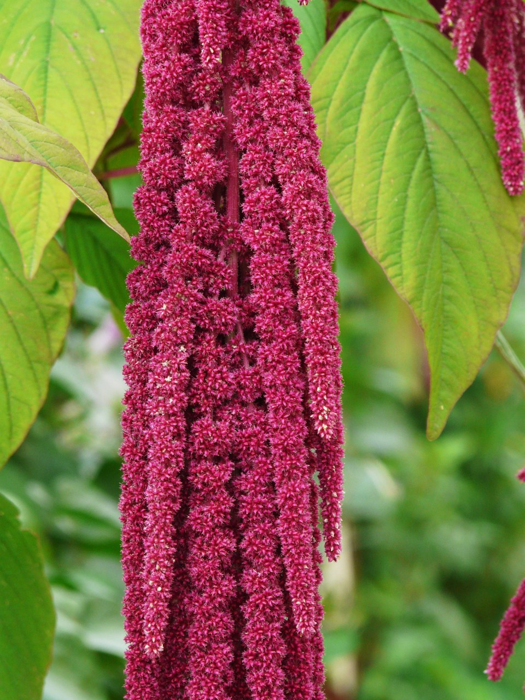
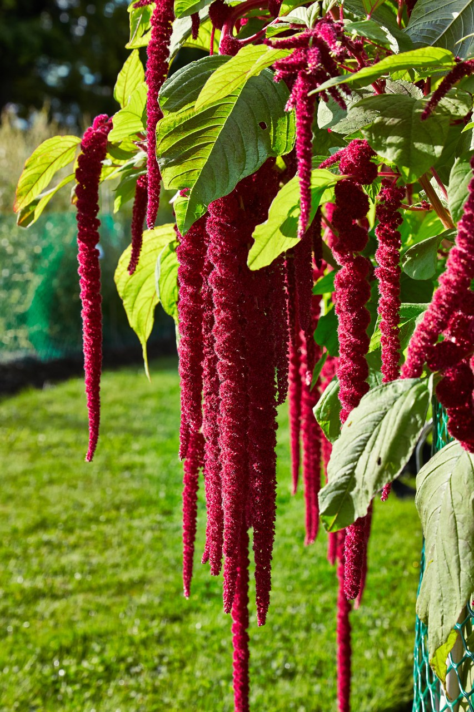
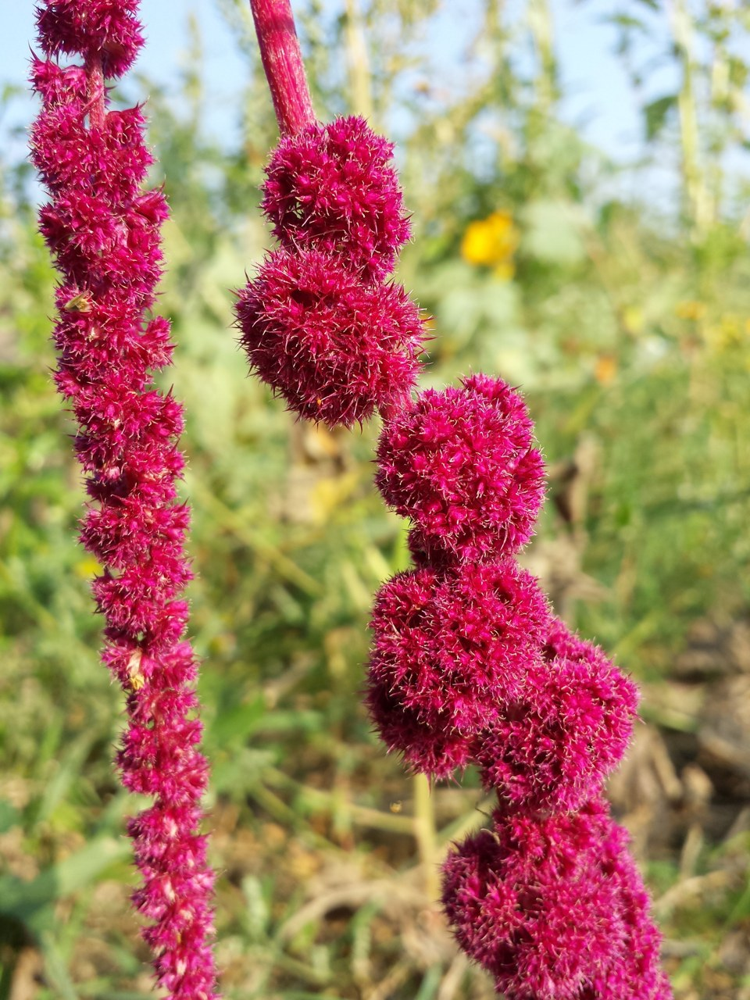
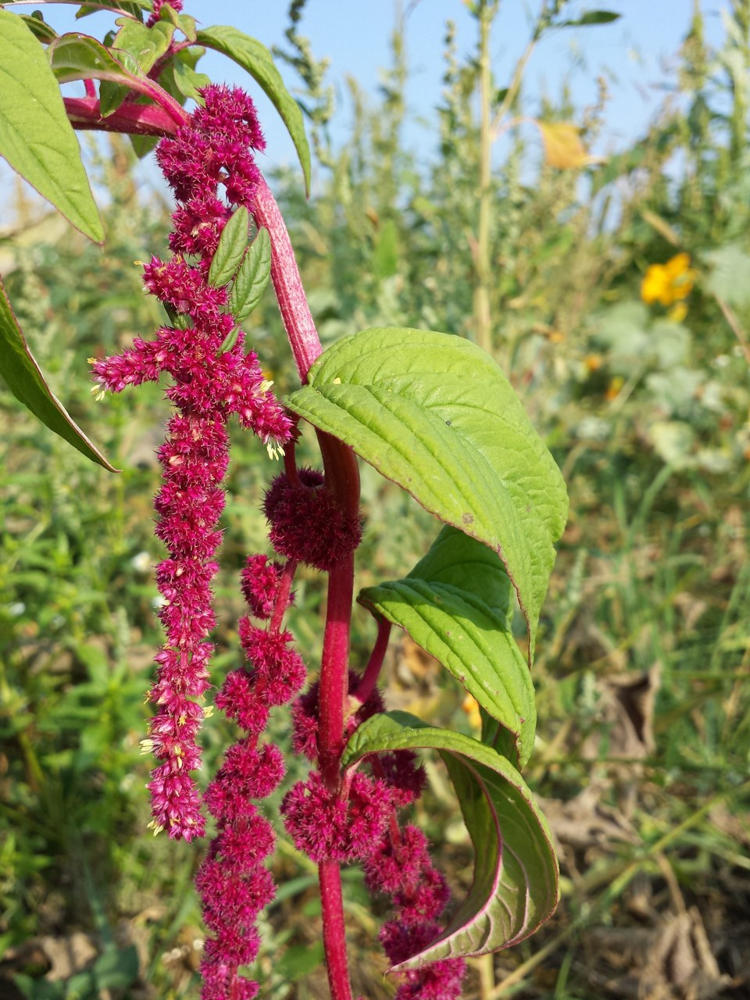

# Amaranthus (Love-Lies-Bleeding)

> Cascading crimson rope-tassels named for immortality — an Andean sacred grain
> and a Greek emblem of the unfading, undying flower.

## Botanical identity
- **Common name(s):** Amaranthus; love-lies-bleeding; tassel flower; velvet flower
- **Scientific name:** *Amaranthus caudatus* (trailing crimson); *A. cruentus*
  (upright plumes)
- **Family:** Amaranthaceae
- **Type:** Filler / line flower (dramatic trailing or upright)

## Native region & origin
- **Native to:** **South America** (the Andes) for *A. caudatus*; the genus is
  worldwide.
- **Now cultivated in:** Worldwide as an ornamental and a **grain crop**.
- **Domestication / spread notes:** The name is Greek *amarantos* — **"unfading,
  immortal"** — because the flowers hold color and don't wilt. A **staple grain**
  of the Aztecs and Inca (*huauhtli* / *kiwicha*).

## Visual identification (for reading a photo)
- **Bloom form:** Long, **velvety, rope-like tassels** that **drape and dangle**
  (*caudatus*), or dense **upright plumes** (*cruentus*).
- **Size:** Dramatic — trailing forms can hang well below the bouquet.
- **Petals:** None obvious; masses of tiny fuzzy florets form the tassel/plume.
- **Center:** N/A (the tassel is the feature).
- **Color range:** Deep crimson, burgundy, and lime-green.
- **Foliage/stem cues:** Broad, sometimes red-veined leaves; sturdy stems.
- **Look-alikes:** Celosia (its relative — crests or stiff plumes) and
  amaranthus-grain types; the dangling crimson tassels of "love-lies-bleeding"
  are unmistakable.

## History & cultural background
Sacred and edible in the Americas and "immortal" to the Greeks, amaranthus carries
a poignant name — love that "lies bleeding" yet never fades — and a dramatic,
draping form that has made it a modern design favorite.

## Symbolism & meaning
- **General meaning:** **Immortality, unfading love, and enduring affection** (the
  "immortal" name), alongside the poignant **"love-lies-bleeding"** reading of
  heartbreak and hopeless love (the drooping crimson tassels).
- **By color:**
  - **Crimson/Burgundy** — Deep, undying (or bleeding) love.
  - **Green** — Renewal, immortality.

## Cultural meanings across the world
- **Andes / Aztec & Inca:** A **sacred staple grain** (*huauhtli* / *kiwicha*);
  the Aztecs mixed amaranth seed with honey (and, in ritual, blood) to form
  **effigies of gods** — a practice the Spanish tried to ban. A symbol of
  sustenance and the sacred.
- **Greco-Roman:** The **"immortal flower"** — woven into wreaths for the gods and
  the dead to signify **immortality and remembrance**.
- **India / Asia:** Grown as a **grain** (*rajgira*), eaten during religious fasts.
- **Western / Victorian:** **"Love-lies-bleeding"** — hopeless or undying love,
  and immortality; a poignant, dramatic sentiment.

## Typical pairings
- **Arranged with:** Dahlias, roses, celosia, and autumnal blooms; the trailing
  form spills dramatically from bouquets and installations.
- **Greenery/fillers:** Its own foliage; textural greens.
- **Anchors:** Dramatic, cascading, autumnal, and "moody" arrangements.

## Occasions & events
- **Strongly associated with:** Autumn weddings and installations, dramatic/gothic
  designs, and remembrance (immortality).
- **Avoid for:** Small tidy posies — it wants room to trail.

## Seasonality & availability
- **Natural season:** Summer to autumn.
- **Commercial availability:** Best in season; **dries well**.
- **Vase life / care notes:** Long-lasting and dries beautifully; the trailing
  tassels keep their drama.

## Quick facts
- **Birth month:** — (a summer/autumn flower)
- **Wedding anniversary:** — (no standard year)
- **Notable toxicity/allergy:** **Non-toxic** — a food grain and leaf vegetable.

## Reference images
<!-- IMAGES-START -->
Reference photos, all under reusable licenses (CC-BY / CC-BY-SA / CC0 / public domain) from Wikimedia Commons. Full attribution in [`image-manifest.json`](../images/image-manifest.json).

*Amaranthus caudatus - Purple amaranth, Inca-wheat, Foxtail, Foxtail amaranth, Ta — Joost J. Bakker IJmuiden · CC BY 2.0*

*Amaranthus caudatus - Purple amaranth, Inca-wheat, Foxtail, Foxtail amaranth, Ta — Joost J. Bakker IJmuiden · CC BY 2.0*

*Amaranthus cruentus - Red amaranth, Indian-spinach, Sudan-spinach, Bush greens,  — Joost J. Bakker IJmuiden · CC BY 2.0*

*Amaranthus cruentus - Red amaranth, Indian-spinach, Sudan-spinach, Bush greens,  — Joost J. Bakker IJmuiden · CC BY 2.0*
<!-- IMAGES-END -->

---
*Confidence / to-verify:* High on the "immortal" etymology, Aztec/Inca sacred-grain
history, the love-lies-bleeding meaning, and the trailing-tassel ID.
