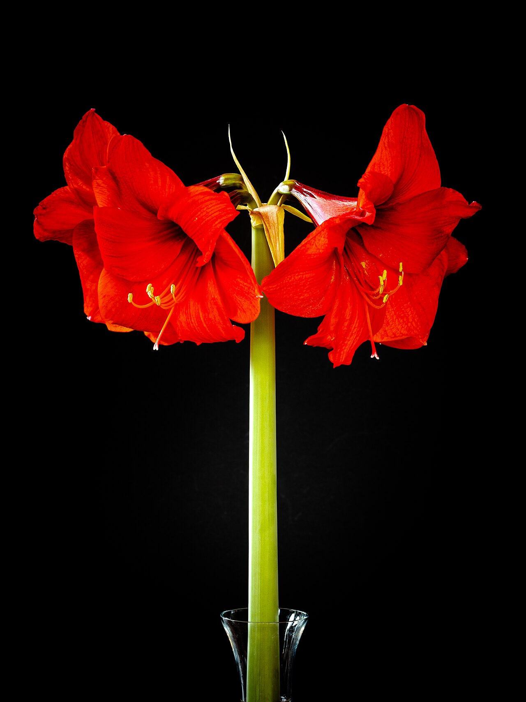
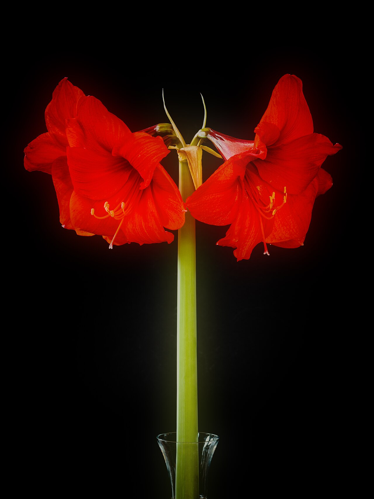
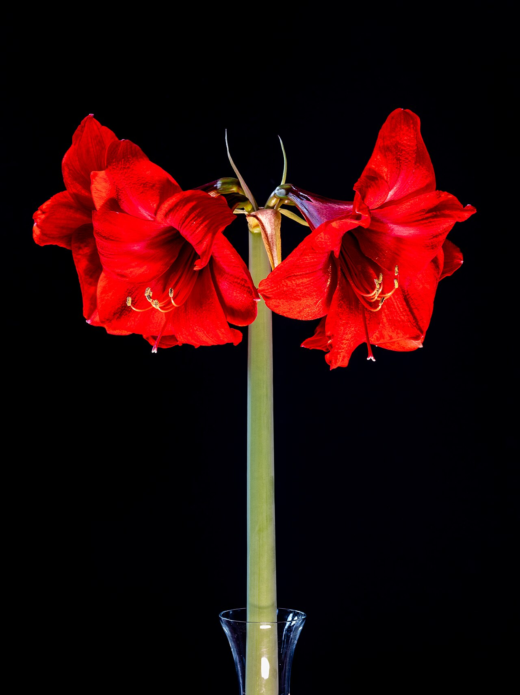
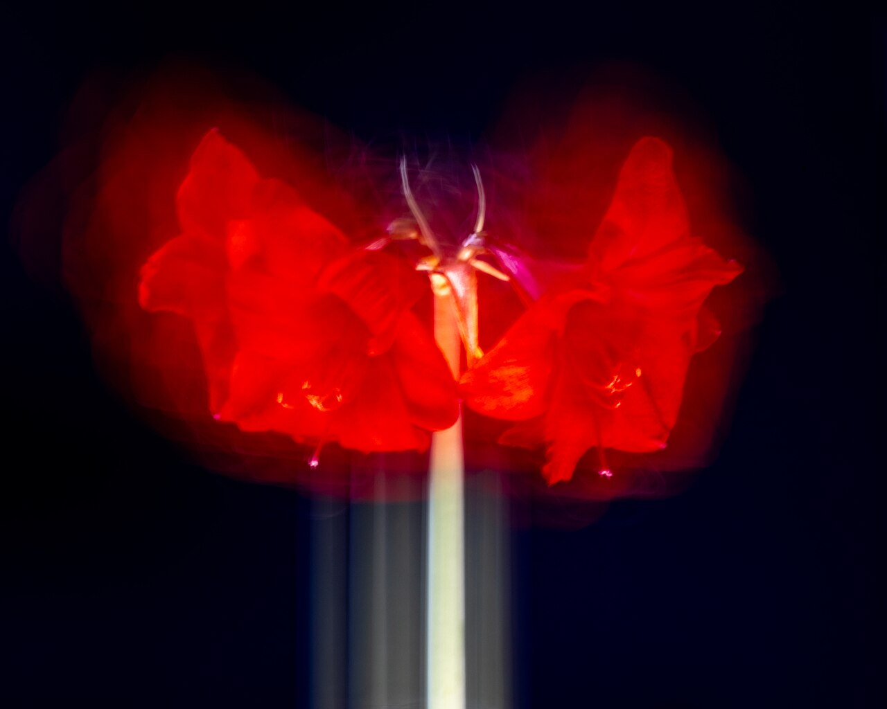

# Amaryllis (Hippeastrum)

> The towering, trumpet-crowned bulb of the winter holidays — a symbol of pride,
> determination, and a maiden's bloody-hearted devotion.

## Botanical identity
- **Common name(s):** Amaryllis (the florist name); knight's-star lily
- **Scientific name:** *Hippeastrum* spp. (the florist "amaryllis"); true
  *Amaryllis belladonna* is a different South African plant
- **Family:** Amaryllidaceae
- **Type:** Form flower (large trumpets on a tall stalk)

## Native region & origin
- **Native to:** **South America** — the tropical Andes and Brazil (*Hippeastrum*).
- **Now cultivated in:** The Netherlands, South Africa, and worldwide (forced as a
  winter/Christmas bulb).
- **Domestication / spread notes:** A naming muddle: the big holiday "amaryllis"
  is really **Hippeastrum**; true *Amaryllis* (belladonna, "naked lady") hails
  from South Africa. Bred heavily for the winter forcing trade.

## Visual identification (for reading a photo)
- **Bloom form:** Several huge **trumpet flowers** atop a tall, thick, **hollow,
  leafless stalk**.
- **Size:** Very large blooms; a dramatic, statuesque stem.
- **Petals:** Six broad tepals forming a wide trumpet/star.
- **Center:** Prominent long stamens and a central style.
- **Color range:** Red (classic), white, pink, salmon, and red-and-white striped.
- **Foliage/stem cues:** Strappy basal leaves; a notably **thick hollow stalk**.
- **Look-alikes:** True lilies (borne along a leafy stem) and amaryllis-relatives;
  the huge trumpets on a bare hollow stalk say Hippeastrum.

## History & cultural background
A staple of winter windowsills and Christmas gifting, the amaryllis carries a
Greek origin story of determined love — a maiden who won a shepherd's heart
through her own sacrifice.

## Symbolism & meaning
- **General meaning:** **Pride, determination, radiant beauty, strength, and
  success** — fitting for its tall, proud stalk and bold bloom.
- **By color:**
  - **Red** — Love, passion, Christmas cheer.
  - **White** — Purity, elegance.
  - **Pink** — Friendship, admiration.

## Cultural meanings across the world
- **Greco-Roman / mythological:** Named for **Amaryllis**, a shy maiden who, to
  win the shepherd Alteo, pierced her own heart nightly — and from her blood grew
  a striking crimson flower. Hence **determination, pride, and devoted love**.
- **South America (origin):** Native *Hippeastrum* of the Andes and Brazil, the
  wild source of today's cultivars.
- **Western / holiday:** The **Christmas amaryllis** — a classic winter forced
  bulb (red and white) symbolizing **cheer, splendor, and success** through the
  darkest months.

## Typical pairings
- **Arranged with:** Roses, pine, and evergreen in holiday designs; often shown
  solo for maximum drama.
- **Greenery/fillers:** Evergreen boughs, eucalyptus, its own strappy leaves.
- **Anchors:** Bold winter and Christmas arrangements; a tall statement bloom.

## Occasions & events
- **Strongly associated with:** Christmas and winter holidays, congratulations
  and "you did it" gifts (pride/success), and dramatic displays.
- **Avoid for:** Homes with pets (toxic); the tall hollow stalk needs support.

## Seasonality & availability
- **Natural season:** Forced for **winter** bloom (Dec–Feb); naturally spring/
  summer in the Southern Hemisphere.
- **Commercial availability:** Peaks in winter; sold as bulbs and cut stems.
- **Vase life / care notes:** Long-lasting (~2 weeks); support the heavy hollow
  stem and keep the cut end from splitting.

## Quick facts
- **Birth month:** — (a winter flower)
- **Wedding anniversary:** — (no standard year)
- **Notable toxicity/allergy:** **Toxic if ingested** (lycorine); keep from pets
  and children.

## Reference images
<!-- IMAGES-START -->
Reference photos, all under reusable licenses (CC-BY / CC-BY-SA / CC0 / public domain) from Wikimedia Commons. Full attribution in [`image-manifest.json`](../images/image-manifest.json).

*Amaryllis -- 2024 -- 9912 — Dietmar Rabich · CC BY-SA 4.0*

*Amaryllis -- 2024 -- 9912 (kreativ) — Dietmar Rabich · CC BY-SA 4.0*

*Amaryllis -- 2024 -- 9913 — Dietmar Rabich · CC BY-SA 4.0*

*Amaryllis -- 2024 -- 9917 — Dietmar Rabich · CC BY-SA 4.0*
<!-- IMAGES-END -->

---
*Confidence / to-verify:* High on the Hippeastrum-vs-true-Amaryllis distinction,
South American origin, the Amaryllis/Alteo myth, and the Christmas association.
