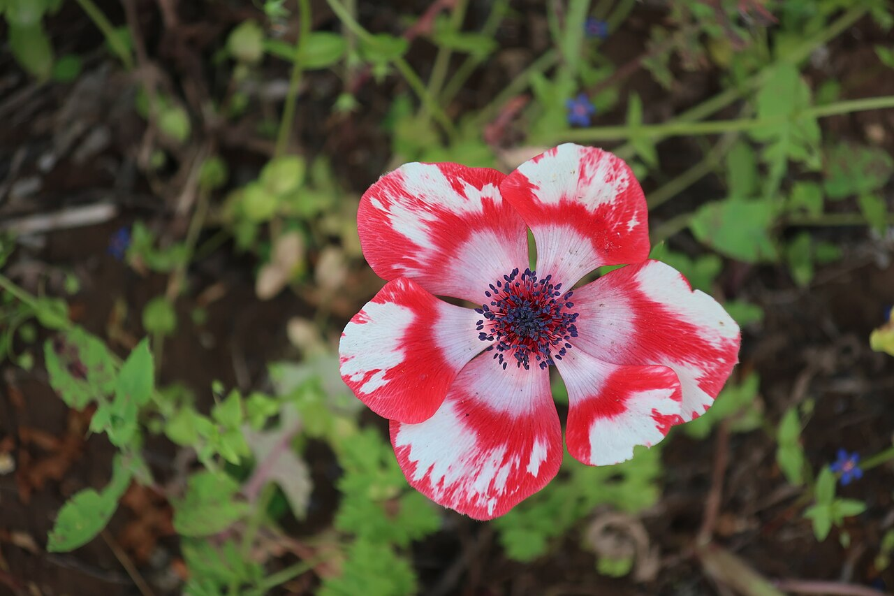
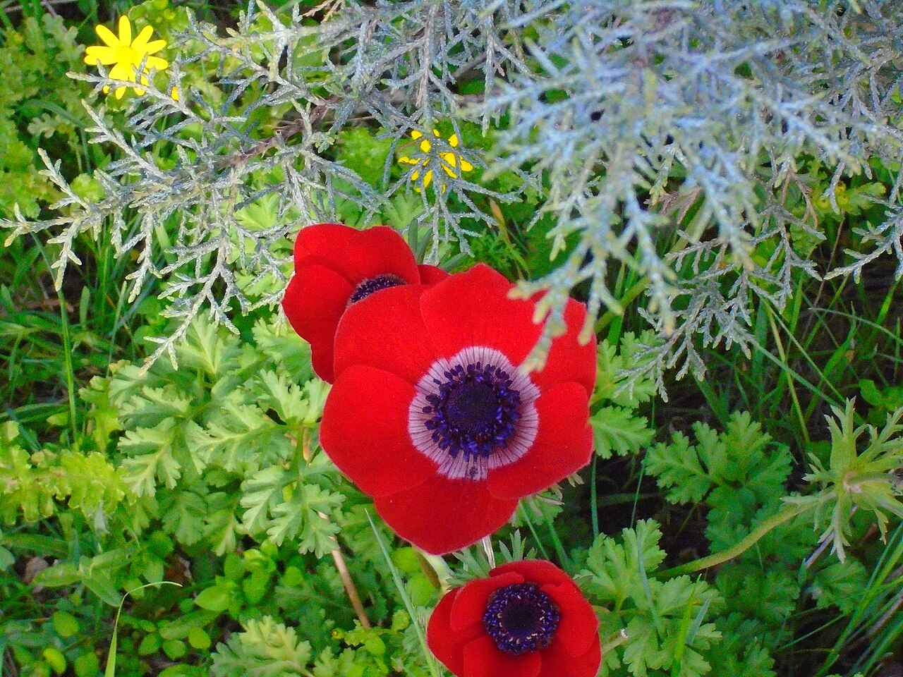
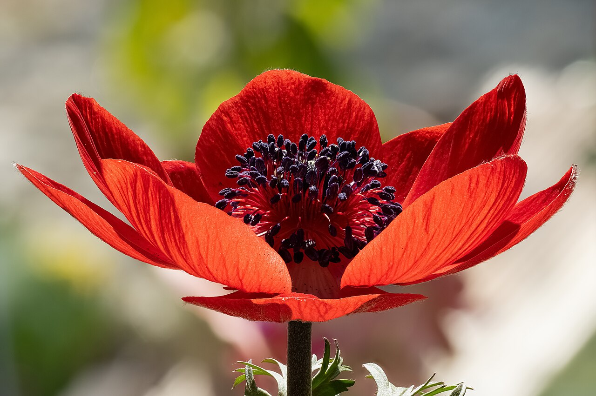
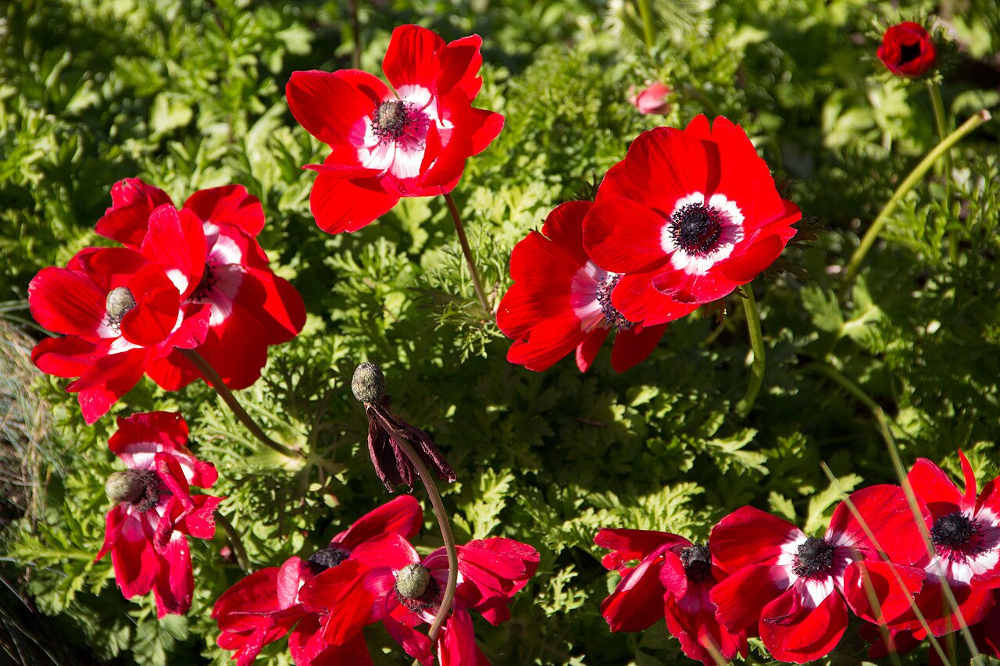

# Anemone

> The "windflower" with a dramatic dark eye — a bloom pulled between opposite
> meanings: anticipation and protection on one side, forsaken love and death on
> the other.

## Botanical identity
- **Common name(s):** Anemone; windflower; poppy anemone
- **Scientific name:** *Anemone coronaria* (the florist type; the genus is large)
- **Family:** Ranunculaceae
- **Type:** Form flower

## Native region & origin
- **Native to:** The **Mediterranean**, Europe, and Asia (*A. coronaria* around
  the Mediterranean and Middle East).
- **Now cultivated in:** Italy, Israel, the Netherlands, and worldwide.
- **Domestication / spread notes:** The name is Greek for **"daughter of the
  wind"** — folklore said the blooms opened only when the wind blew, hence
  "windflower."

## Visual identification (for reading a photo)
- **Bloom form:** A single (or double) ring of **broad petals around a
  prominent dark, often black, center** — the famous "panda" look in white types.
- **Size:** Medium, on a slender stem.
- **Petals:** 5–8+ satiny petal-like sepals; flat, poppy-like.
- **Center:** A **dense dark boss** of stamens — the flower's signature.
- **Color range:** Red, white, blue, purple, pink, and bicolor, almost always
  with the dark eye.
- **Foliage/stem cues:** Ferny, finely divided leaves; a ruff of leaflets below
  the bloom.
- **Look-alikes:** Ranunculus (fuller, many thin petals, green button center, no
  black eye) and poppies (crumpled petals). The **dark eye + few flat petals**
  says anemone.

## History & cultural background
Few flowers are so double-edged. To the Greeks it was born of grief; to
Christians it recalled the Passion; in the modern florist trade its striking
black eye makes it a chic, high-contrast wedding favorite.

## Symbolism & meaning
- **General meaning:** **Anticipation** (of something exciting) and **protection
  against evil/ill luck**, but also — contradictorily — **forsaken love,
  fragility, and death/bad luck** in older and some cultural readings.
- **By color:**
  - **Red** — The blood of Christ, sorrow; also love.
  - **White** — Sincerity, protection, anticipation.
  - **Purple/Blue** — Protection against evil, belief.

## Cultural meanings across the world
- **Greco-Roman / mythological:** Said to have sprung from **Aphrodite's tears**
  as she mourned **Adonis** (or from his blood) — the root of its **forsaken love
  and death** symbolism.
- **Christian (Europe):** The **red anemone** signifies the **blood and Passion of
  Christ**; it appears in Crucifixion art.
- **Israel / Middle East:** *A. coronaria* (the **kalanit**) is the **national
  flower of Israel**; red anemones carpet the land in late winter, celebrated in
  the "Red South" (Darom Adom) bloom festival.
- **Egypt / East Asia:** Read in some traditions as an emblem of **illness** or a
  **death flower** — reinforcing its darker side.
- **Western / Victorian:** **Anticipation** and **protection**, alongside the
  "forsaken love" thread — a flower whose meaning hangs on context.

## Typical pairings
- **Arranged with:** Ranunculus, roses, tulips, and hellebores; its dark center
  adds contrast to soft palettes.
- **Greenery/fillers:** Its own ferny foliage, light greens.
- **Anchors:** Chic, high-contrast wedding and spring bouquets.

## Occasions & events
- **Strongly associated with:** Weddings (esp. the white/black "panda" form),
  spring, and stylish modern bouquets.
- **Avoid for:** Be mindful in cultures where it reads as a death/illness flower.

## Seasonality & availability
- **Natural season:** Late winter to spring.
- **Commercial availability:** Best autumn through spring.
- **Vase life / care notes:** ~5–8 days; they **keep growing and moving toward
  light** in the vase, and petals close at night and in the dark.

## Quick facts
- **Birth month:** — (sometimes cited for a spring/September association)
- **Wedding anniversary:** — (no standard year)
- **Notable toxicity/allergy:** **Toxic if ingested** (protoanemonin); sap
  irritates skin — a Ranunculaceae trait.

## Reference images
<!-- IMAGES-START -->
Reference photos, all under reusable licenses (CC-BY / CC-BY-SA / CC0 / public domain) from Wikimedia Commons. Full attribution in [`image-manifest.json`](../images/image-manifest.json).

*Anemone (Red and white) — Davidbena · CC BY-SA 4.0*

*Red Anemone coronaria in Jordan — JeedaGhazal · CC BY-SA 4.0*

*Anemone coronaria focus stack-20220320-RM-144602 — Ermell · CC BY-SA 4.0*

*Anemone coronaria — Izziekins · CC BY-SA 4.0*
<!-- IMAGES-END -->

---
*Confidence / to-verify:* High on the windflower etymology, the Adonis myth, the
Christian red-anemone meaning, Israel's national flower, and the dark-eye ID.
