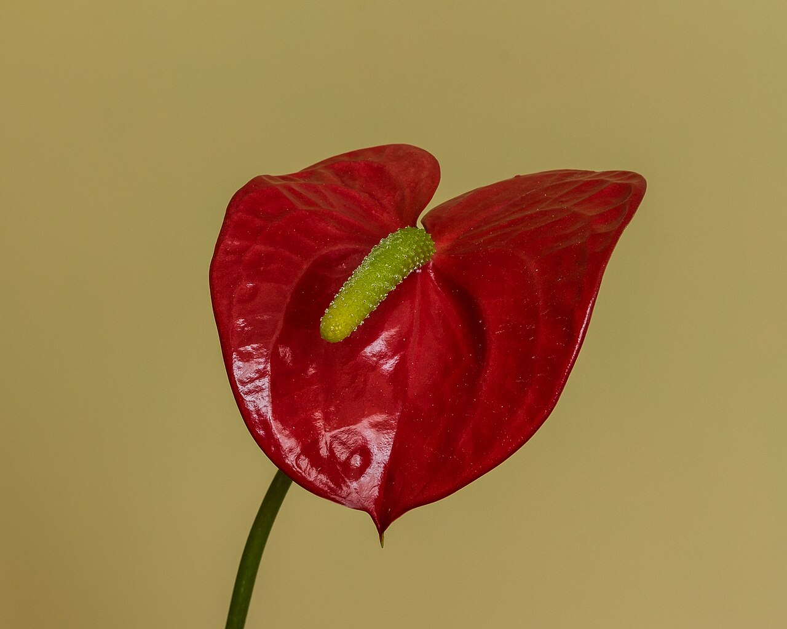
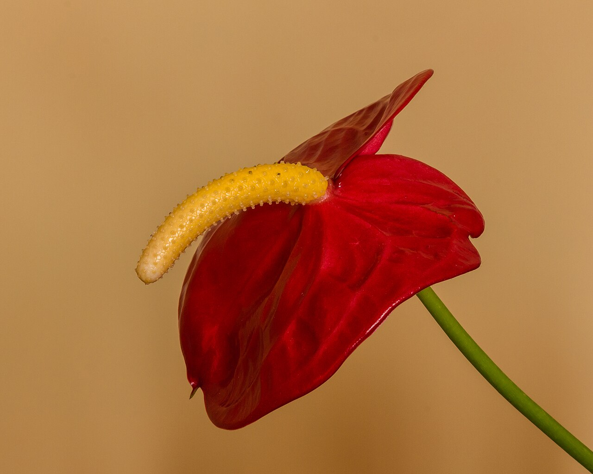
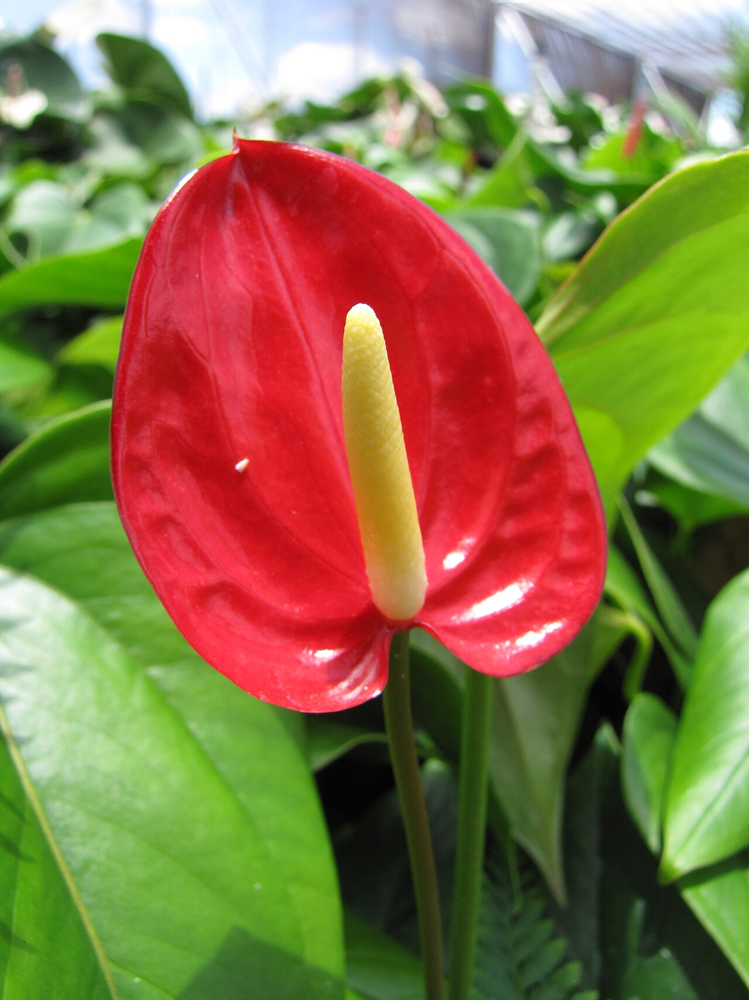
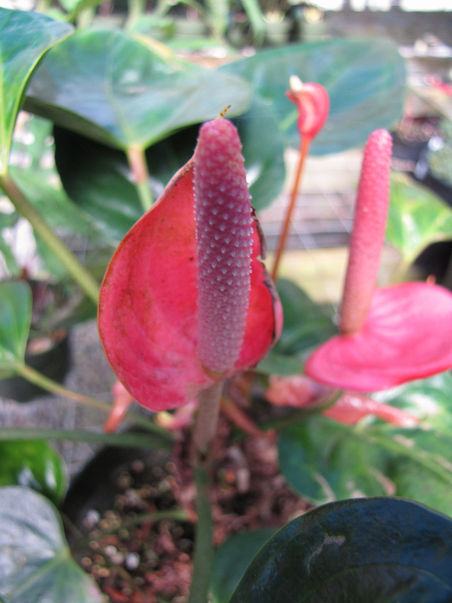

# Anthurium

> The glossy, lacquered "heart" flower — a tropical American bloom of hospitality
> and abundance whose waxy red spathe looks almost artificial.

## Botanical identity
- **Common name(s):** Anthurium; flamingo flower; laceleaf; painter's palette;
  tailflower
- **Scientific name:** *Anthurium andraeanum* (and *A. scherzerianum*)
- **Family:** Araceae (the arum family — like the calla lily)
- **Type:** Form flower

## Native region & origin
- **Native to:** **Central and South America** — Colombia and Ecuador especially.
- **Now cultivated in:** **Hawaii** (a signature crop), the Netherlands, and the
  tropics worldwide.
- **Domestication / spread notes:** The name is Greek — *anthos* (flower) + *oura*
  (tail) — for the tail-like spadix. One of the longest-lasting cut flowers in
  the trade.

## Visual identification (for reading a photo)
- **Bloom form:** A single, flat, glossy, **heart-shaped spathe** (a modified
  leaf) with a protruding finger-like **spadix**.
- **Size:** Medium; strikingly waxy and shiny.
- **Petals:** None as such — the showy "flower" is a lacquered **spathe**; the
  true tiny flowers stud the spadix.
- **Center:** The straight or curled **spadix** (white, yellow, pink, or red).
- **Color range:** Red (classic), pink, white, green, orange, purple, and bicolor.
- **Foliage/stem cues:** Glossy heart-shaped leaves; long smooth stems.
- **Look-alikes:** Calla lily (its spathe is furled into a cone; the anthurium's
  lies flat and heart-shaped). The lacquered flat heart + spadix says anthurium.

## History & cultural background
A tropical American native that became a global emblem of exotic hospitality,
especially through its Hawaiian cultivation. Its almost plastic-looking sheen and
heart shape make it a modern, long-lasting statement flower.

## Symbolism & meaning
- **General meaning:** **Hospitality, abundance, and happiness**; the heart shape
  reads as **love**, and — via the prominent spadix — the flower also carries an
  old note of **fertility and frank sensuality**.
- **By color:**
  - **Red** — Passion, love, hospitality.
  - **White** — Purity, grace.
  - **Pink** — Affection, admiration.

## Cultural meanings across the world
- **Central/South America (origin):** Native to the rainforests of Colombia and
  Ecuador — the wild source of the cultivated flower.
- **Hawaii, USA:** A major crop and a symbol of **tropical hospitality and
  welcome**; used in arrangements and given as a warm greeting.
- **General symbolism:** Its heart form makes it a token of **love and open
  hospitality**; long vase life adds a meaning of **enduring** affection.
- **Note:** A modern exotic; broadly positive, with no strong funerary reading.

## Typical pairings
- **Arranged with:** Bird of paradise, orchids, protea, and tropical foliage;
  often used solo for its bold, clean line.
- **Greenery/fillers:** Monstera, ti leaves, palm, tropical greens.
- **Anchors:** Modern, tropical, and minimalist arrangements.

## Occasions & events
- **Strongly associated with:** Welcome and hospitality gifts, tropical and
  modern designs, congratulations, and long-lasting displays.
- **Avoid for:** Homes with pets (toxic); very traditional pastel bouquets.

## Seasonality & availability
- **Natural season:** Year-round (tropical).
- **Commercial availability:** **Year-round.**
- **Vase life / care notes:** Exceptional — often **2–3 weeks**; wipe the spathe
  to keep its shine and recut the stem.

## Quick facts
- **Birth month:** — (not a traditional birth flower)
- **Wedding anniversary:** — (no standard year)
- **Notable toxicity/allergy:** **Toxic if ingested** — calcium oxalate crystals
  (mouth/throat irritation); keep from pets and children.

## Reference images
<!-- IMAGES-START -->
Reference photos, all under reusable licenses (CC-BY / CC-BY-SA / CC0 / public domain) from Wikimedia Commons. Full attribution in [`image-manifest.json`](../images/image-manifest.json).

*Anthurium (Flamingoplant) 12-08-2019 (actm) 01 — Agnes Monkelbaan · CC BY-SA 4.0*

*Anthurium (Flamingoplant) 12-08-2019 (actm) 03 — Agnes Monkelbaan · CC BY-SA 4.0*

*Starr-100623-7786-Anthurium andraeanum-red flowers potted plants in shade house- — Forest and Kim Starr · CC BY 3.0 us*

*Starr-110124-0283-Anthurium andraeanum-red flower-Sacred Garden of Maliko-Maui — Forest and Kim Starr · CC BY 3.0 us*
<!-- IMAGES-END -->

---
*Confidence / to-verify:* High on tropical-American origin, Hawaiian cultivation
and hospitality meaning, the Araceae/spathe-spadix structure, and toxicity.
