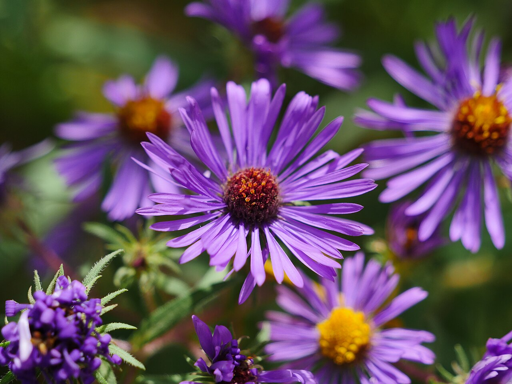
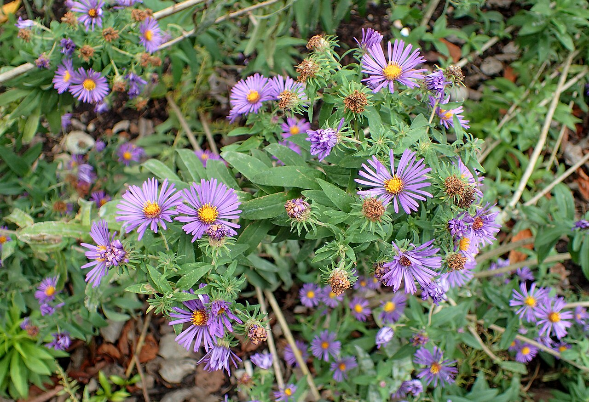
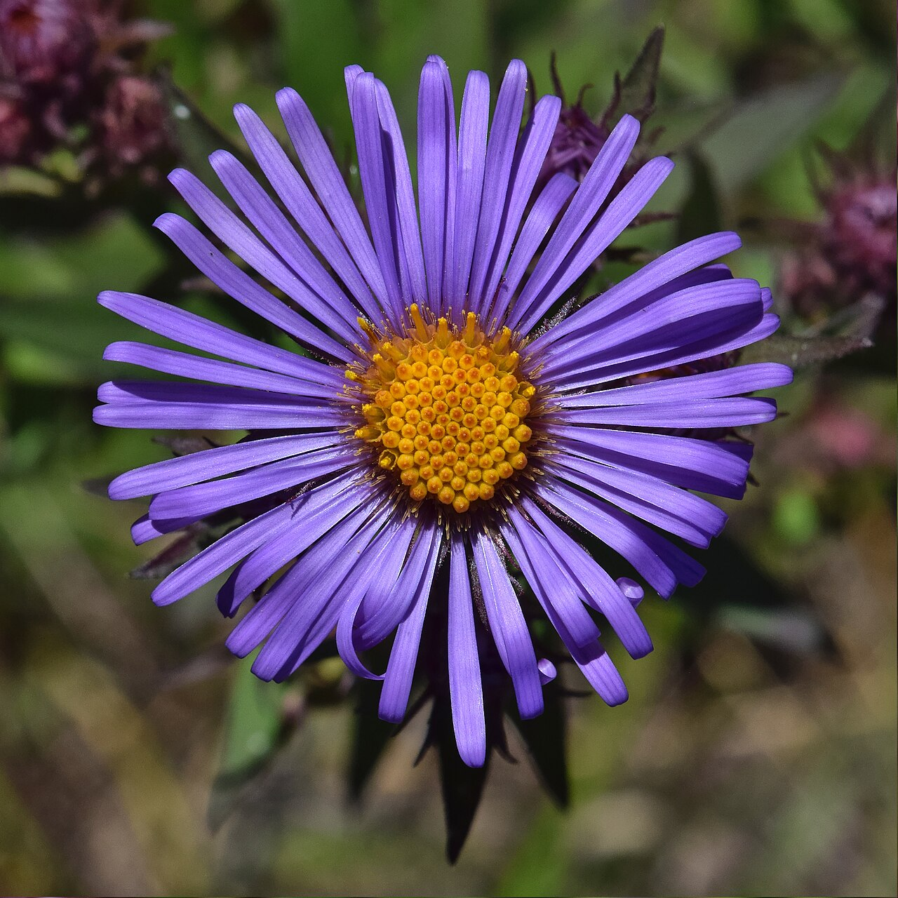
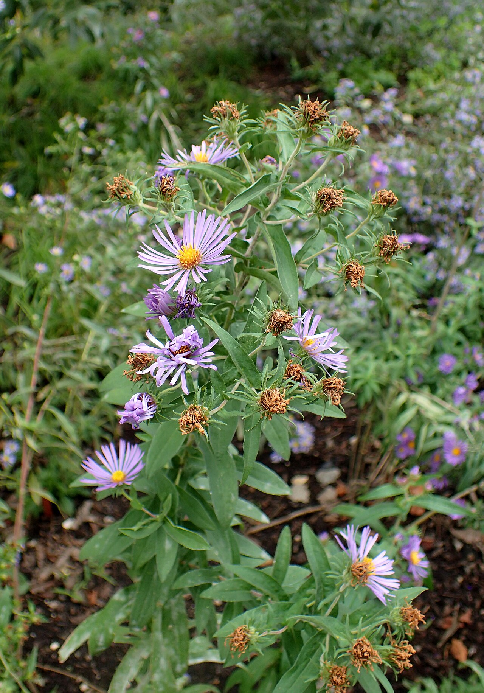

# Aster

> The "star" flower of late summer — September's bloom, a talisman of love and
> patience, and a bloom the ancients laid on altars and graves.

## Botanical identity
- **Common name(s):** Aster; Michaelmas daisy; New England aster; starwort
- **Scientific name:** *Aster* spp. (Old World) and *Symphyotrichum* spp. (New
  World, e.g. New England aster)
- **Family:** Asteraceae
- **Type:** Daisy-form flower (small, many-rayed)

## Native region & origin
- **Native to:** **Eurasia** (true *Aster*) and **North America** (the reclassified
  *Symphyotrichum*, including the New England aster).
- **Now cultivated in:** Worldwide as a garden and cut flower.
- **Domestication / spread notes:** The name is Greek for **"star"** — for the
  radiating, star-like ray petals. Many familiar garden "asters" are actually
  American *Symphyotrichum*.

## Visual identification (for reading a photo)
- **Bloom form:** A small **daisy-form star** — many **thin ray petals** around a
  yellow central disc, borne in profuse sprays.
- **Size:** Small blooms, many per stem.
- **Petals:** Numerous fine rays (more and thinner than a daisy's).
- **Center:** A small yellow (aging to reddish) disc.
- **Color range:** Purple, blue, lavender, pink, magenta, and white — nearly
  always yellow-centered.
- **Foliage/stem cues:** Slender, sometimes hairy stems; small narrow leaves;
  bushy sprays.
- **Look-alikes:** Daisy (fewer, broader white rays), chrysanthemum (denser,
  larger), fleabane. The aster's **many thin colorful rays in airy sprays** is
  the tell.

## History & cultural background
To the Greeks the aster was a literal fallen star; its late bloom made it the
flower of autumn's turn. It has long served as both a **charm of love** and a
**flower of remembrance** placed on graves.

## Symbolism & meaning
- **General meaning:** **Love, patience, wisdom, and faith**; daintiness; a
  talisman of love, and an **"afterthought"** ("I'll think of you").
- **By color:**
  - **Purple** — Wisdom, royalty, the most traditional aster color.
  - **Blue** — Faith, serenity.
  - **Pink** — Love, sensitivity.
  - **White** — Innocence, new beginnings.

## Cultural meanings across the world
- **Greco-Roman / mythological:** Said to have sprung from the tears of the star-
  goddess **Astraea** weeping over a starless earth (or, in another telling, tied
  to Virgo). Ancient Greeks **burned aster leaves to ward off evil and serpents**
  and laid the flowers on **altars for the gods**.
- **France:** Asters were placed on the **graves of fallen soldiers** as a symbol
  of remembrance and an "afterthought" — a wish that things had gone differently.
- **Western / Victorian:** A **talisman of love** and daintiness; the **September
  birth flower** and the flower of the 20th anniversary.
- **Note:** Broadly positive, with a gentle thread of remembrance.

## Typical pairings
- **Arranged with:** Chrysanthemums, dahlias, sunflowers, and daisies in autumnal
  and cottage bouquets; a fine textural filler.
- **Greenery/fillers:** Solidago, its own sprays, seasonal foliage.
- **Anchors:** Autumn and wildflower-style arrangements; airy color and texture.

## Occasions & events
- **Strongly associated with:** Autumn, September birthdays, 20th anniversaries,
  remembrance, and expressions of love and patience.
- **Avoid for:** Few taboos; the grave/remembrance thread is historical, not a
  gifting barrier.

## Seasonality & availability
- **Natural season:** **Late summer to autumn.**
- **Commercial availability:** Best in season; some year-round supply.
- **Vase life / care notes:** ~5–10 days; long-lasting; strip lower foliage and
  keep water fresh.

## Quick facts
- **Birth month:** September
- **Wedding anniversary:** 20th
- **Notable toxicity/allergy:** Generally **non-toxic** and pet-safe.

## Reference images
<!-- IMAGES-START -->
Reference photos, all under reusable licenses (CC-BY / CC-BY-SA / CC0 / public domain) from Wikimedia Commons. Full attribution in [`image-manifest.json`](../images/image-manifest.json).

*New England Aster bloom — Avolphoto · CC BY-SA 4.0*

*Symphyotrichum novae-angliae kz1 — Krzysztof Ziarnek, Kenraiz · CC BY-SA 4.0*

*Symphyotrichum novae-angliae2 — The Cosmonaut · CC BY-SA 2.5 ca*

*Symphyotrichum novae-angliae kz2 — Krzysztof Ziarnek, Kenraiz · CC BY-SA 4.0*
<!-- IMAGES-END -->

---
*Confidence / to-verify:* High on the "star" etymology, Old/New World split,
September birth flower, and the Greek remembrance/warding lore.
