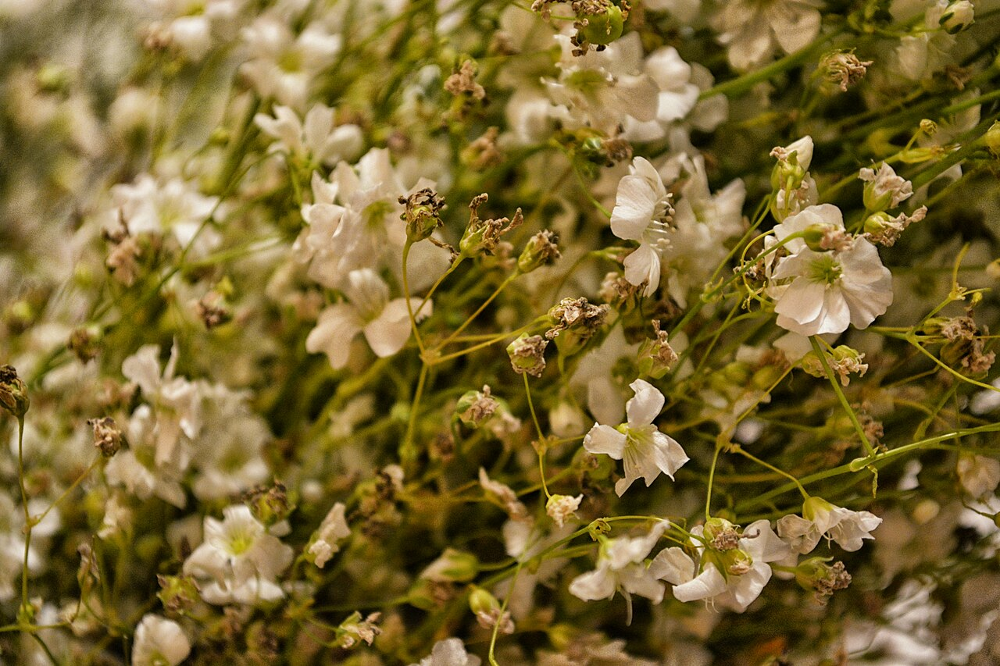
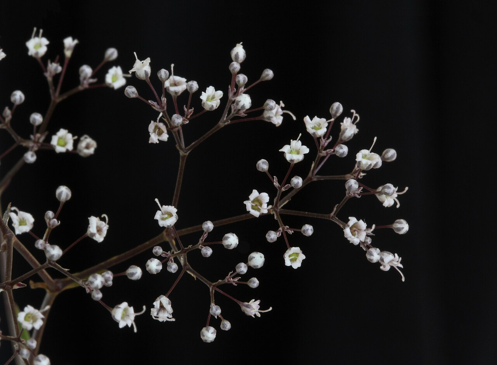
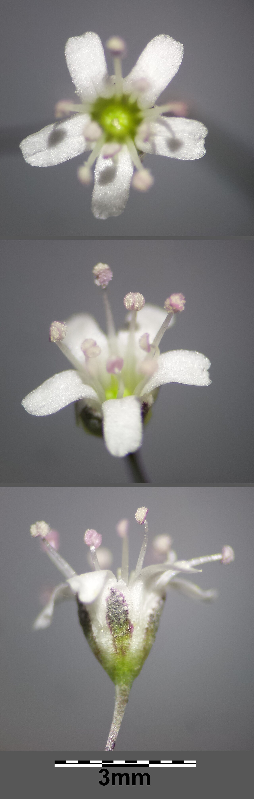
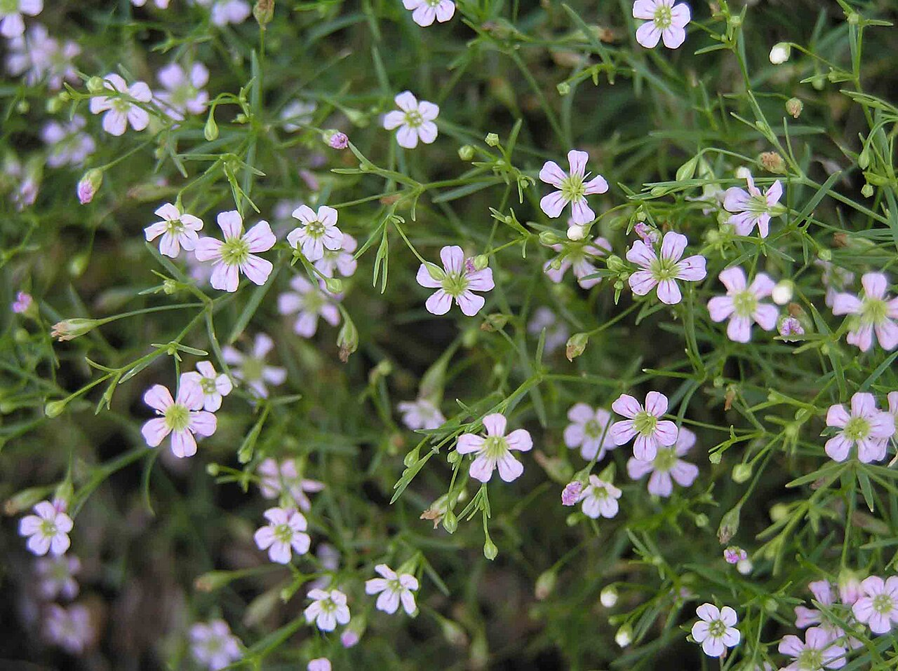

# Baby's Breath

> The airy white cloud that has filled bouquets for a century — long the humble
> supporting player, now fashionable enough to star on its own.

## Botanical identity
- **Common name(s):** Baby's breath; gypsophila; *kasumisou* ("mist grass,"
  Japan); *angae-kkot* ("fog flower," Korea)
- **Scientific name:** *Gypsophila paniculata* (and *G. elegans*)
- **Family:** Caryophyllaceae (the same family as the carnation)
- **Type:** Filler / spray flower

## Native region & origin
- **Native to:** **Eurasia** — central and eastern Europe across to Siberia and
  Central Asia.
- **Now cultivated in:** Worldwide as a cut-flower staple; a naturalized (and
  invasive) weed in parts of North America.
- **Domestication / spread notes:** The name *Gypsophila* means **"gypsum-
  loving"** — it thrives in chalky, calcium-rich soils. "Baby's breath" evokes
  its soft, delicate, innocent look.

## Visual identification (for reading a photo)
- **Bloom form:** Airy, branching **sprays** carrying **hundreds of tiny (2–6 mm)
  five-petaled flowers**, creating a soft cloud or mist.
- **Size:** Individually minute; collectively a billowing haze.
- **Petals:** Five small rounded petals per floret; singles or doubles.
- **Center:** Tiny; barely visible at arm's length.
- **Color range:** White (classic); natural pink (*G. elegans*); often **dyed**
  in bright colors commercially.
- **Foliage/stem cues:** Thin, wiry, blue-green stems with narrow paired leaves;
  a delicate, twiggy structure.
- **Look-alikes:** Wax flower (larger, waxy, star-shaped florets with darker
  centers) and sea lavender/statice (papery clusters). Baby's breath is the
  finest, cloudiest, and most uniform of the white fillers.

## History & cultural background
For most of the 20th century baby's breath was the unglamorous "filler" tucked
behind roses. A modern minimalist trend flipped that: it now appears **on its
own** in bouquets, arches, and crowns, prized for its soft, romantic texture.

## Symbolism & meaning
- **General meaning:** **Everlasting love, purity of heart, innocence, and
  sincerity;** also linked to **new babies** (the name and its gentle look).
- **By color:** Usually white — purity and innocence. Dyed versions borrow the
  general meaning of their color (see color-symbolism.md).

## Cultural meanings across the world
- **Korea:** Enormously popular as a trendy, romantic photo-and-gift flower
  (*angae-kkot*, "fog flower"); readings include a **pure, clear heart, sincere
  love, and reconciliation.**
- **Japan (hanakotoba):** *Kasumisou* ("mist grass") — **a pure heart,
  innocence, everlasting love, sincerity, and gratitude.**
- **Western (weddings):** The traditional emblem of **innocent, everlasting
  love** and the near-default wedding filler; increasingly a standalone romantic
  statement.
- **Note:** Almost universally positive and gentle; it carries essentially no
  funerary or negative baggage.

## Typical pairings
- **Arranged with:** Roses above all (the classic pairing), plus carnations,
  tulips, ranunculus, and nearly any focal flower needing softening.
- **Greenery/fillers:** Functions **as** the filler; pairs with light greens.
- **Anchors:** Romantic and rustic bouquets; modern all-baby's-breath designs,
  crowns, and arches.

## Occasions & events
- **Strongly associated with:** Weddings, new babies, Valentine's and romantic
  gifting, and as the finishing touch in mixed bouquets.
- **Avoid for:** Little to avoid; too delicate to carry a formal statement alone
  in solemn contexts (though modern use is broadening).

## Seasonality & availability
- **Natural season:** Summer bloom.
- **Commercial availability:** **Year-round.**
- **Vase life / care notes:** Long-lasting and dries beautifully (a favorite for
  everlasting/dried arrangements); the fresh plant has a slightly musky scent.

## Quick facts
- **Birth month:** — (not a traditional birth flower)
- **Wedding anniversary:** — (no standard year; strongly wedding-associated)
- **Notable toxicity/allergy:** Mildly toxic/irritant if ingested; dried stems
  and sap can irritate skin/airways for sensitive florists; **invasive** in parts
  of North America.

## Reference images
<!-- IMAGES-START -->
Reference photos, all under reusable licenses (CC-BY / CC-BY-SA / CC0 / public domain) from Wikimedia Commons. Full attribution in [`image-manifest.json`](../images/image-manifest.json).

*Gypsophila paniculata (nube) - flor de Día de Muertos - Closeup - 4 — ProtoplasmaKid · CC BY-SA 4.0*

*Close-up of baby's breath (Gypsophila paniculata) flowers — Avenue · CC BY-SA 3.0*

*Gypsophila paniculata sl32 — Stefan.lefnaer · CC BY-SA 4.0*

*滿天星(錐花絲石竹) Gypsophila paniculata -泰國清邁花展 Royal Flora Ratchaphruek, Thailand- — 阿橋 HQ · CC BY-SA 2.0*
<!-- IMAGES-END -->

---
*Confidence / to-verify:* High on family (shares Caryophyllaceae with carnation),
Eurasian origin, gypsum etymology, and the Korean/Japanese cultural popularity.
