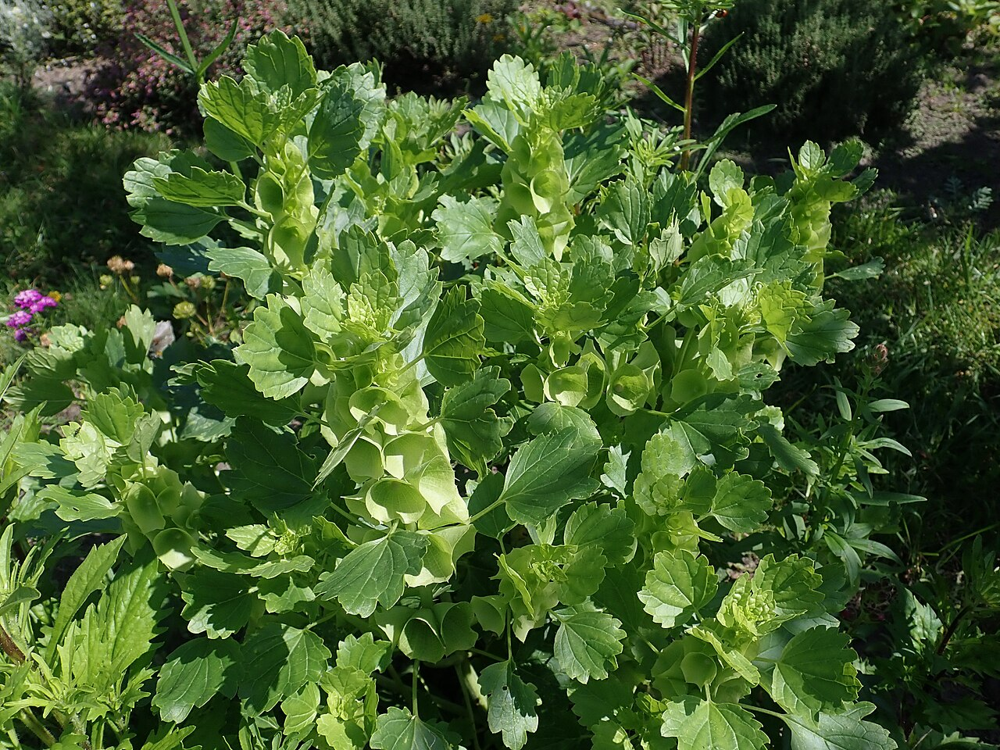
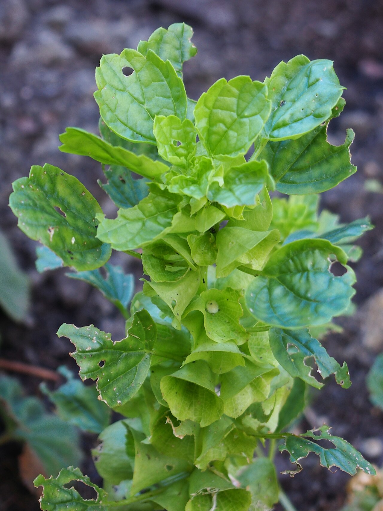
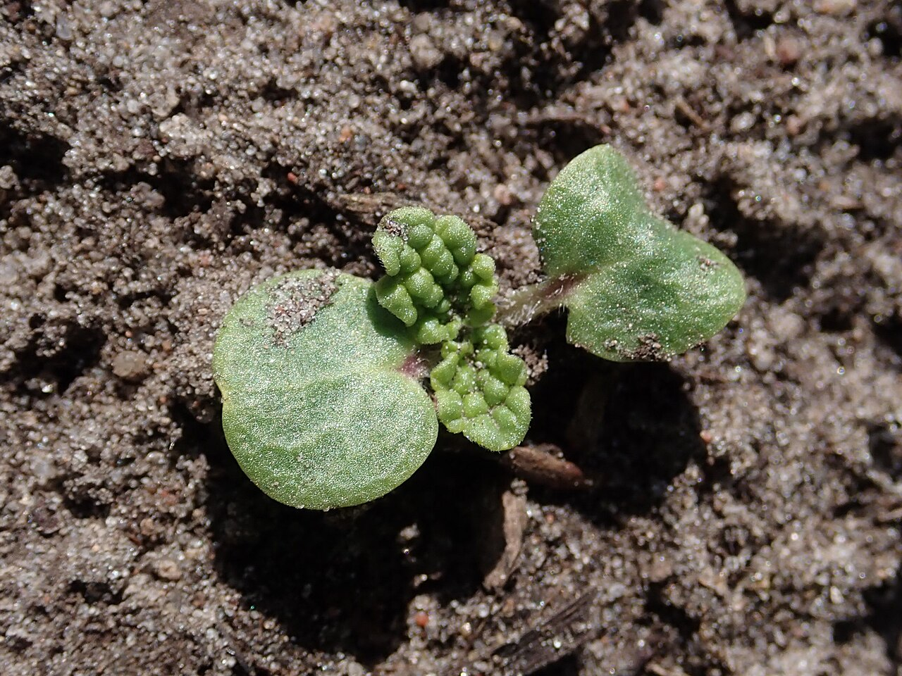
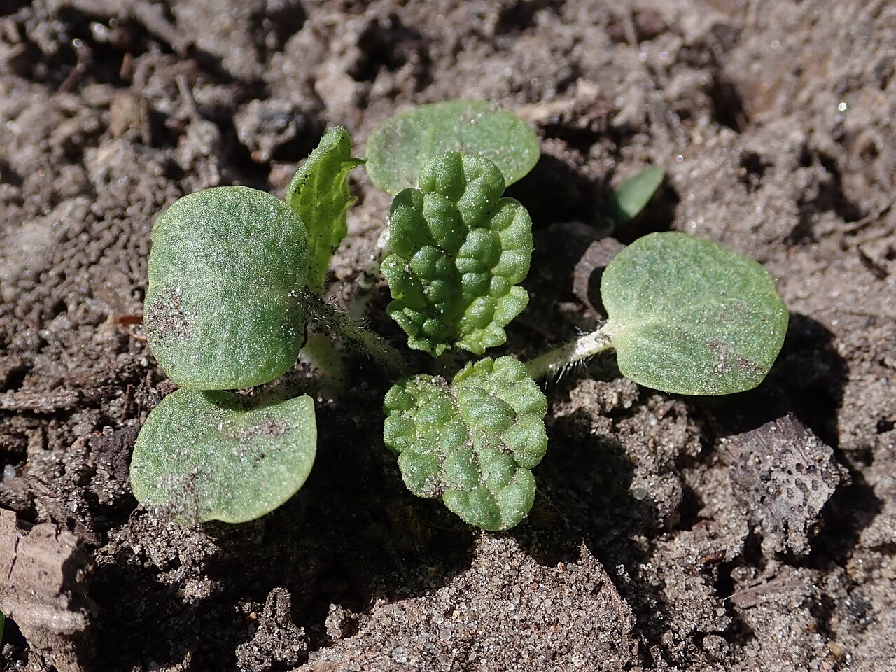

# Bells of Ireland

> Tall green spires of cup-shaped "bells" that mean good luck — despite the name,
> a native not of Ireland but of western Asia.

## Botanical identity
- **Common name(s):** Bells of Ireland; shell flower; molucca balm
- **Scientific name:** *Moluccella laevis*
- **Family:** Lamiaceae (the mint family)
- **Type:** Line flower (a tall green spike)

## Native region & origin
- **Native to:** **Western Asia** — Turkey, Syria, and the Caucasus (**not**
  Ireland, and not the Moluccas, despite both names).
- **Now cultivated in:** Worldwide as a novelty cut flower.
- **Domestication / spread notes:** A misnamed curiosity — the green "bells"
  earned it the "luck of the Irish" association purely by color, and an old
  (mistaken) belief it came from the Moluccas gave the genus its name.

## Visual identification (for reading a photo)
- **Bloom form:** A tall stem lined with **green, cup/bell-shaped calyces** (the
  "bells"); the tiny **true white flowers** sit inside each bell.
- **Size:** Tall spikes; a striking all-green vertical.
- **Petals:** The showy part is the green **calyx** (a bell); the true petals are
  the small white flowers within.
- **Center:** Each bell cradles a small fragrant white floret.
- **Color range:** **Green** (the defining trait); dries to cream/straw.
- **Foliage/stem cues:** Rounded, scalloped leaves; a strong upright stem; faintly
  fragrant (mint family).
- **Look-alikes:** Few — an **all-green flowering spike of bells** is distinctive.

## History & cultural background
A whimsical, all-green spike whose name is a double misnomer, bells of Ireland
became a symbol of **good luck** and a favorite for adding height, structure, and
an unusual green note to arrangements.

## Symbolism & meaning
- **General meaning:** **Good luck** ("the luck of the Irish"), gratitude, and
  wishes for good fortune; whimsy and uniqueness (its all-green novelty).
- **By color:** Its signature **green** reads as luck, renewal, and freshness.

## Cultural meanings across the world
- **Western Asia (origin):** Native to Turkey and the Caucasus, despite its
  European-sounding name.
- **Western / floristry:** Chiefly a **good-luck** flower — the green "bells" tie
  it to Ireland and fortune; a favorite for **St. Patrick's Day** and
  congratulatory or "good luck" arrangements.
- **Note:** A modern novelty flower; its meaning is light, lucky, and positive.

## Typical pairings
- **Arranged with:** Roses, lilies, and snapdragons, supplying tall green line and
  structure; adds an unexpected green vertical.
- **Greenery/fillers:** Functions partly **as** structural green.
- **Anchors:** Tall, structured, and "green-forward" arrangements.

## Occasions & events
- **Strongly associated with:** Good-luck and congratulations gifts, St. Patrick's
  Day, and tall structural designs.
- **Avoid for:** Little to avoid; a supporting line flower rather than a focal.

## Seasonality & availability
- **Natural season:** Summer.
- **Commercial availability:** Best in summer; **dries well** (to straw color).
- **Vase life / care notes:** ~7–10 days; tall stems may need support; dries for
  lasting arrangements.

## Quick facts
- **Birth month:** — (not a traditional birth flower)
- **Wedding anniversary:** — (no standard year)
- **Notable toxicity/allergy:** Generally **non-toxic**; small spines on the
  calyces can prick — handle with care.

## Reference images
<!-- IMAGES-START -->
Reference photos, all under reusable licenses (CC-BY / CC-BY-SA / CC0 / public domain) from Wikimedia Commons. Full attribution in [`image-manifest.json`](../images/image-manifest.json).

*Moluccella laevis 2023-08-14 8511 — Salicyna · CC BY-SA 4.0*

*Moluccella laevis Molukia gładka 2020-09-20 01 — Agnieszka Kwiecień, Nova · CC BY-SA 4.0*

*Moluccella laevis 2023-05-17 5367 — Salicyna · CC BY-SA 4.0*

*Moluccella laevis 2023-05-17 5364 — Salicyna · CC BY-SA 4.0*
<!-- IMAGES-END -->

---
*Confidence / to-verify:* High on the western-Asian origin (double misnomer), the
green-bell calyx structure, and the good-luck symbolism.
