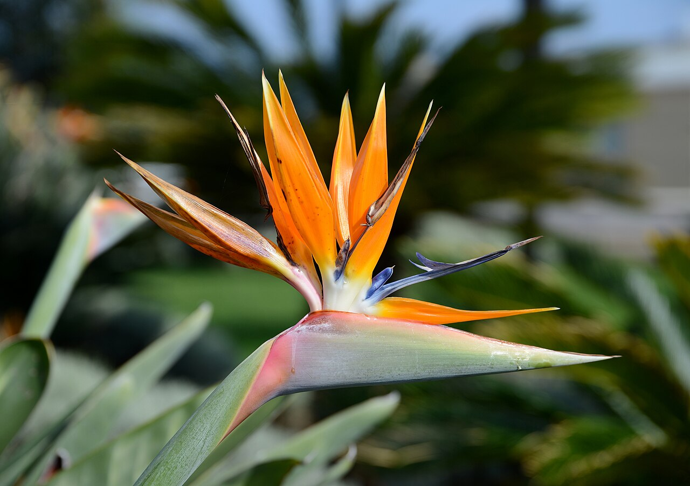
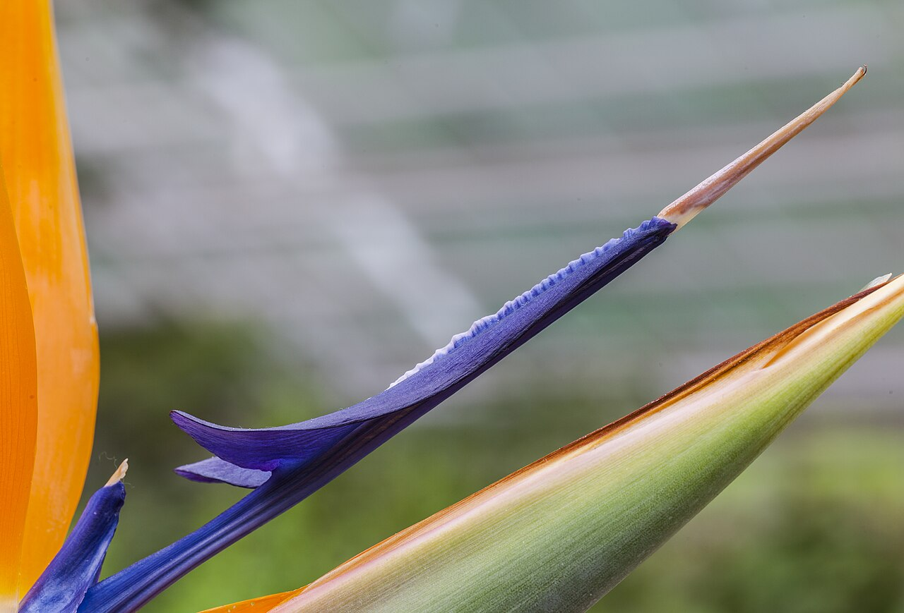
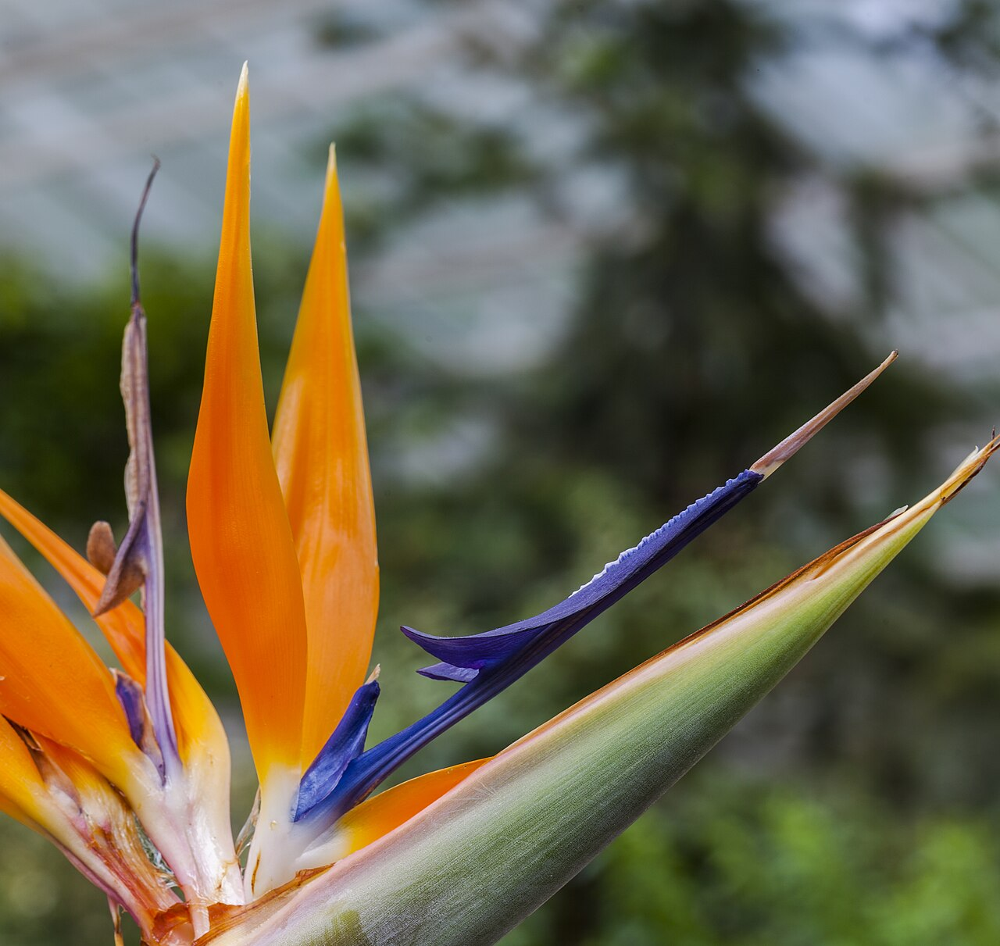
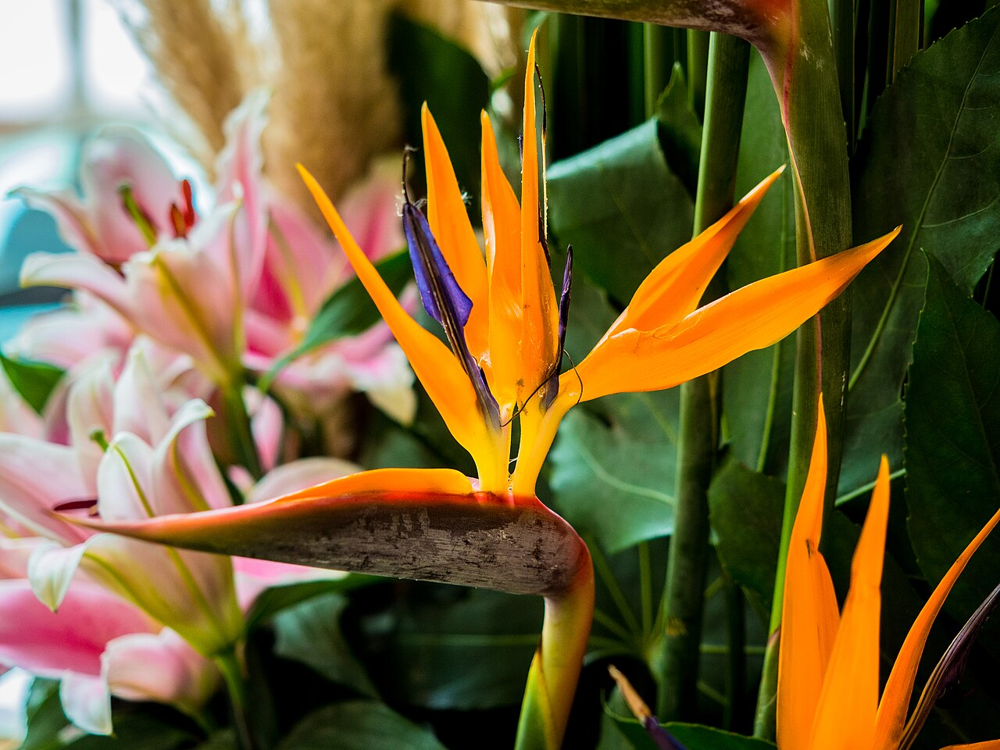

# Bird of Paradise

> The flower shaped like a bird in flight — an exotic South African bloom of
> freedom, joy, and paradise, and the official flower of Los Angeles.

## Botanical identity
- **Common name(s):** Bird of paradise; crane flower; *strelitzia*
- **Scientific name:** *Strelitzia reginae*
- **Family:** Strelitziaceae
- **Type:** Form flower (dramatic, architectural)

## Native region & origin
- **Native to:** **South Africa** (the eastern Cape).
- **Now cultivated in:** California, Hawaii, and warm regions worldwide.
- **Domestication / spread notes:** Named after **Queen Charlotte** of
  Mecklenburg-**Strelitz** (wife of George III); the species name *reginae* means
  "of the queen." A signature tropical/exotic cut flower.

## Visual identification (for reading a photo)
- **Bloom form:** Unmistakable **crane/bird head** — a horizontal, boat-shaped
  bract (the "beak") from which spiky **orange sepals** and **blue petals** fan
  up like a bird's crest.
- **Size:** Large and bold on a tall stem.
- **Petals:** Bright orange sepals + vivid blue petal structures emerging in
  sequence from the bract.
- **Center:** The pointed green/pink **spathe** ("beak") holds the emerging florets.
- **Color range:** Orange-and-blue (classic); a giant white species (*S. nicolai*)
  exists.
- **Foliage/stem cues:** Large, paddle-shaped, banana-like leaves; thick stems.
- **Look-alikes:** Essentially none — the crane silhouette is unique.

## History & cultural background
Introduced to European royalty and named for a queen, the bird of paradise became
the very picture of the exotic and the tropical — a symbol of freedom, joy, and
faraway paradise.

## Symbolism & meaning
- **General meaning:** **Freedom, joyfulness, paradise, magnificence, and
  faithfulness**; anticipation of wonderful things; exotic beauty.
- **By color:** Its fixed orange-and-blue is read as **vibrancy and joyful
  freedom** rather than by separate color codes.

## Cultural meanings across the world
- **South Africa (origin):** A native of the Cape, celebrated as an emblem of
  **beauty and freedom**; it has appeared on South African coinage.
- **Los Angeles, USA:** The **official flower of the City of Los Angeles** — a
  symbol of the city's lush, sunny glamour.
- **General symbolism:** The crane-like bird form makes it a **joyful messenger**
  and a token of **faithfulness and anticipation** — a popular 9th-anniversary
  flower.
- **Note:** A modern exotic with light ancient baggage; its meaning is bright and
  positive worldwide.

## Typical pairings
- **Arranged with:** Anthurium, protea, orchids, monstera, and tropical foliage;
  often a solo statement.
- **Greenery/fillers:** Monstera, ti leaves, palm.
- **Anchors:** Tropical, architectural, and modern arrangements; bold focal flower.

## Occasions & events
- **Strongly associated with:** Tropical and celebratory arrangements,
  congratulations, freedom/new-chapter gifts, and 9th anniversaries.
- **Avoid for:** Soft, traditional pastel bouquets where its scale and color
  dominate.

## Seasonality & availability
- **Natural season:** Blooms mostly autumn through spring; effectively **year-
  round** in the trade.
- **Commercial availability:** Year-round.
- **Vase life / care notes:** Excellent — often **1–2 weeks**; you can gently coax
  each successive floret out of the bract.

## Quick facts
- **Birth month:** — (not a traditional birth flower)
- **Wedding anniversary:** 9th
- **Notable toxicity/allergy:** **Toxic if ingested** (seeds/flowers) to pets and
  people.

## Reference images
<!-- IMAGES-START -->
Reference photos, all under reusable licenses (CC-BY / CC-BY-SA / CC0 / public domain) from Wikimedia Commons. Full attribution in [`image-manifest.json`](../images/image-manifest.json).

*Strelitzia April 2015-1 — Alvesgaspar · CC BY-SA 4.0*

*Ave del Paraíso (Strelitzia reginae), Jardín Botánico de Múnich, Alemania, 2013- — Diego Delso · CC BY-SA 3.0*

*Ave del Paraíso (Strelitzia reginae), Jardín Botánico de Múnich, Alemania, 2013- — Diego Delso · CC BY-SA 3.0*

*Strelitzia Reginae (Bird of Paradise) — Esin Üstün from Istanbul, Turkey · CC BY 2.0*
<!-- IMAGES-END -->

---
*Confidence / to-verify:* High on South African origin, the Queen Charlotte/
Strelitz naming, the LA official-flower fact, and the freedom/joy symbolism.
