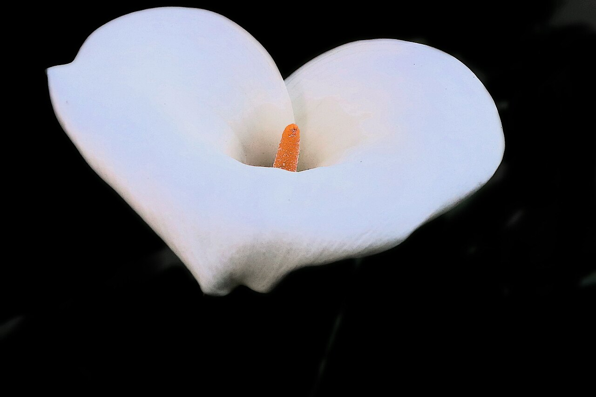
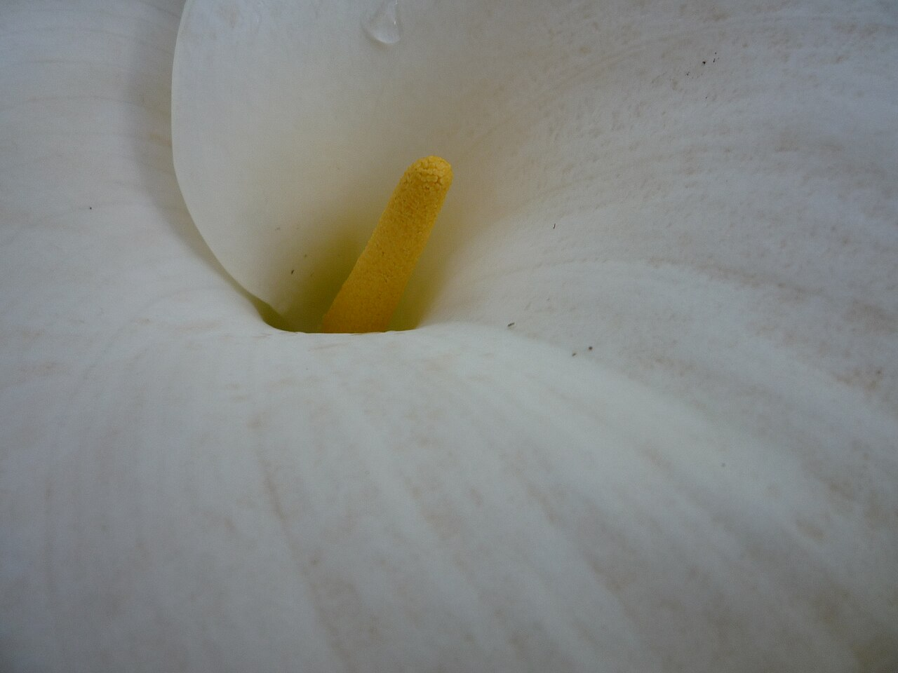
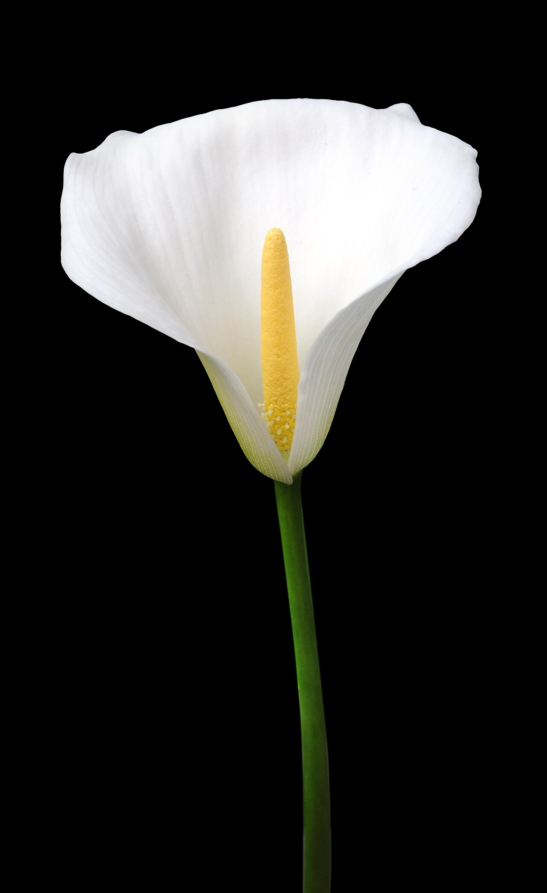
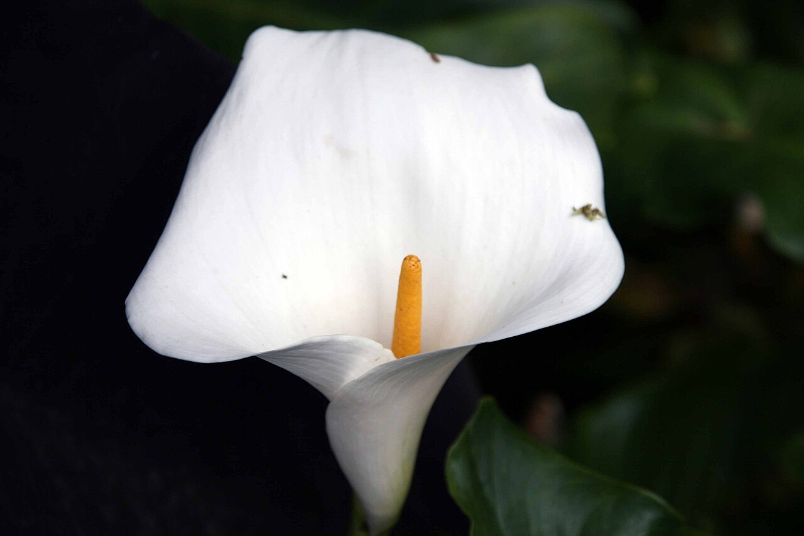

# Calla Lily

> Sculptural, elegant, and famously double-duty: the same white bloom graces both
> weddings and funerals. Note: it is **not a true lily** — its "flower" is a
> single furled leaf.

## Botanical identity
- **Common name(s):** Calla lily; arum lily; *Zantedeschia*
- **Scientific name:** *Zantedeschia aethiopica* (white; and colorful hybrids)
- **Family:** Araceae (the arum family) — **not** Liliaceae
- **Type:** Form flower (a single, unmistakable silhouette)

## Native region & origin
- **Native to:** **Southern Africa** (South Africa, Lesotho, Eswatini).
- **Now cultivated in:** New Zealand, the Netherlands, the US, and worldwide.
- **Domestication / spread notes:** Named after the Italian botanist **Giovanni
  Zantedeschi**; the common name comes from the Greek *kallos*, "beauty."
  Naturalized (and weedy) in mild climates like coastal California and Australia.

## Visual identification (for reading a photo)
- **Bloom form:** A single, smooth, **funnel-shaped spathe** (a modified leaf/
  bract) that curls elegantly around a central finger-like **spadix**.
- **Size:** Medium to large trumpet on a long, leafless, smooth stem.
- **Petals:** None in the usual sense — the showy "petal" is one continuous
  spathe; the tiny true flowers cluster on the spadix.
- **Center:** A yellow (or colored) **spadix** poking up from the throat.
- **Color range:** Classic white (*aethiopica*); hybrids in yellow, pink,
  orange, peach, purple, and near-black.
- **Foliage/stem cues:** Arrowhead/heart-shaped leaves, sometimes white-spotted;
  thick, smooth stems.
- **Look-alikes:** Anthurium (flat, glossy, heart-shaped spathe — the calla's is
  furled into a cone) and true lilies (six separate tepals). The single curled
  spathe + spadix is unmistakable.

## History & cultural background
An icon of **Art Deco** design and of **Diego Rivera's** paintings, the calla's
clean architectural line has made it a symbol of both modern elegance and
timeless purity. Its long association with the Virgin Mary and the resurrection
gives it a foot in both celebration and mourning.

## Symbolism & meaning
- **General meaning:** Magnificent beauty, purity, elegance, and — via its
  Christian associations — **holiness and rebirth/resurrection.**
- **By color:**
  - **White** — Purity and innocence (weddings) **and** sympathy/rebirth (funerals).
  - **Yellow** — Gratitude, cheer.
  - **Pink** — Admiration, appreciation, gentleness.
  - **Purple** — Passion, royalty, charm.
  - **Dark/"black"** — Elegance, mystery, sophistication.

## Cultural meanings across the world
- **Christian (Western):** A symbol of **purity, the Virgin Mary, and the
  resurrection** — hence its role at **Easter**, at **weddings** (purity), and at
  **funerals** (rebirth of the soul). This dual use is its defining trait.
- **Greco-Roman / mythological:** One myth says it sprang from **Hera's** spilled
  milk (purity/beauty); a competing Roman tale has **Venus**, jealous of its
  beauty, curse it with the prominent spadix — giving the calla a quiet
  undercurrent of **lust** beside its purity.
- **Latin America (Mexico):** Immortalized by **Diego Rivera**, whose paintings
  of indigenous calla-lily vendors made the flower a symbol of **dignity, labor,
  and Mexican identity**.
- **Note:** Because white carries funerary weight in many cultures, the calla's
  "wedding or funeral?" reading depends heavily on context and arrangement.

## Typical pairings
- **Arranged with:** Roses, orchids, hydrangea, and tulips for sleek modern
  designs; often used **solo** for maximum architectural impact.
- **Greenery/fillers:** Aspidistra/ti leaves, monstera, bear grass (for line).
- **Anchors:** Elegant, minimalist, and formal arrangements; bridal bouquets and
  funeral tributes alike.

## Occasions & events
- **Strongly associated with:** Weddings (6th anniversary flower), funerals and
  sympathy, Easter, and sophisticated/formal gifting.
- **Avoid for:** Casual cheer — it reads as formal and can feel solemn.

## Seasonality & availability
- **Natural season:** Spring–summer.
- **Commercial availability:** Largely **year-round**.
- **Vase life / care notes:** ~7–14 days; keep water shallow (stems are prone to
  rot/curl) and change it often.

## Quick facts
- **Birth month:** — (not a traditional birth flower)
- **Wedding anniversary:** 6th
- **Notable toxicity/allergy:** **Toxic if ingested** — insoluble calcium oxalate
  crystals (mouth/throat irritation); keep from pets and children.

## Reference images
<!-- IMAGES-START -->
Reference photos, all under reusable licenses (CC-BY / CC-BY-SA / CC0 / public domain) from Wikimedia Commons. Full attribution in [`image-manifest.json`](../images/image-manifest.json).

*J20170325-0020—Zantedeschia aethiopica — John Rusk from Berkeley, CA, United States of America · CC BY 2.0*

*Zantedeschia aethiopica bcn — Arria Belli · CC BY-SA 3.0*

*Zantedeschia aethiopica 001 — Amada44 · CC BY 3.0*

*Zantedeschia aethiopica 21zz — Photo by David J. Stang · CC BY-SA 4.0*
<!-- IMAGES-END -->

---
*Confidence / to-verify:* High on the not-a-true-lily fact, southern-African
origin, wedding/funeral duality, and the Rivera association.
