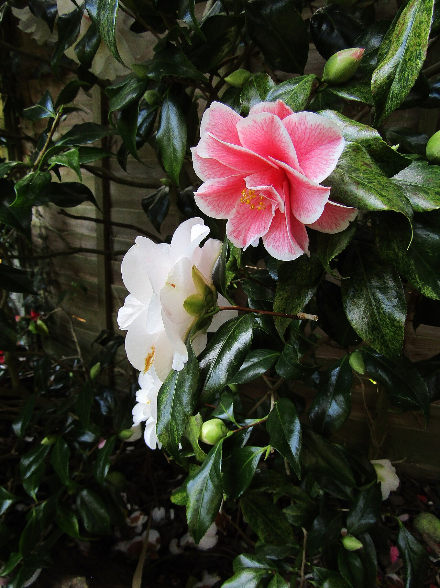
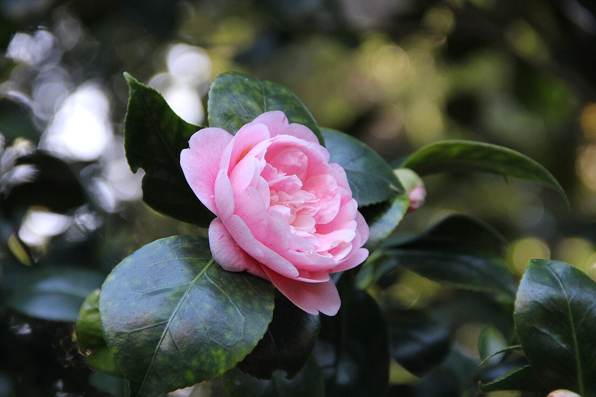
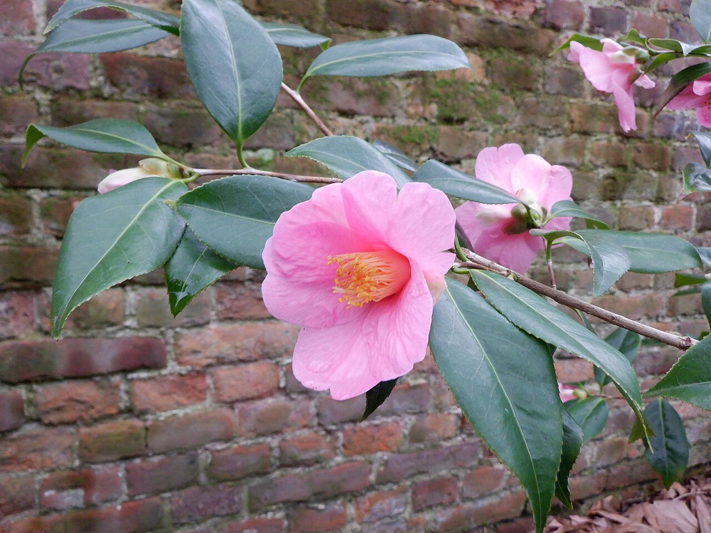
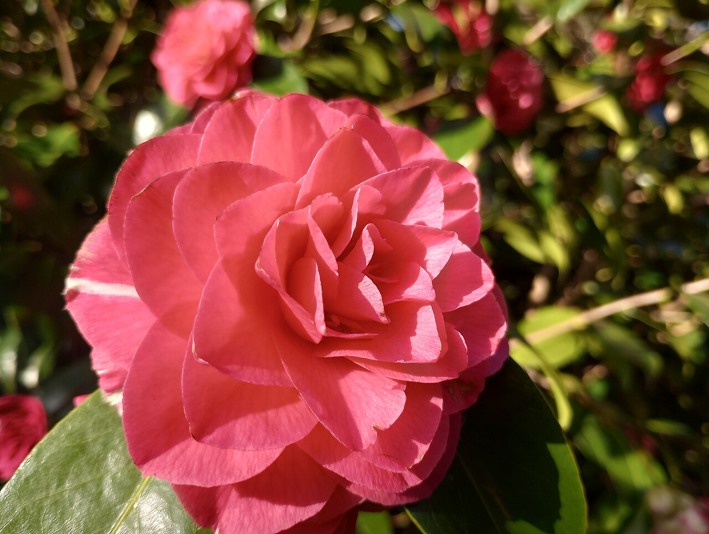

# Camellia

> A waxy, rose-like winter bloom of perfected beauty and devotion — beloved in
> East Asia, yet an omen of death to the samurai for the way its whole head falls.

## Botanical identity
- **Common name(s):** Camellia; *tsubaki* (Japan); *japonica*
- **Scientific name:** *Camellia japonica* (and *C. sasanqua*)
- **Family:** Theaceae
- **Type:** Mass / focal flower
- **Relative of note:** *Camellia sinensis* — the **tea plant** — is the same genus.

## Native region & origin
- **Native to:** **East Asia** — China, Japan, and Korea.
- **Now cultivated in:** Worldwide in mild climates; a signature of the US South.
- **Domestication / spread notes:** Cultivated for centuries in China and Japan;
  reached Europe in the 1700s and became a status flower. Named after the
  Jesuit botanist **Georg Josef Kamel**.

## Visual identification (for reading a photo)
- **Bloom form:** A **symmetrical, rose-like** bloom of waxy petals in neat rows,
  from single to fully double.
- **Size:** Medium to large; borne on a **glossy evergreen shrub**.
- **Petals:** Thick, waxy, rounded, in orderly ranks.
- **Center:** A boss of golden stamens in singles/semi-doubles.
- **Color range:** Red, pink, white, and variegated/striped.
- **Foliage/stem cues:** Dark, glossy, leathery evergreen leaves; **the spent
  flower drops as a whole head** (rather than shedding petals).
- **Look-alikes:** Roses and ranunculus; the camellia's waxy symmetry, glossy
  evergreen leaves, and whole-head drop are the tells.

## History & cultural background
An emblem of refined, perfected beauty in East Asia and, later, of European
elegance (Chanel's chosen flower; the tragic heroine of *La Dame aux Camélias*).
Its habit of dropping its whole flower head gave it a darker meaning among
Japanese warriors.

## Symbolism & meaning
- **General meaning:** Love, affection, admiration, devotion, and **perfected
  loveliness**; gratitude.
- **By color:**
  - **Red** — Love, passion, deep desire; "you're a flame in my heart."
  - **White** — Adoration, purity; "you're adorable."
  - **Pink** — Longing, admiration.

## Cultural meanings across the world
- **Japan (hanakotoba):** *Tsubaki* signifies **love and admiration**, and white
  camellias mean "waiting." But because the whole flower **falls at once** — like
  a head from a neck — **samurai read it as an omen of death** and avoided it, a
  striking split from its romantic meaning.
- **China:** A symbol of **the union of lovers** (the calyx and petals fall
  together, said to represent an inseparable couple), of **steadfastness**, and of
  young sons and daughters.
- **Korea:** Used in **weddings** for **faithfulness and long life**.
- **Western:** **Perfected loveliness and admiration** — the flower of Coco
  Chanel and of Dumas's tragic *Camille*, linking it to elegance and doomed love.

## Typical pairings
- **Arranged with:** Roses, ranunculus, and hellebores; its glossy foliage is
  prized on its own.
- **Greenery/fillers:** Its own evergreen leaves; soft greens.
- **Anchors:** Elegant winter and formal arrangements; corsages.

## Occasions & events
- **Strongly associated with:** Winter weddings, Valentine's and devotion gifts,
  and refined/formal arrangements.
- **Avoid for:** Gifting to anyone in Japan mindful of its samurai death-omen; and
  note it bruises easily.

## Seasonality & availability
- **Natural season:** **Winter to early spring.**
- **Commercial availability:** Limited as a cut flower (delicate); often used as
  cut foliage and corsage blooms.
- **Vase life / care notes:** Short-lived and bruise-prone; handle gently and keep
  cool.

## Quick facts
- **Birth month:** — (a winter flower)
- **Wedding anniversary:** — (no standard year)
- **Notable toxicity/allergy:** **Non-toxic** (the genus gives us tea); pet-safe.

## Reference images
<!-- IMAGES-START -->
Reference photos, all under reusable licenses (CC-BY / CC-BY-SA / CC0 / public domain) from Wikimedia Commons. Full attribution in [`image-manifest.json`](../images/image-manifest.json).

*Camellia japonica 'Lady Vansittart' - Flickr - wallygrom — Leonora (Ellie) Enking from East Preston, United Kingdom · CC BY-SA 2.0*

*Camellia Japonica "Black Prince" — Izziekins · CC BY-SA 4.0*

*Camellia Japonica HannesWilms 01 — Hannes Wilms · CC BY-SA 4.0*

*Pink Camellia Flower — Nathanieljoyce · CC BY-SA 4.0*
<!-- IMAGES-END -->

---
*Confidence / to-verify:* High on East Asian origin, the tea-plant relation, the
Japanese whole-head-drop death omen, and the perfected-loveliness meaning.
