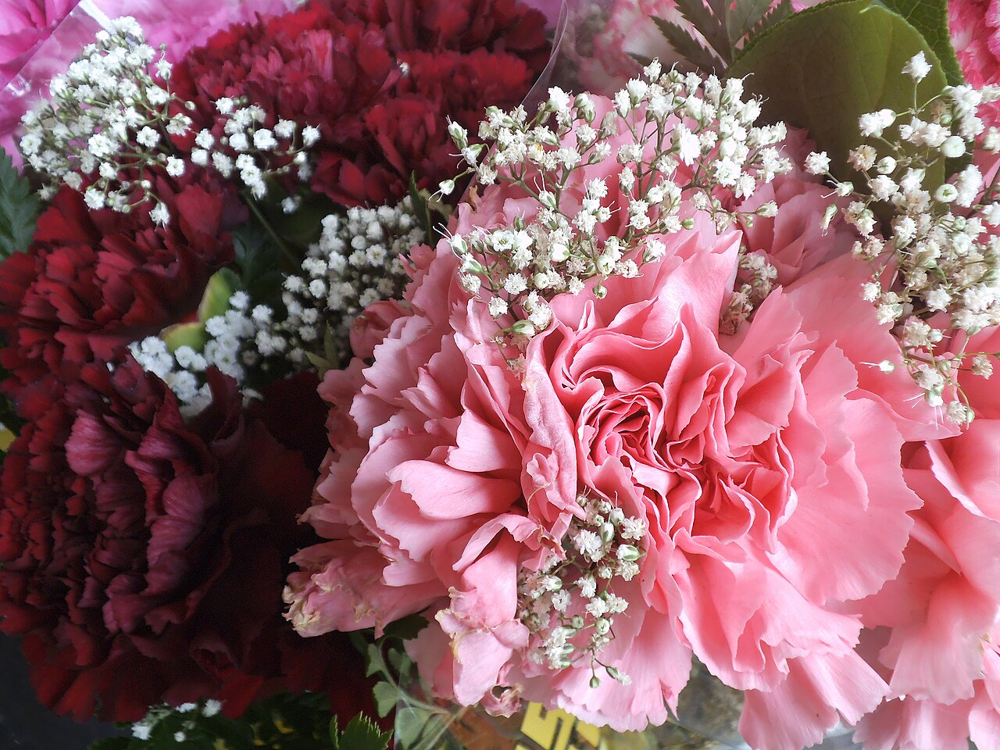
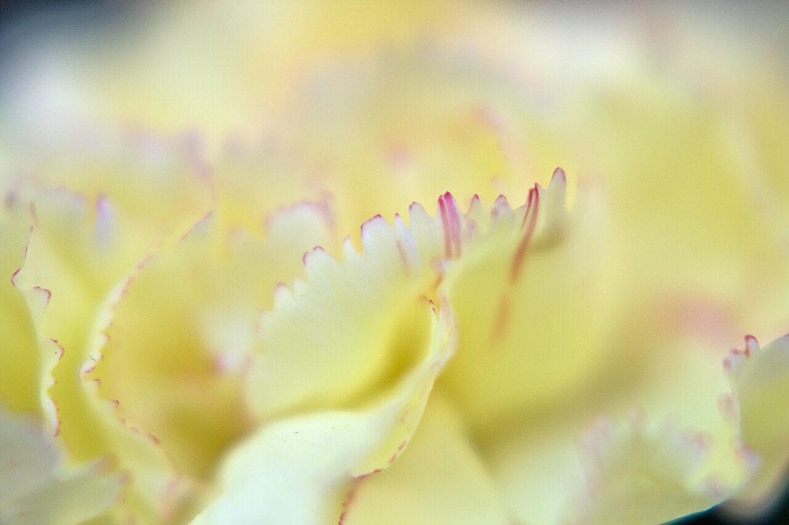
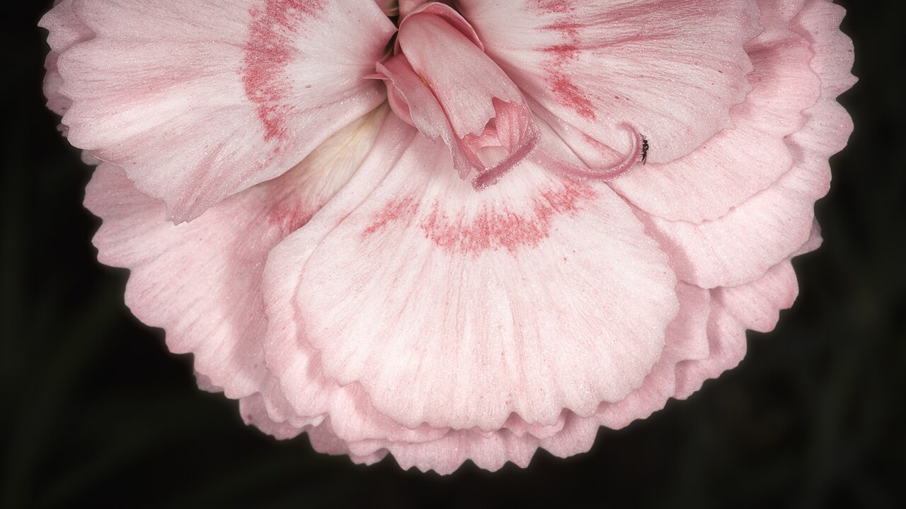
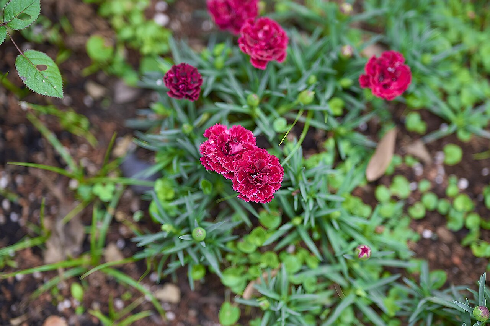

# Carnation

> The affordable, long-lasting workhorse of the trade — and, in pink, the
> original Mother's Day flower. Carries surprisingly strong political and
> revolutionary symbolism worldwide.

## Botanical identity
- **Common name(s):** Carnation; clove pink; "grenadine"; the genus is *Dianthus* ("divine flower")
- **Scientific name:** *Dianthus caryophyllus* (standard, spray, and mini "sweet William" relatives)
- **Family:** Caryophyllaceae
- **Type:** Mass / focal flower (also a reliable filler)

## Native region & origin
- **Native to:** The **Mediterranean region** (exact wild origin blurred by
  2,000+ years of cultivation).
- **Now cultivated in:** Colombia, Ecuador, Kenya, China, and the Netherlands
  (major cut-flower producers).
- **Domestication / spread notes:** Grown since Greek and Roman antiquity. The
  name may derive from **"coronation"** (woven into ceremonial Greek crowns) or
  from **"carnis"/incarnation** (its original flesh-pink color and a Christian
  legend, below).

## Visual identification (for reading a photo)
- **Bloom form:** Dense, ruffled dome of many fringed petals.
- **Size:** Medium; sprays carry several small heads per stem.
- **Petals:** Numerous, with a distinctive **serrated/notched ("pinked") edge**
  — the source of the word "pink."
- **Center:** Hidden within the packed ruffle.
- **Color range:** Nearly all colors, including dyed and bicolor/striped; famous
  for taking up dye (rainbow carnations).
- **Foliage/stem cues:** Slender blue-green grassy leaves; swollen nodes on the stem.
- **Look-alikes:** Ruffled peonies and some dianthus; the notched petal edge and
  grassy foliage confirm carnation.

## History & cultural background
One of the oldest cultivated cut flowers. A **Christian legend** holds that pink
carnations first bloomed where the Virgin Mary's tears fell at the crucifixion —
tying the flower to a mother's love and setting up its Mother's Day role.

## Symbolism & meaning
- **General meaning:** Fascination, distinction, and love; devotion.
- **By color:**
  - **Red** — Admiration; deep red = deep love and affection.
  - **White** — Pure love, innocence, good luck, remembrance.
  - **Pink** — A mother's undying love (the Mother's Day color).
  - **Yellow** — Disappointment, rejection, disdain.
  - **Purple** — Capriciousness, whimsy, unpredictability.
  - **Striped** — Refusal; "I'm sorry I can't be with you," regret.
- **Number/presentation notes:** Long vase life makes it the default in mixed
  supermarket bouquets and standing funeral work.

## Cultural meanings across the world
- **China:** Used in weddings and celebrations; also appears in funeral/mourning
  arrangements. Broadly a flower of maternal love and marriage.
- **Korea:** Central to **Parents' Day (May 8)** and **Teachers' Day** — children
  pin red/pink carnations on parents and teachers to show respect and gratitude.
  Folk tradition even reads three carnations placed in the hair as a small
  fortune-telling charm.
- **Europe (continental):** In **France**, carnations long carried connotations
  of misfortune and were associated with funerals. In the **Netherlands**, white
  carnations are worn to honor WWII veterans and the resistance.
- **Portugal & Spain:** The red carnation is the emblem of Portugal's peaceful
  **Carnation Revolution (1974)** — democracy and freedom. The red carnation is
  also the **national flower of Spain**, tied to passion and flamenco.
- **Political / labor:** Worldwide, the red carnation is a socialist and
  labor-movement symbol (worn on May Day). Oscar Wilde's **green carnation**
  became a coded emblem of aestheticism and queer identity in the 1890s.
- **Greco-Roman / mythological:** Woven into ceremonial garlands and crowns;
  linked by name to coronation.

## Typical pairings
- **Arranged with:** Roses, chrysanthemums, alstroemeria, baby's breath; the
  backbone of budget mixed bouquets.
- **Greenery/fillers:** Leatherleaf fern, ruscus, its own foliage.
- **Anchors:** Long-lasting everyday arrangements; standing funeral sprays.

## Occasions & events
- **Strongly associated with:** Mother's Day (pink for living, white to honor a
  late mother — Anna Jarvis's original tradition), funerals (many cultures),
  Parents'/Teachers' Day in Korea, and everyday gifting.
- **Avoid for:** Gifting in France (funeral connotation); yellow anywhere it
  might read as rejection.

## Seasonality & availability
- **Natural season:** Spring–summer bloom outdoors.
- **Commercial availability:** Year-round.
- **Vase life / care notes:** Exceptional — often **2–3 weeks**; ethylene-
  sensitive, so keep away from ripening fruit.

## Quick facts
- **Birth month:** January
- **Wedding anniversary:** 1st
- **Notable toxicity/allergy:** Mildly toxic to cats/dogs (GI upset); sap can
  irritate skin.

## Reference images
<!-- IMAGES-START -->
Reference photos, all under reusable licenses (CC-BY / CC-BY-SA / CC0 / public domain) from Wikimedia Commons. Full attribution in [`image-manifest.json`](../images/image-manifest.json).

*Romantic Bouquet (Unsplash) — R Kong edwise · CC0*

*Carnation Cafe - Flickr - Cliff Johnson — Cliff Johnson from West Jordan, UT, USA · CC BY-SA 2.0*

*Carnation — James Johnstone from Ecclefechan, Scotland · CC BY 2.0*

*Carnation (red) in Athens on May 1, 2023 — George E. Koronaios · CC BY-SA 2.0*
<!-- IMAGES-END -->

---
*Confidence / to-verify:* High on identity, native range, Mother's Day and
Carnation Revolution history. Color meanings are well-attested Victorian
readings.
