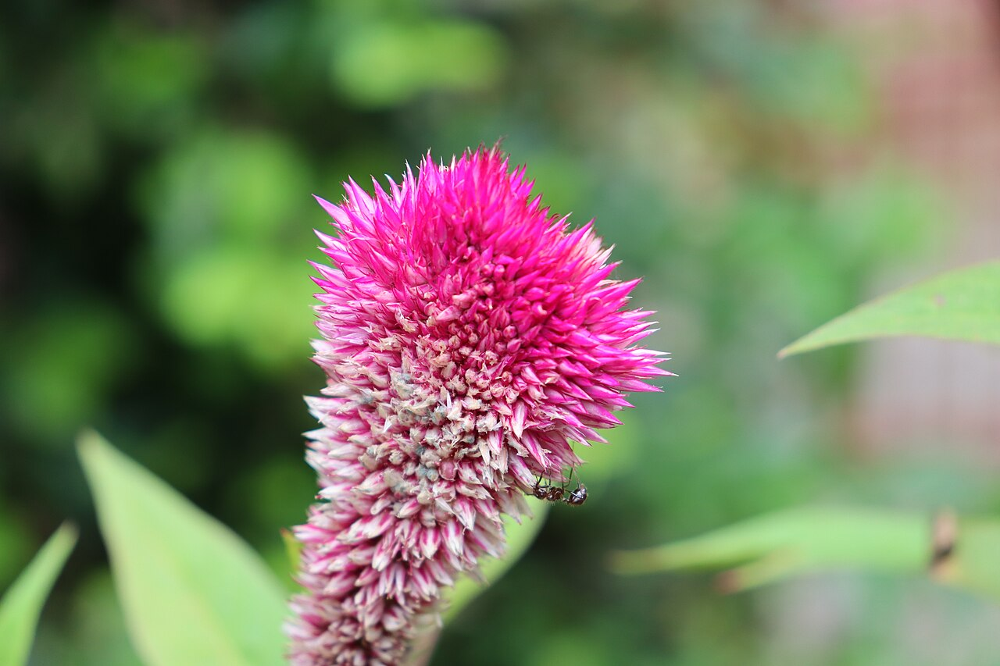
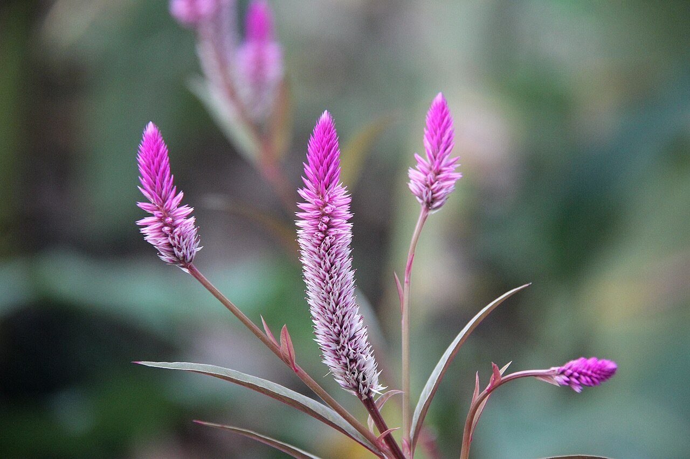
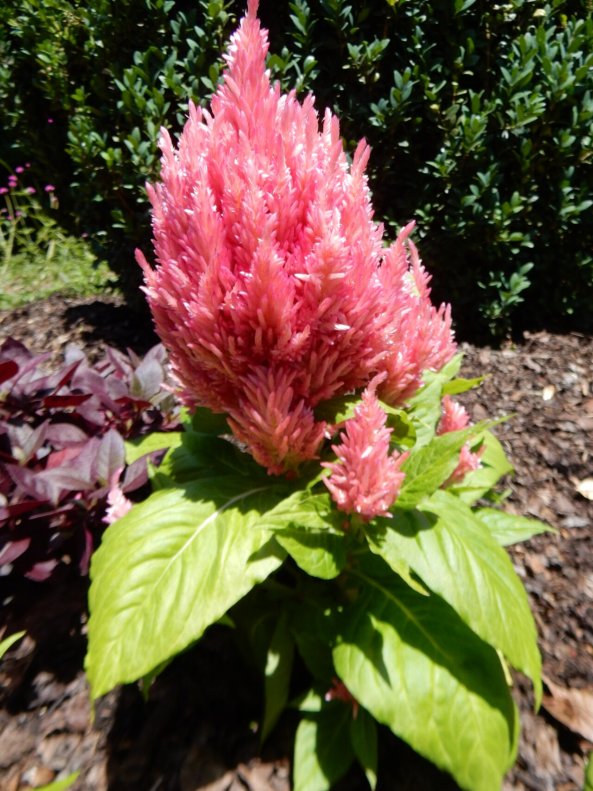
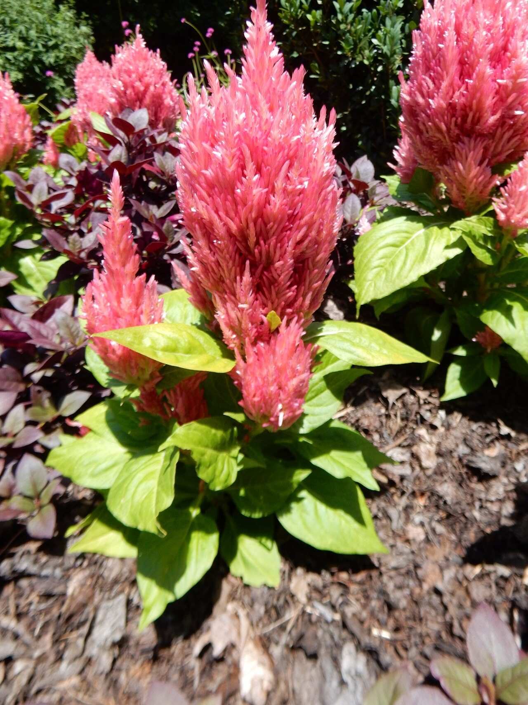

# Celosia (Cockscomb)

> Velvety brain-like crests or flame-shaped plumes in electric colors — a bold,
> playful tropical bloom that doubles as a leafy food crop across Africa and Asia.

## Botanical identity
- **Common name(s):** Celosia; cockscomb (crested); plume/wheat celosia (feathery)
- **Scientific name:** *Celosia argentea* (var. *cristata* crested; var. *plumosa*
  plumed)
- **Family:** Amaranthaceae
- **Type:** Form flower

## Native region & origin
- **Native to:** Tropical **Africa, Asia, and the Americas.**
- **Now cultivated in:** Worldwide as an ornamental and, in Africa/Asia, a leaf
  vegetable.
- **Domestication / spread notes:** The name is from Greek *kēleos* — **"burning"**
  — for the flame-like plumes. Grown as **"Lagos spinach" / soko** for edible
  leaves and grain in West Africa and parts of Asia.

## Visual identification (for reading a photo)
- **Bloom form:** Two dramatic forms — **cockscomb** (velvety, convoluted,
  brain-/coral-like crests) or **plume** (soft, feathery flame spikes).
- **Size:** Medium to large heads on sturdy stems.
- **Petals:** None obvious — the color is in masses of tiny fused florets forming
  the crest or plume.
- **Center:** N/A (the whole head is the feature).
- **Color range:** Electric red, magenta, orange, yellow, pink, and green.
- **Foliage/stem cues:** Broad, sometimes bronze-tinted leaves; thick stems.
- **Look-alikes:** Amaranthus (its relative — but drooping tassels or upright
  plumes, not crests); the cockscomb's velvety brain-crest is unmistakable.

## History & cultural background
Grown for food and beauty across the tropics, celosia's flame-like plumes and
velvety crests give it a bold, almost surreal presence — read in floriography as
warmth, humor, and courage.

## Symbolism & meaning
- **General meaning:** **Boldness, warmth, humor, playfulness, and courage**;
  also singularity/uniqueness (the "burning," one-of-a-kind form) and affection.
- **By color:** Colors follow their general meanings (see color-symbolism.md); the
  vivid hues amplify the bold, warm reading.

## Cultural meanings across the world
- **West Africa / Nigeria:** Grown as **"soko" / Lagos spinach**, a common leaf
  vegetable — a food crop as much as an ornamental.
- **Asia (India, SE Asia):** Cultivated for leaves and grain, and used in some
  garlands and offerings; a bold festival color.
- **Western / floristry:** Reads as **boldness, humor, and warmth** — a striking,
  textural focal or filler that stands out and adds personality.
- **Note:** A tropical ornamental-and-food plant with light Western symbolic
  baggage.

## Typical pairings
- **Arranged with:** Marigolds, dahlias, sunflowers, and amaranthus in bold,
  autumnal, textural bouquets.
- **Greenery/fillers:** Its own foliage; textural greens.
- **Anchors:** Bold, warm, autumn and "textural" arrangements.

## Occasions & events
- **Strongly associated with:** Autumn bouquets, bold/quirky designs, and warm
  celebratory arrangements.
- **Avoid for:** Soft, delicate pastel bouquets — it's loud and textural.

## Seasonality & availability
- **Natural season:** Summer to autumn.
- **Commercial availability:** Best in season; **dries well**.
- **Vase life / care notes:** Long-lasting (~1–2 weeks) and dries beautifully.

## Quick facts
- **Birth month:** — (a summer/autumn flower)
- **Wedding anniversary:** — (no standard year)
- **Notable toxicity/allergy:** **Non-toxic** — indeed edible (a leaf vegetable).

## Reference images
<!-- IMAGES-START -->
Reference photos, all under reusable licenses (CC-BY / CC-BY-SA / CC0 / public domain) from Wikimedia Commons. Full attribution in [`image-manifest.json`](../images/image-manifest.json).

*Celosia argentea flower 01 — Gnoeee · CC BY-SA 4.0*

*Celosia argentea in Philippines — TheNuggeteer · CC BY-SA 4.0*

*Celosia argentea var. plumosa 'Castle Pink', Longwood Gardens 2024 01 — Shuvaev · CC BY 4.0*

*Celosia argentea var. plumosa 'Castle Pink', Longwood Gardens 2024 02 — Shuvaev · CC BY 4.0*
<!-- IMAGES-END -->

---
*Confidence / to-verify:* High on the "burning" etymology, cockscomb vs. plume
forms, the African/Asian food-crop use, and the boldness/warmth symbolism.
