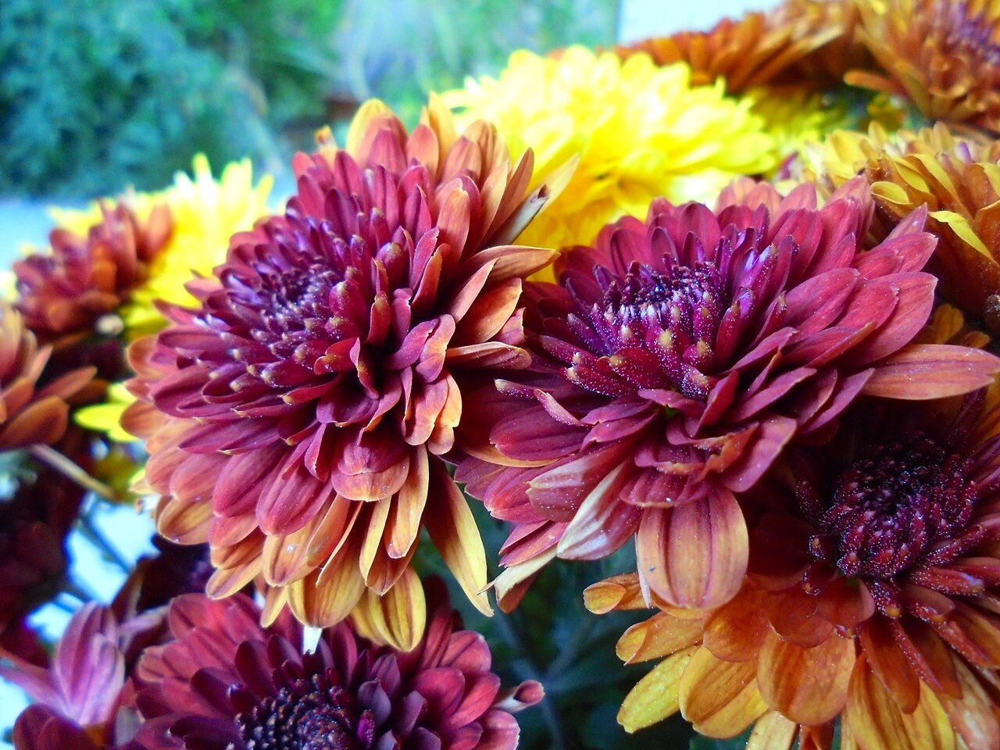
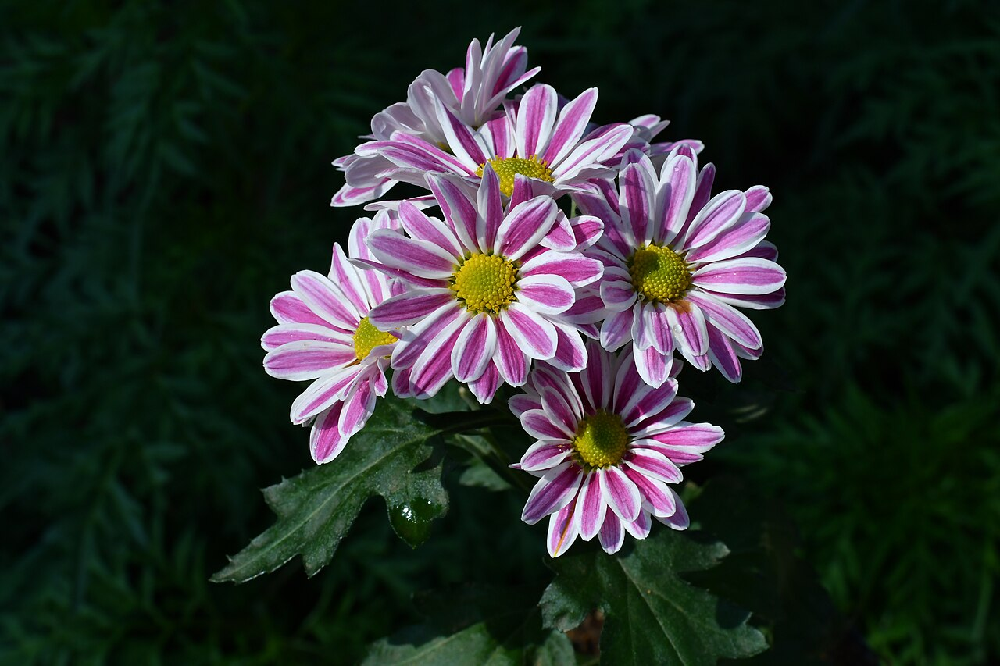
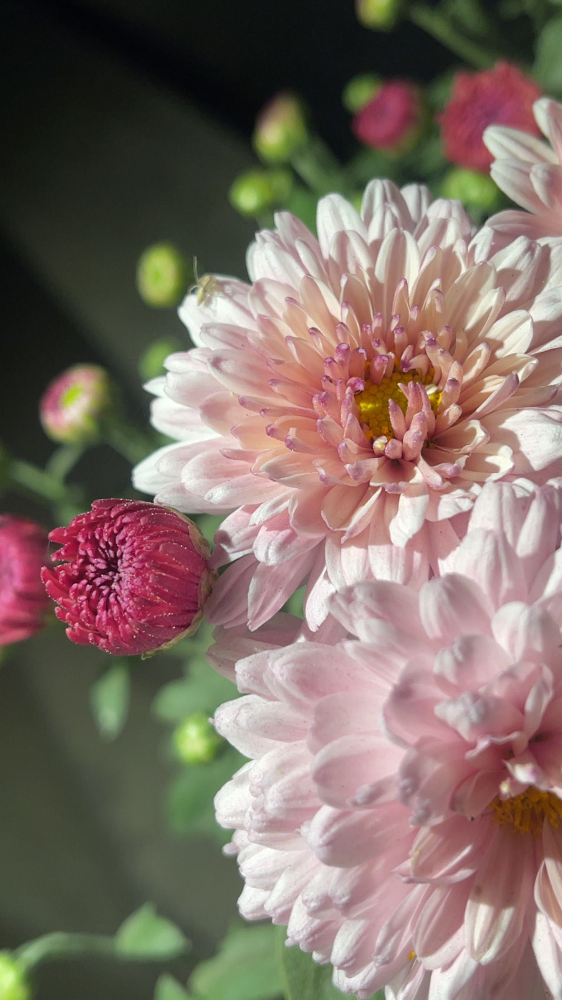
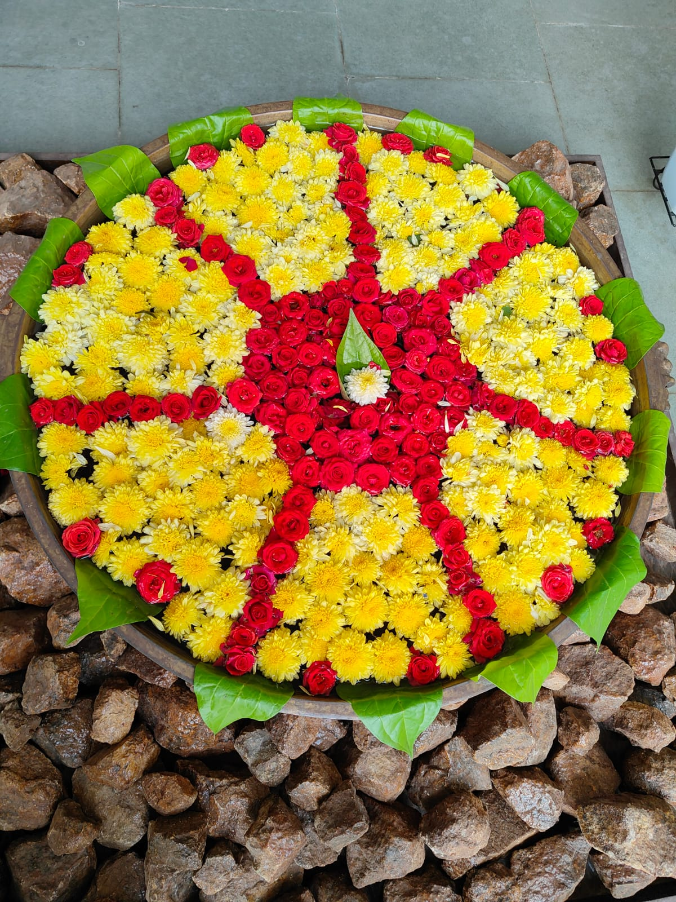

# Chrysanthemum

> The flower whose meaning flips most dramatically by country: cheerful autumn
> icon in the US, the emblem of the Japanese emperor, and the flower of the dead
> across much of Europe and Asia. **Always resolve the culture before assigning
> meaning.**

## Botanical identity
- **Common name(s):** Chrysanthemum, "mum," "kiku" (Japan), "juhua" (China)
- **Scientific name:** *Chrysanthemum* spp. (many reclassified as *Dendranthema*);
  from Greek *chrysos* (gold) + *anthemon* (flower)
- **Family:** Asteraceae
- **Type:** Mass / focal (also a daisy-form; "spider" and "pompon" forms vary)

## Native region & origin
- **Native to:** **East Asia** (China) and northeastern Europe.
- **Now cultivated in:** Worldwide; China, Japan, Colombia, and the Netherlands
  are major producers.
- **Domestication / spread notes:** Cultivated in **China since the 15th century
  BC**, first as a herb; carried to Japan by ~8th century AD, where it became an
  imperial emblem; reached Europe in the 17th–18th centuries.

## Visual identification (for reading a photo)
- **Bloom form:** Extremely varied — dense pompon domes, flat daisy-form, or
  shaggy "spider" and "quill" types.
- **Size:** Small sprays to large "football/disbud" heads.
- **Petals:** Many rows of ray florets; disc often hidden by petal density.
- **Center:** Frequently concealed; visible greenish disc in daisy types.
- **Color range:** White, yellow, bronze, red, pink, purple, green.
- **Foliage/stem cues:** Lobed, aromatic leaves; sturdy stems.
- **Look-alikes:** Asters (smaller, thinner rays), dahlias (larger, more
  symmetric), zinnias. Aromatic foliage and dense form point to mum.

## History & cultural background
Few flowers carry heavier cultural weight. In East Asia it is a scholar's and
emperor's flower and a symbol of autumn and long life; in much of the West and
Mediterranean Europe it is inseparable from cemeteries and remembrance.

## Symbolism & meaning
- **General meaning (Western/US):** Cheerfulness, friendship, joy, optimism,
  and longevity.
- **By color:**
  - **Red** — Love and deep passion.
  - **White** — Truth, loyal love; **grief and death** in East Asian and much of
    European use.
  - **Yellow** — Neglected or slighted love; sorrow (older reading).
  - **Purple** — Wishing wellness/getting well.

## Cultural meanings across the world
- **China:** One of the **"Four Gentlemen"** of classical art (with plum, orchid,
  bamboo). Symbol of **autumn, longevity, nobility, and the reclusive scholar**
  (the poet Tao Yuanming loved them). **Chrysanthemum wine** is drunk at the
  **Double Ninth (Chongyang) Festival** for long life. In modern China, white
  and yellow mums are also **funeral/grave flowers**.
- **Japan (hanakotoba):** The **imperial flower** — the **Chrysanthemum Throne**
  and the 16-petal Imperial Seal. Symbol of the emperor, longevity, and
  rejuvenation; celebrated at the **Festival of Happiness (Kiku no Sekku)**.
  Yet **white chrysanthemums mean death and grief** and are standard at funerals.
- **Korea:** White chrysanthemums are the primary **funeral and mourning** flower.
- **Europe (continental):** In **France, Italy, Belgium, Spain, Poland, Croatia,
  Hungary** and beyond, chrysanthemums are **the flower of the dead**, laid on
  graves at **All Saints' Day (Nov 1)**. Giving them as a gift is a serious
  faux pas.
- **Australia:** The **Mother's Day** flower — because it blooms in the southern
  autumn (May) and shortens to "**mum**."
- **United States:** Cheerful **autumn/homecoming "mums,"** football garlands,
  and fall décor — almost no funerary weight.

## Typical pairings
- **Arranged with:** Roses, lilies, carnations, gladioli (sympathy work);
  asters and solidago in autumn bouquets.
- **Greenery/fillers:** Leatherleaf fern, ruscus.
- **Anchors:** Long-lasting fall arrangements and, culturally, funeral tributes.

## Occasions & events
- **Strongly associated with:** Autumn and homecoming (US), funerals and All
  Saints' Day (Europe, East Asia), the imperial house and longevity (Japan/
  China), Mother's Day (Australia).
- **Avoid for:** Gifting to living people in France, Italy, Japan, Korea, China,
  and much of Europe — reads as a death flower.

## Seasonality & availability
- **Natural season:** Autumn (short-day bloomer).
- **Commercial availability:** Year-round (photoperiod-controlled greenhouses).
- **Vase life / care notes:** Excellent — often **2+ weeks**.

## Quick facts
- **Birth month:** November
- **Wedding anniversary:** 13th
- **Notable toxicity/allergy:** Contains pyrethrins (natural insecticide); mildly
  toxic to pets and can cause contact dermatitis.

## Reference images
<!-- IMAGES-START -->
Reference photos, all under reusable licenses (CC-BY / CC-BY-SA / CC0 / public domain) from Wikimedia Commons. Full attribution in [`image-manifest.json`](../images/image-manifest.json).

*Chrysanthemum(auburn) — Jjlrjjlr00 · CC BY-SA 4.0*

*Chrysanthemum flowers, specifically a variety known for its bi-color blooms with — Shagil Muzhappilangad · CC BY-SA 4.0*

*Bloom of a Chrysanthemum — This is kiranpreet Kaur · CC BY-SA 4.0*

*Flower decoration 2 — JAYASHREESATHIYAMOORTHY · CC BY-SA 4.0*
<!-- IMAGES-END -->

---
*Confidence / to-verify:* High. The single most important takeaway to always
surface: **its meaning is culture-dependent and can flip from "cheer" to
"death."**
