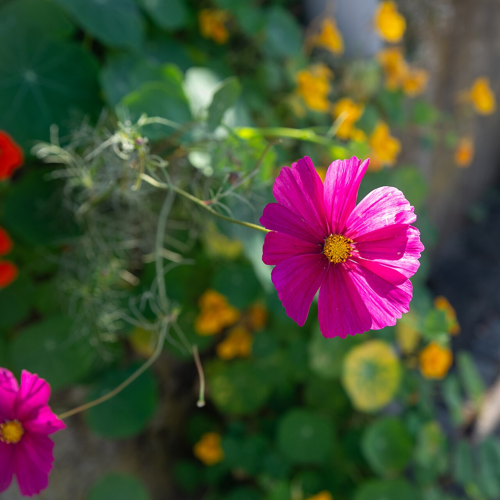
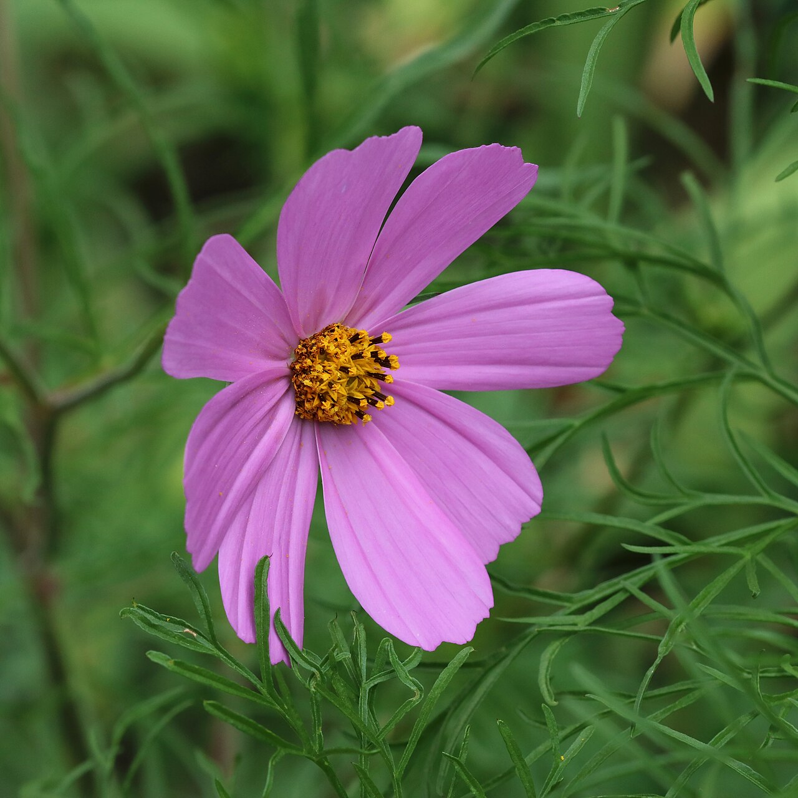
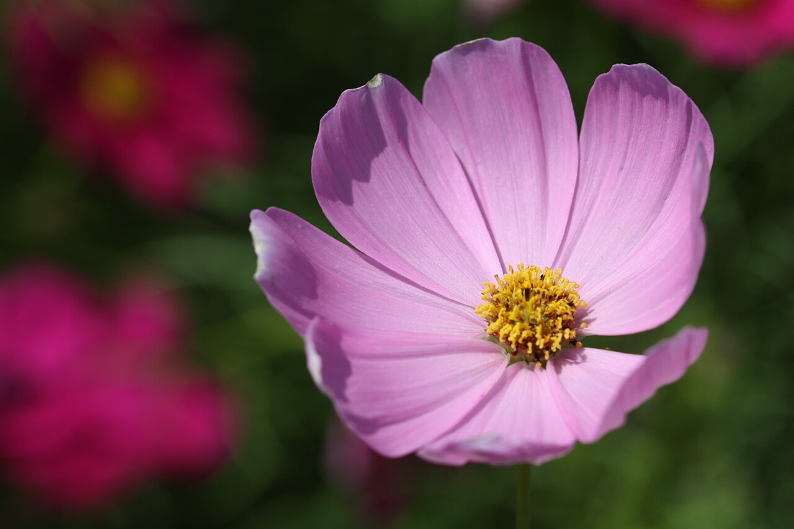

# Cosmos

> Airy, daisy-like blooms literally named for "harmony" — a Mexican native that
> means order, peace, and wholeness, and a signature of the Japanese autumn.

## Botanical identity
- **Common name(s):** Cosmos; Mexican aster
- **Scientific name:** *Cosmos bipinnatus* (pink/white); *C. sulphureus*
  (orange/yellow)
- **Family:** Asteraceae
- **Type:** Daisy-form flower (airy)

## Native region & origin
- **Native to:** **Mexico** and the southern US/Central America.
- **Now cultivated in:** Worldwide as an easy cottage-garden and cutting flower.
- **Domestication / spread notes:** **Spanish missionaries** grew it in Mexican
  mission gardens and named it from the Greek *kosmos* — **"order, harmony,
  ornament"** — for the even, balanced arrangement of its petals.

## Visual identification (for reading a photo)
- **Bloom form:** A flat, open **daisy-form** flower — usually **eight broad,
  slightly notched ray petals** around a small yellow disc.
- **Size:** Medium blooms on tall, wiry stems.
- **Petals:** Broad, flat, often with a fringed or toothed tip.
- **Center:** A neat, small yellow **disc**.
- **Color range:** Pink, white, crimson, and lavender (*bipinnatus*); orange and
  gold (*sulphureus*).
- **Foliage/stem cues:** **Feathery, thread-like foliage** on airy, tall stems —
  a key tell.
- **Look-alikes:** Single dahlias and daisies; the cosmos's eight broad petals,
  ferny foliage, and airy wiry stems distinguish it.

## History & cultural background
Named for cosmic order and grown first in Spanish mission gardens, cosmos carries
a gentle meaning of harmony and balance — and, half a world away, it became the
beloved flower of the Japanese autumn.

## Symbolism & meaning
- **General meaning:** **Order, harmony, peace, balance, wholeness, and
  tranquility**; also modesty and innocence.
- **By color:**
  - **Pink** — Love, innocence.
  - **White** — Purity, tranquility.
  - **Orange/Gold** (*sulphureus*) — Joy, energy.

## Cultural meanings across the world
- **Mexico (origin):** A native wildflower named by **Spanish priests** for the
  orderly symmetry of its petals — *cosmos*, harmony.
- **Japan:** *Kosumosu* is a beloved **autumn flower**; vast **cosmos fields** are
  a seasonal attraction, and it reads as **girlish innocence, purity, and the
  serene beauty of autumn**.
- **Western / Victorian:** **Order, harmony, and peaceful modesty** — a calm,
  gentle sentiment.
- **Note:** A modern ornamental; broadly positive and peaceful in meaning.

## Typical pairings
- **Arranged with:** Zinnias, dahlias, roses, and grasses in airy, wildflower-
  style bouquets.
- **Greenery/fillers:** Its own ferny foliage; grasses.
- **Anchors:** Loose, "just-picked," garden-style arrangements; adds movement.

## Occasions & events
- **Strongly associated with:** Autumn bouquets, weddings (garden style),
  peace/harmony gifts, and cheerful everyday arrangements.
- **Avoid for:** Formal, structured designs — it reads casual and wild.

## Seasonality & availability
- **Natural season:** **Summer to autumn.**
- **Commercial availability:** Best in season (a local flower-farm favorite).
- **Vase life / care notes:** ~5–7 days; delicate — cut when just open and keep
  water fresh.

## Quick facts
- **Birth month:** October (sometimes listed for autumn)
- **Wedding anniversary:** 2nd (sometimes cited with lily of the valley)
- **Notable toxicity/allergy:** **Non-toxic** and pet-safe.

## Reference images
<!-- IMAGES-START -->
Reference photos, all under reusable licenses (CC-BY / CC-BY-SA / CC0 / public domain) from Wikimedia Commons. Full attribution in [`image-manifest.json`](../images/image-manifest.json).

*Cosmos bipinnatus in Zürich — Balise42 · CC BY-SA 4.0*

*White and Pink Cosmos — Kaldari · CC0*

*Cosmos bipinnatus 2026 G2 — George Chernilevsky · CC BY 4.0*

*Cosmos bipinnatus Cav (23) — PEAK99 · CC BY 3.0*
<!-- IMAGES-END -->

---
*Confidence / to-verify:* High on Mexican origin, the "kosmos/harmony" naming,
the Japanese autumn association, and the eight-petal/ferny-foliage ID.
