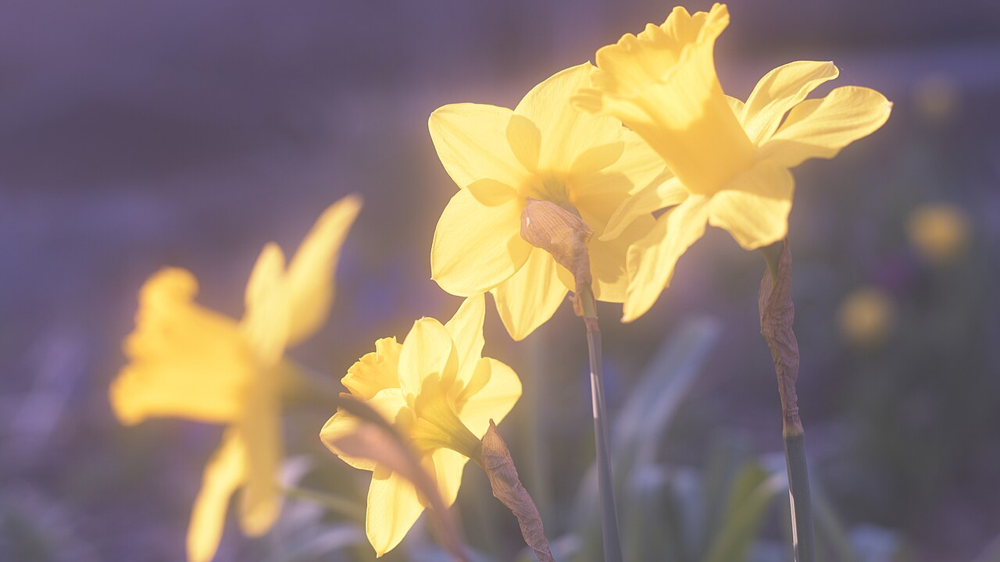
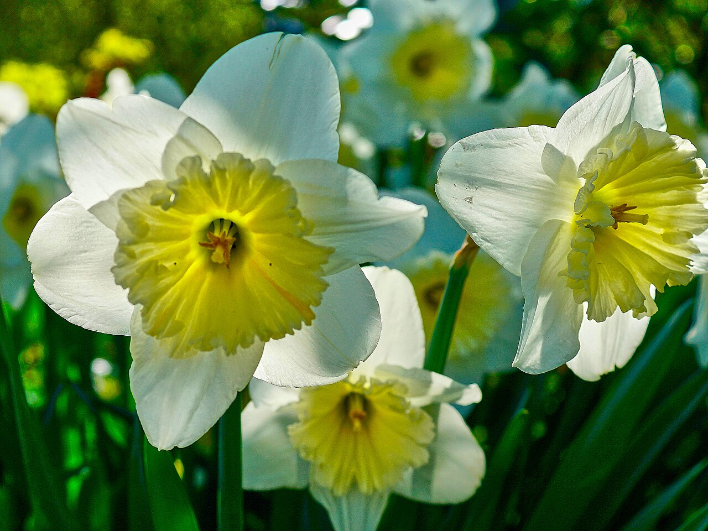
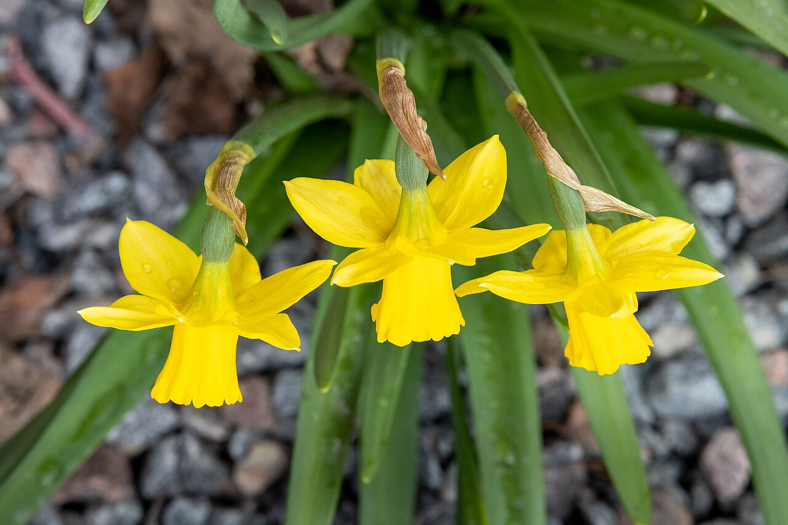
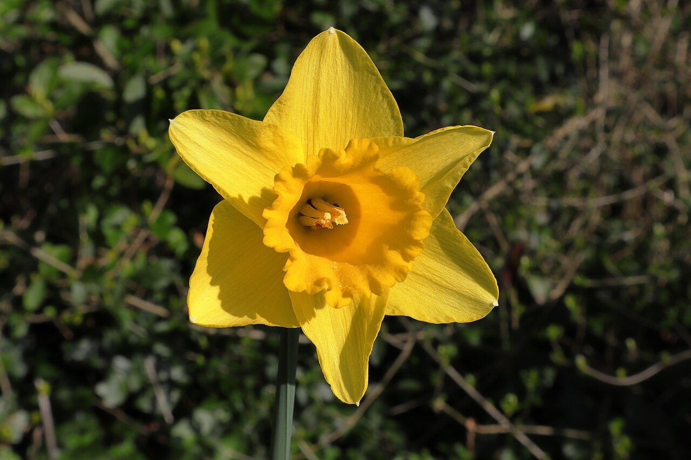

# Daffodil (Narcissus)

> The trumpet of spring and the flower of new beginnings — but tradition warns to
> give a *bunch*, never a single stem.

## Botanical identity
- **Common name(s):** Daffodil; narcissus; jonquil (fragrant multi-flowered
  types); paperwhite (white clustered types)
- **Scientific name:** *Narcissus* spp. (~50 species, thousands of cultivars)
- **Family:** Amaryllidaceae
- **Type:** Form flower

## Native region & origin
- **Native to:** **Europe, North Africa, and the Mediterranean**, with a center
  of diversity on the **Iberian Peninsula**.
- **Now cultivated in:** The Netherlands, the UK, and worldwide.
- **Domestication / spread notes:** One of the most-hybridized garden bulbs;
  naturalized across temperate regions as a harbinger of spring.

## Visual identification (for reading a photo)
- **Bloom form:** A central **trumpet/cup (corona)** surrounded by a ring of
  **six tepals**; borne singly or in clusters.
- **Size:** Small to medium.
- **Petals:** Six flat tepals; the corona ranges from a long trumpet to a shallow
  cup, often in a **contrasting color** (e.g. white petals, orange cup).
- **Center:** The trumpet itself is the focal center.
- **Color range:** Classic yellow; also white, cream, orange, pink-cupped, and
  bicolor.
- **Foliage/stem cues:** Strappy blue-green leaves; hollow stems that exude a
  sap harmful to other cut flowers.
- **Look-alikes:** Few — the trumpet-in-a-ring is unmistakable. Jonquils and
  paperwhites are clustered, smaller-cupped forms.

## History & cultural background
The Greek myth of **Narcissus** — the youth who fell in love with his own
reflection and wasted away into the flower — gives the genus its name and a
thread of vanity and self-love. Yet as the first bold bloom of spring, the
daffodil is far better known as the flower of **rebirth, hope, and renewal**.

## Symbolism & meaning
- **General meaning:** New beginnings, rebirth, hope, and the return of spring;
  and, from the myth, self-love/vanity.
- **By color:**
  - **Yellow** — Joy, friendship, new beginnings, cheer.
  - **White** — Purity, respect, honesty.
  - **Orange-cupped** — Energy, warmth.
- **Number/presentation notes:** A widespread superstition holds that a **single
  daffodil foretells misfortune**, while **a bunch brings joy and good luck** —
  so they are given in generous handfuls.

## Cultural meanings across the world
- **Wales:** The **national flower**, worn on **St David's Day (March 1)**; a
  proud emblem of Welsh identity.
- **China:** The **"water fairy flower"** (*shuixianhua*, a *Narcissus*) is a
  **Lunar New Year** symbol of good fortune and prosperity; if it blooms exactly
  on New Year's Day, it promises wealth for the year ahead.
- **Cancer charities (UK/US/Australia):** The daffodil is the emblem of **hope
  for a cure** — Marie Curie's Great Daffodil Appeal, the American Cancer
  Society's Daffodil Days, and Australia's Daffodil Day.
- **Greco-Roman / mythological:** Beyond Narcissus, **Persephone** was gathering
  narcissus when Hades abducted her to the underworld — lending the flower a
  quiet link to death and the turning of the seasons.

## Typical pairings
- **Arranged with:** Tulips, hyacinths, muscari, and ranunculus in spring
  bouquets. **Care note:** condition daffodils separately for several hours —
  their sap shortens the life of other flowers.
- **Greenery/fillers:** Their own foliage; light spring greens.
- **Anchors:** Cheerful, seasonal spring arrangements.

## Occasions & events
- **Strongly associated with:** Spring, Easter, St David's Day, Lunar New Year
  (China), cancer-awareness fundraising, and "new start" gifts.
- **Avoid for:** Giving a lone stem (the misfortune superstition).

## Seasonality & availability
- **Natural season:** **Early spring** (Feb–April).
- **Commercial availability:** Late winter through spring.
- **Vase life / care notes:** ~5–7 days; rinse cut stems and let them stand alone
  before mixing (see sap note above).

## Quick facts
- **Birth month:** March
- **Wedding anniversary:** 10th
- **Notable toxicity/allergy:** **Toxic if ingested** (lycorine); bulbs can be
  mistaken for onions; sap irritates skin and other flowers.

## Reference images
<!-- IMAGES-START -->
Reference photos, all under reusable licenses (CC-BY / CC-BY-SA / CC0 / public domain) from Wikimedia Commons. Full attribution in [`image-manifest.json`](../images/image-manifest.json).

*Trumpet Daffodils in the Preserve — SavidgeMichael · CC BY 4.0*

*Narcissus — Kerbla Edzerdla · CC BY 3.0*

*Påsklilja, Dafodil, Narcissus pseudonarcissus NZ7 0254 — Bengt Nyman from Vaxholm, Sweden · CC BY 2.0*

*Fleur de narcisse jaune (Narcissus pseudonarcissus) — JackyM59 · CC BY-SA 4.0*
<!-- IMAGES-END -->

---
*Confidence / to-verify:* High on identity, Welsh/St David's association, the
Narcissus/Persephone myths, and the single-vs-bunch superstition.
