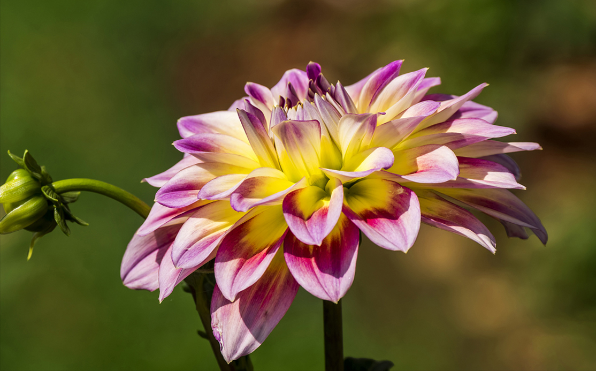
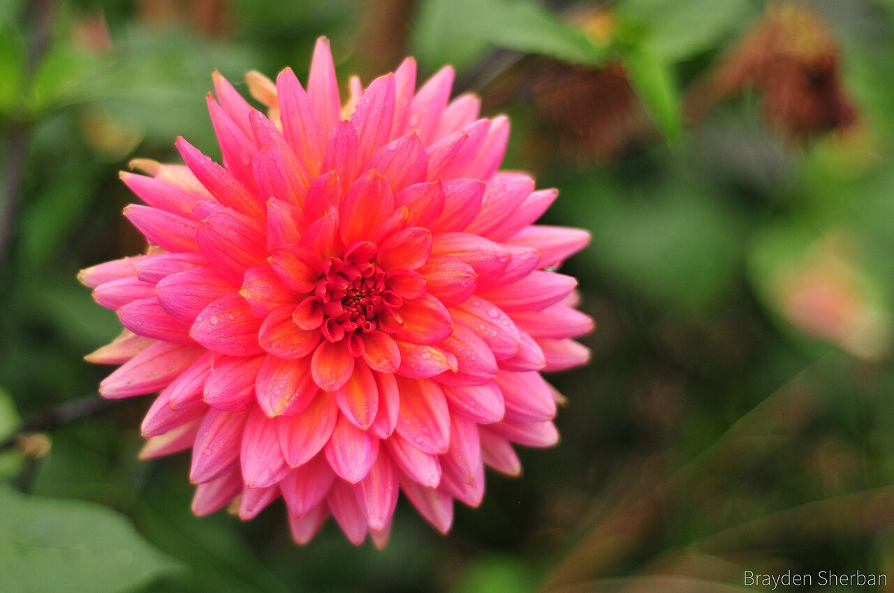
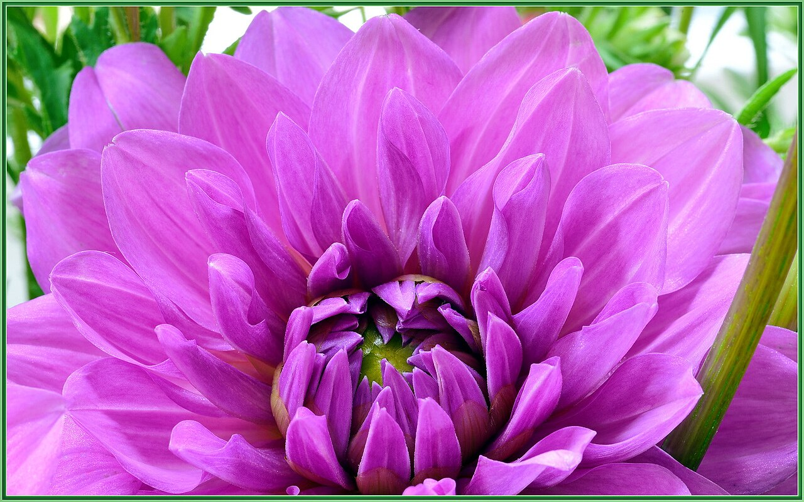
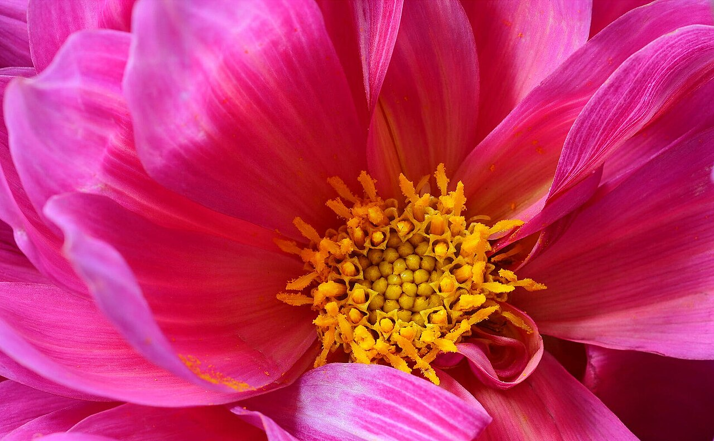

# Dahlia

> Mexico's national flower and the Aztecs' "water pipe" plant — a bloom of
> dizzying variety, meaning dignity, elegance, and grace under pressure.

## Botanical identity
- **Common name(s):** Dahlia; the Aztec *acocotli* / *cocoxochitl*
- **Scientific name:** *Dahlia* spp. (~42 species, thousands of cultivars)
- **Family:** Asteraceae
- **Type:** Mass / form flower (form ranges enormously)

## Native region & origin
- **Native to:** **Mexico and Central America** — the **national flower of Mexico.**
- **Now cultivated in:** The Netherlands, the US, and worldwide.
- **Domestication / spread notes:** Cultivated by the **Aztecs**, who used the
  hollow stems as **water pipes** and the tubers as **food and medicine**. Named
  after Swedish botanist **Anders Dahl**. Bred into a staggering array of forms:
  pompon, ball, cactus, decorative, and giant "dinnerplate."

## Visual identification (for reading a photo)
- **Bloom form:** Rounded, **highly symmetrical** heads of many ray florets —
  from tiny tight pompons to plate-sized blooms.
- **Size:** Small (pompon) to very large (dinnerplate, 25+ cm).
- **Petals:** Ray florets often **rolled, pointed, or quilled**, in geometric
  rings; some show a visible central disc (single/collarette types).
- **Center:** Hidden in doubles; a golden disc in singles.
- **Color range:** Nearly every color and many bicolors — but **no true blue.**
- **Foliage/stem cues:** Divided, toothed leaves; hollow stems; sturdy.
- **Look-alikes:** Chrysanthemum, zinnia, and ball forms of other Asteraceae; the
  dahlia's crisp geometry and rolled petals, plus large size, distinguish it.

## History & cultural background
From Aztec gardens to the Swedish botanists who named it and the European growers
who multiplied it into thousands of cultivars, the dahlia is a flower of
transformation and abundance — now a signature of late-summer and autumn design.

## Symbolism & meaning
- **General meaning:** **Dignity, elegance, commitment, and staying graceful
  under pressure**; a lasting bond, and new beginnings/change. A genuine
  floriographic double reads it as **warning, instability, or betrayal**.
- **By color:** Colors follow their general meanings (see color-symbolism.md);
  the dignity/elegance reading dominates modern use.

## Cultural meanings across the world
- **Mexico (national flower):** Cultivated by the **Aztecs** for food, medicine,
  and water-carrying stems, and linked to the **sun** and ceremony; declared
  Mexico's national flower in 1963 — a symbol of national pride.
- **Western / Victorian:** **Dignity and elegance**, plus the shadow-meaning of
  **betrayal or a warning** — the same flower could flatter or caution depending
  on context.
- **Modern floristry:** A byword for **commitment and grace under pressure**, and
  a favorite for **autumn weddings** for its lush geometry.
- **Note:** The tubers remain edible (an Aztec staple) — a rare ornamental with a
  food history.

## Typical pairings
- **Arranged with:** Roses, ranunculus, zinnias, and amaranthus in autumnal,
  textural bouquets.
- **Greenery/fillers:** Eucalyptus, dusty miller, seasonal foliage.
- **Anchors:** Late-summer and autumn arrangements; a big focal statement bloom.

## Occasions & events
- **Strongly associated with:** Autumn weddings, late-summer celebrations,
  birthdays, and Mexican cultural pride.
- **Avoid for:** No strong taboos; the "betrayal" meaning is folkloric.

## Seasonality & availability
- **Natural season:** **Late summer to first frost** (peak Aug–Oct).
- **Commercial availability:** Best in season; limited and pricier off-season.
- **Vase life / care notes:** ~4–7 days (shorter than many); cut in cool morning,
  use warm water and change often; blooms don't open much after cutting — buy open.

## Quick facts
- **Birth month:** — (a late-summer/autumn flower)
- **Wedding anniversary:** 14th (with orchid)
- **Notable toxicity/allergy:** Mildly toxic to pets if ingested; tubers are
  edible for humans (traditional food).

## Reference images
<!-- IMAGES-START -->
Reference photos, all under reusable licenses (CC-BY / CC-BY-SA / CC0 / public domain) from Wikimedia Commons. Full attribution in [`image-manifest.json`](../images/image-manifest.json).

*Closeup of a beautiful Dahlia Flower in a garden — Kreativeart · CC BY-SA 4.0*

*Flower — Brayden Sherban · CC BY-SA 3.0*

*Summer Dahlia — Terry Lucas · CC BY 3.0*

*Hot Diggity Dahlia — Terry Lucas · CC BY 3.0*
<!-- IMAGES-END -->

---
*Confidence / to-verify:* High on Mexican/Aztec origin and national-flower status,
the Dahl naming, the "no true blue" and dignity/betrayal duality.
