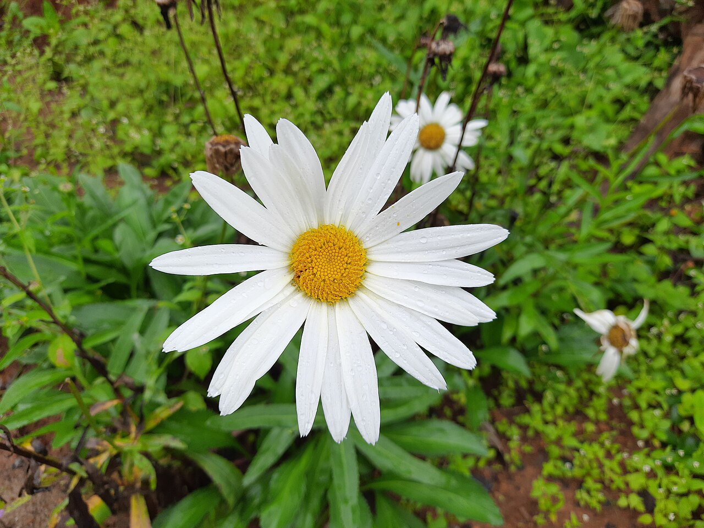
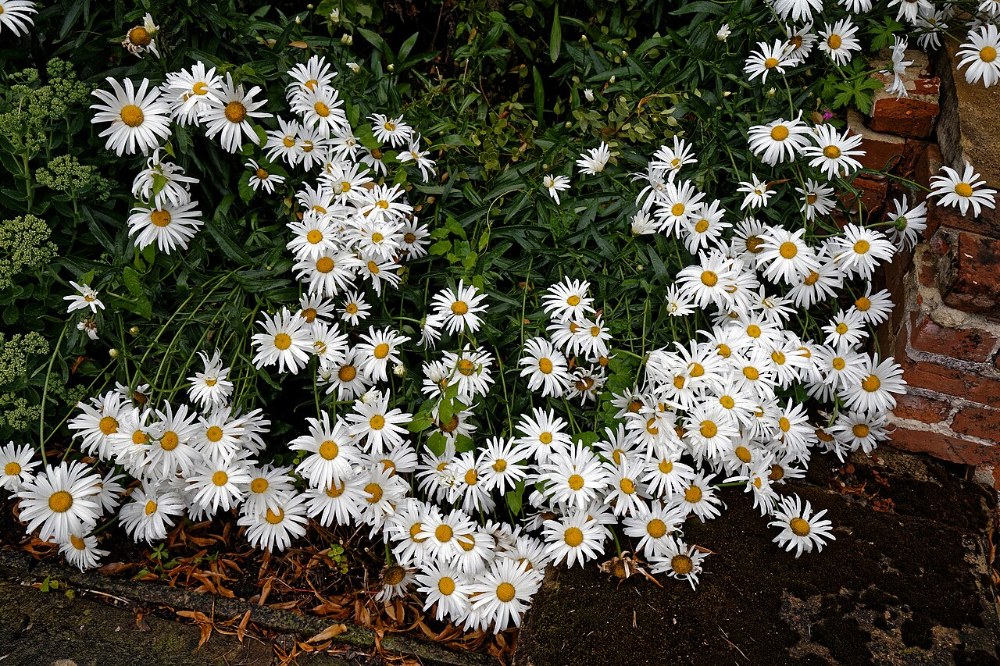
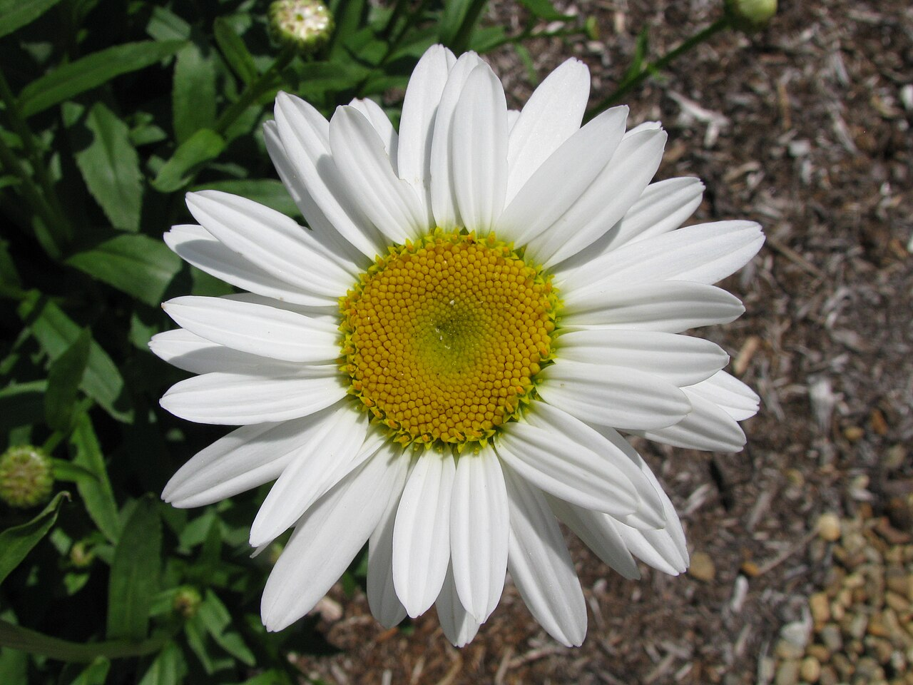
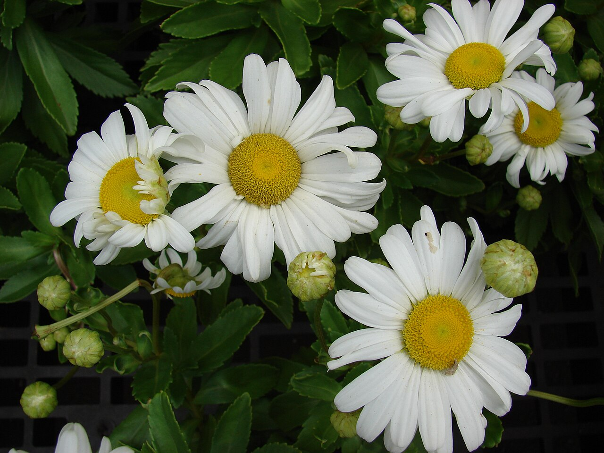

# Daisy

> The "day's eye" that opens with the dawn — the simple, cheerful emblem of
> innocence, loyal love, and new beginnings, sacred to the Norse goddess of love.

## Botanical identity
- **Common name(s):** Daisy; common/English daisy (*Bellis*), oxeye and **Shasta
  daisy** (*Leucanthemum*), marguerite (*Argyranthemum*)
- **Scientific name:** *Leucanthemum* × *superbum* (Shasta, the common cut daisy);
  *Bellis perennis* (English daisy)
- **Family:** Asteraceae
- **Type:** Daisy-form flower

## Native region & origin
- **Native to:** **Europe and temperate Asia** (*Bellis*, *Leucanthemum*); the
  marguerite hails from the **Canary Islands**.
- **Now cultivated in:** Worldwide as a garden and cut flower.
- **Domestication / spread notes:** The name is Old English **"dæges eage"** —
  "day's eye" — because the flower **opens at dawn and closes at dusk**. The
  Shasta daisy was bred by Luther Burbank in California.

## Visual identification (for reading a photo)
- **Bloom form:** The classic **daisy** — a single ring of white ray petals
  around a flat **yellow disc**.
- **Size:** Small (English daisy) to medium (Shasta); larger than an aster.
- **Petals:** Clean, even white rays; some doubles.
- **Center:** A bright, flat **yellow disc** of tiny florets.
- **Color range:** Mostly white with yellow centers; *Bellis* and gerbera-type
  daisies add pinks and reds.
- **Foliage/stem cues:** Toothed or spoon-shaped leaves; slender stems.
- **Look-alikes:** Aster (many thinner rays, purple/blue), chamomile (smaller,
  domed center), gerbera (much larger, on a bare fuzzy stem). The daisy's broad
  white rays and flat yellow disc are the baseline "daisy."

## History & cultural background
A universal symbol of childhood innocence and simple joy — from "he loves me, he
loves me not" petal-picking to Norse mythology, where the daisy was **sacred to
Freya**, goddess of love and fertility, and so came to stand for **new life and
motherhood**.

## Symbolism & meaning
- **General meaning:** **Innocence, purity, loyal love, and new beginnings**; also
  **childbirth and motherhood**, and cheerful simplicity.
- **By color:**
  - **White** — Innocence, purity.
  - **Yellow** — Cheer, friendship.
  - **Pink/Red** (Bellis/gerbera types) — Affection, love.

## Cultural meanings across the world
- **Norse mythology:** Sacred to **Freya** (love, beauty, fertility), making the
  daisy a symbol of **new beginnings, childbirth, and new motherhood** — why
  daisies are a classic **new-baby** flower.
- **Greco-Roman / mythological:** The nymph **Belides** turned into a daisy
  (*Bellis*) to escape the pursuing god Vertumnus — hence **innocence and modesty.**
- **Christian (medieval Europe):** Associated with the **Virgin Mary** and
  childlike innocence.
- **Western / Victorian:** **Innocence and loyal love**, plus a note of **secrecy**
  — "I'll never tell."

## Typical pairings
- **Arranged with:** Sunflowers, gerberas, asters, and wildflowers in cheerful,
  casual bouquets.
- **Greenery/fillers:** Its own foliage, grasses, baby's breath.
- **Anchors:** Fresh, informal, "just-picked" and country arrangements.

## Occasions & events
- **Strongly associated with:** New babies and new beginnings, birthdays,
  get-well and cheer-up gifts, April birthdays, and 5th anniversaries.
- **Avoid for:** Formal solemn occasions — it reads as casual and cheerful.

## Seasonality & availability
- **Natural season:** Late spring through summer.
- **Commercial availability:** Much of the year.
- **Vase life / care notes:** ~6–10 days; hardy and long-lasting; strip lower
  leaves and refresh water.

## Quick facts
- **Birth month:** April (with sweet pea)
- **Wedding anniversary:** 5th
- **Notable toxicity/allergy:** *Bellis* and *Leucanthemum* are generally
  **non-toxic**; can cause mild upset in pets and contact allergy in the sensitive.

## Reference images
<!-- IMAGES-START -->
Reference photos, all under reusable licenses (CC-BY / CC-BY-SA / CC0 / public domain) from Wikimedia Commons. Full attribution in [`image-manifest.json`](../images/image-manifest.json).

*White Shasta Daisies- Shola Gardens - Kotagiri — Sankar 1995 · CC BY-SA 4.0*

*Leucanthemum × superbum Shasta daisy at Easton Lodge Gardens, Little Easton, Ess — Acabashi · CC BY-SA 4.0*

*Leucanthemum x superbum 'Becky' in NH — Captain-tucker · CC BY-SA 3.0*

*Starr-070906-8713-Leucanthemum x superbum-flowers and leaves-Kula Ace Hardware a — Forest and Kim Starr · CC BY 3.0 us*
<!-- IMAGES-END -->

---
*Confidence / to-verify:* High on the "day's eye" etymology, Freya/Belides myths,
new-baby association, and the daisy-vs-aster/gerbera ID.
