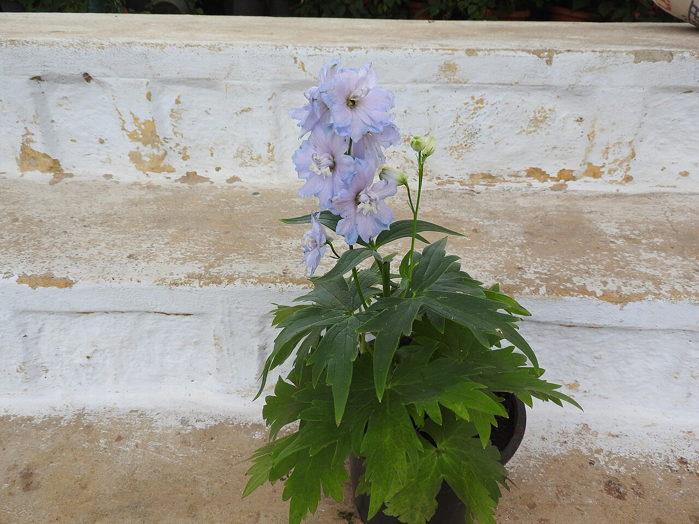
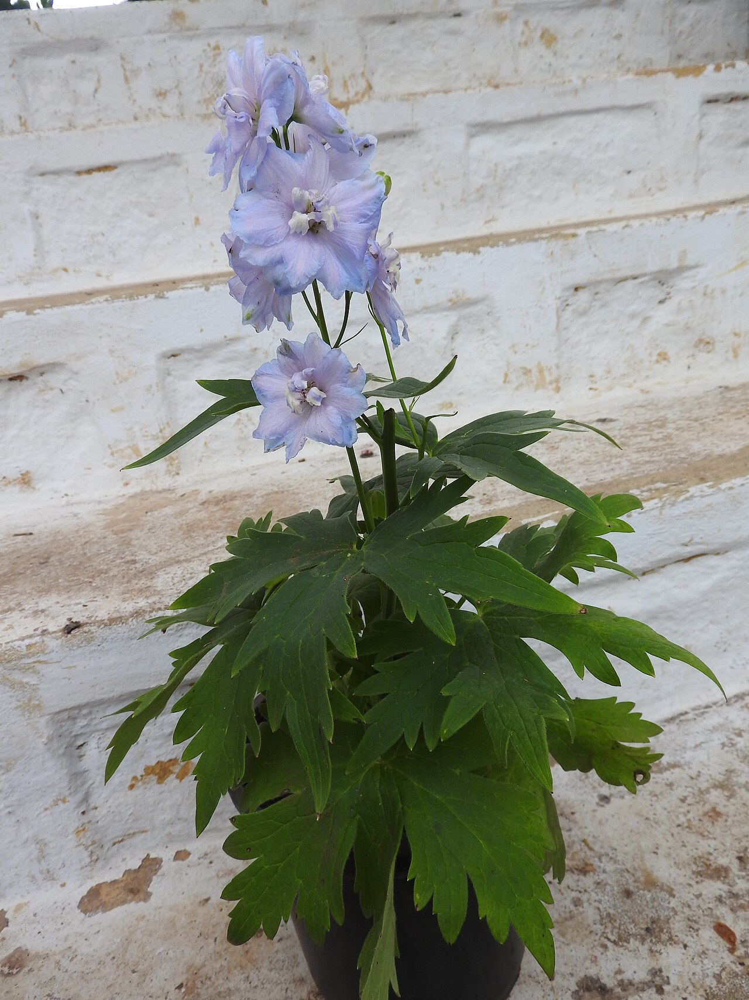
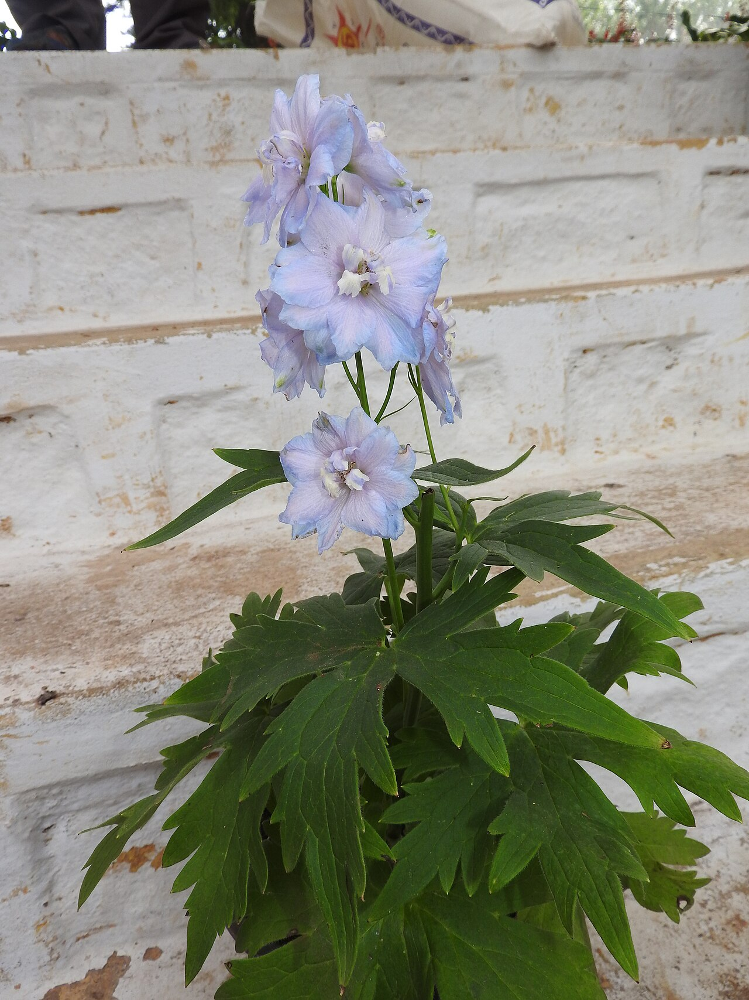
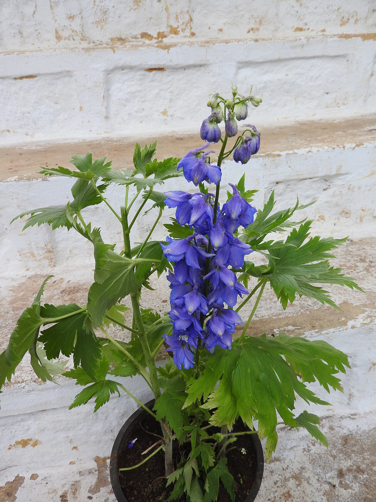

# Delphinium (Larkspur)

> The tall true-blue spire of the summer garden — a rare genuinely blue flower,
> read as an open heart, and July's birth flower as larkspur.

## Botanical identity
- **Common name(s):** Delphinium (perennial); larkspur (the annual relative,
  *Consolida*)
- **Scientific name:** *Delphinium* spp. (esp. *D. elatum* hybrids)
- **Family:** Ranunculaceae
- **Type:** Line flower (a tall vertical spike)

## Native region & origin
- **Native to:** The **Northern Hemisphere** widely, plus the high mountains of
  **tropical Africa**.
- **Now cultivated in:** Worldwide as a garden and cut flower.
- **Domestication / spread notes:** *Delphinium* is Greek for **"dolphin"** — the
  unopened bud's shape; **"larkspur"** describes the floret's backward **spur**,
  like a lark's claw.

## Visual identification (for reading a photo)
- **Bloom form:** A tall, dense **spike** of **spurred florets** climbing the stem.
- **Size:** Can be very tall (up to ~2 m in the garden); long cut stems.
- **Petals:** Each floret has a distinctive rear **spur**; often a contrasting
  central "bee" (tuft) in delphiniums.
- **Center:** A small fuzzy "bee" of inner petals in many delphiniums.
- **Color range:** Famous for **true blue** (uncommon in flowers), plus purple,
  white, pink, and lavender.
- **Foliage/stem cues:** Deeply cut, palmate (hand-shaped) leaves.
- **Look-alikes:** Snapdragon and stock spikes; delphinium is confirmed by its
  **spurred florets, palmate leaves, and clear blues**.

## History & cultural background
Prized for a color few flowers achieve — genuine blue — the delphinium is the
statement spire of the English summer border. Its Greek and folkloric past ties
it to both dolphins and grief, and to protective charms against evil.

## Symbolism & meaning
- **General meaning:** An **open heart**, ardent attachment, big-heartedness,
  positivity, lightness/fun, and protection.
- **By color:**
  - **Blue** — Dignity, grace, remembrance.
  - **Pink** — Fickleness, contrariness.
  - **White** — Joy, a happy nature.
  - **Purple** — First love, sweetness.

## Cultural meanings across the world
- **Greco-Roman / mythological:** One legend says the larkspur sprang from the
  **blood of Ajax**, its petal markings spelling his cry of grief — a thread of
  **mourning** beneath the cheerful flower.
- **Europe (folklore):** Believed to **protect against scorpions, ghosts, and
  witchcraft**; hung in stables and homes as a guard against evil.
- **Western / Victorian:** Chiefly an **open heart and ardent attachment**;
  larkspur is the **July birth flower**, and blue delphinium reads as dignity
  and remembrance.
- **Note:** Its beauty hides real danger — all parts are poisonous.

## Typical pairings
- **Arranged with:** Roses, peonies, lilies, and stock; supplies height, line,
  and rare blue.
- **Greenery/fillers:** Its own foliage; airy greens.
- **Anchors:** Tall summer garden arrangements; a go-to for genuine blue.

## Occasions & events
- **Strongly associated with:** Summer bouquets, July birthdays, celebrations of
  an open heart, and anything needing true blue (patriotic palettes, "something
  blue" weddings).
- **Avoid for:** Homes with pets/children who might chew stems (toxic).

## Seasonality & availability
- **Natural season:** Summer.
- **Commercial availability:** Late spring through summer, plus imports.
- **Vase life / care notes:** ~5–7 days; tall stems are top-heavy — support them;
  handle with care (sap can irritate skin).

## Quick facts
- **Birth month:** July (as larkspur)
- **Wedding anniversary:** — (no standard year)
- **Notable toxicity/allergy:** **Poisonous — all parts** (diterpene alkaloids);
  a notable cause of livestock poisoning; keep from pets and children.

## Reference images
<!-- IMAGES-START -->
Reference photos, all under reusable licenses (CC-BY / CC-BY-SA / CC0 / public domain) from Wikimedia Commons. Full attribution in [`image-manifest.json`](../images/image-manifest.json).

*Delphinium elatum-1-anna park-yercaud-salem-India — Yercaud-elango · CC BY-SA 4.0*

*Delphinium elatum-2-anna park-yercaud-salem-India — Yercaud-elango · CC BY-SA 4.0*

*Delphinium elatum-3-anna park-yercaud-salem-India — Yercaud-elango · CC BY-SA 4.0*

*Delphinium elatum hybrid-1-anna park-yercaud-salem-India — Yercaud-elango · CC BY-SA 4.0*
<!-- IMAGES-END -->

---
*Confidence / to-verify:* High on the dolphin/lark etymology, true-blue rarity,
July birth flower, toxicity, and the Ajax grief legend.
