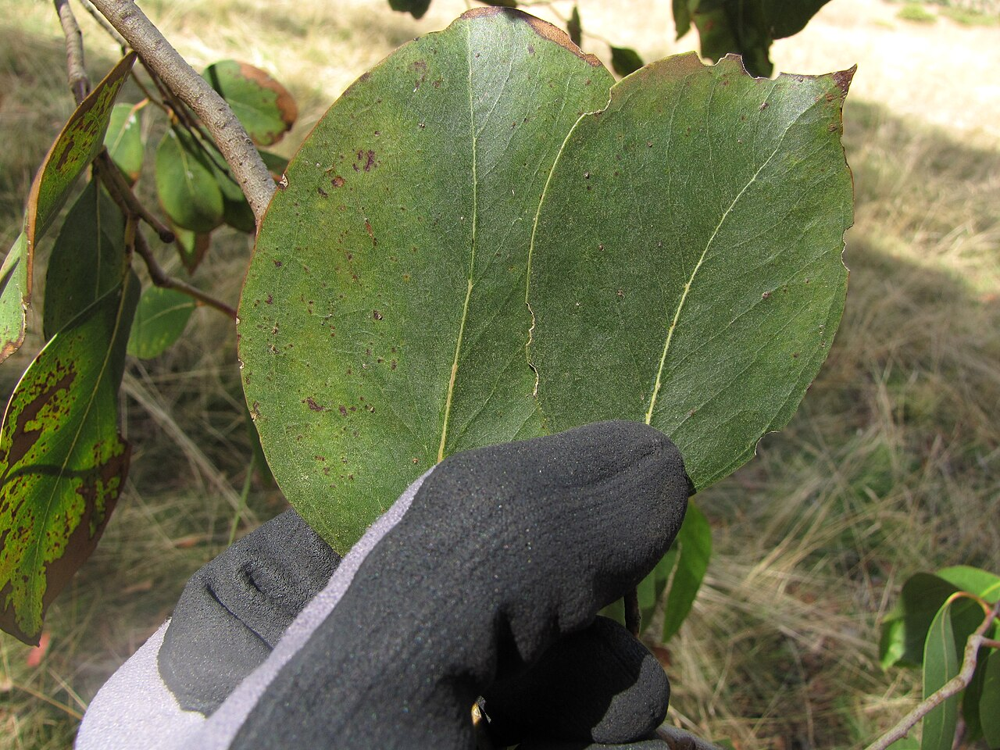
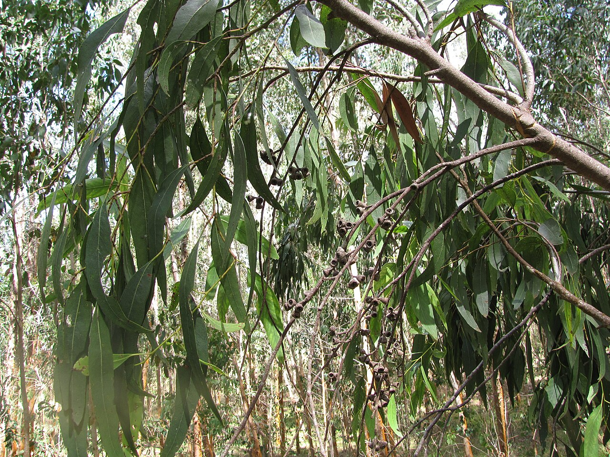
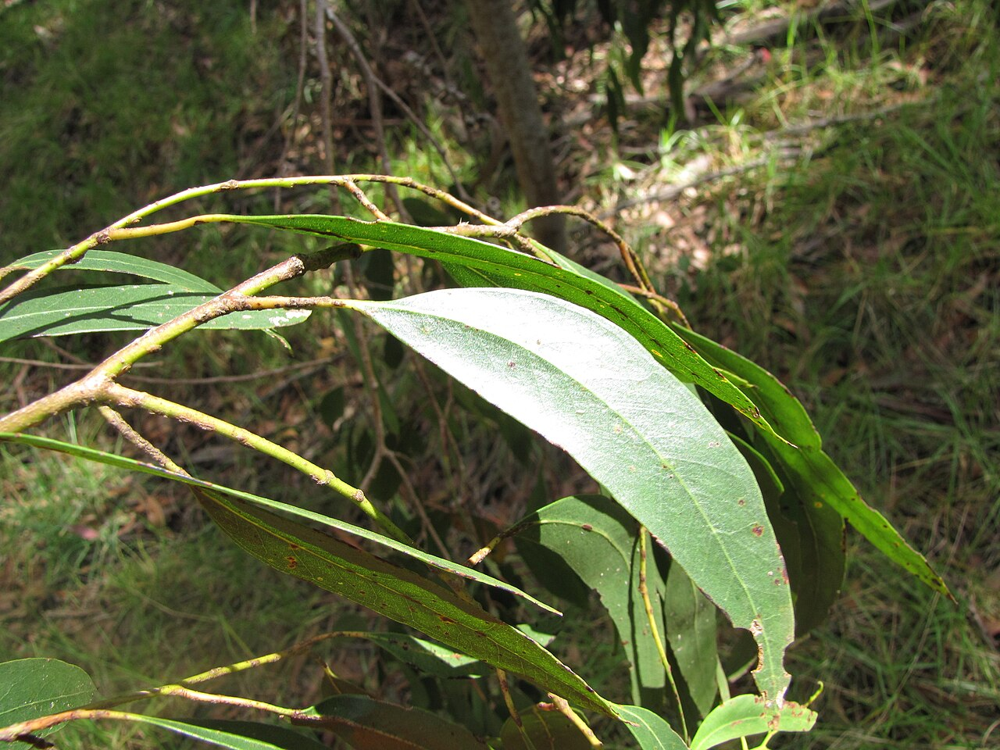
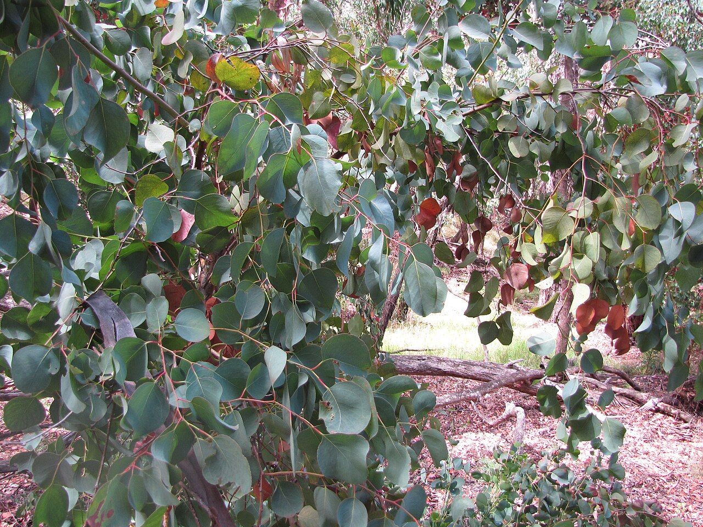

# Eucalyptus (Greenery)

> The scented silver-green foliage behind the modern "organic" bouquet look. An
> Australian native carrying deep meanings of protection, healing, and cleansing.

## Botanical identity
- **Common name(s):** Eucalyptus; gum tree; silver dollar, seeded, baby blue,
  willow, and true blue eucalyptus (by cut type)
- **Scientific name:** *Eucalyptus* spp. — florist favorites include *E. cinerea*
  and *E. pulverulenta* (silver dollar), *E. gunnii*, and seeded types
- **Family:** Myrtaceae
- **Type:** Foliage / greenery

## Native region & origin
- **Native to:** **Australia** (with a few species in nearby New Guinea,
  Indonesia, and the Philippines) — over 700 species.
- **Now cultivated in:** Grown worldwide for foliage, timber, and oil; widely
  naturalized (e.g. California, the Mediterranean, South America).
- **Domestication / spread notes:** A defining tree of the Australian bush and a
  koala food source; its fast growth and aromatic oil spread it around the globe.

## Visual identification (for reading a photo)
- **Bloom form:** Not a flower — **foliage**. Recognized by its distinctive
  leaves and scent.
- **Size:** Sprays and branches used to frame and fill arrangements.
- **Petals:** N/A. **Silver dollar** types have **rounded, coin-like blue-green
  leaves** in pairs along the stem; **willow/adult** foliage is long and sickle-
  shaped; **seeded** eucalyptus carries clusters of small gumnut buds/pods.
- **Center:** N/A.
- **Color range:** Silvery blue-green to gray-green; sometimes powdery/glaucous.
- **Foliage/stem cues:** **Strongly aromatic** (menthol/camphor); often a waxy,
  frosted coating; reddish or slender woody stems.
- **Look-alikes:** Dusty miller and some silvery herbs; eucalyptus is confirmed
  by its **paired round leaves and unmistakable medicinal scent**.

## History & cultural background
Long central to Aboriginal Australian life — as medicine, tools, and ceremony —
and now the signature greenery of contemporary floristry, prized for adding
volume, movement, silvery color, and fragrance.

## Symbolism & meaning
- **General meaning:** **Protection, abundance, healing, purification, clarity,
  and renewal;** also strength and longevity (fast-growing and resilient). In
  design, it signals a modern, natural, "just-gathered" aesthetic.
- **By color:** As silvery foliage it reads as calm, clean, and fresh rather than
  carrying color-coded messages.

## Cultural meanings across the world
- **Indigenous / Aboriginal Australian:** Deep significance across many nations —
  a source of **medicine, tools, and food**, and central to **smoking (cleansing)
  ceremonies**, where burning leaves are used for **protection, healing, and
  warding off bad spirits**. Bound up with the Dreaming and Country.
- **Global folk/herbal:** The essential oil is a worldwide emblem of **healing and
  respiratory relief**, reinforcing meanings of purification and clarity.
- **Modern floristry (Western):** Reads as **freshness, calm, and natural
  elegance** — the backbone of the organic/garden-style bouquet.
- **Note:** As Australia's iconic tree, it also stands broadly for the continent
  itself and its wildlife.

## Typical pairings
- **Arranged with:** Roses, peonies, ranunculus, dahlias — nearly any focal
  flower; a near-universal greenery.
- **Greenery/fillers:** Combines with ruscus, olive branch, ferns, and other
  foliage.
- **Anchors:** Modern, rustic, and "organic" arrangements; wreaths, garlands,
  bouquet backing, and table runners.

## Occasions & events
- **Strongly associated with:** Contemporary weddings, everyday greenery,
  wreaths and installations, and home décor (its scent doubles as aromatherapy).
- **Avoid for:** Little to avoid; strong scent can be much in very small enclosed
  spaces.

## Seasonality & availability
- **Natural season:** Evergreen — harvested year-round.
- **Commercial availability:** **Year-round.**
- **Vase life / care notes:** Excellent — often **2–3 weeks fresh** and dries
  well for lasting arrangements; woody stems benefit from a fresh angled cut.

## Quick facts
- **Birth month:** — (foliage, not a birth flower)
- **Wedding anniversary:** — (no standard year; a wedding-greenery staple)
- **Notable toxicity/allergy:** **Eucalyptus oil is toxic if ingested** (to pets
  and, in quantity, people); the foliage is for arrangements, not consumption.

## Reference images
<!-- IMAGES-START -->
Reference photos, all under reusable licenses (CC-BY / CC-BY-SA / CC0 / public domain) from Wikimedia Commons. Full attribution in [`image-manifest.json`](../images/image-manifest.json).

*Starr-110920-9084-Eucalyptus sp-leaves-Waiale Gulch-Maui — Forest and Kim Starr · CC BY 3.0 us*

*Starr-110920-9089-Eucalyptus sp-leaves-Waiale Gulch-Maui — Forest and Kim Starr · CC BY 3.0 us*

*Starr-110920-9092-Eucalyptus sp-leaves-Waiale Gulch-Maui — Forest and Kim Starr · CC BY 3.0 us*

*Starr-110920-9105-Eucalyptus sp-leaves-Waiale Gulch-Maui — Forest and Kim Starr · CC BY 3.0 us*
<!-- IMAGES-END -->

---
*Confidence / to-verify:* High on Australian origin, silver-dollar vs. seeded
foliage types, the aromatic-oil healing symbolism, and Aboriginal ceremonial use.
