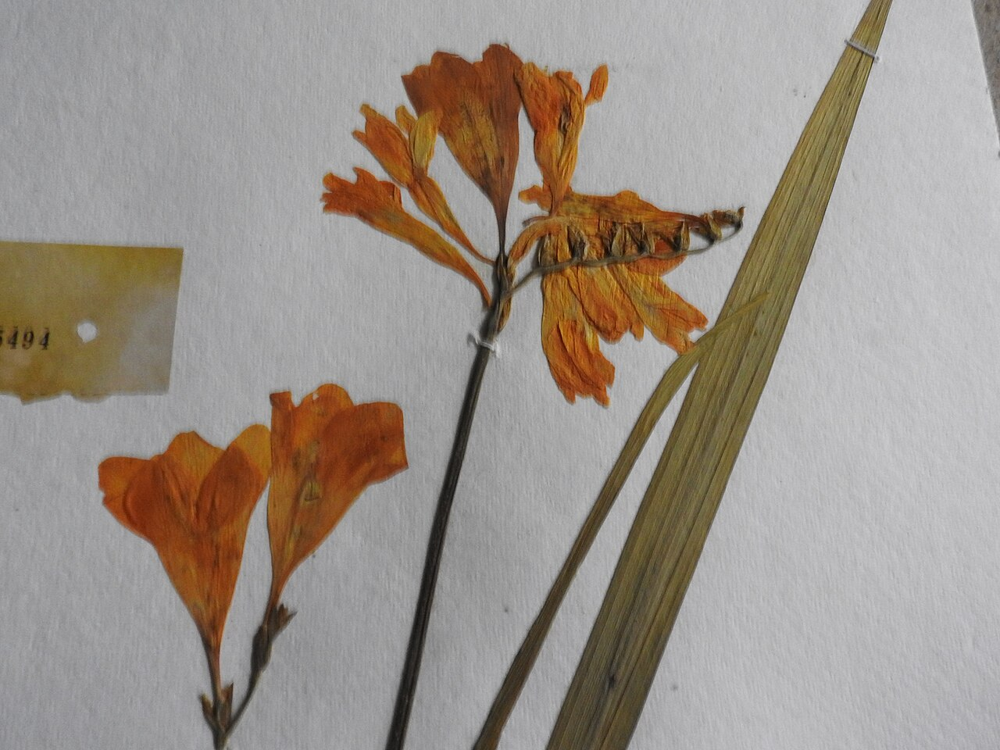
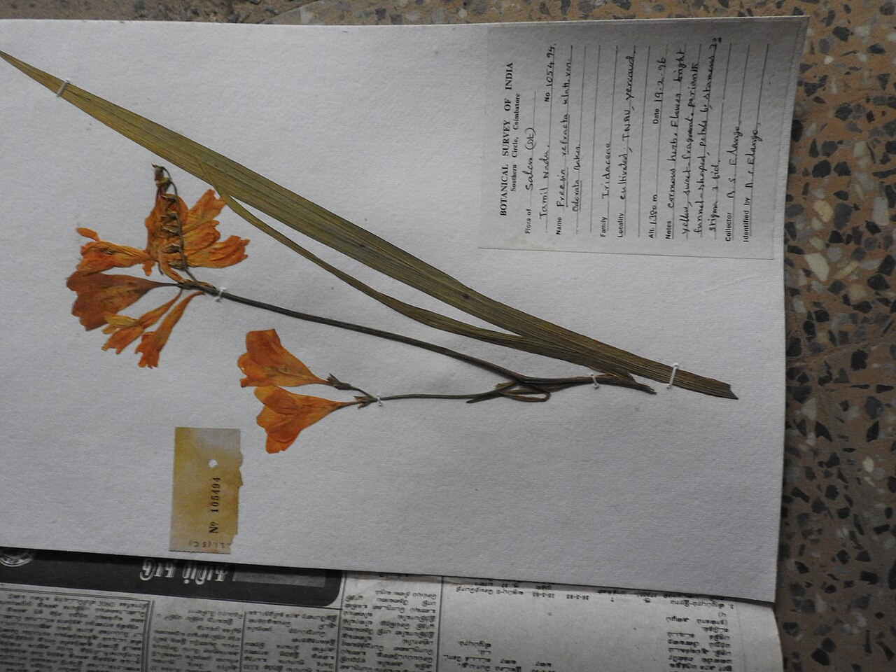
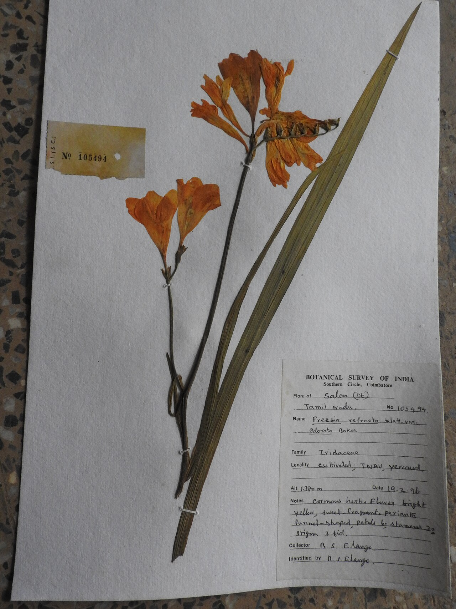
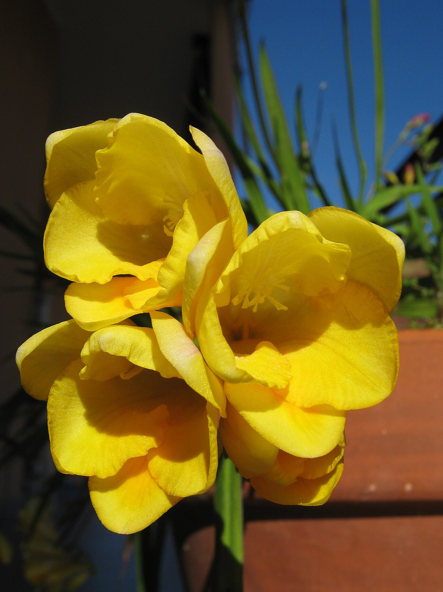

# Freesia

> Small, sweetly scented, and arranged in a one-sided arc — the florist's flower
> of trust and friendship, and one of the most fragrant blooms in the shop.

## Botanical identity
- **Common name(s):** Freesia
- **Scientific name:** *Freesia* spp. (hybrids from *F. refracta* and relatives)
- **Family:** Iridaceae
- **Type:** Spray flower

## Native region & origin
- **Native to:** **South Africa** (the Cape region), with most species in the
  eastern Cape.
- **Now cultivated in:** The Netherlands and worldwide as a fragrant cut flower.
- **Domestication / spread notes:** Named after the German physician/botanist
  **Friedrich Freese**. A prized ingredient in perfumery for its clean, sweet
  scent.

## Visual identification (for reading a photo)
- **Bloom form:** A slender stem that bends at a right angle, carrying a **one-
  sided arching spike** of funnel-shaped florets that open in succession.
- **Size:** Small florets along a wiry arching stem.
- **Petals:** Six tepals forming a small trumpet; singles and doubles.
- **Center:** Small; sometimes a contrasting throat.
- **Color range:** White, yellow, cream, pink, red, purple, orange — often
  vividly saturated.
- **Foliage/stem cues:** Narrow, sword-like leaves; the tell-tale **bent stem
  and one-sided flower arrangement**.
- **Look-alikes:** Small gladiolus and some alstroemeria; freesia is confirmed by
  its **strong sweet fragrance** and the right-angle bend of the flowering stem.

## History & cultural background
A modern florist favorite valued as much for its **perfume** as its looks. With
little ancient symbolism, its meanings grew in the Victorian and modern eras
around ideas of **trust, thoughtfulness, and friendship**.

## Symbolism & meaning
- **General meaning:** Innocence, trust, friendship, and thoughtfulness; the
  **7th wedding anniversary** flower.
- **By color:** Colors follow their general meanings (see color-symbolism.md) —
  white/yellow lean to innocence and friendship, red/pink to affection.

## Cultural meanings across the world
- **South Africa (origin):** The cultural anchor — a Cape native carried into
  global horticulture.
- **Western / Victorian:** Firmly a symbol of **trust and thoughtful friendship**;
  a common way to say "I trust you" or to honor a dependable friend.
- **Perfumery (global):** Its scent makes "freesia" a recognizable note in soaps,
  candles, and fragrances, reinforcing associations of freshness and calm.
- **Note:** As a modern ornamental, it carries essentially **no funerary or
  negative baggage** — a safe, gentle gift.

## Typical pairings
- **Arranged with:** Roses, tulips, ranunculus, and lisianthus; adds fragrance
  and delicate line to mixed bouquets.
- **Greenery/fillers:** Light greens; its own foliage.
- **Anchors:** Fragrant, softly colorful spring/summer arrangements.

## Occasions & events
- **Strongly associated with:** Friendship and thank-you gifts, weddings (7th
  anniversary), and fragrant everyday bouquets.
- **Avoid for:** Little to avoid; scent can be strong in very small spaces.

## Seasonality & availability
- **Natural season:** Spring.
- **Commercial availability:** Much of the year via greenhouse growing.
- **Vase life / care notes:** ~5–10 days; buds continue opening up the stem —
  buy with the lowest bud just showing color.

## Quick facts
- **Birth month:** — (not a traditional birth flower)
- **Wedding anniversary:** 7th
- **Notable toxicity/allergy:** Generally low toxicity; considered pet-safe by
  most sources.

## Reference images
<!-- IMAGES-START -->
Reference photos, all under reusable licenses (CC-BY / CC-BY-SA / CC0 / public domain) from Wikimedia Commons. Full attribution in [`image-manifest.json`](../images/image-manifest.json).

*Freesia refracta-1-yercaud-salem-India — Yercaud-elango · CC BY-SA 4.0*

*Freesia refracta-2-yercaud-salem-India — Yercaud-elango · CC BY-SA 4.0*

*Freesia refracta-3-yercaud-salem-India — Yercaud-elango · CC BY-SA 4.0*

*FreesiaRefracta1 — Senet · CC BY-SA 3.0*
<!-- IMAGES-END -->

---
*Confidence / to-verify:* High on South African origin, the Freese naming, the
one-sided arching habit, and the trust/friendship symbolism.
