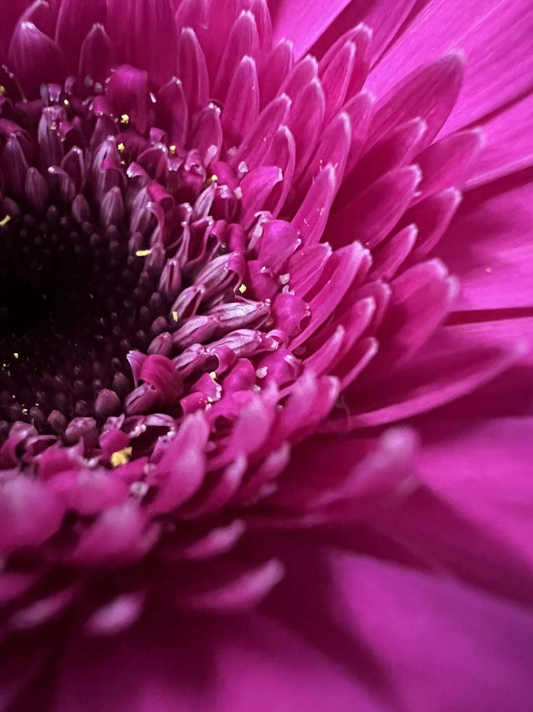
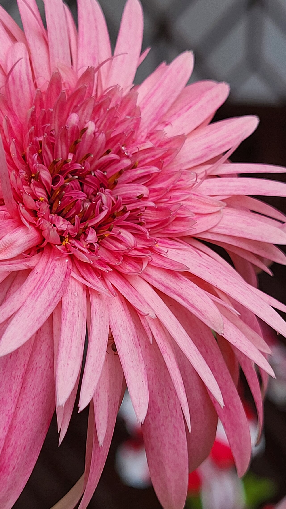
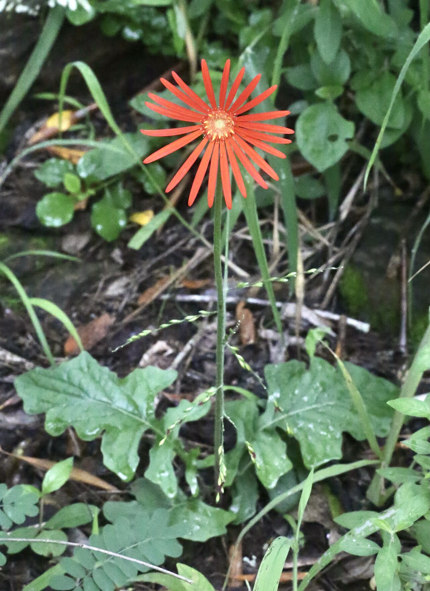
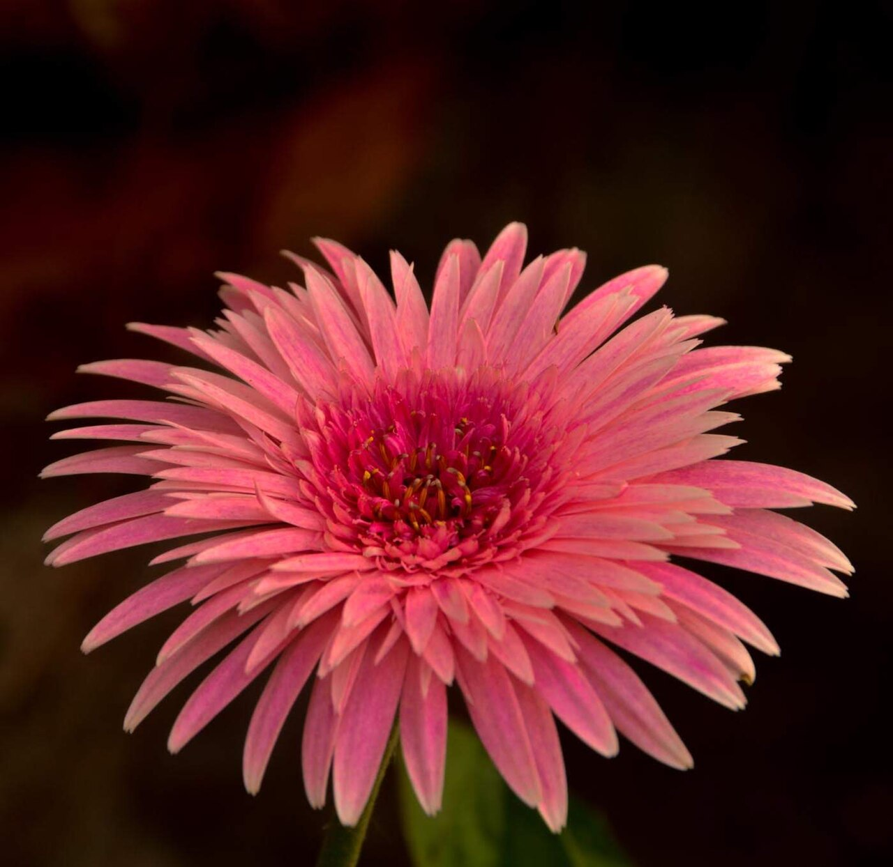

# Gerbera Daisy

> The big, bright, guileless smile of the flower world — pure cheer, with less
> cultural baggage than almost any other cut flower.

## Botanical identity
- **Common name(s):** Gerbera daisy, Barberton daisy, Transvaal daisy, African daisy
- **Scientific name:** *Gerbera jamesonii* (and hybrids)
- **Family:** Asteraceae
- **Type:** Daisy-form / focal flower

## Native region & origin
- **Native to:** **South Africa** (first described near Barberton, in the former
  Transvaal); the genus also reaches tropical Asia and South America.
- **Now cultivated in:** The Netherlands, Colombia, and worldwide as one of the
  top-five cut flowers globally.
- **Domestication / spread notes:** Named after the 18th-century German botanist
  **Traugott Gerber**. Modern florist gerberas are largely a 20th-century
  hybridization success, which is why they carry little ancient symbolism.

## Visual identification (for reading a photo)
- **Bloom form:** A large, flat, classic **daisy** — a single ring (or few rows)
  of long ray petals around a prominent central disc.
- **Size:** Large head (often 3–5 in / 8–12 cm) on a long, leafless, slightly
  fuzzy stem.
- **Petals:** Clean, evenly spaced rays; some doubles and "spider" types.
- **Center:** A big, distinct disc, sometimes a contrasting dark or green "eye."
- **Color range:** Vivid — red, orange, yellow, pink, coral, white, bicolor;
  notably **no true blue**.
- **Foliage/stem cues:** Basal leaves only; the tall bare stem is a giveaway.
- **Look-alikes:** Common daisy (much smaller), sunflower (bigger, coarse dark
  disc), some single dahlias. Gerbera's large clean head on a bare fuzzy stem
  is distinctive.

## History & cultural background
A relatively modern florist flower whose meaning grew out of the broader daisy
family's association with **innocence and purity**, amplified by its sheer size
and saturated color into an emblem of **cheerfulness and joy**.

## Symbolism & meaning
- **General meaning:** Cheerfulness, innocence, purity, beauty, and loyal love;
  a lighthearted "happiness" flower.
- **By color:**
  - **Red** — Love, romance.
  - **Yellow** — Happiness, sunshine, cheer.
  - **Pink** — Admiration, gratitude, gentleness.
  - **Orange** — Warmth, energy, "you are my sunshine."
  - **White** — Innocence, purity.

## Cultural meanings across the world
- **Daisy family (broad):** Innocence, purity, loyal love, and new beginnings —
  the meaning gerberas inherit across most Western cultures.
- **Greco-Roman / mythological:** The daisy is tied to **Belides**, a nymph who
  turned into a daisy to escape a pursuing god — hence innocence and modesty.
- **Egypt (ancient):** Daisy-form flowers were associated with the **sun** and
  used in temple decoration and healing.
- **General:** Because gerberas are a modern hybrid, they largely **escape the
  funerary or negative meanings** that burden older flowers — they read as
  positive nearly everywhere, which makes them safe cross-cultural gifts.
- **5th wedding anniversary:** Marked by the daisy, which gerberas represent.

## Typical pairings
- **Arranged with:** Roses, sunflowers, alstroemeria, carnations, solidago —
  anything bright and cheerful.
- **Greenery/fillers:** Baby's breath, leatherleaf fern, ruscus.
- **Anchors:** Playful, colorful, "happy" bouquets; often the pop of color in a
  mixed arrangement.

## Occasions & events
- **Strongly associated with:** Birthdays, get-well wishes, congratulations,
  graduations, thank-yous, and "cheer up" gifts.
- **Avoid for:** Little to avoid; too casual/cheerful for solemn formal sympathy.

## Seasonality & availability
- **Natural season:** Summer bloom outdoors.
- **Commercial availability:** Year-round.
- **Vase life / care notes:** ~5–8 days; heads are heavy and stems can bend or
  rot — use clean shallow water and support the necks.

## Quick facts
- **Birth month:** April (as the daisy)
- **Wedding anniversary:** 5th (as the daisy)
- **Notable toxicity/allergy:** Non-toxic and pet-safe — a rare "all clear."

## Reference images
<!-- IMAGES-START -->
Reference photos, all under reusable licenses (CC-BY / CC-BY-SA / CC0 / public domain) from Wikimedia Commons. Full attribution in [`image-manifest.json`](../images/image-manifest.json).

*Гербера Джемсона (Lat. Gerbera Jamesonii) — LadaPash · CC BY 4.0*

*Barberton daisy (Gerbera jamesonii) in Jorhat, Assam — Gitartha.bordoloi · CC BY-SA 4.0*

*Gerbera jamesonii (Asteraceae) — Alexey Yakovlev · CC BY-SA 4.0*

*Gerbera jamesonii in Kolkata — Sohom Datta · CC BY 4.0*
<!-- IMAGES-END -->

---
*Confidence / to-verify:* High on identity, native South African origin, and
Gerber naming. Symbolism is soft/positive and well-attested.
