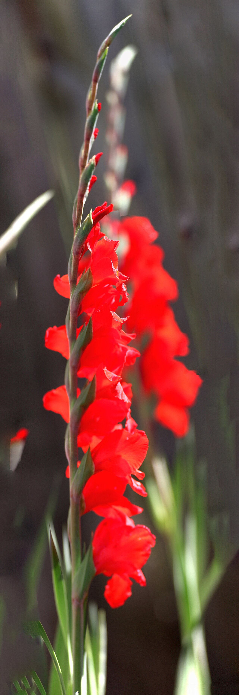
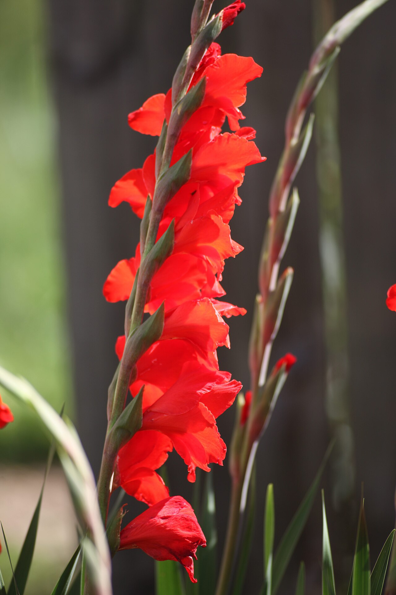
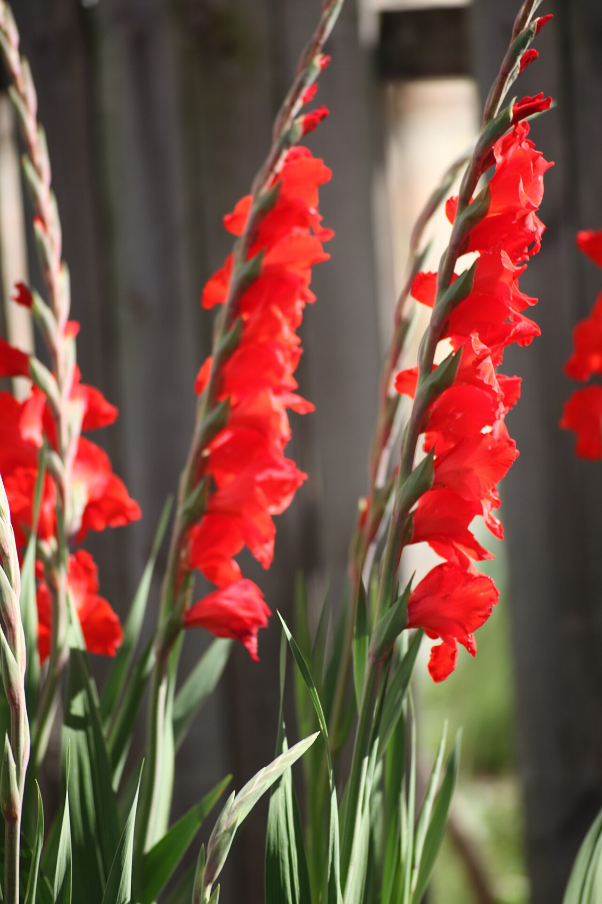
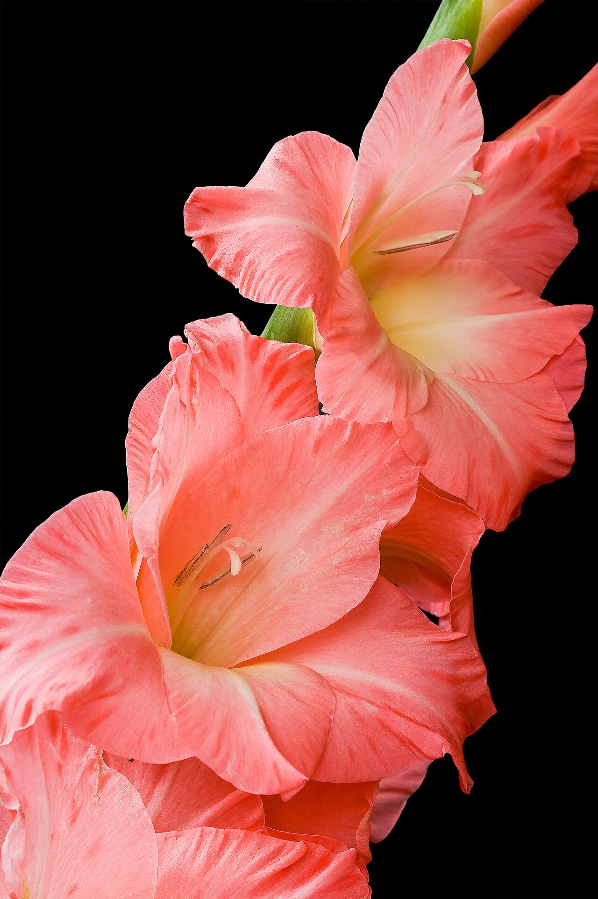

# Gladiolus

> The "sword lily." A tall, dramatic spike named for the Roman gladiator's blade
> — a flower of strength, honor, and moral integrity.

## Botanical identity
- **Common name(s):** Gladiolus; sword lily; "glads"
- **Scientific name:** *Gladiolus* spp.
- **Family:** Iridaceae
- **Type:** Line flower (a tall vertical spike)

## Native region & origin
- **Native to:** Mostly **South Africa** (the Cape holds the greatest diversity),
  with species in the **Mediterranean, Europe, Asia, and tropical Africa**.
- **Now cultivated in:** The Netherlands, the US, and worldwide.
- **Domestication / spread notes:** The name is Latin for **"little sword"**
  (*gladius*) — the source of "gladiator" — for its blade-like leaves. Modern
  large-flowered glads are hybrids of South African species.

## Visual identification (for reading a photo)
- **Bloom form:** A tall, one-sided **spike** of large **funnel-shaped florets**
  that open in sequence from the bottom up.
- **Size:** Long stems (up to ~1 m) with big, ruffled florets.
- **Petals:** Six tepals per floret, often ruffled, sometimes with a contrasting
  throat.
- **Center:** A throat marking within each funnel.
- **Color range:** Nearly every color — white, pink, red, orange, yellow, purple,
  green, and bicolors.
- **Foliage/stem cues:** Stiff, **sword-shaped** leaves; a strong upright stem.
- **Look-alikes:** Snapdragon and delphinium spikes; the gladiolus's florets are
  much larger and funnel-shaped, and its leaves are broad swords.

## History & cultural background
In ancient Rome the gladiolus was tied to **gladiators** — victors were said to
be showered with them, and the flower stood for the fighter's strength and
honor. That martial thread survives in its modern meanings of **integrity and
strength of character**.

## Symbolism & meaning
- **General meaning:** Strength of character, moral integrity, honor,
  faithfulness, remembrance, and **infatuation** ("you pierce my heart").
- **By color:**
  - **Red** — Love, passion.
  - **Pink** — Compassion, motherly love, femininity.
  - **White** — Purity, innocence.
  - **Purple** — Grace, charm, dignity.
  - **Yellow** — Cheer, generosity.

## Cultural meanings across the world
- **Greco-Roman / mythological:** The flower of **Roman gladiators** — victory,
  strength, and honor; women were said to wear glads to the arena for their
  favored fighters.
- **South Africa (origin):** The genus's homeland and center of diversity — a
  wild flower of the Cape long before its global cultivation.
- **Western / Victorian:** A message of **infatuation and admiration for strength
  of character** — "you pierce my heart" — and a token of remembrance.
- **Funerals & celebrations:** Its tall, stately spikes make it a fixture of both
  **standing funeral sprays** (honor, remembrance) and grand celebratory displays.

## Typical pairings
- **Arranged with:** Chrysanthemums, lilies, and roses (especially in sympathy
  and formal work); provides height and line.
- **Greenery/fillers:** Leatherleaf fern, its own sword foliage.
- **Anchors:** Tall, structural arrangements; standing sprays and statement vases.

## Occasions & events
- **Strongly associated with:** Honoring strength and integrity, remembrance and
  funerals, grand celebrations, August birthdays, and 40th anniversaries.
- **Avoid for:** Small hand-tied posies — it's a tall, architectural flower.

## Seasonality & availability
- **Natural season:** Summer.
- **Commercial availability:** Much of the year.
- **Vase life / care notes:** ~7–10 days; remove faded lower florets as upper
  buds open; pinch the growing tip to keep the spike straight.

## Quick facts
- **Birth month:** August
- **Wedding anniversary:** 40th
- **Notable toxicity/allergy:** **Toxic if ingested** (especially the corms);
  sap can irritate skin.

## Reference images
<!-- IMAGES-START -->
Reference photos, all under reusable licenses (CC-BY / CC-BY-SA / CC0 / public domain) from Wikimedia Commons. Full attribution in [`image-manifest.json`](../images/image-manifest.json).

*Косарики у Немішаєві 01 — Сарапулов · CC BY 4.0*

*Косарики у Немішаєві 02 — Сарапулов · CC BY 4.0*

*Косарики у Немішаєві 04 — Сарапулов · CC BY 4.0*

*Pink Gladiolus — Twdragon · CC BY 3.0*
<!-- IMAGES-END -->

---
*Confidence / to-verify:* High on the gladius/gladiator etymology, South African
origin, and the strength/integrity + remembrance symbolism.
