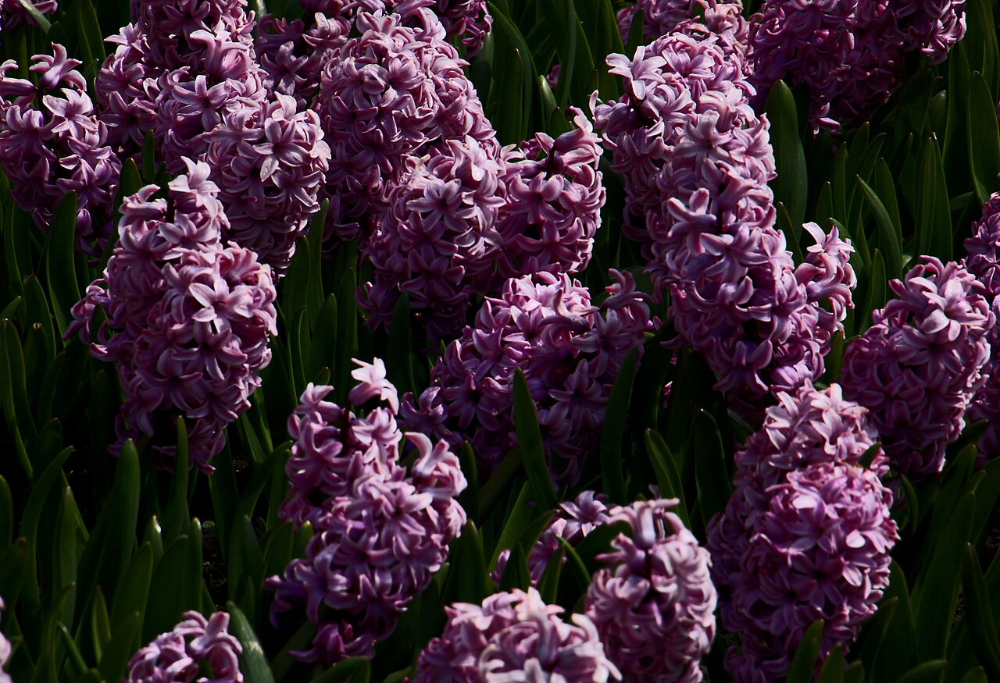
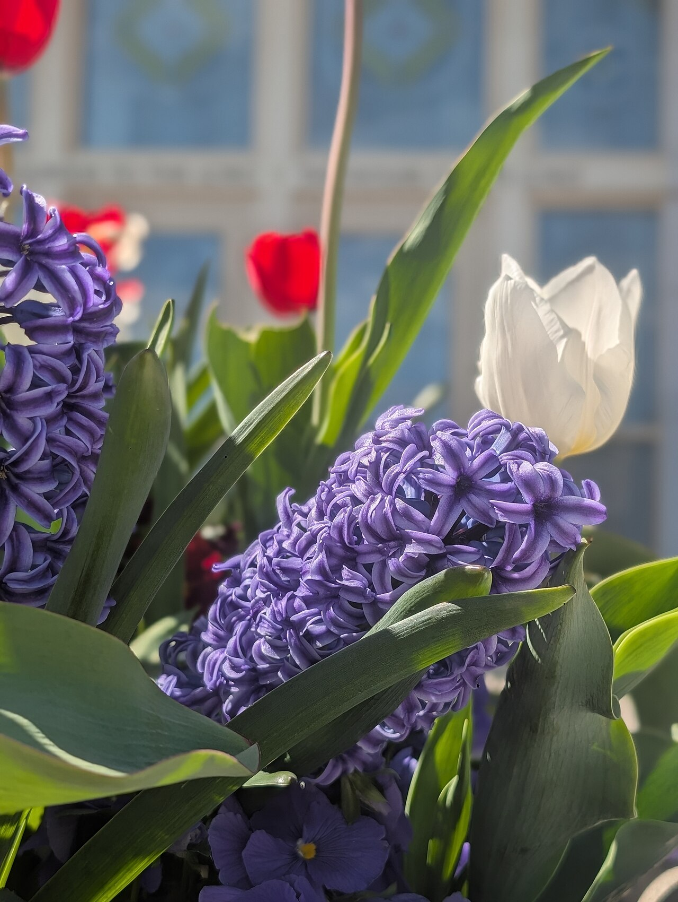
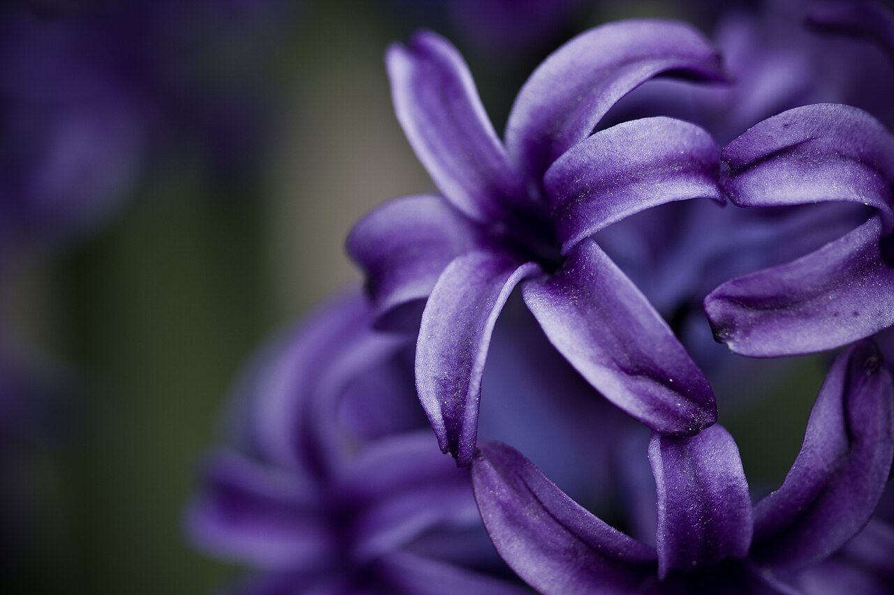
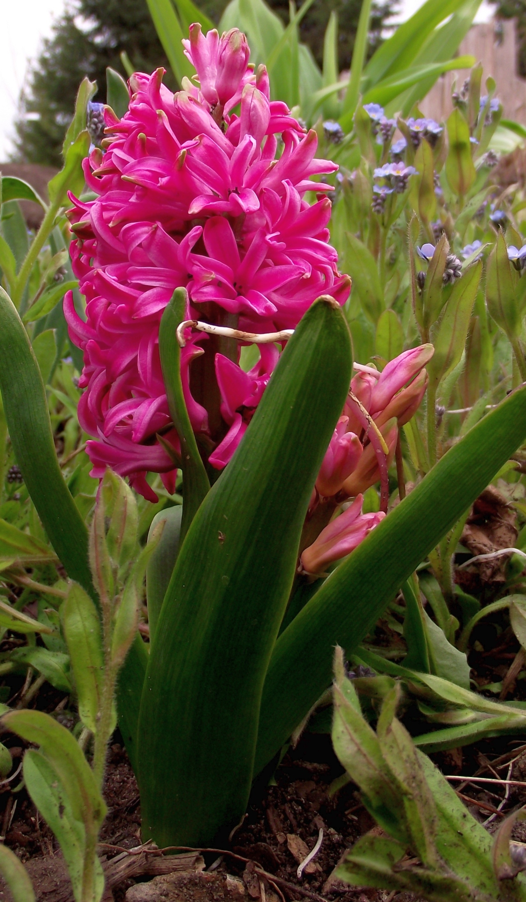

# Hyacinth

> A powerfully fragrant spring spike born, in Greek myth, from a grieving god's
> tears — and a centerpiece of the Persian New Year table.

## Botanical identity
- **Common name(s):** Hyacinth; *sonbol* (Persian)
- **Scientific name:** *Hyacinthus orientalis*
- **Family:** Asparagaceae (subfamily Scilloideae)
- **Type:** Line / spray flower (a dense upright column)
- **Not to be confused with:** **grape hyacinth** (*Muscari*) or **water
  hyacinth** (*Eichhornia*) — different plants.

## Native region & origin
- **Native to:** The **eastern Mediterranean** — Turkey, Syria, Lebanon — and
  **Iran**.
- **Now cultivated in:** The **Netherlands** above all; worldwide as a spring bulb.
- **Domestication / spread notes:** Beloved by the **Ottomans** and then the
  Dutch, who bred the dense, fat modern spikes. Famous for an intense, sweet
  fragrance.

## Visual identification (for reading a photo)
- **Bloom form:** A single **dense column** packed with **waxy, reflexed star-
  shaped florets** all around the stem.
- **Size:** Compact, chunky spike on a short thick stem.
- **Petals:** Six recurved tepals per starry floret; singles and doubles.
- **Center:** Small; hidden within each star.
- **Color range:** Blue, purple, pink, white, cream, yellow, apricot, and red.
- **Foliage/stem cues:** Strappy, glossy basal leaves; a thick fleshy stem.
- **Look-alikes:** Grape hyacinth (*Muscari*) is far smaller with tight urn-
  shaped bells; true hyacinth's fat, fragrant, star-floret column is distinctive.

## History & cultural background
Named for the Greek youth **Hyacinthus** and later a Dutch horticultural obsession
(alongside tulips), the hyacinth is prized as much for scent as for looks — and
carries meanings of both **sport and sorrow**.

## Symbolism & meaning
- **General meaning:** Playfulness and sport, sincerity, constancy — and, from
  the myth, **sorrow and "please forgive me."**
- **By color:**
  - **Purple** — Sorrow, apology, "I'm sorry / please forgive me."
  - **Blue** — Constancy, sincerity.
  - **White** — Loveliness, prayers, purity.
  - **Pink/Red** — Play, playfulness.
  - **Yellow** — Jealousy.

## Cultural meanings across the world
- **Greco-Roman / mythological:** **Hyacinthus**, a youth loved by **Apollo**, was
  killed when the jealous west wind **Zephyrus** blew a discus off course; from
  his blood Apollo raised the hyacinth, its markings reading as a cry of grief —
  the source of its **sorrow and regret** symbolism.
- **Persia / Iran:** The **sonbol** is one of the seven **haft-sin** items on the
  **Nowruz (Persian New Year)** table, symbolizing **spring's arrival and
  rebirth**; hyacinth curls are a favorite image of the beloved in Persian poetry.
- **Netherlands:** A signature Dutch spring bulb and export, second only to the
  tulip in the Golden-Age bulb craze.
- **Western / Victorian:** Chiefly **sincerity and playful sport**, with purple
  carrying the strong "please forgive me" apology meaning.

## Typical pairings
- **Arranged with:** Tulips, daffodils, muscari, and ranunculus in fragrant
  spring bouquets.
- **Greenery/fillers:** Its own foliage; light spring greens.
- **Anchors:** Scented spring arrangements and forced-bulb displays.

## Occasions & events
- **Strongly associated with:** Spring, Easter, Nowruz (Persian New Year),
  apology bouquets (purple), and fragrant gifts.
- **Avoid for:** Yellow where it might read as jealousy; strong scent in tiny
  rooms.

## Seasonality & availability
- **Natural season:** **Spring** (forced bulbs from late winter).
- **Commercial availability:** Winter–spring.
- **Vase life / care notes:** ~5–7 days; heavy heads can flop — support them;
  the sap can irritate skin.

## Quick facts
- **Birth month:** — (a spring flower)
- **Wedding anniversary:** — (no standard year)
- **Notable toxicity/allergy:** **Toxic if ingested** (oxalic acid); bulbs cause
  "hyacinth itch" — wear gloves when handling.

## Reference images
<!-- IMAGES-START -->
Reference photos, all under reusable licenses (CC-BY / CC-BY-SA / CC0 / public domain) from Wikimedia Commons. Full attribution in [`image-manifest.json`](../images/image-manifest.json).

*Zealand 2016-05-01 — Guillaume Baviere from Copenhagen, Denmark · CC BY-SA 2.0*

*Columbia River Washington Temple spring flowers — Bobjgalindo · CC BY-SA 4.0*

*Purple Star — Benson Kua from Toronto, Canada · CC BY-SA 2.0*

*Hyacinthus orientalis — Rillke · CC BY-SA 3.0*
<!-- IMAGES-END -->

---
*Confidence / to-verify:* High on eastern-Mediterranean origin, the Hyacinthus/
Apollo myth, the Nowruz haft-sin role, and the purple-apology meaning.
