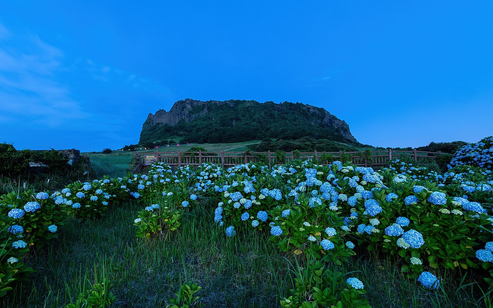
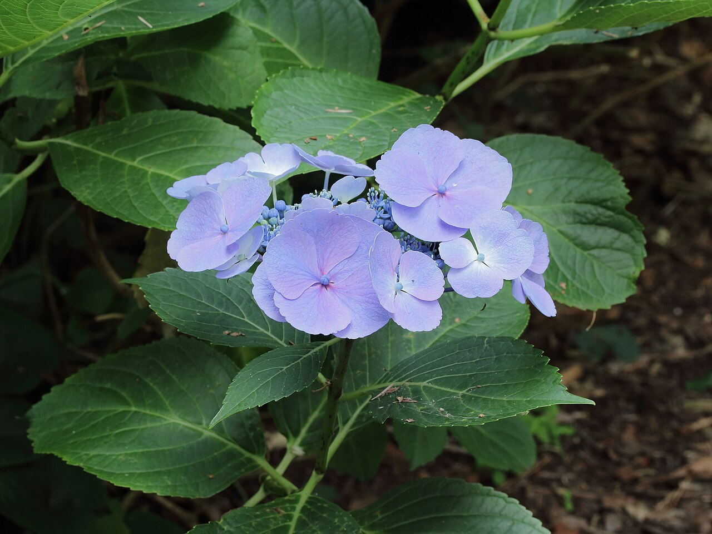
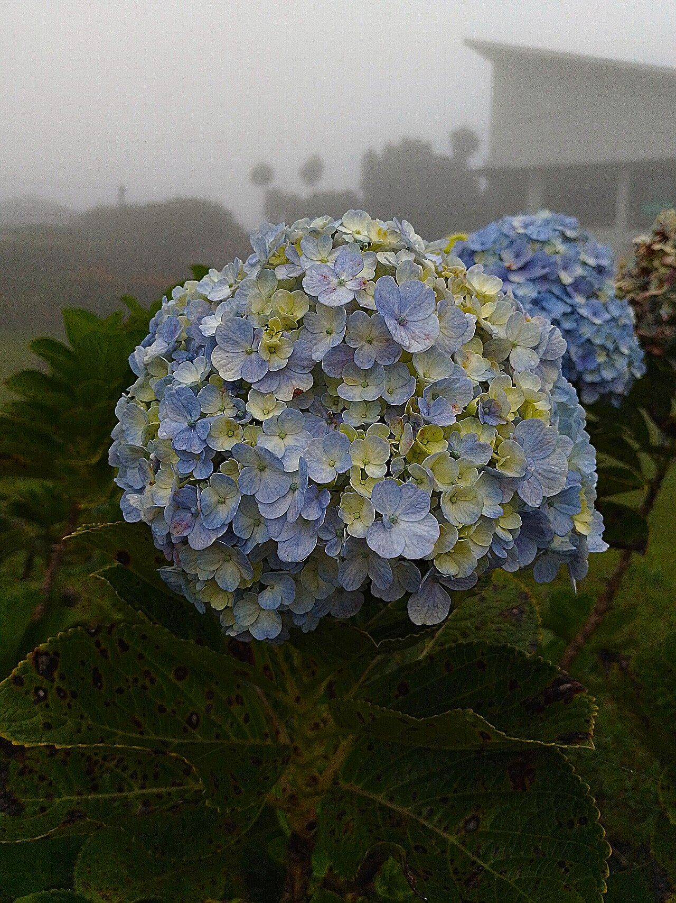
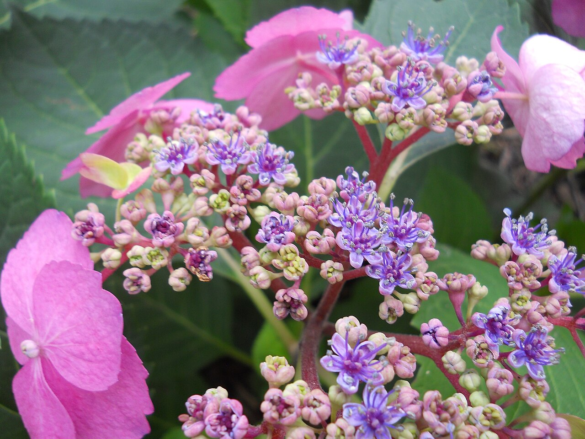

# Hydrangea

> Big, cloud-like blooms that literally change color with the soil — and carry a
> famously split personality: heartfelt gratitude in one tradition, cold-hearted
> boastfulness in another.

## Botanical identity
- **Common name(s):** Hydrangea; "hortensia"; *ajisai* (Japan)
- **Scientific name:** *Hydrangea macrophylla* (mophead/lacecap; the common
  florist type) and relatives
- **Family:** Hydrangeaceae
- **Type:** Mass flower (a single stem reads as one large dome)

## Native region & origin
- **Native to:** **East Asia** (Japan, China, Korea) and the **Americas**.
  *H. macrophylla* is native to Japan.
- **Now cultivated in:** Worldwide as a garden and cut flower; the Netherlands,
  Colombia, and Japan are notable in the trade.
- **Domestication / spread notes:** The name is Greek — *hydor* (water) + *angos*
  (vessel) — for its thirst and seed-capsule shape. Introduced to Europe from
  Asia in the 18th–19th centuries.

## Visual identification (for reading a photo)
- **Bloom form:** A large, rounded **cluster (corymb) of many small 4-petaled
  florets** — a "mophead" pom, or a flat "lacecap" ring.
- **Size:** Large — a single head can be the size of a fist or bigger.
- **Petals:** Each floret has four (sometimes five) petal-like sepals; hundreds
  per head.
- **Center:** Tiny true flowers clustered among the showy sepals.
- **Color range:** Blue, pink, purple, white, green, and shifting bicolors.
- **Foliage/stem cues:** Large, toothed, deeply veined leaves; thick stems.
- **Look-alikes:** Viburnum and some sedum clusters; hydrangea's big 4-sepal
  florets and broad leaves are distinctive. Its color often **shifts with soil
  pH** — acidic = blue, alkaline = pink (aluminum availability).

## History & cultural background
Prized in Japanese gardens (temple "hydrangea trails" bloom in the rainy season)
and adopted into European horticulture as "hortensia." Its color chemistry made
it a Victorian curiosity — and its showiness earned it a scolding reputation.

## Symbolism & meaning
- **General meaning:** Gratitude, grace, and heartfelt/genuine emotion — but with
  a strong negative Victorian double meaning of **frigidity, heartlessness,
  boastfulness, and vanity** (showy blooms, historically thought to set little
  seed).
- **By color:**
  - **Blue** — Apology, gratitude, understanding; (Victorian) frigidity, "you are cold."
  - **Pink** — Heartfelt/true emotion, romance; "you are the beat of my heart."
  - **White** — Purity, grace; (Victorian) boastfulness, vanity.
  - **Purple** — A desire to understand someone; abundance and wealth.

## Cultural meanings across the world
- **Japan (hanakotoba):** *Ajisai* is the flower of the **rainy season (tsuyu)**.
  Meanings include **heartfelt emotion, gratitude, and a sincere apology** — one
  legend says a Meiji-era emperor sent hydrangeas as an apology to the family of
  a woman he had neglected. Because the color changes, it also read as
  **fickleness/pride**; the clustered florets separately suggest **family unity**.
- **China / Korea:** Similar East Asian readings of heartfelt emotion,
  understanding, and (via abundance of florets) prosperity and togetherness.
- **Europe (Victorian West):** The **negative** meanings dominate the old code —
  sending hydrangeas could accuse the recipient of being cold-hearted or a
  braggart. Modern floristry has largely reclaimed it as gratitude and grace.

## Typical pairings
- **Arranged with:** Roses, peonies, ranunculus, lisianthus (a wedding staple
  quartet); provides lush volume behind focal blooms.
- **Greenery/fillers:** Eucalyptus, its own foliage; often needs little filler
  (it *is* the volume).
- **Anchors:** Romantic, full "garden" arrangements; wedding and sympathy work.

## Occasions & events
- **Strongly associated with:** Weddings (voluminous, soft), 4th anniversary,
  Mother's Day, apology bouquets, and sympathy.
- **Avoid for:** Sending as a pointed message to anyone versed in the old
  "heartless/boastful" meaning; otherwise broadly welcome.

## Seasonality & availability
- **Natural season:** Summer (into early autumn).
- **Commercial availability:** Best late spring–autumn; imported year-round at
  higher cost.
- **Vase life / care notes:** Thirsty and prone to wilting — cut stems on an
  angle, hydrate deeply, and mist; reviving wilted heads by submerging them in
  water often works.

## Quick facts
- **Birth month:** — (sometimes cited for late summer)
- **Wedding anniversary:** 4th
- **Notable toxicity/allergy:** **Toxic if ingested** (cyanogenic glycosides) —
  keep from pets and children.

## Reference images
<!-- IMAGES-START -->
Reference photos, all under reusable licenses (CC-BY / CC-BY-SA / CC0 / public domain) from Wikimedia Commons. Full attribution in [`image-manifest.json`](../images/image-manifest.json).

*Hydrangea macrophylla in front of Seongsan Ilchulbong volcano at blue hour in Je — Basile Morin · CC BY-SA 4.0*

*Hydrangea macrophylla 03 — Dominicus Johannes Bergsma · CC BY-SA 3.0*

*Blue and yellow Hydrangea macrophylla flower in fog 2026-03-26 — MaheSwara · CC BY-SA 4.0*

*Hydrangea macrophylla (flowers) — Ірина Бучнєва · CC0*
<!-- IMAGES-END -->

---
*Confidence / to-verify:* High on identity, pH color chemistry, and the Japanese
apology association. The emperor legend is traditional (widely retold).
