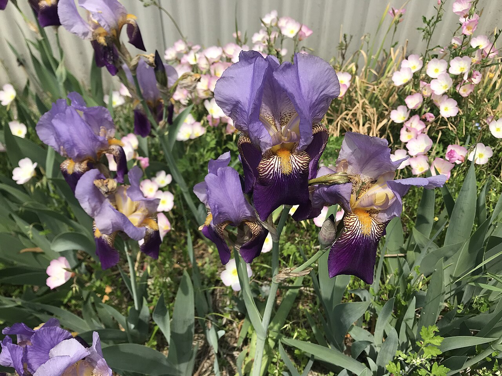
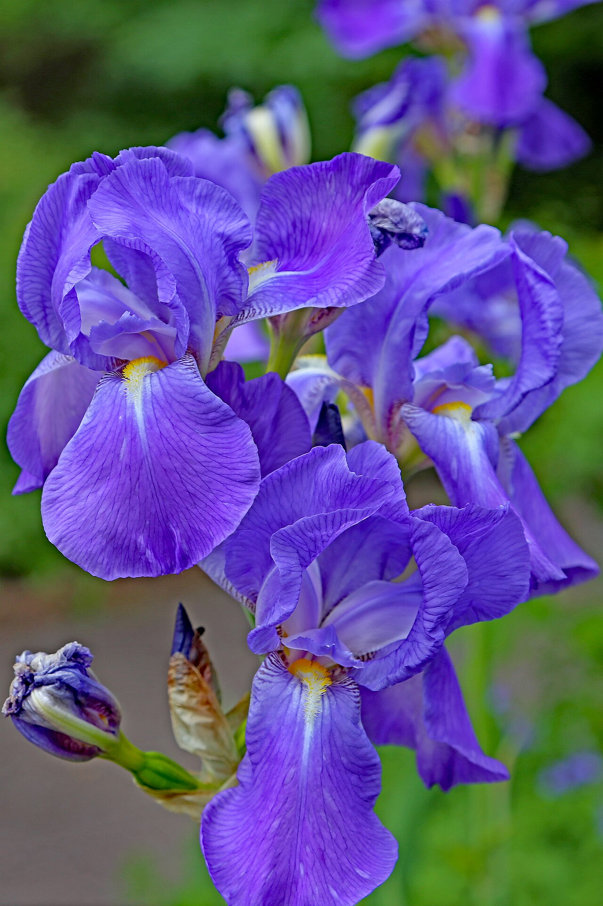
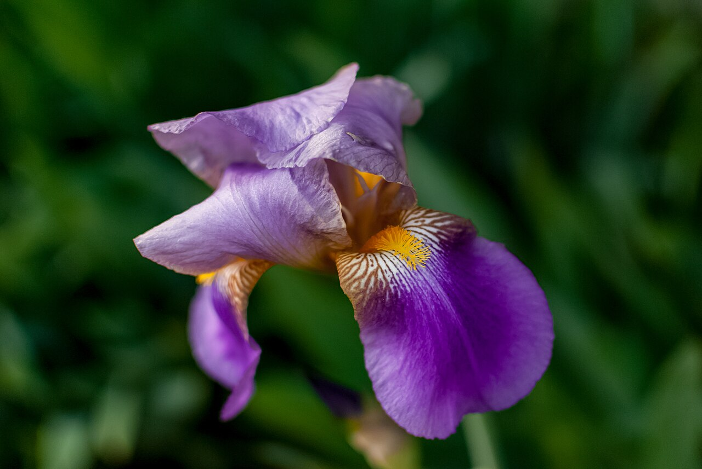
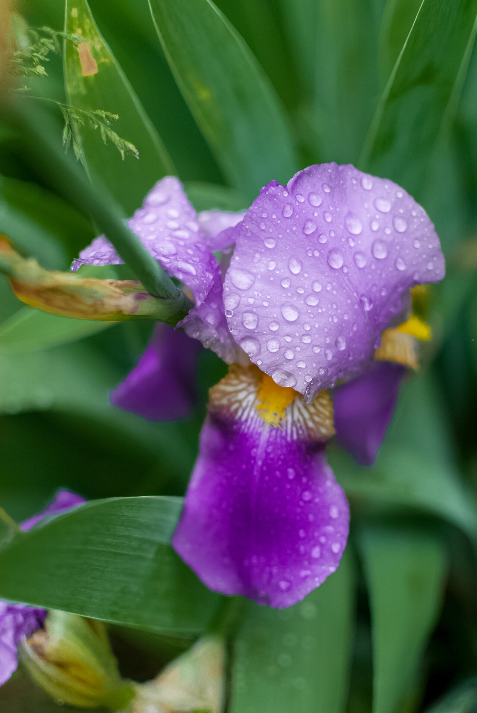

# Iris

> Named for the Greek goddess of the rainbow, and stylized into the French
> fleur-de-lis. A flower of faith, wisdom, and royal messages.

## Botanical identity
- **Common name(s):** Iris; flag; the cut-flower trade favors the **Dutch iris**
- **Scientific name:** *Iris* spp. (bearded/German *I. germanica*; Dutch, Siberian,
  Japanese types)
- **Family:** Iridaceae
- **Type:** Form flower

## Native region & origin
- **Native to:** The **north temperate zone** — Europe, Asia, and North America.
- **Now cultivated in:** The Netherlands (Dutch iris) and worldwide.
- **Domestication / spread notes:** Grown since antiquity; **orris root** (dried
  iris rhizome) has flavored perfume and gin for centuries. Egyptian pharaohs
  prized irises as symbols of majesty.

## Visual identification (for reading a photo)
- **Bloom form:** A distinctive **three-up, three-down** structure — three
  upright petals (**standards**) and three drooping ones (**falls**).
- **Size:** Medium to large.
- **Petals:** Six segments; **bearded** irises have a fuzzy strip on the falls,
  **beardless** (Dutch/Siberian/Japanese) are smooth.
- **Center:** The falls often carry a contrasting **signal** patch or crest.
- **Color range:** Purple, blue, white, yellow, bronze, and bicolors — the
  "rainbow" the name promises.
- **Foliage/stem cues:** Flat, **sword-shaped** leaves in a fan.
- **Look-alikes:** Orchids are the nearest form flower, but the iris's rigid
  three-fold plan of standards and falls is unique.

## History & cultural background
The Greek goddess **Iris** traveled the rainbow as messenger between gods and
mortals, so the flower came to mean **communication, hope, and a bridge between
worlds**. Stylized, it became the **fleur-de-lis**, one of the most enduring
emblems of European royalty.

## Symbolism & meaning
- **General meaning:** Faith, hope, wisdom, courage/valor, and cherished
  friendship; eloquence and messages.
- **By color:**
  - **Purple** — Royalty, wisdom, admiration, compliments.
  - **Blue** — Faith and hope.
  - **Yellow** — Passion.
  - **White** — Purity.

## Cultural meanings across the world
- **France:** The stylized iris is the **fleur-de-lis** — emblem of the French
  monarchy and purity, carried onward by **Québec** and **New Orleans**.
- **Japan:** Irises (*hanashōbu* / *ayame*) are the flower of **Boys' Day /
  Children's Day (Tango no Sekku, May 5)**; their **sword-shaped leaves** signal
  martial valor, and iris baths are taken to **ward off evil and purify**.
- **Egypt (ancient):** A symbol of **majesty and power**, planted in royal gardens
  and depicted on temple walls.
- **Greco-Roman / mythological:** The rainbow goddess **Iris** guided souls; the
  flower was planted on **women's graves** to summon her as a guide to the
  afterlife.

## Typical pairings
- **Arranged with:** Tulips and daffodils in spring; roses and lilies in formal
  designs.
- **Greenery/fillers:** Its own sword foliage, bear grass.
- **Anchors:** Elegant spring and formal arrangements; a strong vertical accent.

## Occasions & events
- **Strongly associated with:** Spring, congratulations, expressions of faith and
  wisdom, February birthdays, and (in Japan) Children's Day.
- **Avoid for:** Few taboos; the grave association is historical, not a modern
  gifting concern.

## Seasonality & availability
- **Natural season:** Late spring to early summer.
- **Commercial availability:** Dutch iris available much of the year.
- **Vase life / care notes:** ~4–7 days; buy in bud (they open fast), keep water
  fresh.

## Quick facts
- **Birth month:** February
- **Wedding anniversary:** 25th
- **Notable toxicity/allergy:** **Rhizomes/roots toxic if ingested**; sap can
  irritate skin.

## Reference images
<!-- IMAGES-START -->
Reference photos, all under reusable licenses (CC-BY / CC-BY-SA / CC0 / public domain) from Wikimedia Commons. Full attribution in [`image-manifest.json`](../images/image-manifest.json).

*Flowers of Iris germanica 20180430 — そらみみ · CC BY-SA 4.0*

*00 1238 Deutsche Schwertlilie (Iris × germanica) — W. Bulach · CC BY-SA 4.0*

*Purple Iris Droop PLT-FL-IR-1 — Shadowmeld Photography · CC BY-SA 4.0*

*Purple Iris Droplets PLT-FL-IR-3 — Shadowmeld Photography · CC BY-SA 4.0*
<!-- IMAGES-END -->

---
*Confidence / to-verify:* High on the goddess/rainbow etymology, fleur-de-lis,
Japanese Children's Day, and the standards/falls structure.
