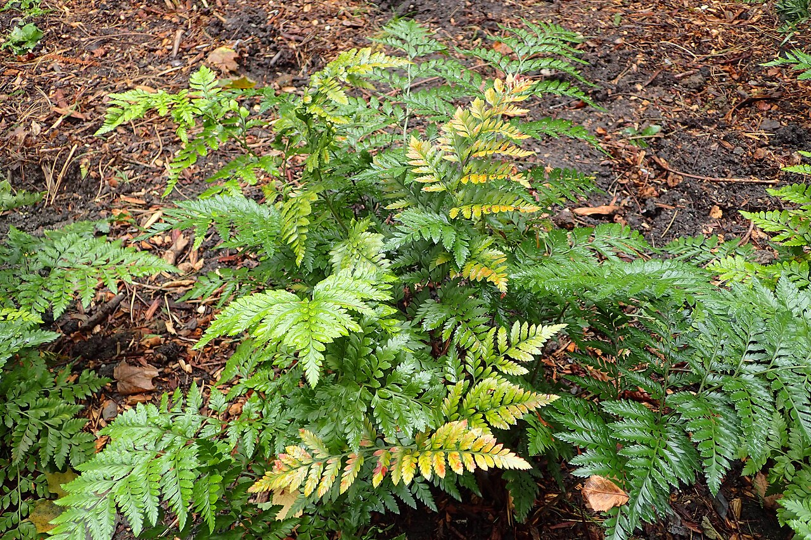
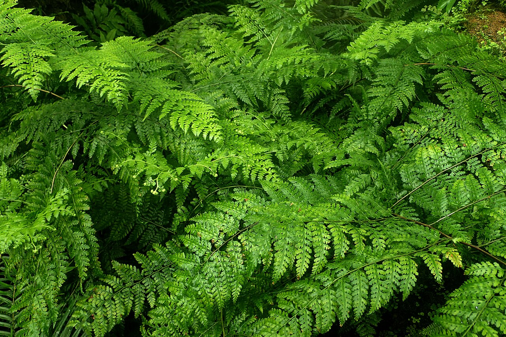
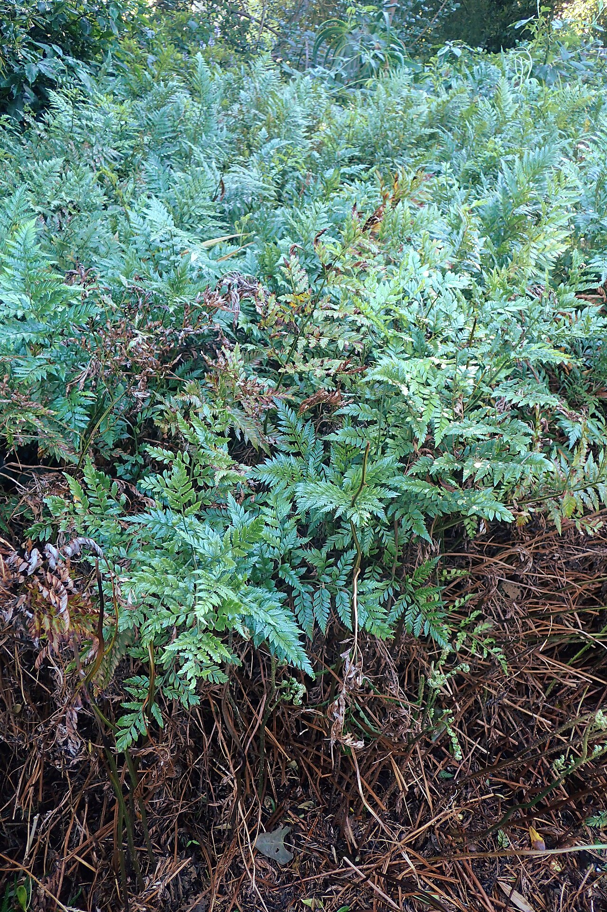
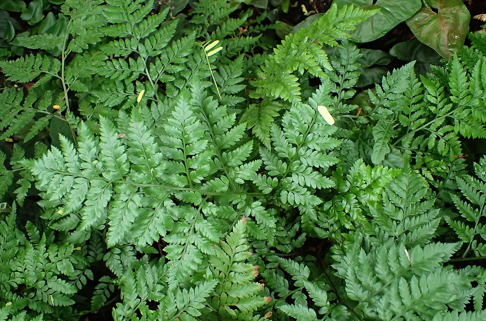

# Leatherleaf Fern (Foliage)

> The classic dark-green backing frond behind traditional bouquets — tough,
> glossy, and, like all ferns, quietly symbolic of sincerity and secret bonds.

## Botanical identity
- **Common name(s):** Leatherleaf fern; leather fern
- **Scientific name:** *Rumohra adiantiformis*
- **Family:** Dryopteridaceae
- **Type:** Foliage / greenery
- **Related florist ferns:** plumosa/asparagus fern (*Asparagus setaceus*),
  maidenhair (*Adiantum*), sword fern (*Nephrolepis*).

## Native region & origin
- **Native to:** The **Southern Hemisphere** — South Africa, South America,
  Australasia.
- **Now cultivated in:** Florida and worldwide for the florist-green trade.
- **Domestication / spread notes:** The **default backing green** of traditional
  floristry for a century, prized for durability and a neat triangular frond.

## Visual identification (for reading a photo)
- **Bloom form:** Not a flower — a **fern frond**.
- **Size:** Triangular fronds on wiry stems; used flat behind blooms.
- **Petals:** N/A. **Leathery, glossy, finely divided** dark-green fronds.
- **Center:** N/A.
- **Color range:** Deep, glossy green.
- **Foliage/stem cues:** **Stiff, leathery, triangular** fronds that resist
  wilting; spore dots (sori) on the undersides.
- **Look-alikes:** Other florist ferns — plumosa (feathery, soft), maidenhair
  (delicate fan leaflets); leatherleaf is the **stiff, glossy, durable** one.

## History & cultural background
The unglamorous but indispensable green behind generations of bouquets. Ferns as a
group carry a rich symbolic and folkloric history — from Victorian "pteridomania"
to Japanese New Year decorations.

## Symbolism & meaning
- **General meaning (ferns broadly):** **Sincerity, humility, new life, eternal
  youth, and shelter**; also **fascination and magic**, and secret/eternal bonds
  of love.
- **As foliage:** Leatherleaf itself plays a **framing, structural** role rather
  than sending a coded message.

## Cultural meanings across the world
- **Victorian Britain:** **"Pteridomania"** — a 19th-century fern craze — made
  ferns emblems of **humility, sincerity, and fascination**; fern motifs covered
  everything from pottery to gravestones.
- **Japan:** Ferns feature in **New Year decorations** as wishes for **prosperity
  and the continuation of the family line** (fronds unfurling = new generations).
- **Celtic / European folklore:** Ferns were linked to **magic, invisibility, and
  protection** (the mythical "fern seed" said to make one unseen).
- **Note:** Leatherleaf is chiefly the **workhorse florist green**; its meaning is
  the ferns' general symbolism plus a structural role.

## Typical pairings
- **Arranged with:** Roses, carnations, and mums (the classic traditional
  bouquet); a near-universal backing green.
- **Greenery/fillers:** Combines with ruscus, salal, and baby's breath.
- **Anchors:** The frame behind focal blooms in traditional bouquets and
  corsages.

## Occasions & events
- **Strongly associated with:** Traditional bouquets, corsages, funeral and
  everyday arrangements — wherever a durable green frame is needed.
- **Avoid for:** Little to avoid; a supporting element, not a focal.

## Seasonality & availability
- **Natural season:** Evergreen — harvested year-round.
- **Commercial availability:** **Year-round.**
- **Vase life / care notes:** Exceptional — often **2–3+ weeks**; very durable and
  cheap.

## Quick facts
- **Birth month:** — (foliage)
- **Wedding anniversary:** — (foliage)
- **Notable toxicity/allergy:** Leatherleaf fern is generally considered
  **non-toxic** (unlike some ferns — check the specific fern for pet homes).

## Reference images
<!-- IMAGES-START -->
Reference photos, all under reusable licenses (CC-BY / CC-BY-SA / CC0 / public domain) from Wikimedia Commons. Full attribution in [`image-manifest.json`](../images/image-manifest.json).

*Rumohra adiantiformis kz02 — Krzysztof Ziarnek, Kenraiz · CC BY-SA 4.0*

*Rumohra adiantiformis kz3 — Krzysztof Ziarnek, Kenraiz · CC BY-SA 4.0*

*Rumohra adiantiformis kz6 — Krzysztof Ziarnek, Kenraiz · CC BY-SA 4.0*

*Rumohra adiantiformis kz10 — Krzysztof Ziarnek, Kenraiz · CC BY-SA 4.0*
<!-- IMAGES-END -->

---
*Confidence / to-verify:* High on Southern-Hemisphere origin, its role as the
classic florist green, and the fern-family symbolism (pteridomania, Japanese New
Year).
