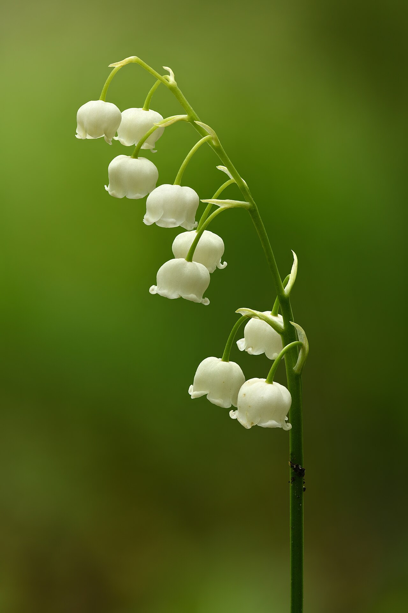
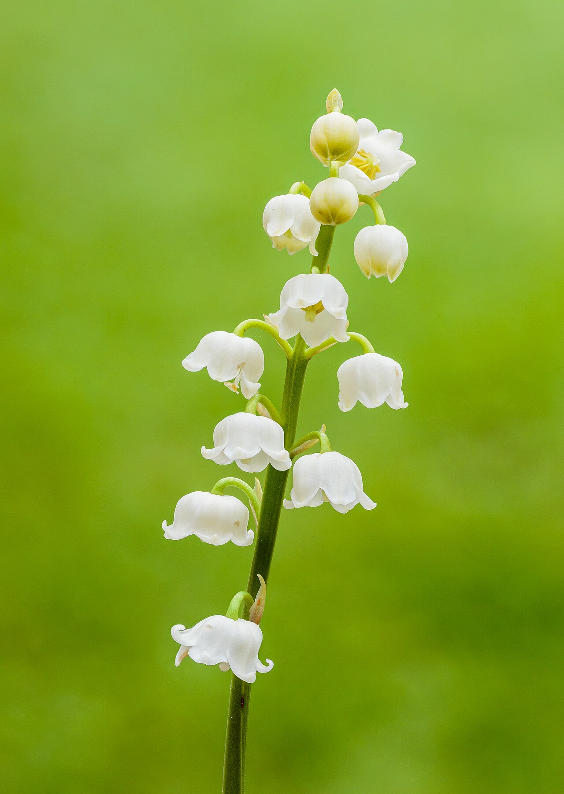
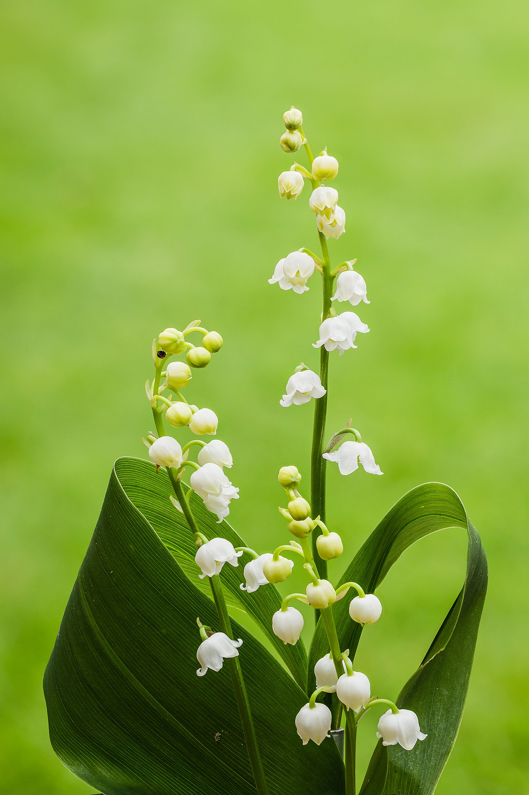
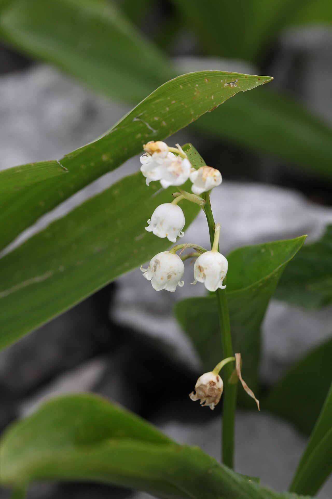

# Lily of the Valley

> Tiny, intensely fragrant white bells that mean the return of happiness — given
> across France every May Day for luck, and carried by brides and queens. Also
> deadly poisonous.

## Botanical identity
- **Common name(s):** Lily of the valley; *muguet* (French); "Our Lady's tears"
- **Scientific name:** *Convallaria majalis*
- **Family:** Asparagaceae
- **Type:** Spray flower
- **Not a true lily** (despite the name).

## Native region & origin
- **Native to:** Cool **temperate Northern Hemisphere** — Europe and Asia, with a
  small native population in the eastern US.
- **Now cultivated in:** The Netherlands and worldwide (forced for spring).
- **Domestication / spread notes:** A woodland groundcover prized for an
  extraordinarily sweet perfume; short-seasoned and therefore expensive as a cut
  flower.

## Visual identification (for reading a photo)
- **Bloom form:** A slender, **one-sided arching stem** hung with tiny **white
  nodding bells**.
- **Size:** Small and delicate; short stems.
- **Petals:** Each bell is a fused, scalloped-edged white cup (rarely pink).
- **Center:** Hidden within the downturned bell.
- **Color range:** White (occasionally pink).
- **Foliage/stem cues:** Two broad, upright, lance-shaped basal leaves cradle the
  flowering stem.
- **Look-alikes:** Solomon's seal and some *Muscari*; the paired broad leaves and
  arching row of sweet white bells are distinctive.

## History & cultural background
A flower of purity and returning joy, threaded through Christian legend, French
national custom, and royal weddings — and, for all its innocence, one of the most
poisonous plants in the florist trade.

## Symbolism & meaning
- **General meaning:** **The return of happiness**, purity, humility, sweetness,
  and motherhood; "you've made my life complete."
- **By color:** Essentially always white — purity and renewed joy.

## Cultural meanings across the world
- **France:** ***La Fête du Muguet*** — on **May 1 (May Day)**, sprigs of *muguet*
  are given to wish **luck and happiness**, a tradition dating to the Renaissance
  court of Charles IX and now entwined with Labor Day.
- **Christian (Europe):** Called **"Our Lady's tears"** — said to have sprung
  from the Virgin Mary's (or Eve's) tears; a symbol of **humility and purity**,
  and "the ladder to heaven."
- **Royal / bridal:** Chosen by brides for purity and humility — carried by
  **Grace Kelly** and **Catherine, Princess of Wales**, among others.
- **Western / Victorian:** The **return of happiness** — a hopeful, tender gift.

## Typical pairings
- **Arranged with:** Roses, peonies, and ranunculus in delicate, fragrant bridal
  work; often a precious accent.
- **Greenery/fillers:** Its own broad leaves; soft greens.
- **Anchors:** Intimate, fragrant spring and wedding arrangements.

## Occasions & events
- **Strongly associated with:** May Day (France), weddings, May birthdays, 2nd
  anniversaries, and "new happiness" gifts.
- **Avoid for:** Homes with children or pets — see toxicity.

## Seasonality & availability
- **Natural season:** **Spring** (April–May).
- **Commercial availability:** Brief and pricey; peaks around May Day.
- **Vase life / care notes:** ~4–7 days; keep cool; **wash hands after handling**
  (toxic sap).

## Quick facts
- **Birth month:** May
- **Wedding anniversary:** 2nd
- **Notable toxicity/allergy:** **Highly toxic** — cardiac glycosides
  (convallatoxin); all parts, including the vase water, are dangerous to people
  and pets.

## Reference images
<!-- IMAGES-START -->
Reference photos, all under reusable licenses (CC-BY / CC-BY-SA / CC0 / public domain) from Wikimedia Commons. Full attribution in [`image-manifest.json`](../images/image-manifest.json).

*Convallaria majalis inflorescence - Keila — Ivar Leidus · CC BY-SA 4.0*

*Lelietje-van-dalen of meiklokje (Convallaria majalis). 14-05-2021 (actm.) 01 — Agnes Monkelbaan · CC BY-SA 4.0*

*Lelietje-van-dalen of meiklokje (Convallaria majalis). 14-05-2021 (actm.) 02 — Agnes Monkelbaan · CC BY-SA 4.0*

*Convallaria majalis, Creux du Van - img 43495 — Pmau · CC BY-SA 4.0*
<!-- IMAGES-END -->

---
*Confidence / to-verify:* High on the muguet/May Day custom, "Our Lady's tears,"
royal-bridal use, and the serious cardiac toxicity.
