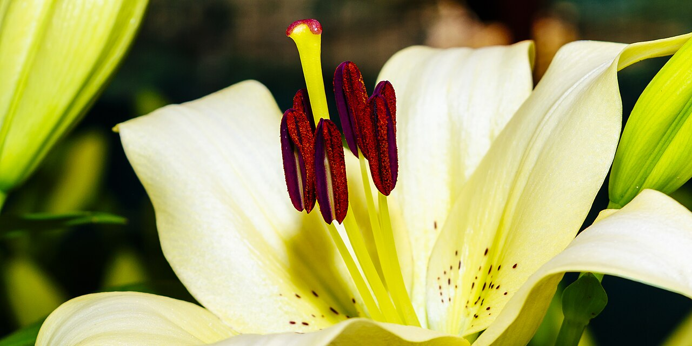
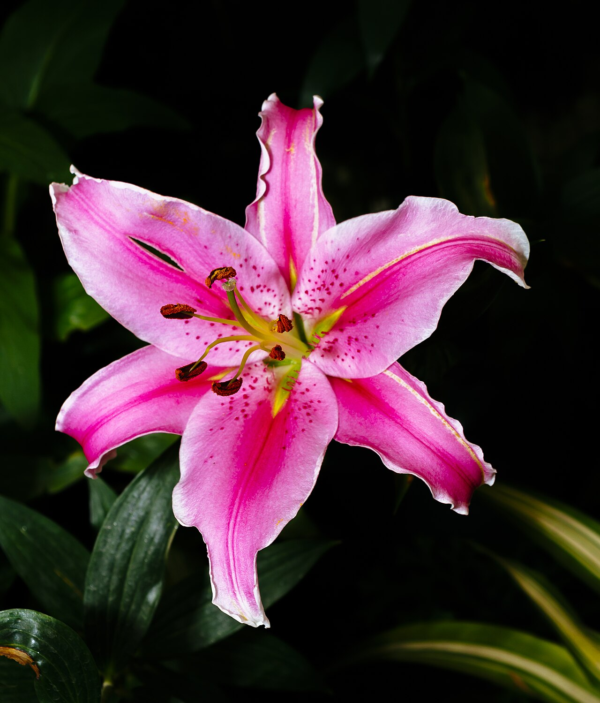
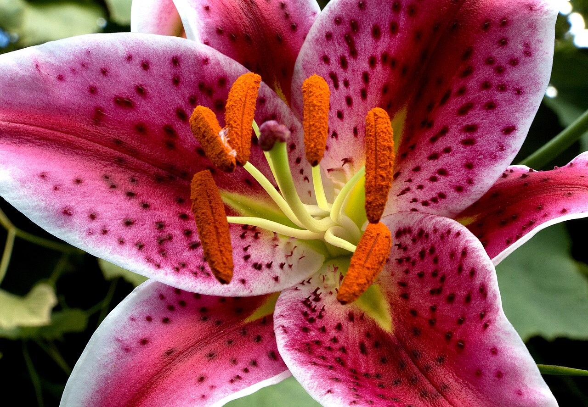
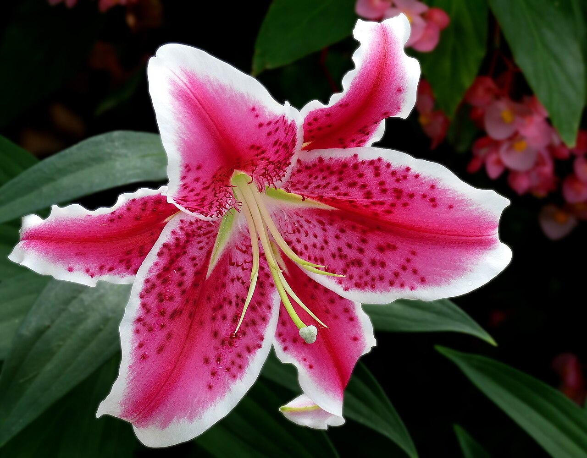

# Lily

> Stately and fragrant, the flower of purity — and, in white, the classic
> flower of sympathy. Note: several "lilies" sold in shops are not true lilies.

## Botanical identity
- **Common name(s):** Lily; common cut types — **Oriental** (e.g. 'Stargazer'),
  **Asiatic**, **Easter lily**, **Tiger lily**, **LA hybrids**.
- **Scientific name:** *Lilium* spp. (true lilies)
- **Family:** Liliaceae
- **Type:** Form flower (large, distinctive trumpet/star)
- **Not true lilies (common confusables):** **Calla lily** (*Zantedeschia*, native
  South Africa), **Peruvian lily** (*Alstroemeria*), **daylily** (*Hemerocallis*),
  **lily of the valley** (*Convallaria*), **water lily** (*Nymphaea*). Each has
  its own profile/meaning.

## Native region & origin
- **Native to:** The temperate **Northern Hemisphere** — Asia, Europe, and North
  America. Asia (China, Japan) is a major center of diversity.
- **Now cultivated in:** Worldwide; the Netherlands and Asia are large producers.
- **Domestication / spread notes:** The **Madonna lily** (*Lilium candidum*),
  native to the Balkans and Middle East, is among the oldest cultivated flowers
  and a longstanding Christian symbol of the Virgin Mary.

## Visual identification (for reading a photo)
- **Bloom form:** Large trumpet or outward-facing **star of six tepals**, borne
  several to a stem.
- **Size:** Large and showy.
- **Petals:** Six tepals, often recurved; **Oriental** types are heavily
  fragrant with spotted, sometimes ruffled throats; **Asiatic** types are
  unscented with vivid, cleaner colors.
- **Center:** Prominent protruding **stamens with heavy pollen** (often removed
  by florists because it stains) and a central pistil.
- **Color range:** White, pink, red, orange, yellow; many spotted/streaked.
- **Foliage/stem cues:** Lance-shaped leaves up a single tall stem.
- **Look-alikes:** Alstroemeria (much smaller, clustered, streaked) and amaryllis
  (huge, hollow stem). The big six-tepal bloom with heavy stamens says *Lilium*.

## History & cultural background
An ancient emblem of purity and the divine — associated with Hera/Juno in Greco-
Roman myth and, via the Madonna lily, with the Virgin Mary in Christian art
(annunciation scenes). The **Easter lily** (*Lilium longiflorum*) became the
Western symbol of Easter and resurrection.

## Symbolism & meaning
- **General meaning:** Purity, refined beauty, majesty, renewal.
- **By color / type:**
  - **White** — Purity, virtue, sympathy; the classic funeral lily, said to
    represent the restored innocence of the departed's soul. Also weddings.
  - **Stargazer (pink/white Oriental)** — Ambition, prosperity, aspiration.
  - **Orange (incl. tiger lily)** — Confidence, pride, passion. (Older reading:
    hatred or disdain — a Victorian caution.)
  - **Pink** — Admiration, prosperity, femininity.
  - **Yellow** — Gratitude, gaiety; (older) falsehood.
  - **Calla lily** (not a true lily) — Beauty and purity; used for both weddings
    and funerals.
- **Cultural variations:** White lilies read as sympathy/funeral across much of
  the West; as with all white flowers, funerary weight is even stronger in East
  Asia.

## Typical pairings
- **Arranged with:** Roses, chrysanthemums, and gladioli (esp. in sympathy work);
  hydrangea and greenery in mixed designs.
- **Greenery/fillers:** Salal, ruscus, eucalyptus.
- **Anchors:** Large formal arrangements, sympathy sprays, and statement bouquets
  (one lily fills a lot of space).

## Occasions & events
- **Strongly associated with:** Funerals and sympathy (white), Easter (Easter
  lily), weddings (calla and white), and formal celebrations.
- **Avoid for:** Homes with **cats** — true lilies are severely toxic to cats.
  Heavy fragrance can overwhelm small or hospital spaces.

## Seasonality & availability
- **Natural season:** Summer.
- **Commercial availability:** Year-round.
- **Vase life / care notes:** ~7–10+ days as buds open in succession; remove
  pollen-laden anthers to prevent staining.

## Quick facts
- **Birth month:** May (lily of the valley — a different plant); lilies broadly
  associated with 30th anniversary.
- **Wedding anniversary:** 30th (lily); 6th (calla lily).
- **Notable toxicity/allergy:** **Highly toxic to cats** (even pollen/water);
  pollen stains fabric.

## Reference images
<!-- IMAGES-START -->
Reference photos, all under reusable licenses (CC-BY / CC-BY-SA / CC0 / public domain) from Wikimedia Commons. Full attribution in [`image-manifest.json`](../images/image-manifest.json).

*Closeup of Stamen and stigma of Lilium 'Stargazer' (the 'Stargazer lily') — Subhrajyoti07 · CC BY-SA 4.0*

*Lilium 'Stargazer' (the 'Stargazer lily') — Subhrajyoti07 · CC BY-SA 4.0*

*Stargazer Lily 2 — ksblack99 · Public domain*

*Lilium Oriental hybrid -- Lilium orientalis - 'Stargazer' — Jim Evans · CC BY-SA 4.0*
<!-- IMAGES-END -->

---
*Confidence / to-verify:* High confidence. Key caution to always surface: many
shop "lilies" are other genera, and true lilies are dangerous to cats.
