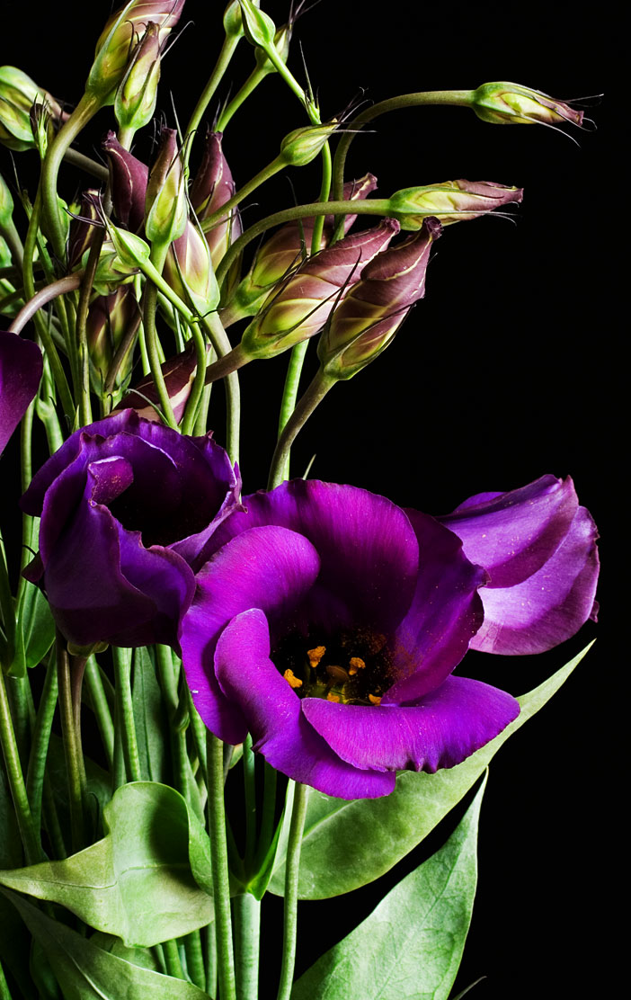
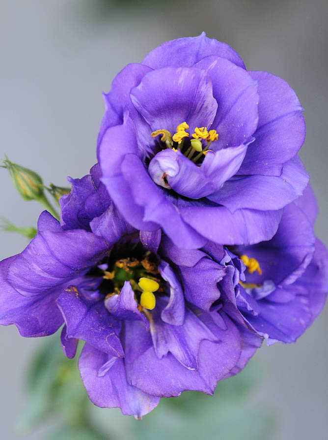
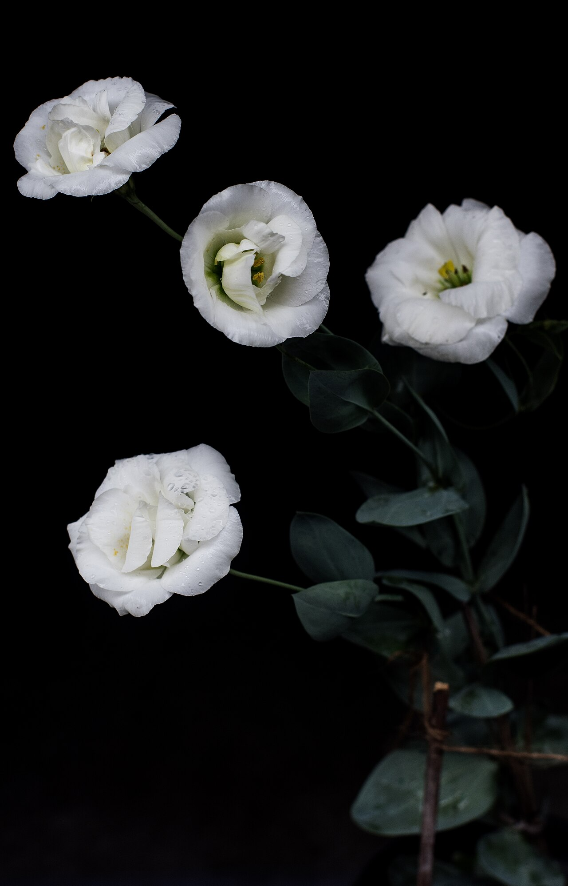
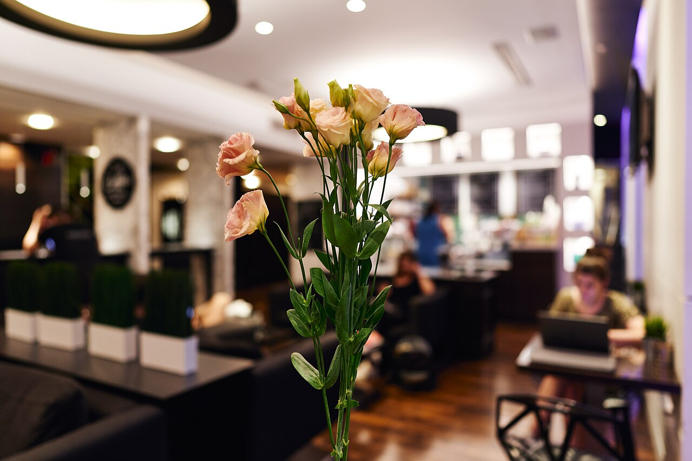

# Lisianthus

> The rose look-alike that isn't a rose — a prairie wildflower turned elegant
> wedding staple, meaning appreciation and an outgoing, charismatic nature.

## Botanical identity
- **Common name(s):** Lisianthus; prairie gentian; Texas bluebell; tulip gentian
- **Scientific name:** *Eustoma grandiflorum* (syn. *Eustoma russellianum*)
- **Family:** Gentianaceae
- **Type:** Mass / focal flower

## Native region & origin
- **Native to:** Warm grasslands of the **southern United States** (Texas,
  Nebraska), **Mexico**, and northern South America.
- **Now cultivated in:** **Japan** is the leading breeder/producer; also grown
  worldwide.
- **Domestication / spread notes:** A **North American prairie wildflower**
  transformed by 20th-century (largely Japanese) breeding into the ruffled,
  double, rose-like cut flower seen today.

## Visual identification (for reading a photo)
- **Bloom form:** Cupped, softly **ruffled, rose-like** blooms on wiry stems;
  singles have a simple bell, doubles look like a garden rose or small peony.
- **Size:** Medium; buds spiral like a rosebud and open flat.
- **Petals:** Delicate, satiny, slightly crepe-textured, often with a subtle
  picotee edge.
- **Center:** Visible stamens and a two-lobed stigma in open singles.
- **Color range:** Purple, blue, lavender, pink, white, cream, apricot, and
  bicolor/picotee.
- **Foliage/stem cues:** Blue-green, waxy, clasping leaves on slender branching
  stems; multiple buds per stem.
- **Look-alikes:** Roses and peonies (lisianthus is daintier, on wirier stems,
  with a spiraling bud) and, when open, poppies. The **clasping blue-green
  leaves and multi-bud wiry stems** confirm it.

## History & cultural background
From the open prairies of Texas to the breeding greenhouses of Japan, lisianthus
rose from wildflower to wedding favorite. Its resemblance to roses — with a
softer, more romantic looseness — made it a florist darling.

## Symbolism & meaning
- **General meaning:** **Appreciation and gratitude**, charisma, an outgoing
  nature, and a longstanding bond; also calm and serenity.
- **By color:** Colors follow their general meanings (see color-symbolism.md) —
  purple/blue lean regal and calm, pink/white toward sweetness and grace.

## Cultural meanings across the world
- **North America (origin):** A native **prairie gentian** — "Texas bluebell" —
  woven into the wildflower heritage of the southern plains.
- **Japan (leading grower):** Known as *torukogikyō* ("Turkish bellflower");
  Japan's breeding made it a global cut flower, and it is popular there for both
  celebrations and refined gifting.
- **Western / Victorian:** Reads as **appreciation, charisma, and a bond that
  lasts** — a graceful way to say thank you or to honor an outgoing, magnetic
  person.
- **Note:** A modern ornamental with light historical baggage and no strong
  funerary meaning — versatile and safe.

## Typical pairings
- **Arranged with:** Roses, peonies, ranunculus, and hydrangea — a wedding
  quartet; softens and extends romantic bouquets.
- **Greenery/fillers:** Eucalyptus, its own buds and foliage.
- **Anchors:** Romantic, full, garden-style arrangements; a rose substitute or
  companion.

## Occasions & events
- **Strongly associated with:** Weddings, thank-you and appreciation gifts,
  everyday elegance, and sympathy (soft whites).
- **Avoid for:** Little to avoid; broadly welcome.

## Seasonality & availability
- **Natural season:** Summer.
- **Commercial availability:** **Much of the year.**
- **Vase life / care notes:** Excellent — often **~2 weeks**; buds keep opening,
  so blooms and buds share the stem beautifully.

## Quick facts
- **Birth month:** — (not a traditional birth flower)
- **Wedding anniversary:** — (no standard year; a wedding staple)
- **Notable toxicity/allergy:** Generally low toxicity; considered relatively
  pet-safe.

## Reference images
<!-- IMAGES-START -->
Reference photos, all under reusable licenses (CC-BY / CC-BY-SA / CC0 / public domain) from Wikimedia Commons. Full attribution in [`image-manifest.json`](../images/image-manifest.json).

*Eustoma grandiflorum purple 02 — Unknown · CC BY-SA 2.0*

*Lisianthus — Koshy Koshy from Faridabad, Haryana, India · CC BY 2.0*

*Lisianthus 2025.2 — Wasir kasab · CC BY 4.0*

*A bouquet of light pink and white Lisianthus flowers — George E. Koronaios · CC BY-SA 4.0*
<!-- IMAGES-END -->

---
*Confidence / to-verify:* High on North American prairie origin, Japanese
breeding leadership, the rose look-alike ID, and the appreciation/charisma meaning.
