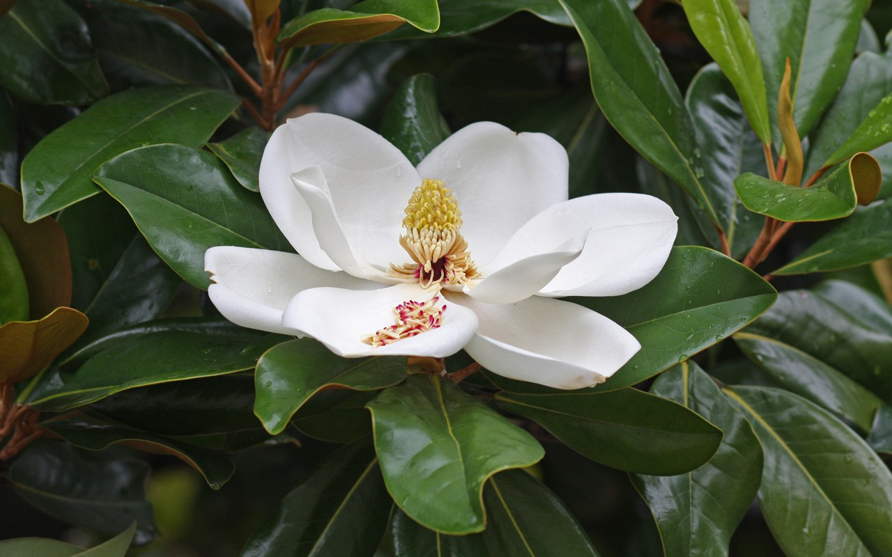
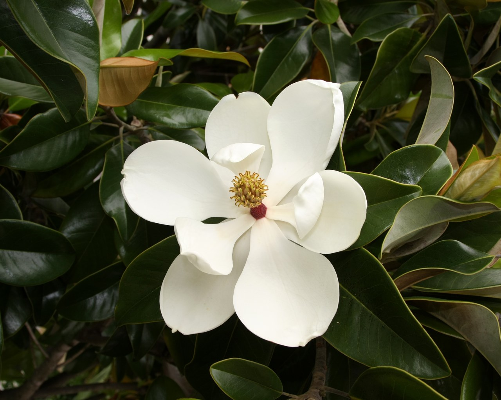
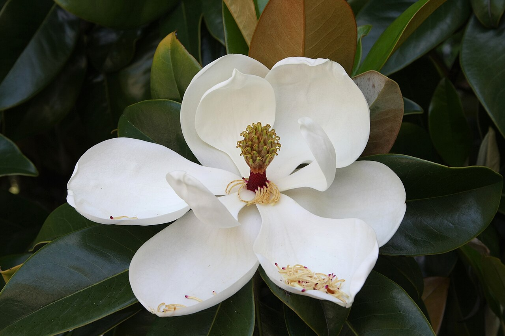
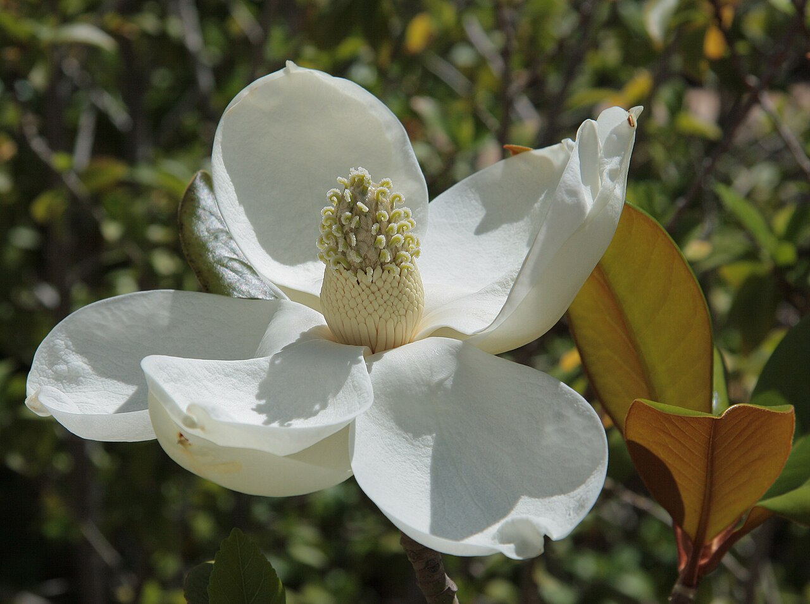

# Magnolia

> An ancient flower older than bees — big, waxy goblets meaning dignity, nobility,
> and perseverance, and the pride of both imperial China and the American South.

## Botanical identity
- **Common name(s):** Magnolia; Southern magnolia; saucer/tulip magnolia; *yulan*
- **Scientific name:** *Magnolia grandiflora* (evergreen Southern); *M.* ×
  *soulangeana* (deciduous saucer); *M. denudata* (yulan)
- **Family:** Magnoliaceae
- **Type:** Form flower (large, on a tree)

## Native region & origin
- **Native to:** **East Asia** and **the Americas** (the Southern magnolia is
  native to the southeastern US).
- **Now cultivated in:** Worldwide in temperate/warm gardens.
- **Domestication / spread notes:** One of the **most ancient flowering plants** —
  magnolias evolved ~95+ million years ago, **before bees**, and are pollinated
  by **beetles**; their tough petals resist beetle damage. Named after French
  botanist **Pierre Magnol**.

## Visual identification (for reading a photo)
- **Bloom form:** Large, **goblet- or star-shaped** waxy flowers with broad
  tepals.
- **Size:** Large (grandiflora blooms can span 20+ cm).
- **Petals:** Thick, waxy tepals (no distinct sepals/petals); creamy and fragrant.
- **Center:** A cone-like central structure of stamens and carpels.
- **Color range:** White, cream, pink, purple, and yellow.
- **Foliage/stem cues:** **Large, glossy, leathery evergreen leaves** (grandiflora)
  with rusty-felted undersides; deciduous types bloom on bare branches.
- **Look-alikes:** Lotus and water lily (aquatic); the magnolia's waxy tepals on
  a woody tree with glossy leaves are distinctive.

## History & cultural background
A living fossil that predates the bee, the magnolia has stood for endurance and
nobility across continents — a Tang-dynasty imperial flower in China and the
emblematic bloom of the American South.

## Symbolism & meaning
- **General meaning:** **Dignity, nobility, perseverance, purity, and love of
  nature**; feminine beauty and sweetness; endurance/longevity (its ancient
  lineage).
- **By color:**
  - **White** — Purity, dignity.
  - **Pink** — Youth, joy, feminine sweetness.
  - **Purple** — Dignity, good fortune.

## Cultural meanings across the world
- **China:** The **yulan magnolia** (*M. denudata*) symbolizes **purity,
  nobility, and feminine beauty**; grown in **imperial palace gardens** and prized
  since the Tang dynasty — a mark of high rank and candor.
- **United States (the South):** The **Southern magnolia** is the state flower of
  **Mississippi and Louisiana**, an emblem of **dignity, hospitality, endurance,
  and the Old South**.
- **Feng shui:** Associated with **purity and the sweetness of contentment**, and
  planted for good fortune.
- **Western / Victorian:** **Dignity and nobility** — a flower of stately,
  perseverant beauty.

## Typical pairings
- **Arranged with:** Roses and other large focal blooms; the branches and glossy
  leaves are used on their own in wreaths and installations.
- **Greenery/fillers:** Its own leathery leaves (a florist favorite for garlands).
- **Anchors:** Grand, elegant arrangements; branch-and-foliage designs.

## Occasions & events
- **Strongly associated with:** Weddings (dignity/purity), Southern celebrations,
  and stately/formal arrangements; the foliage for holiday wreaths.
- **Avoid for:** Little to avoid; the blooms are short-lived once cut.

## Seasonality & availability
- **Natural season:** Spring (deciduous types) into summer (grandiflora).
- **Commercial availability:** Blooms are fleeting cut; the **foliage** is sold
  year-round.
- **Vase life / care notes:** Flowers bruise and brown quickly; the waxy leaves
  last for weeks and dry beautifully.

## Quick facts
- **Birth month:** — (not a traditional birth flower)
- **Wedding anniversary:** — (no standard year)
- **Notable toxicity/allergy:** **Non-toxic**; petals are even edible (pickled in
  some cuisines).

## Reference images
<!-- IMAGES-START -->
Reference photos, all under reusable licenses (CC-BY / CC-BY-SA / CC0 / public domain) from Wikimedia Commons. Full attribution in [`image-manifest.json`](../images/image-manifest.json).

*Southern magnolia (Magnolia grandiflora) flower buds, Jardim da Fundação Caloust — Jules Verne Times Two · CC BY-SA 4.0*

*Magnolia grandiflora 001 — H. Zell · CC BY-SA 3.0*

*Magnolia grandiflora - flower 2 — Ianaré Sévi · CC BY-SA 3.0*

*Magnolia grandiflora 3964 — Anna Anichkova · CC BY-SA 3.0*
<!-- IMAGES-END -->

---
*Confidence / to-verify:* High on the ancient/beetle-pollinated lineage, Chinese
imperial yulan and US-South symbolism, and the Magnol naming.
