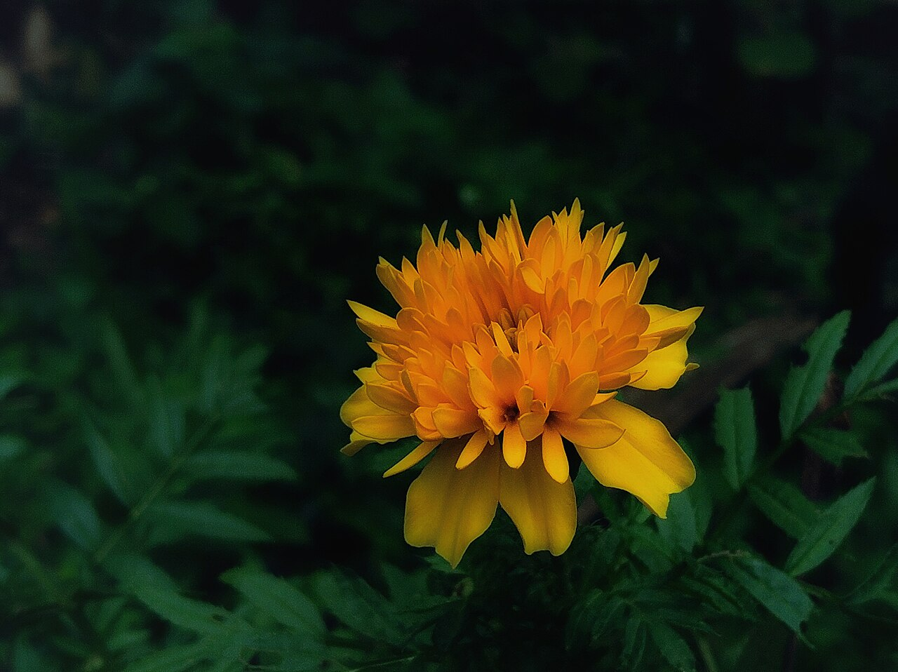
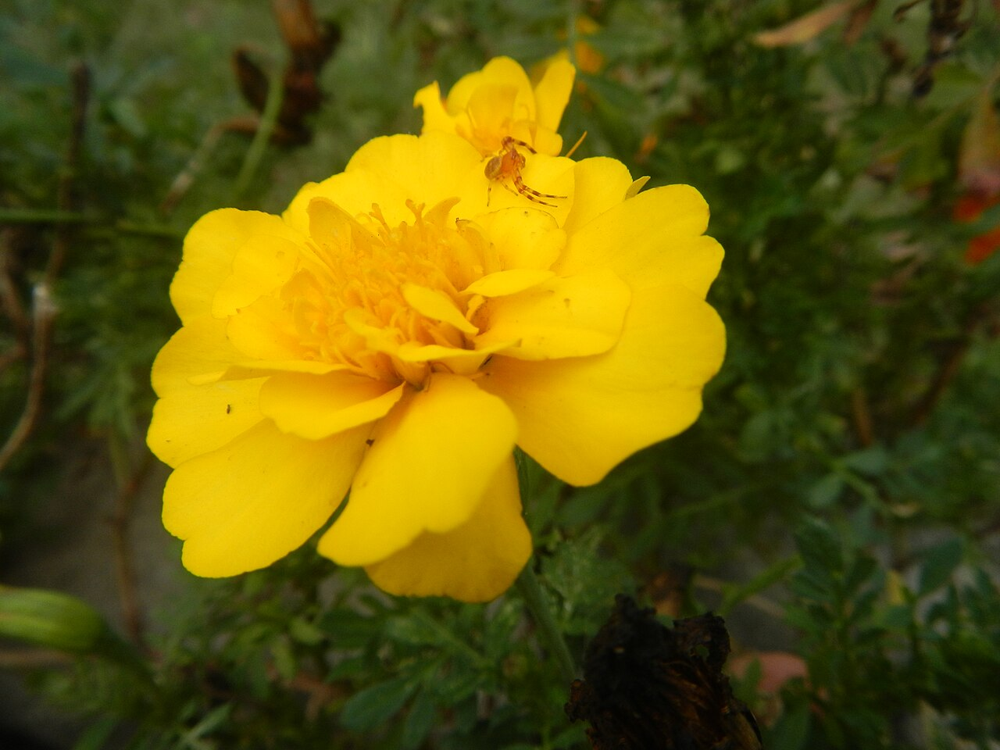
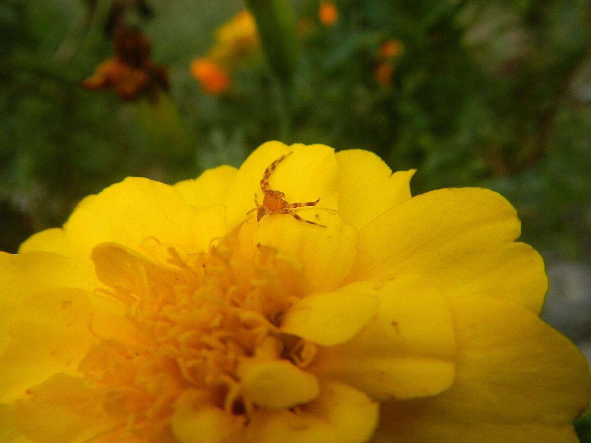
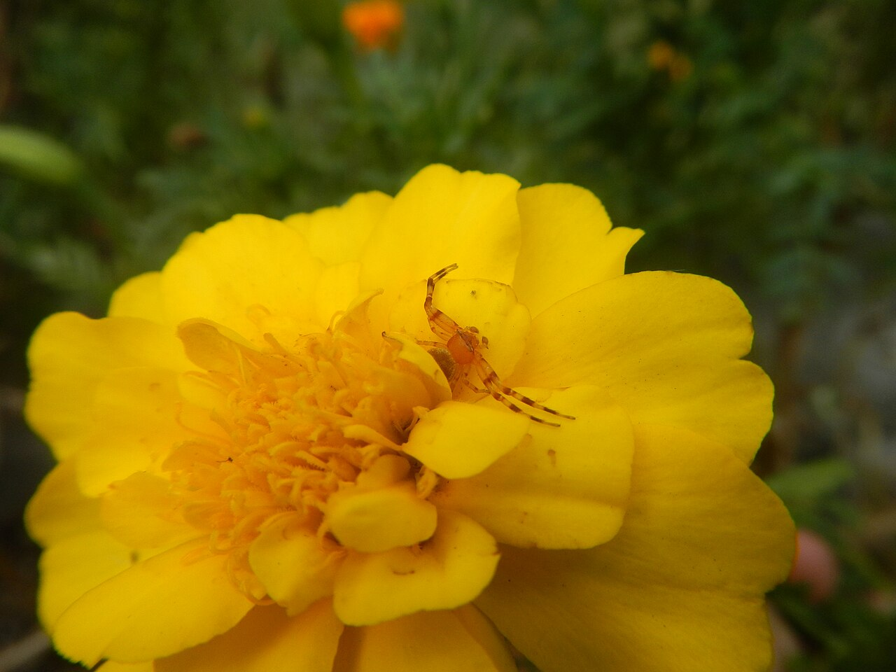

# Marigold (Tagetes)

> The flower of the dead in Mexico and the flower of the divine in India — the
> same bright bloom, opposite ceremonial weight. **Resolve the culture first.**

## Botanical identity
- **Common name(s):** Marigold; *cempasúchil* (Aztec/Mexican); *genda* (India);
  Aztec / African / French marigold
- **Scientific name:** *Tagetes* spp. (*T. erecta*, *T. patula*)
- **Family:** Asteraceae
- **Type:** Mass / daisy-form flower
- **Not to be confused with:** **pot marigold** (*Calendula*) or **marsh
  marigold** (*Caltha*) — different genera.

## Native region & origin
- **Native to:** **Mexico, Central and South America.**
- **Now cultivated in:** India, Mexico, Thailand, and worldwide.
- **Domestication / spread notes:** Cultivated by the **Aztecs** for ritual and
  medicine; carried to Europe, Africa, and Asia after the 16th century, becoming
  deeply woven into Indian and Southeast Asian ceremony.

## Visual identification (for reading a photo)
- **Bloom form:** Dense, rounded **pompom** of many ruffled ray petals.
- **Size:** Small (French) to large (African/Aztec) heads.
- **Petals:** Many crowded, often frilled rays.
- **Center:** Usually hidden in the petal density.
- **Color range:** Vivid **orange, yellow, gold, rust, and bicolor**.
- **Foliage/stem cues:** Ferny, deeply divided leaves with a **strong pungent
  scent**; sturdy stems.
- **Look-alikes:** Calendula (flatter, daisy-like), chrysanthemum, and pompom
  dahlias; the marigold's pungent foliage and hot orange/gold pompoms are the tell.

## History & cultural background
From Aztec altars to Indian temple garlands, the marigold is one of the world's
great **ceremonial** flowers — its color and scent believed to carry between the
living and the divine (or the dead).

## Symbolism & meaning
- **General meaning (Western/Victorian):** A genuine double — **grief,
  jealousy, cruelty, and despair** on one side; **warmth, creativity, and the
  sun** on the other.
- **By color:** Mostly warm oranges/golds reading as sun, warmth, and energy.

## Cultural meanings across the world
- **Mexico / Latin America:** The ***cempasúchil*** is **the flower of the dead**
  — the heart of **Día de los Muertos (Nov 1–2)**. Its color and scent are said
  to **guide spirits back to the ofrenda**; petals are strewn in paths to altars.
- **India / Nepal (Hindu tradition):** Intensely **auspicious and sacred** —
  *genda phool* garlands for **weddings, Diwali, Dussehra**, temple offerings,
  and deity garlanding; a symbol of the **sun, trust, and sacredness**.
- **Aztec:** Sacred to the sun and used medicinally and in ceremony.
- **Thailand & SE Asia:** *Dao ruang* ("star of prosperity") — good fortune and
  temple offerings.
- **Western / Victorian:** The darker **grief and jealousy** reading — a rare
  case where the Western meaning is the negative one.

## Typical pairings
- **Arranged with:** Other warm-tone blooms — sunflowers, dahlias, zinnias, and
  celosia; strung into garlands.
- **Greenery/fillers:** Its own foliage; sturdy greens.
- **Anchors:** Autumn, festival, and Day-of-the-Dead arrangements; garlands.

## Occasions & events
- **Strongly associated with:** Día de los Muertos (Mexico), Diwali and Hindu
  weddings/festivals (India), autumn, and harvest celebrations.
- **Avoid for:** Casual Western romantic gifting (grief/jealousy connotation);
  and always mind the strong Day-of-the-Dead association.

## Seasonality & availability
- **Natural season:** Summer to autumn (peak around late October for Día de los
  Muertos).
- **Commercial availability:** Widely available, especially in autumn.
- **Vase life / care notes:** Long-lasting; the pungent scent is characteristic.

## Quick facts
- **Birth month:** October
- **Wedding anniversary:** — (no standard year)
- **Notable toxicity/allergy:** Generally non-toxic; sap/scent can irritate
  sensitive skin; often planted to repel garden pests.

## Reference images
<!-- IMAGES-START -->
Reference photos, all under reusable licenses (CC-BY / CC-BY-SA / CC0 / public domain) from Wikimedia Commons. Full attribution in [`image-manifest.json`](../images/image-manifest.json).

*Marigold Flower in Bloom — Navaneethpp · CC BY-SA 4.0*

*02002jfTagetes French Marigold Bulacanfvf 01 — Judgefloro · CC0*

*02002jfTagetes French Marigold Bulacanfvf 02 — Judgefloro · CC0*

*02002jfTagetes French Marigold Bulacanfvf 03 — Judgefloro · CC0*
<!-- IMAGES-END -->

---
*Confidence / to-verify:* High on Mexican/Aztec origin, Día de los Muertos and
Hindu-festival roles, and the Western grief/warmth duality.
