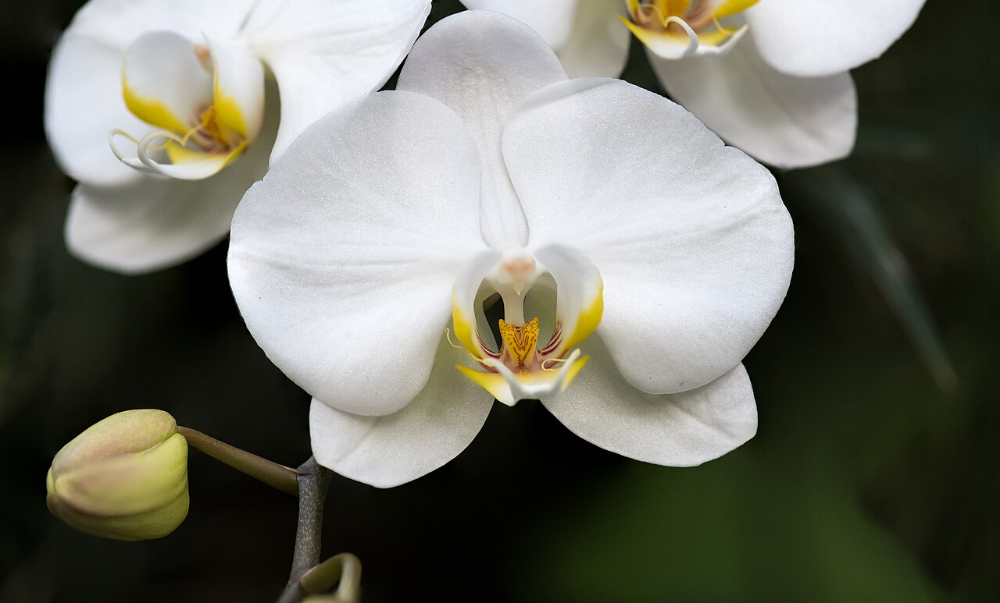
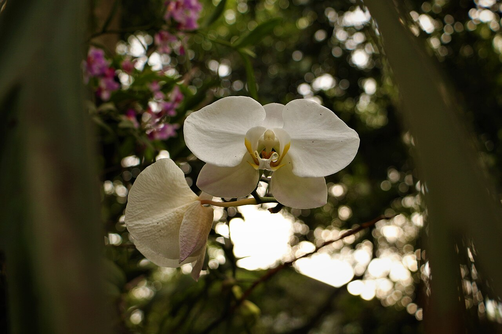
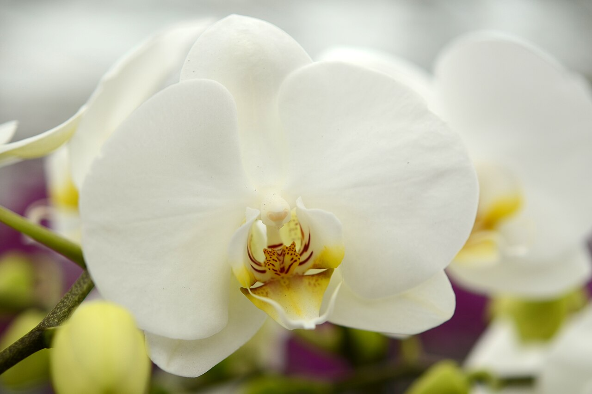
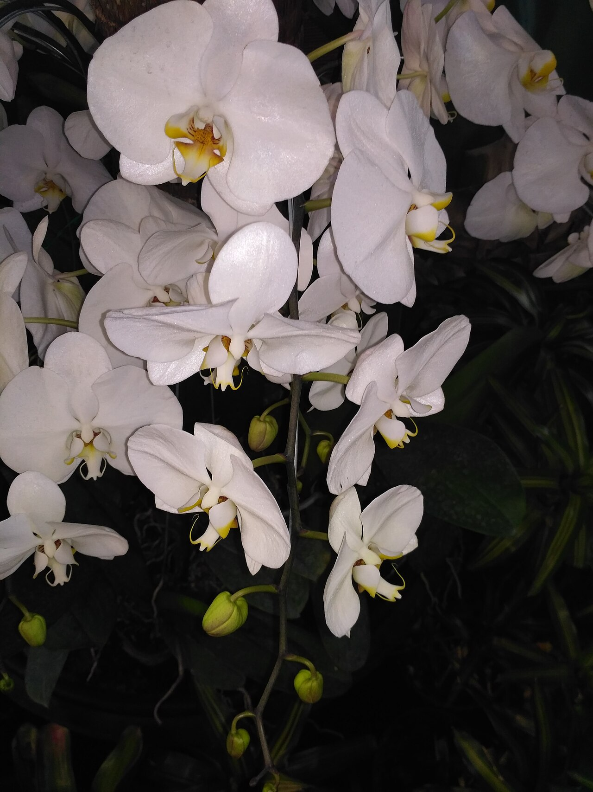

# Orchid

> Exotic luxury in bloom. One of the two largest plant families on Earth, and a
> flower loaded with meaning from ancient Greek virility to the Chinese ideal of
> the noble scholar.

## Botanical identity
- **Common name(s):** Orchid; common cut/potted types — **Phalaenopsis** (moth
  orchid), **Dendrobium**, **Cymbidium** (boat orchid), **Cattleya**, **Vanda**,
  **Oncidium** (dancing lady)
- **Scientific name:** Family *Orchidaceae* (~28,000 species — one of the two
  largest families of flowering plants)
- **Family:** Orchidaceae
- **Type:** Form flower (distinctive bilateral silhouette)

## Native region & origin
- **Native to:** **Worldwide**, concentrated in the tropics — **tropical Asia**
  and **Central/South America** especially. Phalaenopsis: SE Asia to Australia;
  Cattleya: Central/South America; Cymbidium & Dendrobium: Asia/Pacific.
- **Now cultivated in:** Taiwan, Thailand, the Netherlands, and worldwide (moth
  orchids are among the best-selling potted plants globally).
- **Domestication / spread notes:** The **vanilla orchid** (*Vanilla planifolia*)
  was cultivated by the Aztecs to flavor chocolate. Victorian "**Orchidelirium**"
  drove collectors to obsession and remote-jungle plant-hunting expeditions.

## Visual identification (for reading a photo)
- **Bloom form:** **Bilaterally symmetric** ("face-like"), with a distinctive
  lower **lip (labellum)** different from the other petals; borne in arching
  sprays along a stem.
- **Size:** Small (Oncidium) to large and flat (Phalaenopsis, Cattleya).
- **Petals:** Three sepals + three petals, one modified into the lip; waxy,
  long-lasting.
- **Center:** A **column** (fused stamen + pistil) at the throat, often a
  contrasting color.
- **Color range:** Nearly limitless, including spots, stripes, and gradients;
  blue is usually dyed.
- **Foliage/stem cues:** Thick, strappy leaves; aerial roots in potted moth
  orchids; blooms arch along a wand-like stem.
- **Look-alikes:** Few — the bilateral "face" with a lip is unmistakable once
  learned; iris is the nearest form flower but has an obvious three-fold plan.

## History & cultural background
The name comes from the Greek *orchis* ("testicle," for the paired root tubers),
which seeded an ancient association with **virility and fertility**. From Aztec
vanilla to Victorian collecting manias, orchids have long signified the exotic,
the rare, and the coveted.

## Symbolism & meaning
- **General meaning:** Luxury, refinement, exotic beauty, love, strength, and
  fertility; a mark of good taste and status.
- **By color:**
  - **White** — Elegance, purity, reverence, humility.
  - **Pink** — Grace, femininity, joy; affection.
  - **Purple** — Royalty, admiration, dignity, respect.
  - **Red** — Passion, desire, strength.
  - **Yellow** — Friendship, new beginnings, optimism.
  - **Green** — Health, longevity, good fortune, nature.

## Cultural meanings across the world
- **China:** One of the **"Four Gentlemen"** of classical art (*lan*). Emblem of
  **refinement, integrity, nobility, and friendship** and of the ideal scholar-
  gentleman (*junzi*); **Confucius** likened the virtuous person to an orchid's
  fragrance. Also linked to **fertility and many children** (numerous offspring).
- **Japan (hanakotoba):** Nobility, elegance, and refined beauty. Fūran
  (*Neofinetia*) orchids were prized and collected by samurai and nobility.
- **India / Southeast Asia:** Widely used in **garlands, temple offerings, and
  weddings**; orchids are national flowers across the region (e.g. **Singapore's**
  *Vanda* Miss Joaquim, and the national flowers of several other SE Asian states).
- **Latin America (Aztec/Mesoamerican):** The **vanilla orchid** was sacred and
  used to flavor cacao; a symbol of value and pleasure.
- **Greco-Roman / mythological:** Tied to **virility and fertility** via the
  tuber's name; eating tubers was folk-believed to influence a child's sex.
- **Victorian West:** Rare orchids signified **wealth, luxury, and seduction** —
  the ultimate status flower of "Orchidelirium."

## Typical pairings
- **Arranged with:** Roses, calla lilies, hydrangea, and anthurium for luxe
  designs; often used solo (a single spray is a statement).
- **Greenery/fillers:** Monstera leaf, ti leaf, ruscus, moss.
- **Anchors:** High-end, tropical, and minimalist-modern arrangements; corsages
  and leis.

## Occasions & events
- **Strongly associated with:** Luxury and corporate gifting, weddings (bouquets,
  leis, corsages), anniversaries (14th & 28th = pink orchid), and elegant
  sympathy (especially white potted phalaenopsis in East Asia).
- **Avoid for:** Few taboos; culturally a safe, prestigious gift almost everywhere.

## Seasonality & availability
- **Natural season:** Varies by genus; many bloom in winter–spring.
- **Commercial availability:** Year-round (potted Phalaenopsis especially).
- **Vase life / care notes:** Cut sprays last **2–3 weeks**; potted plants
  rebloom for months. Sensitive to cold drafts and overwatering.

## Quick facts
- **Birth month:** — (not a traditional birth flower)
- **Wedding anniversary:** 14th & 28th (pink orchid)
- **Notable toxicity/allergy:** Generally **non-toxic** and pet-safe; vanilla is
  the only orchid of major culinary use.

## Reference images
<!-- IMAGES-START -->
Reference photos, all under reusable licenses (CC-BY / CC-BY-SA / CC0 / public domain) from Wikimedia Commons. Full attribution in [`image-manifest.json`](../images/image-manifest.json).

*White Orchid 1 NBG — PumpkinSky · CC BY-SA 3.0*

*White Orchid Flower — Rodanhadid · CC BY-SA 4.0*

*Phalaenopsis cultivars — Alias 0591 from the Netherlands · CC BY 2.0*

*White orchid flower in Soekarno-Hatta Airport — Apundung · CC BY-SA 4.0*
<!-- IMAGES-END -->

---
*Confidence / to-verify:* High on family scale, native ranges, and the Chinese
"Four Gentlemen" and Greek etymology. Some national-flower specifics vary by country.
