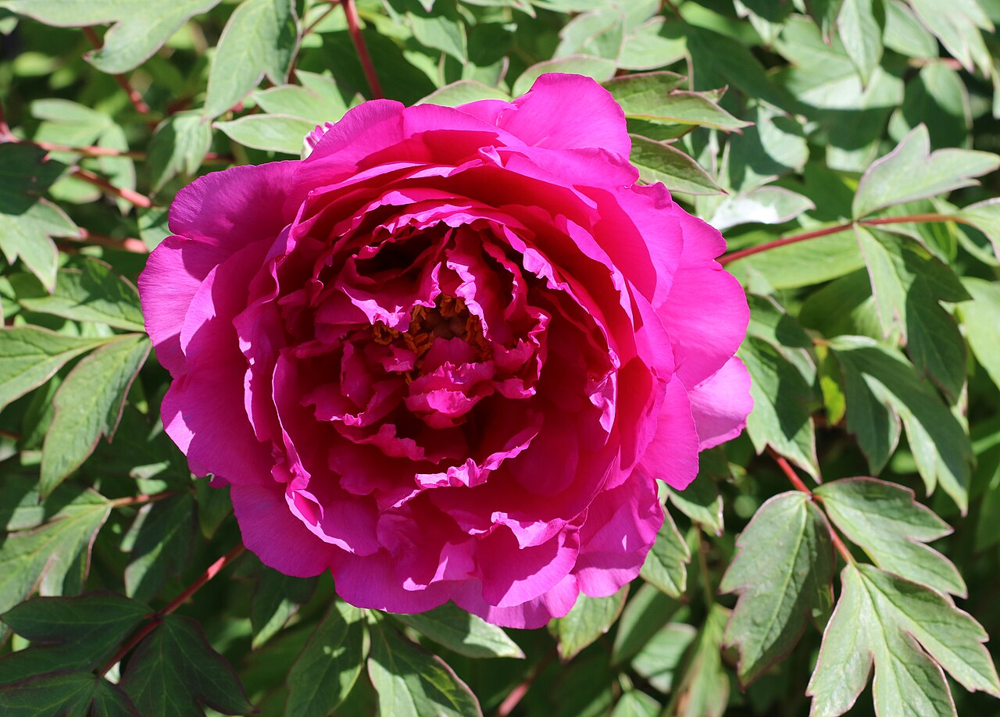
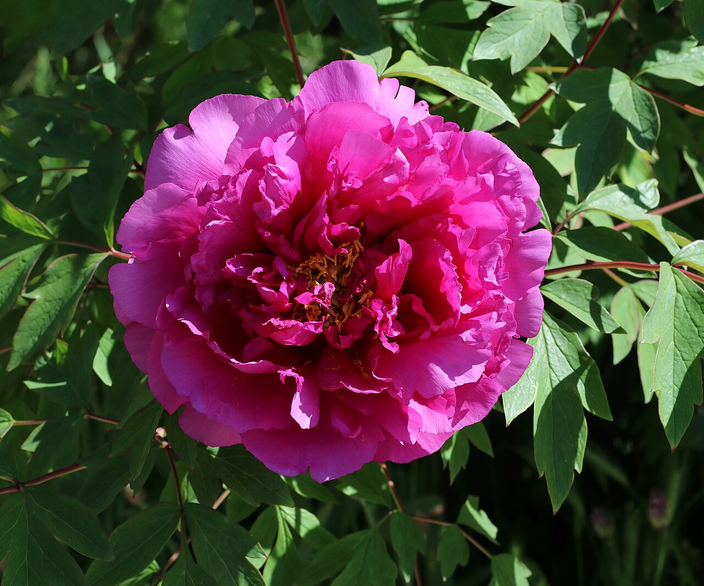
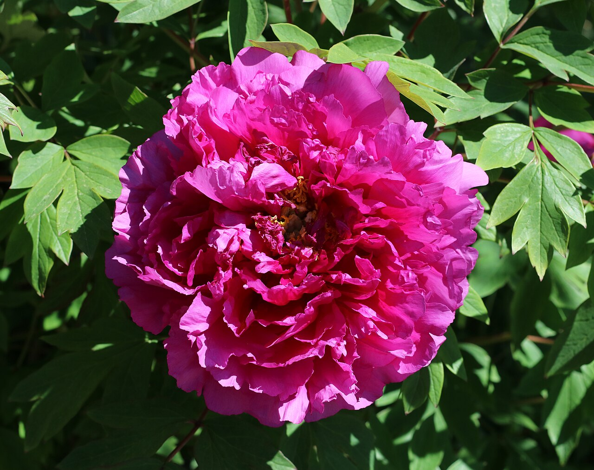
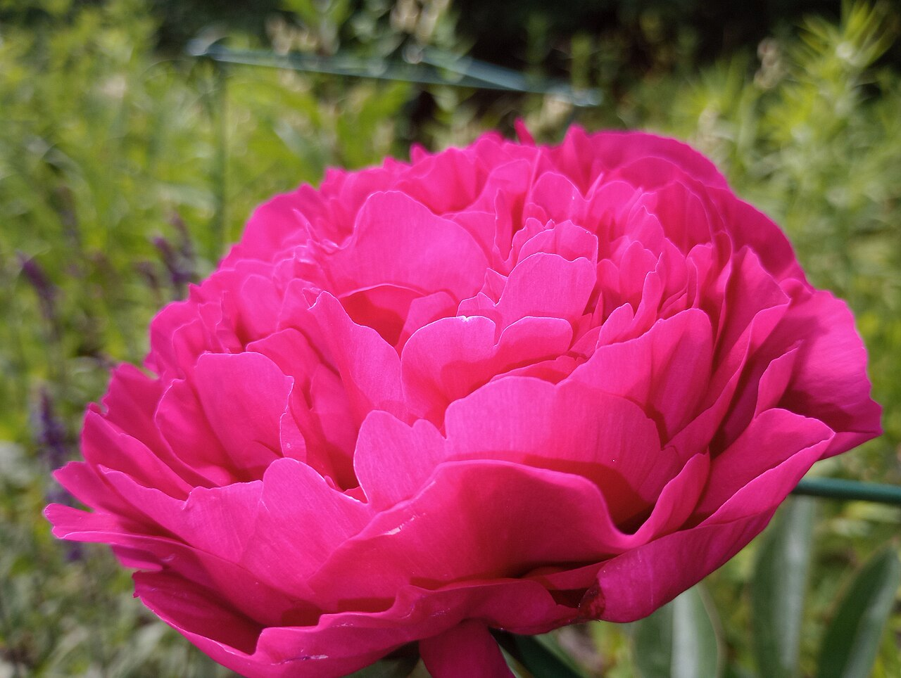

# Peony

> The lush, romantic "king of flowers." A Chinese symbol of wealth and honor, a
> Japanese symbol of bravery, and one of the most coveted (and seasonal) wedding
> flowers in the world.

## Botanical identity
- **Common name(s):** Peony; tree peony (*botan*, Japan / *mudan*, China);
  herbaceous peony
- **Scientific name:** *Paeonia* spp. (herbaceous *P. lactiflora*; tree peonies;
  intersectional "Itoh" hybrids)
- **Family:** Paeoniaceae
- **Type:** Mass / focal flower (large, romantic centerpiece bloom)

## Native region & origin
- **Native to:** **Asia** (China is the historic heartland), **Southern Europe**,
  and **Western North America**.
- **Now cultivated in:** China, the Netherlands, the US, and (for counter-season
  supply) New Zealand, Chile, and Alaska.
- **Domestication / spread notes:** Cultivated in China for well over a thousand
  years; **Luoyang** and **Heze** are famous peony cities. Named for **Paeon**,
  physician to the Greek gods (the roots were used medicinally).

## Visual identification (for reading a photo)
- **Bloom form:** Very large, rounded, and **many-petaled**, often loose and
  ruffled with a fluffy center; forms range from single to fully "double."
- **Size:** Large — among the biggest common cut blooms.
- **Petals:** Numerous, soft, silky, often with a slightly frilled edge.
- **Center:** In doubles, a dense froth of petals; in singles/semi-doubles, a
  boss of golden stamens.
- **Color range:** White, blush, pink, coral, red, and rare yellow (Itoh).
- **Foliage/stem cues:** Large, glossy, deeply divided leaves; buds are round
  and often ant-covered in the garden (harmless).
- **Look-alikes:** Garden roses and ranunculus, and ruffled carnations. The
  peony is **larger and looser** with a fluffier center; its big divided leaves
  help confirm it.

## History & cultural background
For centuries the peony has been the emblem of prosperity and high rank in China
and a fixture of imperial gardens and classical painting. Its brief, opulent
bloom season and full, romantic form make it one of the most requested — and
priciest — wedding flowers today.

## Symbolism & meaning
- **General meaning:** Romance, prosperity, good fortune, honor, a happy
  marriage, and compassion; also **bashfulness** (from a blushing-nymph myth).
- **By color:**
  - **Pink** — Romance, prosperity, a happy marriage; love and good luck.
  - **White** — Bashfulness, apology; sometimes remembrance.
  - **Red** — Honor, respect, wealth, passion.
  - **Coral** — Desire, transformation (coral peonies fade as they open).

## Cultural meanings across the world
- **China:** The **"king of flowers"** (*huawang*) and a longstanding **national
  emblem**; symbol of **riches, honor, high rank, and feminine beauty** — the
  "flower of riches and honour" (*fùguì huā*). Ubiquitous in wedding décor and
  **Lunar New Year** imagery for prosperity.
- **Japan (hanakotoba):** The **tree peony (*botan*)** signifies **bravery,
  honor, good fortune, and nobility**; paired with a lion (*karajishi*) in art
  and tattoo to mean fearless, devil-may-care courage. Hanakotoba also reads it
  as bashfulness.
- **Europe (Victorian / Greek):** Romance and a happy marriage, but also
  **bashfulness or shame** — from the myth of the nymph **Paeonia**, who blushed
  when noticed; some Victorian dictionaries even read it as anger or indignation.
- **Greco-Roman / mythological:** Named for **Paeon**; associated with healing
  (medicinal roots) and, via the nymph, with modesty.

## Typical pairings
- **Arranged with:** Garden roses, ranunculus, hydrangea, sweet peas, and
  lisianthus — the classic romantic/wedding palette.
- **Greenery/fillers:** Eucalyptus, jasmine vine, its own foliage.
- **Anchors:** Lush, full, romantic bouquets; the star of late-spring weddings.

## Occasions & events
- **Strongly associated with:** Weddings, romance, anniversaries (12th), Lunar
  New Year and prosperity (China), and Mother's Day.
- **Avoid for:** Few taboos; mainly limited by its short season and cost.

## Seasonality & availability
- **Natural season:** **Late spring to early summer** (roughly late April–June in
  the Northern Hemisphere) — a short, prized window.
- **Commercial availability:** Extended by counter-season imports (NZ/Chile ~Nov)
  but never truly year-round; expect high demand and price.
- **Vase life / care notes:** ~5–7 days; buy in "marshmallow" soft-bud stage;
  they open dramatically. Ants on garden buds are harmless.

## Quick facts
- **Birth month:** — (associated with April/spring)
- **Wedding anniversary:** 12th
- **Notable toxicity/allergy:** Mildly toxic to pets if ingested (GI upset).

## Reference images
<!-- IMAGES-START -->
Reference photos, all under reusable licenses (CC-BY / CC-BY-SA / CC0 / public domain) from Wikimedia Commons. Full attribution in [`image-manifest.json`](../images/image-manifest.json).

*Tree peony flower 2021 G2 — George Chernilevsky · CC BY-SA 4.0*

*Tree peony flower 2021 G3 — George Chernilevsky · CC BY-SA 4.0*

*Tree peony flower 2021 G1 — George Chernilevsky · CC BY-SA 4.0*

*Pink Peony Flower — Nathanieljoyce · CC0*
<!-- IMAGES-END -->

---
*Confidence / to-verify:* High on Chinese "king of flowers" status, Japanese
bravery symbolism, seasonality, and the Paeon/Paeonia mythology.
