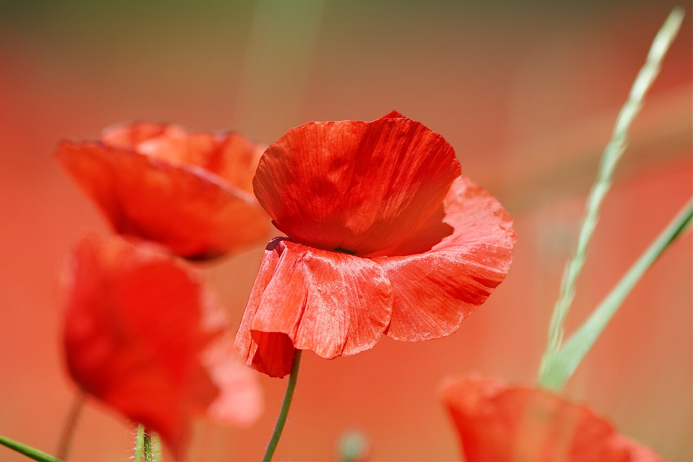
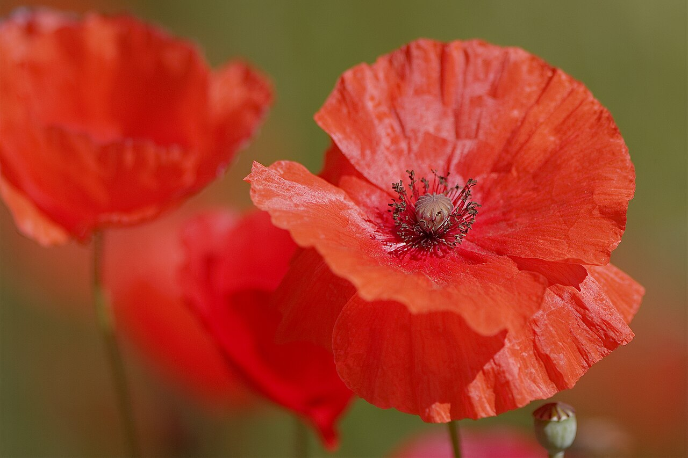
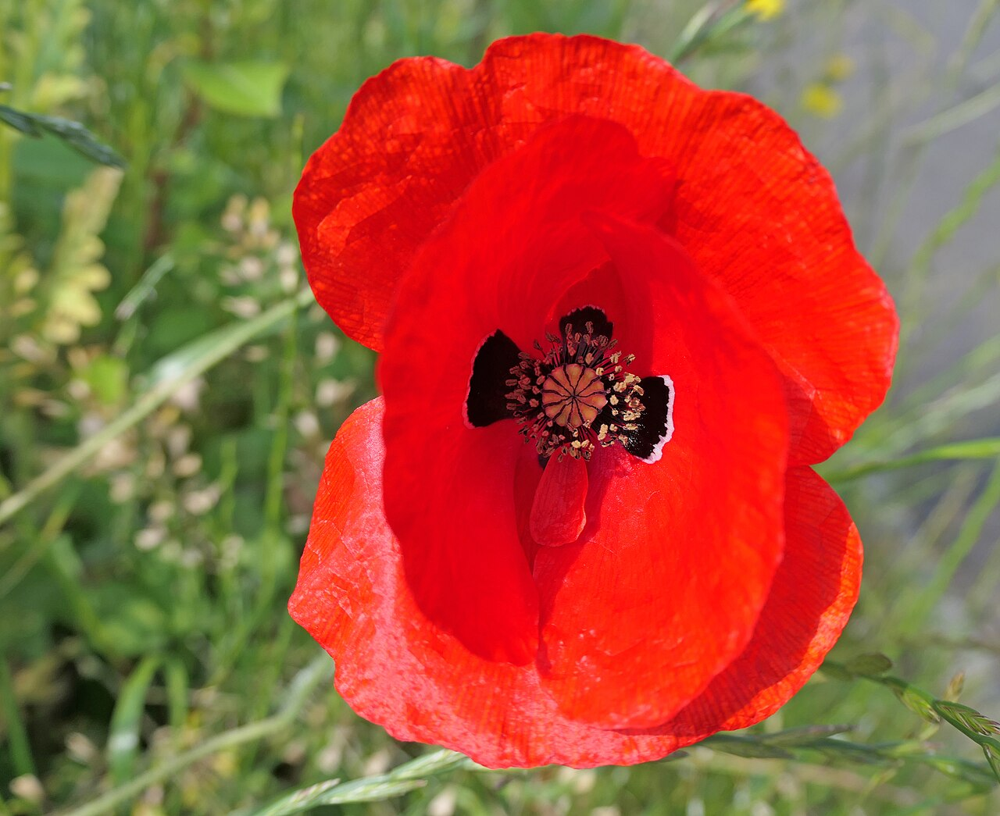
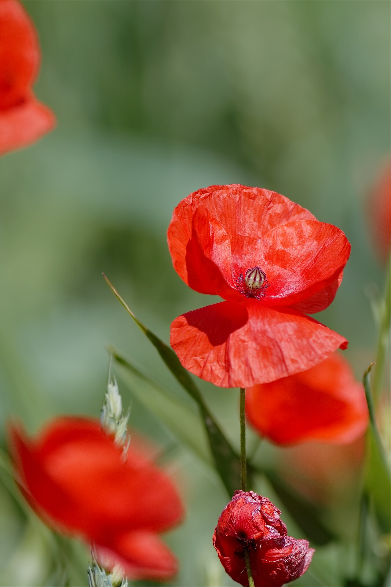

# Poppy

> Crepe-paper petals that carry humanity's heaviest meanings — remembrance of the
> war dead, eternal sleep, and consolation.

## Botanical identity
- **Common name(s):** Poppy; corn/field/Flanders poppy; Iceland poppy; Oriental
  poppy
- **Scientific name:** *Papaver* spp. (*P. rhoeas* field poppy; *P. nudicaule*
  Iceland; *P. orientale* Oriental; *P. somniferum* opium)
- **Family:** Papaveraceae
- **Type:** Form flower

## Native region & origin
- **Native to:** **Europe, North Africa, and temperate Asia** (species vary; the
  field poppy is Eurasian, Iceland poppy subarctic).
- **Now cultivated in:** Worldwide as garden and cut flowers.
- **Domestication / spread notes:** The field poppy famously colonizes disturbed
  ground — which is why it bloomed across the churned battlefields of WWI.

## Visual identification (for reading a photo)
- **Bloom form:** A shallow **bowl of crepe-paper petals**, often with a dark
  basal blotch and a prominent central knob.
- **Size:** Medium to large; delicate.
- **Petals:** Thin, silky, **crinkled like tissue paper**, few in number.
- **Center:** A distinctive ring of stamens around a **flat-topped seed capsule**.
- **Color range:** Red (classic), orange, pink, white, yellow, and dark maroon.
- **Foliage/stem cues:** **Hairy stems and nodding fuzzy buds**; the buds hang
  down then lift as they open.
- **Look-alikes:** Anemone (dark eye, flatter) and Icelandic vs. field types; the
  poppy's crepe petals, hairy stems, and seed capsule are the tells.

## History & cultural background
Bound to sleep and death since antiquity (the source of opium and its dreams),
the poppy became the twentieth century's great emblem of **remembrance** after
the poem "In Flanders Fields."

## Symbolism & meaning
- **General meaning:** **Remembrance of the fallen**, eternal sleep, peace,
  consolation, and — via opium — dreams and oblivion; also resurrection and
  extravagance.
- **By color:**
  - **Red** — Remembrance, sacrifice; also love/pleasure.
  - **White** — Consolation, sleep, peace.
  - **Yellow/Orange** — Wealth, success.

## Cultural meanings across the world
- **UK / Commonwealth / US (remembrance):** The **red Flanders poppy** is worn on
  **Remembrance / Armistice Day, ANZAC Day, and around Memorial Day** to honor
  **fallen soldiers** — sparked by John McCrae's 1915 poem **"In Flanders Fields."**
- **Greco-Roman / mythological:** Sacred to **Demeter/Ceres** (grain and the
  earth) and to **Hypnos/Morpheus** (sleep and dreams) — the root of its
  sleep/death symbolism; tied to Persephone and the underworld.
- **Persia / Middle East:** The red poppy (*shaghayegh*) signifies **love and
  martyrdom** — the blood of the beloved/martyr in Persian poetry.
- **China:** The **opium poppy** carries a fraught history through the **Opium
  Wars** — a symbol of both narcotic allure and national trauma.

## Typical pairings
- **Arranged with:** Ranunculus, anemones, and tulips in delicate spring
  bouquets; often a fleeting garden accent.
- **Greenery/fillers:** Airy greens; its own buds and pods.
- **Anchors:** Ephemeral, artful arrangements; remembrance displays.

## Occasions & events
- **Strongly associated with:** Remembrance and memorial days, sympathy, and
  delicate spring bouquets.
- **Avoid for:** Note the strong funerary/remembrance weight; cheerful gifting
  can misfire if the remembrance meaning dominates locally.

## Seasonality & availability
- **Natural season:** Spring to early summer.
- **Commercial availability:** Limited as a cut flower (delicate); best seasonal.
- **Vase life / care notes:** Short-lived; **sear cut stem ends** (they bleed a
  milky sap) to extend vase life; buy in cracking bud.

## Quick facts
- **Birth month:** August (with gladiolus, in some lists)
- **Wedding anniversary:** — (no standard year)
- **Notable toxicity/allergy:** **Toxic** — especially the opium poppy (alkaloids)
  and milky sap; seeds are culinary but the plant is not for eating.

## Reference images
<!-- IMAGES-START -->
Reference photos, all under reusable licenses (CC-BY / CC-BY-SA / CC0 / public domain) from Wikimedia Commons. Full attribution in [`image-manifest.json`](../images/image-manifest.json).

*Poppy closeup of a single blossom outside — MatthiasKabel · CC BY-SA 3.0*

*Poppy closeup of a single blossom 3 — MatthiasKabel · CC BY-SA 3.0*

*Poppy closeup2 — Amanda Slater · CC BY-SA 2.0*

*Poppy closeup of a single blossom — MatthiasKabel · CC BY-SA 3.0*
<!-- IMAGES-END -->

---
*Confidence / to-verify:* High on the Flanders remembrance history and "In
Flanders Fields," the sleep/death mythology, and the crepe-petal ID.
