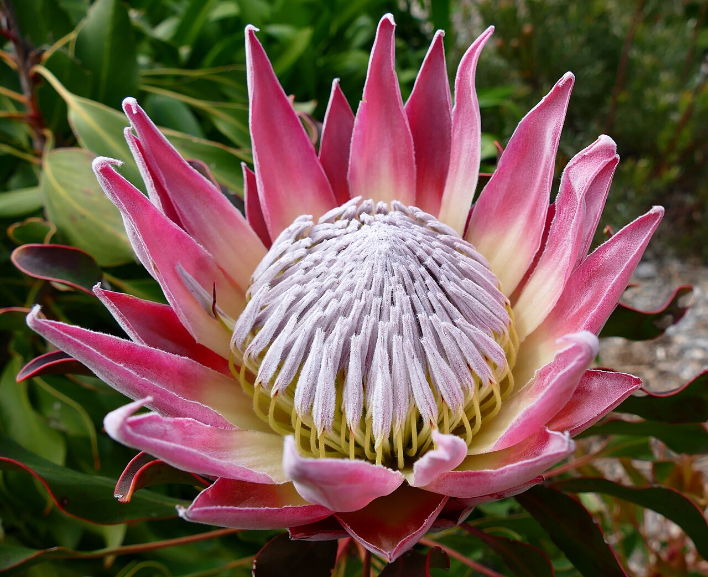
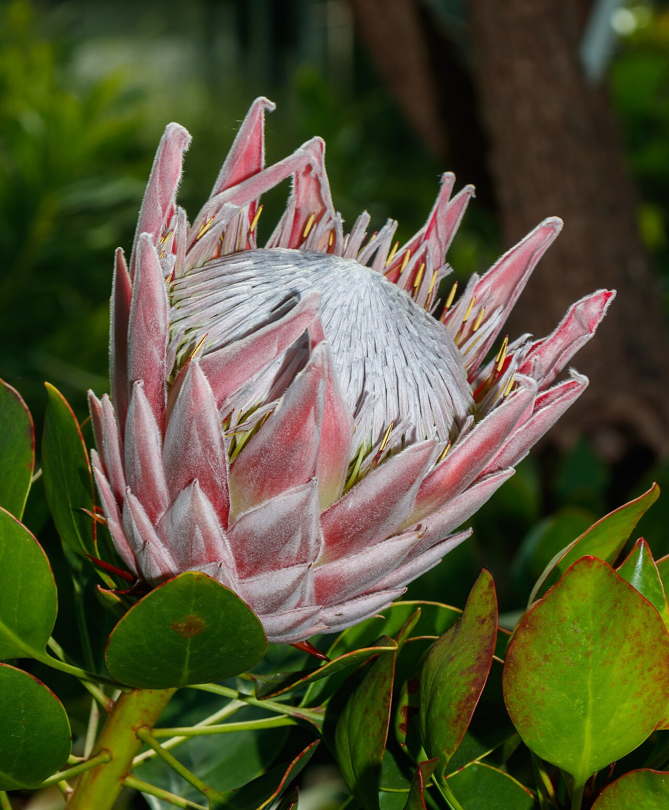
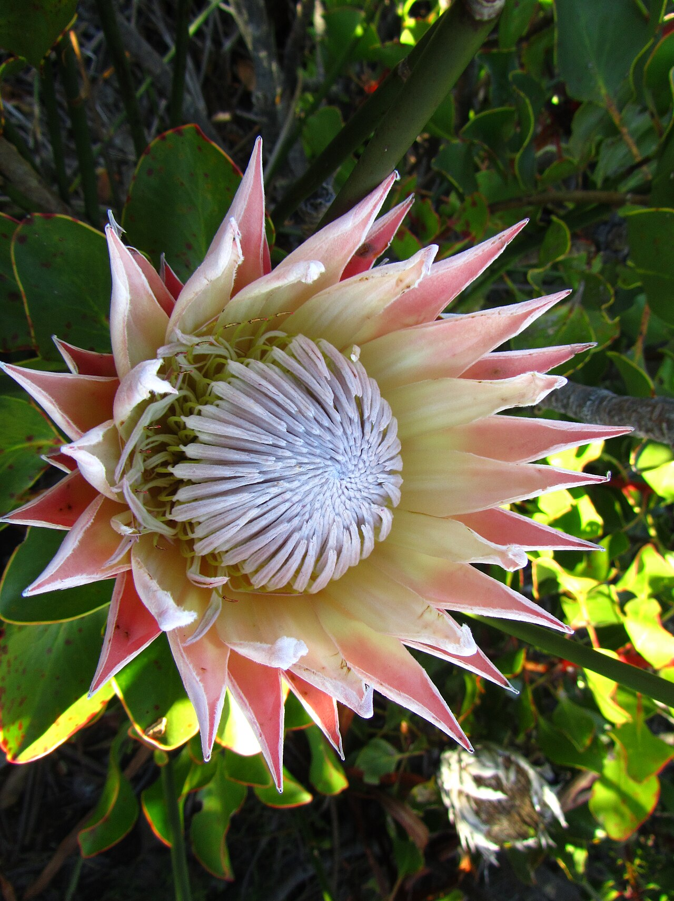
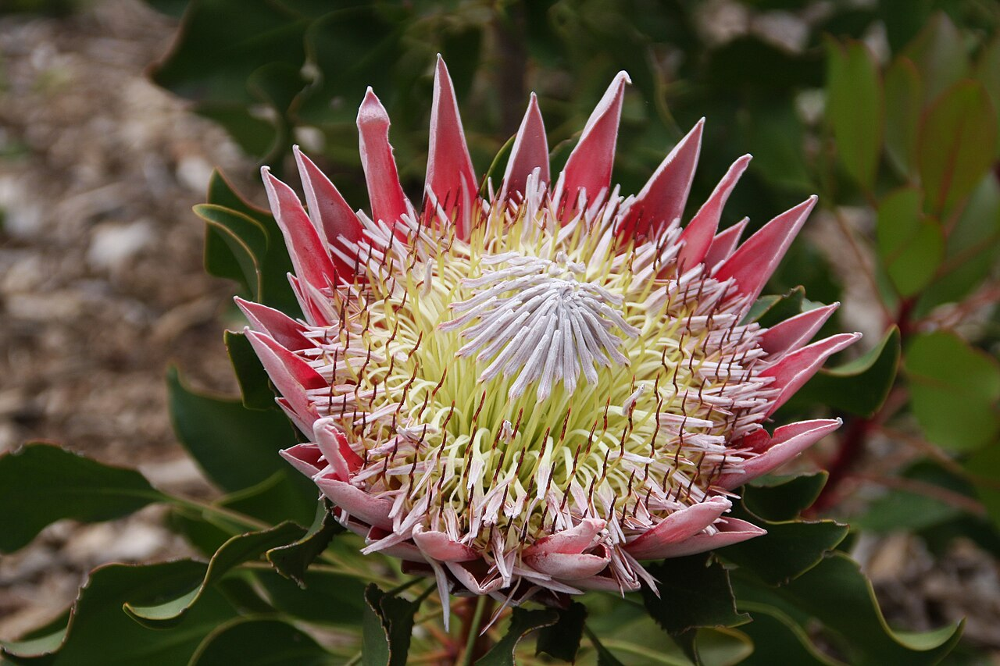

# Protea

> The dramatic, architectural bloom named for a shape-shifting god — South
> Africa's national flower, and an emblem of courage, transformation, and
> resilience.

## Botanical identity
- **Common name(s):** Protea; **king protea** (the largest); sugarbush
- **Scientific name:** *Protea cynaroides* (king protea) and other *Protea* spp.
- **Family:** Proteaceae
- **Type:** Form flower (large, spiky, architectural)

## Native region & origin
- **Native to:** **South Africa** — especially the **fynbos** of the Cape Floristic
  Region — with the wider family across the Southern Hemisphere (relatives such
  as banksia and leucadendron reach Australia).
- **Now cultivated in:** South Africa, Australia, and worldwide for the exotic
  cut-flower trade.
- **Domestication / spread notes:** Named by **Linnaeus** after **Proteus**, the
  Greek god who could **change shape** — a nod to the genus's astonishing variety
  of forms.

## Visual identification (for reading a photo)
- **Bloom form:** A large, **cup or crown of stiff, pointed bracts** surrounding a
  dense central boss of fuzzy florets — like an artichoke crossed with a crown.
- **Size:** Large and bold (the king protea head can span 20–30 cm).
- **Petals:** Not true petals — colorful **bracts** ring the flowerhead.
- **Center:** A packed, often furry central cone of tiny true flowers.
- **Color range:** Pink, red, cream, white, and green, often with darker bract tips.
- **Foliage/stem cues:** Tough, leathery, evergreen leaves; woody stems.
- **Look-alikes:** Banksia and leucadendron (relatives); the protea's broad
  bract-crown around a fuzzy center is distinctive.

## History & cultural background
A survivor of the fire-adapted Cape fynbos — many proteas **resprout after
wildfire** — the protea stands for endurance and rebirth. Its endless diversity
of forms earned it the name of a shape-shifting god.

## Symbolism & meaning
- **General meaning:** **Courage, transformation, diversity, resilience, and
  daring change**; also, via its fire survival, **rebirth and enduring strength.**
- **By color:** Colors follow their general meanings (see color-symbolism.md);
  the flower's form and symbolism outweigh color coding.

## Cultural meanings across the world
- **South Africa (national flower):** The **king protea** is South Africa's
  national flower and a symbol of national pride — it names the national cricket
  team (**the Proteas**) and appears on coins and emblems, standing for **beauty,
  diversity, and resilience.**
- **Greco-Roman / mythological:** Named for **Proteus**, the shape-shifting,
  prophetic sea god — hence **transformation and adaptability.**
- **Southern Hemisphere (broad):** With its fire-survival, it reads across the
  region as **resilience and rebirth**.
- **Modern floristry:** A statement of **boldness and standing out** — a favorite
  focal for exotic, tropical, and contemporary designs.

## Typical pairings
- **Arranged with:** Banksia, leucadendron, kangaroo paw, eucalyptus, and other
  textural/native foliage; often a solo focal.
- **Greenery/fillers:** Eucalyptus, leucadendron, tough native greens.
- **Anchors:** Exotic, architectural, and rustic-modern arrangements; a dramatic
  focal point.

## Occasions & events
- **Strongly associated with:** Bold statement bouquets, congratulations,
  courage/encouragement gifts, and modern or tropical weddings.
- **Avoid for:** Soft, traditional pastel arrangements where its scale dominates.

## Seasonality & availability
- **Natural season:** Winter to spring in the Southern Hemisphere.
- **Commercial availability:** Much of the year via SH imports.
- **Vase life / care notes:** Excellent — often **2–3 weeks**, and **dries
  beautifully** for lasting arrangements.

## Quick facts
- **Birth month:** — (not a traditional birth flower)
- **Wedding anniversary:** — (no standard year)
- **Notable toxicity/allergy:** Generally **non-toxic**; primarily an ornamental
  cut flower.

## Reference images
<!-- IMAGES-START -->
Reference photos, all under reusable licenses (CC-BY / CC-BY-SA / CC0 / public domain) from Wikimedia Commons. Full attribution in [`image-manifest.json`](../images/image-manifest.json).

*King Protea (Protea cynaroides) flower — Bernard DUPONT from FRANCE · CC BY-SA 2.0*

*Protea cynaroides - Wilhelma — H. Zell · CC BY-SA 3.0*

*King Protea flower at the beginning of flowering — Amitai.irron · CC BY-SA 3.0*

*Bioscape flower lrg Protea cynaroides — NASA Earth Observatory. Photo from PxHere, where cc-0 licens · CC0*
<!-- IMAGES-END -->

---
*Confidence / to-verify:* High on South African fynbos origin, national-flower/
Proteas status, the Proteus naming, and fire-survival resilience symbolism.
