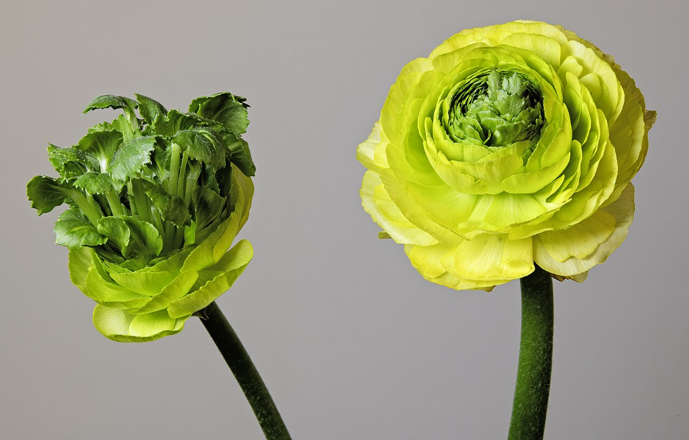
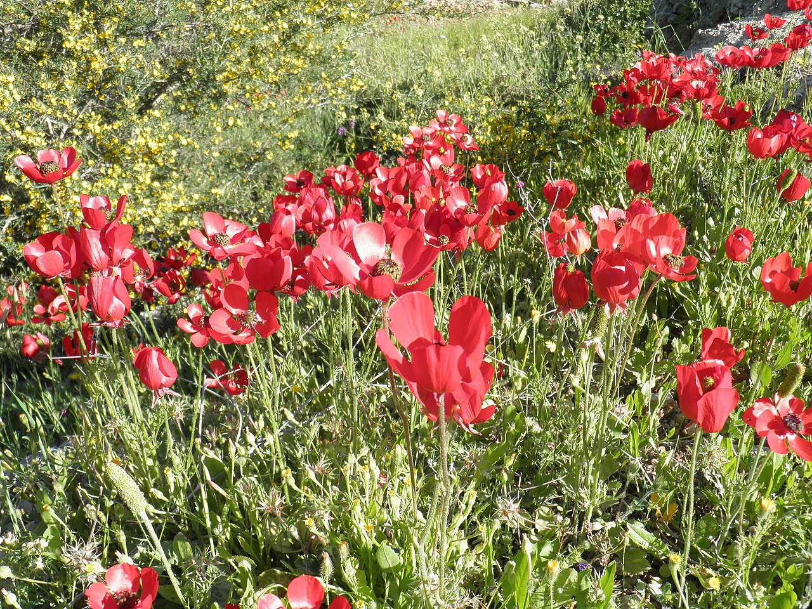
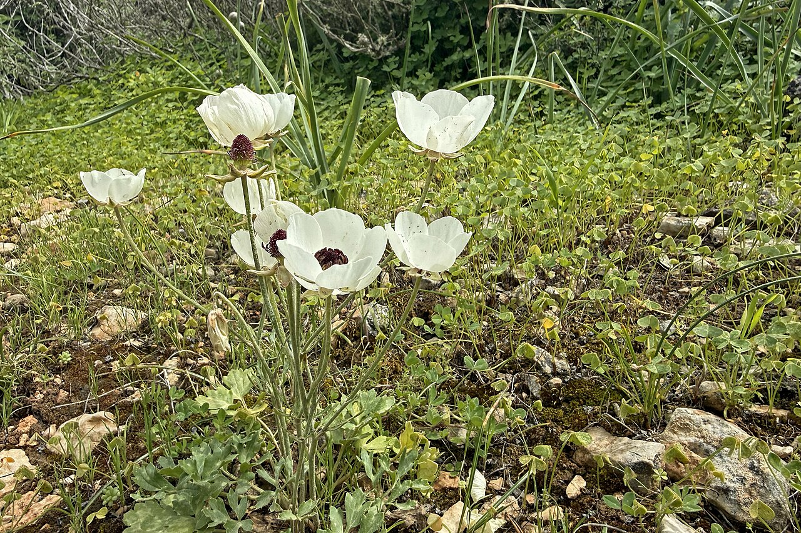
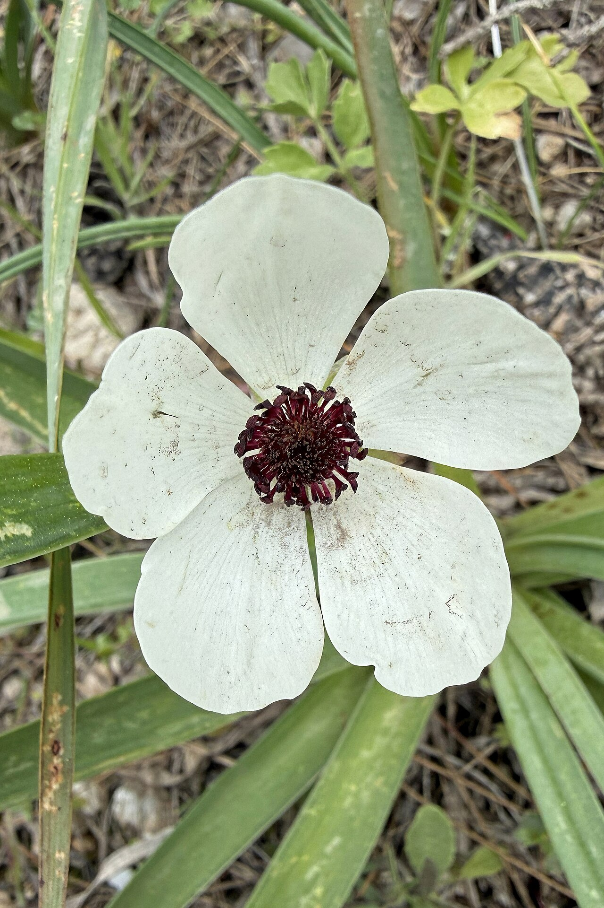

# Ranunculus

> Rose-like layers of tissue-thin petals — the "you are radiant with charm"
> flower, and a beloved, budget-friendly wedding stand-in for roses and peonies.

## Botanical identity
- **Common name(s):** Ranunculus; Persian buttercup
- **Scientific name:** *Ranunculus asiaticus* (florist type; the genus is the
  buttercups)
- **Family:** Ranunculaceae
- **Type:** Mass / focal flower

## Native region & origin
- **Native to:** The **Eastern Mediterranean, southwestern Asia, southeastern
  Europe, and northeastern Africa.**
- **Now cultivated in:** Italy, the Netherlands, Japan, the US (notably
  California), and Israel.
- **Domestication / spread notes:** The genus name is Latin for **"little frog"**
  (*rana*), since many wild species grow in damp places. *R. asiaticus* was
  brought into European cultivation via the Ottoman world.

## Visual identification (for reading a photo)
- **Bloom form:** A rounded cup of **many thin, tightly stacked concentric
  petals** — like a paper rose or a small peony.
- **Size:** Small to medium.
- **Petals:** Numerous, delicate, almost translucent ("tissue paper"), in neat
  layers.
- **Center:** Often a **small green or dark button eye** at the very center.
- **Color range:** White, cream, peach, pink, orange, red, purple, and picotee
  edges.
- **Foliage/stem cues:** Finely divided, celery-like leaves; hollow, slightly
  curving stems.
- **Look-alikes:** Roses (spiraled bud vs. ranunculus's flat concentric layers),
  peonies (much bigger), and camellias. The **dark button eye and paper-thin
  layered petals** confirm ranunculus.

## History & cultural background
Introduced to European gardens through Ottoman Turkey and long admired for its
rose-like form at a fraction of the cost. A modern florist and wedding favorite
that mimics roses and peonies while adding an airy delicacy.

## Symbolism & meaning
- **General meaning:** **Radiant charm and attractiveness** — the classic
  Victorian message "I am dazzled by your charms" / "you are radiant." Also
  admiration and playful affection.
- **By color:** Colors inherit their general meanings (see color-symbolism.md) —
  pink/peach/white dominate weddings (grace, sweetness), red signals love, and
  bright orange/yellow read as cheer and energy.

## Cultural meanings across the world
- **Persia / Middle East:** A Persian legend tells of a **prince, always dressed
  in green and gold**, who loved a nymph and, too shy to speak, serenaded her
  until he died and was transformed into a ranunculus — the root of its
  **charm-and-love** symbolism.
- **Europe (Victorian West):** Firmly the flower of **charm and radiant
  attractiveness**; to send one was to say the recipient was dazzlingly charming.
- **Japan:** A popular spring cut flower (*ranankyurasu*); readings center on
  charm and a bright, cheerful attractiveness.
- **General:** Being largely a modern ornamental, it carries little funerary or
  negative baggage — a safe, pretty, celebratory choice.

## Typical pairings
- **Arranged with:** Roses, peonies, anemones, sweet peas, and tulips — a
  spring-wedding staple mix.
- **Greenery/fillers:** Eucalyptus, ranunculus foliage, delicate greens.
- **Anchors:** Soft, romantic, airy spring bouquets; a rose/peony substitute.

## Occasions & events
- **Strongly associated with:** Weddings, spring celebrations, romantic and
  "you're charming" gifting, and Valentine's/Mother's Day alternatives to roses.
- **Avoid for:** No strong taboos; very seasonal.

## Seasonality & availability
- **Natural season:** **Spring** (late winter through spring).
- **Commercial availability:** Best winter–spring; limited outside that window.
- **Vase life / care notes:** Excellent for such a delicate flower — often
  **7–10+ days**; buds continue opening in the vase.

## Quick facts
- **Birth month:** — (a spring flower)
- **Wedding anniversary:** — (no standard year)
- **Notable toxicity/allergy:** **Toxic if ingested** (like most Ranunculaceae —
  protoanemonin); sap can irritate skin.

## Reference images
<!-- IMAGES-START -->
Reference photos, all under reusable licenses (CC-BY / CC-BY-SA / CC0 / public domain) from Wikimedia Commons. Full attribution in [`image-manifest.json`](../images/image-manifest.json).

*(MHNT) Ranunculus asiaticus - example of Totipotency — Didier Descouens and Boris Presseq · CC BY-SA 4.0*

*Ranunculus asiaticus 1 — Ariel Palmon · CC BY-SA 3.0*

*Persian buttercup - Ranunculus asiaticus var. albus 02 — Bouke ten Cate · CC BY 4.0*

*Persian buttercup - Ranunculus asiaticus var. albus — Bouke ten Cate · CC BY 4.0*
<!-- IMAGES-END -->

---
*Confidence / to-verify:* High on identity, native range, and the "radiant charm"
meaning. The Persian prince legend is traditional.
