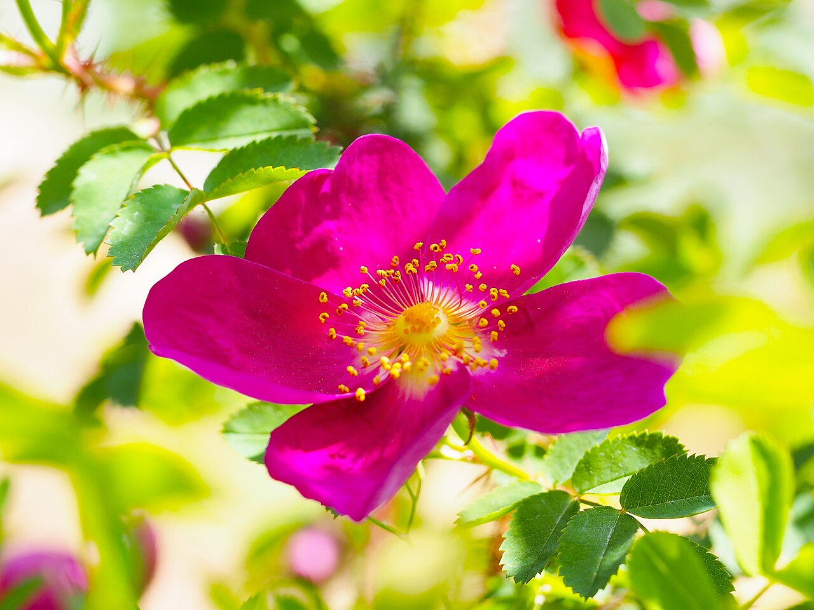
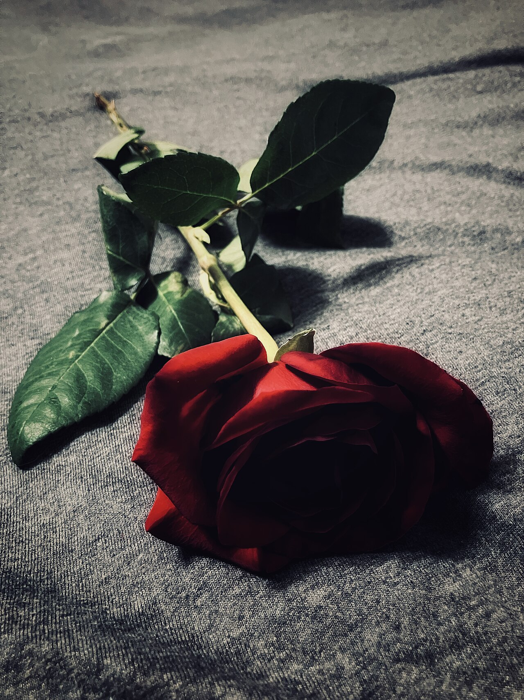
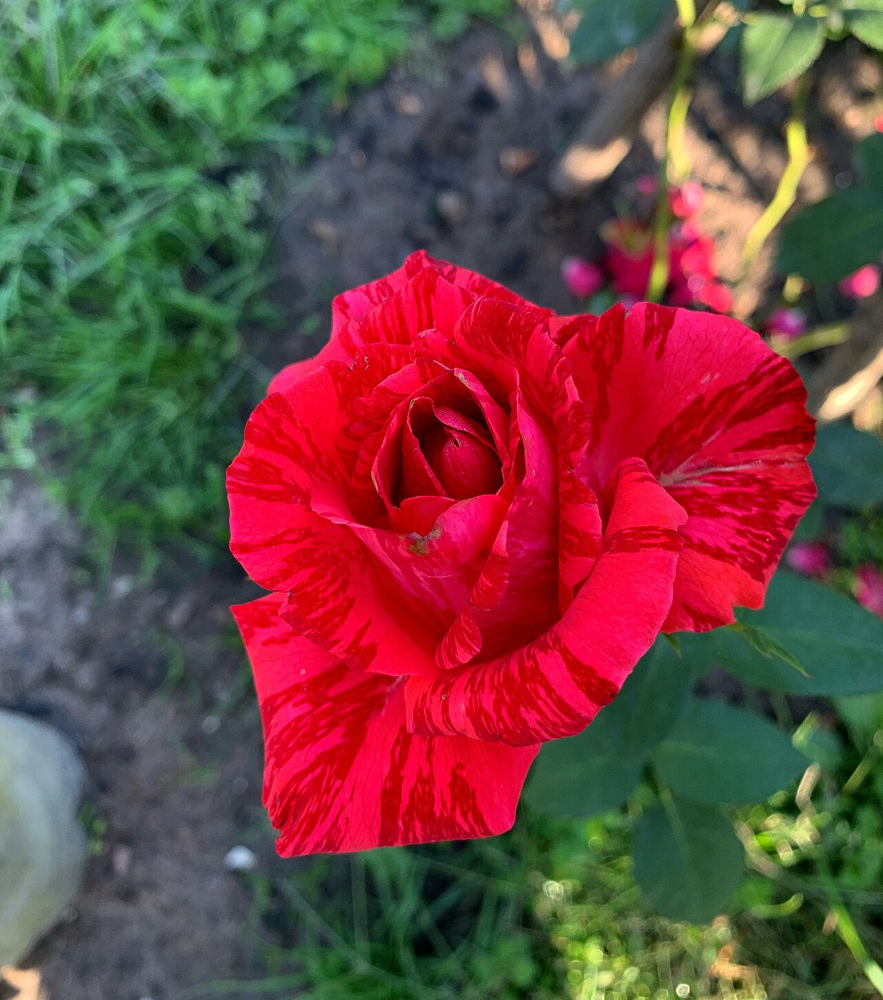
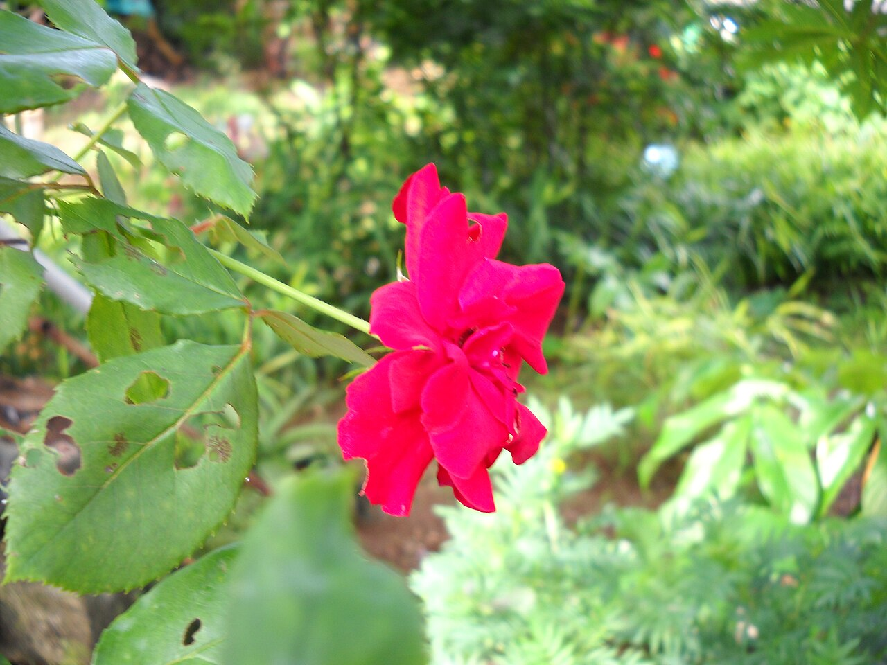

# Rose

> The florist's icon of love. The single most recognizable — and most
> color-coded — flower in the trade.

## Botanical identity
- **Common name(s):** Rose (garden rose, spray rose, hybrid tea)
- **Scientific name:** *Rosa* spp. (genus of ~150–300 species; thousands of cultivars)
- **Family:** Rosaceae
- **Type:** Mass / focal flower

## Native region & origin
- **Native to:** Predominantly the temperate Northern Hemisphere. The center of
  species diversity is **Asia**; roses are also native to Europe, North America,
  and northwest Africa.
- **Now cultivated in:** Worldwide; major cut-rose exporters include Ecuador,
  Colombia, Kenya, and the Netherlands (trade).
- **Domestication / spread notes:** Cultivated for thousands of years. "Old
  garden roses" trace to China and the Middle East; the modern **hybrid tea**
  line began with 'La France' (1867), the reference point dividing old and
  modern roses.

## Visual identification (for reading a photo)
- **Bloom form:** Cupped, with a **tight, spiraled center** unfurling outward.
- **Size:** Medium to large; spray roses are small and clustered.
- **Petals:** Many, smooth, broad, often with a gently rolled edge.
- **Center:** Tightly coiled (classic hybrid tea) to open with visible stamens
  (garden/"cabbage" roses).
- **Color range:** Nearly every color except true blue and true black (both are
  dyed or bred approximations).
- **Foliage/stem cues:** Compound leaves of toothed leaflets; thorny stems.
- **Look-alikes:** Ranunculus (thinner, more numerous concentric petals, small
  dark eye), peony (larger, looser, fluffier), garden ranunculus/lisianthus.
  The rose's spiraled bud center is the giveaway.

## History & cultural background
Sacred to Aphrodite/Venus and a Roman symbol of luxury and secrecy (*sub rosa*,
"under the rose," = spoken in confidence). Emblem of England's **Wars of the
Roses** (red Lancaster vs. white York, resolved in the Tudor rose). Central to
Persian gardens and poetry. The rose is arguably the most written-about flower
in human history and the default symbol of love in Western culture.

## Symbolism & meaning
- **General meaning:** Love, in all its forms; also beauty, honor, and secrecy.
- **By color:**
  - **Red** — Love, romance, desire; "I love you."
  - **White** — Purity, innocence, new beginnings, reverence; weddings, and
    also remembrance/sympathy.
  - **Pink** — Grace, admiration, gratitude, joy. Light pink = admiration/
    gentleness; deep pink = gratitude and appreciation.
  - **Yellow** — Friendship, joy, warmth. (Victorian double meaning: jealousy
    or infidelity.)
  - **Orange** — Enthusiasm, fascination, desire; energy.
  - **Lavender/Purple** — Enchantment, love at first sight, mystery.
  - **Peach** — Sincerity, gratitude, modesty.
  - **Coral** — Desire, enthusiasm.
  - **Green** — Harmony, renewal, fertility.
  - **Burgundy/Deep red** — Unconscious beauty, deep and committed passion.
- **Number/presentation notes:** A single rose = love at first sight / "you are
  the one"; a dozen = complete, full love; the count is itself a message.

## Typical pairings
- **Arranged with:** Baby's breath (the classic romantic pairing), lilies,
  peonies, ranunculus, hydrangea, lisianthus, carnations (as budget filler).
- **Greenery/fillers:** Eucalyptus, ruscus, fern; baby's breath.
- **Anchors:** Nearly any palette — the universal focal flower.

## Occasions & events
- **Strongly associated with:** Valentine's Day (red), anniversaries, weddings
  (white/blush), romance generally; white roses also for sympathy.
- **Avoid for:** Few restrictions; yellow can misread as jealousy to someone
  versed in Victorian meanings.

## Seasonality & availability
- **Natural season:** Peak late spring–summer.
- **Commercial availability:** Year-round globally.
- **Vase life / care notes:** ~5–7+ days; recut stems underwater, strip
  submerged leaves.

## Quick facts
- **Birth month:** June
- **Wedding anniversary:** 15th (rose); yellow rose ~50th
- **Notable toxicity/allergy:** Non-toxic; thorns are the main hazard.

## Reference images
<!-- IMAGES-START -->
Reference photos, all under reusable licenses (CC-BY / CC-BY-SA / CC0 / public domain) from Wikimedia Commons. Full attribution in [`image-manifest.json`](../images/image-manifest.json).

*Rose, Red Nelly, バラ, レッド ネリー — T.Kiya from Japan · CC BY-SA 2.0*

*Single rose on fabric (2024) Photograph by Shawn D Crabtree — ShawnDCrabtree-art · CC BY-SA 4.0*

*Троянди сорту Red Intuition 02 — Сарапулов · CC BY 4.0*

*Red rose single flower — carrotmadman6 from Mauritius · CC BY 2.0*
<!-- IMAGES-END -->

---
*Confidence / to-verify:* High confidence on identity, native range, and
color symbolism. Cut-flower export figures are approximate/current-trade.
