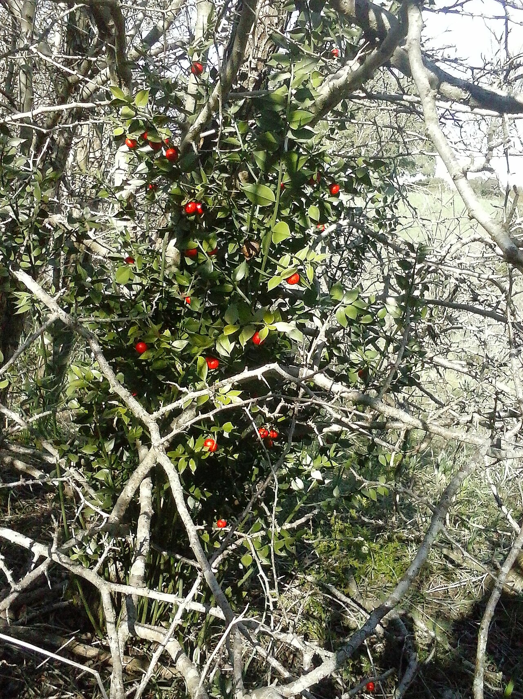
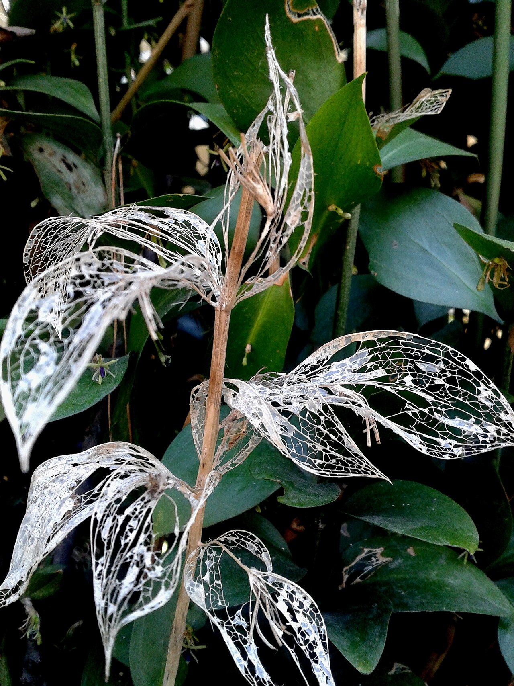
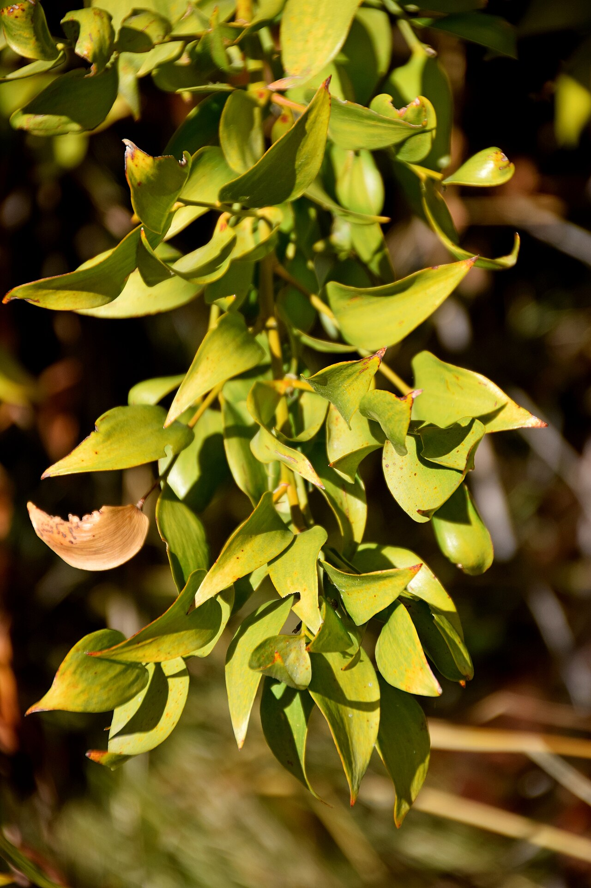
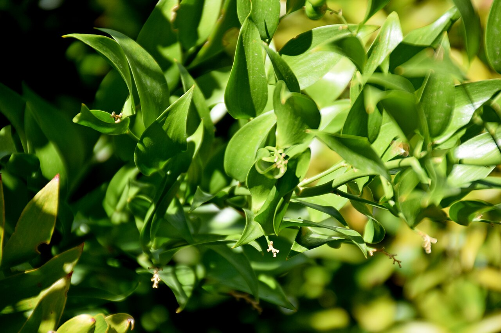

# Ruscus (Foliage)

> The glossy, hardy green that frames countless bouquets — a Mediterranean foliage
> whose "leaves" are really flattened stems, and one of the longest-lasting greens
> in the trade.

## Botanical identity
- **Common name(s):** Ruscus; Italian ruscus (soft, trailing); butcher's broom
  (*R. aculeatus*); Alexandrian laurel / poet's laurel (*Danae racemosa*, "soft
  ruscus")
- **Scientific name:** *Ruscus aculeatus* / *R. hypophyllum*; *Danae racemosa*
- **Family:** Asparagaceae
- **Type:** Foliage / greenery

## Native region & origin
- **Native to:** The **Mediterranean, Europe, and western Asia.**
- **Now cultivated in:** Italy, Israel, and worldwide for florist foliage.
- **Domestication / spread notes:** *R. aculeatus* is "**butcher's broom**" — its
  stiff, spiny sprigs were once bundled to **scour butcher blocks**, and used in
  folk medicine for circulation. "Italian ruscus" (soft, trailing sprays) is the
  premium florist green.

## Visual identification (for reading a photo)
- **Bloom form:** Not a flower — **foliage**. Sprays of glossy, pointed
  "leaves."
- **Size:** From short stiff sprigs (butcher's broom) to long trailing sprays
  (Italian ruscus).
- **Petals:** N/A. The glossy pointed "leaves" are actually **flattened stems
  (cladodes)** — tiny flowers/berries appear on their surface.
- **Center:** N/A.
- **Color range:** Deep, glossy green (sometimes with small red berries).
- **Foliage/stem cues:** Wiry stems lined with **stiff, glossy, sharply pointed**
  cladodes; extremely durable.
- **Look-alikes:** Other florist greens (salal, myrtle); ruscus is confirmed by
  its **glossy pointed "leaves" on wiry stems** and stiff texture.

## History & cultural background
A workhorse florist green with a humble past — butcher's broom scoured chopping
blocks and treated ailments — now prized (especially as Italian ruscus) for its
glossy durability in bouquets and installations.

## Symbolism & meaning
- **General meaning (as greenery):** Endurance, protection, and humility — mostly
  a **structural, framing** role rather than a coded message.
- **Historical:** Butcher's broom carried folk associations of **protection** (hung
  to guard stores) and healing (circulation remedies).

## Cultural meanings across the world
- **Mediterranean (origin):** *R. aculeatus* was used to **sweep and protect**
  butcher shops and in traditional herbal medicine.
- **Christmas / Europe:** Berried butcher's broom is a **festive green**, a holly
  substitute for wreaths and winter décor.
- **Modern floristry:** Reads simply as **premium, long-lasting foliage** — the
  reliable frame and filler behind focal flowers.
- **Note:** Chiefly a functional green; its "meaning" is structural and enduring.

## Typical pairings
- **Arranged with:** Roses, lilies, and nearly any focal flower; a near-universal
  backing green.
- **Greenery/fillers:** Combines with eucalyptus, salal, and ferns.
- **Anchors:** The framing and filler green in bouquets, garlands, and
  installations.

## Occasions & events
- **Strongly associated with:** Weddings, everyday bouquets, garlands and
  installations, and Christmas (berried forms).
- **Avoid for:** Little to avoid; a supporting element, not a focal.

## Seasonality & availability
- **Natural season:** Evergreen — harvested year-round.
- **Commercial availability:** **Year-round.**
- **Vase life / care notes:** Exceptional — often **2–3 weeks**; one of the most
  durable florist greens.

## Quick facts
- **Birth month:** — (foliage)
- **Wedding anniversary:** — (foliage)
- **Notable toxicity/allergy:** The **berries are mildly toxic if eaten**; the
  foliage is for arrangements, not consumption.

## Reference images
<!-- IMAGES-START -->
Reference photos, all under reusable licenses (CC-BY / CC-BY-SA / CC0 / public domain) from Wikimedia Commons. Full attribution in [`image-manifest.json`](../images/image-manifest.json).

*Ruscus aculeatus, Ladispoli, Italia — fotokoci · CC0*

*Ruscus hypoglossum skeletonized leaves — Maria G. Tsiouri · CC BY-SA 4.0*

*Danae racemosa in Jardin des Plantes de Toulouse 01 — Krzysztof Golik · CC BY-SA 4.0*

*Danae racemosa in Jardin des Plantes de Toulouse 02 — Krzysztof Golik · CC BY-SA 4.0*
<!-- IMAGES-END -->

---
*Confidence / to-verify:* High on Mediterranean origin, the butcher's-broom
history, the cladode (flattened-stem) structure, and its role as durable foliage.
