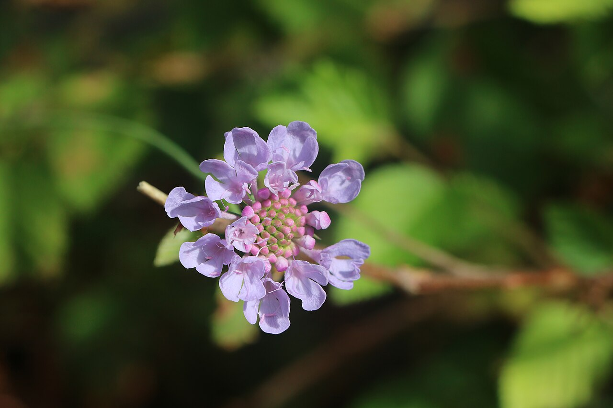
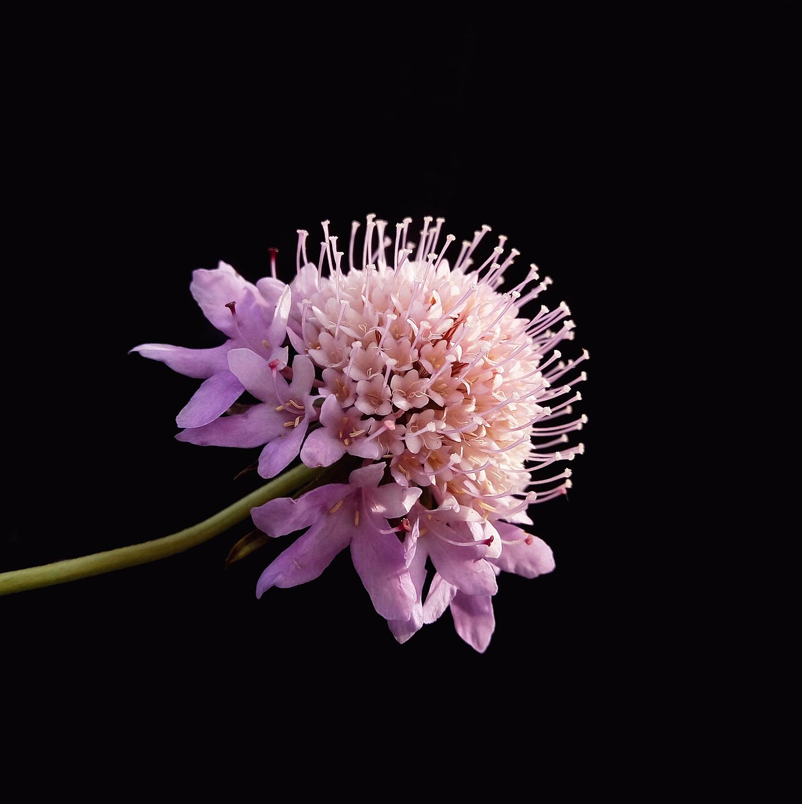
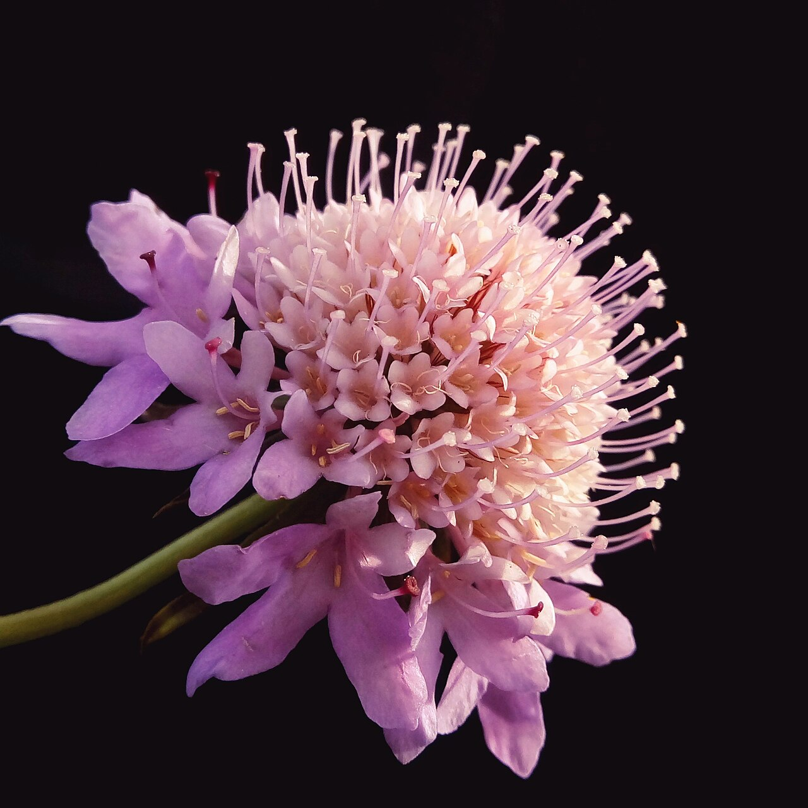
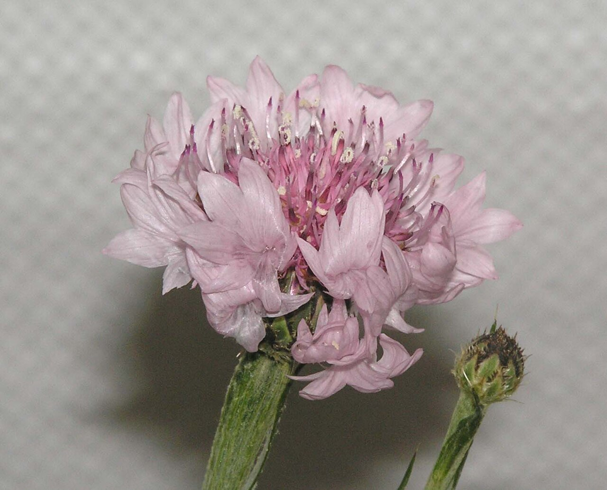

# Scabiosa (Pincushion Flower)

> A frilly domed bloom with pin-like stamens — airy and pretty, yet the dark
> "mourning bride" once meant widowhood and lost love.

## Botanical identity
- **Common name(s):** Scabiosa; pincushion flower; mourning bride; sweet scabious
- **Scientific name:** *Scabiosa atropurpurea* / *S. columbaria* (and *Scabiosa
  stellata* for the papery seed pods)
- **Family:** Caprifoliaceae (formerly Dipsacaceae)
- **Type:** Form flower (also grown for its globe seed pods)

## Native region & origin
- **Native to:** **Europe, the Mediterranean, Africa, and Asia.**
- **Now cultivated in:** Worldwide as a cottage-garden and cut flower.
- **Domestication / spread notes:** The name comes from Latin *scabies* — the
  plant was once used to treat **skin ailments**. Its protruding stamens look
  like **pins in a pincushion**.

## Visual identification (for reading a photo)
- **Bloom form:** A domed or flattened **cushion** of small florets with
  **pin-like stamens sticking out** all over.
- **Size:** Small to medium heads on long, wiry stems.
- **Petals:** Frilly outer ray florets around a dense pincushion center.
- **Center:** Studded with protruding stamens — the "pins."
- **Color range:** Lavender, blue, pink, white, and deep maroon-black
  ("mourning bride").
- **Foliage/stem cues:** Wiry stems; finely divided leaves. The **seed pods**
  (*S. stellata*) form airy **papery honeycomb globes** used in bouquets.
- **Look-alikes:** Astrantia and knautia; the pincushion of protruding stamens is
  the tell.

## History & cultural background
A cottage-garden favorite whose dark maroon form — the "mourning bride" — was worn
by widows and gave the flower a Victorian meaning of grief and unlucky love, even
as its airy texture makes it a modern wedding darling.

## Symbolism & meaning
- **General meaning:** A genuine double — **unfortunate/unlucky love, "I have lost
  all," and mourning** (the dark "mourning bride"), alongside lighter readings of
  **purity, peace, and admiration**.
- **By color:**
  - **Deep maroon/black** — Mourning, lost love ("mourning bride").
  - **Pale blue/lavender** — Peace, admiration.
  - **White** — Purity.

## Cultural meanings across the world
- **Europe (Victorian):** The dark **"mourning bride"** variety was associated
  with **widowhood and unfortunate love** — "I have lost all"; a flower of grief.
- **Herbal history:** Named for treating **scabies and skin conditions**, tying
  it to old folk medicine.
- **Modern floristry:** Reads simply as **airy texture and delicate charm** — a
  wedding and bouquet favorite, its darker Victorian meaning largely forgotten;
  the **seed-pod globes** add whimsical movement.

## Typical pairings
- **Arranged with:** Roses, ranunculus, cosmos, and grasses in airy, garden-style
  bouquets; the pods add texture.
- **Greenery/fillers:** Its own wiry stems and pods; light greens.
- **Anchors:** Loose, romantic, "wildflower" and bridal arrangements.

## Occasions & events
- **Strongly associated with:** Garden-style weddings, airy summer bouquets, and
  (historically) sympathy via the dark form.
- **Avoid for:** Little to avoid in modern use; the mourning meaning is now obscure.

## Seasonality & availability
- **Natural season:** Summer.
- **Commercial availability:** Best in season; pods dry well.
- **Vase life / care notes:** ~5–7 days; long wiry stems benefit from support.

## Quick facts
- **Birth month:** — (a summer flower)
- **Wedding anniversary:** — (no standard year)
- **Notable toxicity/allergy:** Generally **non-toxic**.

## Reference images
<!-- IMAGES-START -->
Reference photos, all under reusable licenses (CC-BY / CC-BY-SA / CC0 / public domain) from Wikimedia Commons. Full attribution in [`image-manifest.json`](../images/image-manifest.json).

*Scabiosa atropurpurea pincushion flower 9854 — ImagePerson · CC BY 4.0*

*Scabiosa atropurpurea maritima "pincushion flowers" — Rouibi Dhia Eddine Nadjm · CC BY-SA 4.0*

*Scabiosa atropurpurea maritima (pincushion flowers) — Rouibi Dhia Eddine Nadjm · CC BY-SA 4.0*

*松蟲草(紫盆花) Scabiosa atropurpurea -香港花展 Hong Kong Flower Show- — 阿橋 HQ · CC BY-SA 2.0*
<!-- IMAGES-END -->

---
*Confidence / to-verify:* High on the pincushion ID, the *scabies* etymology, and
the "mourning bride"/unfortunate-love Victorian meaning.
