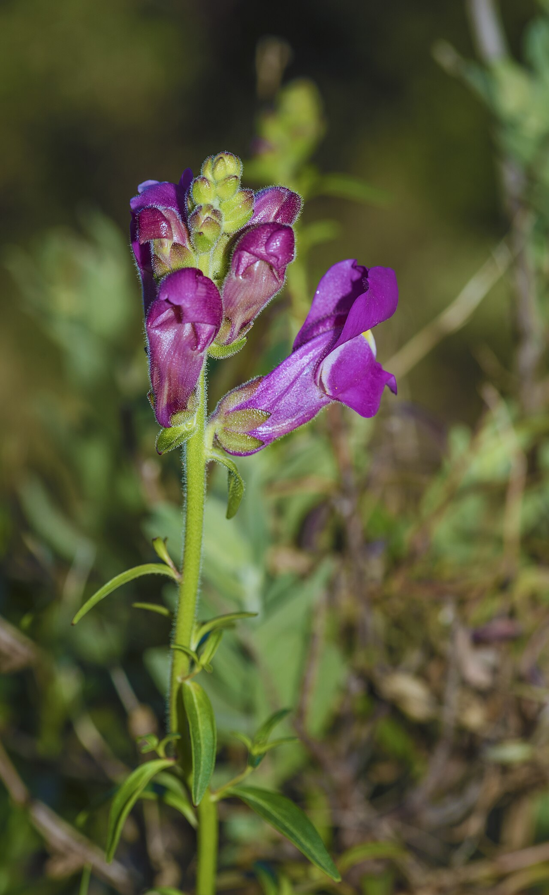
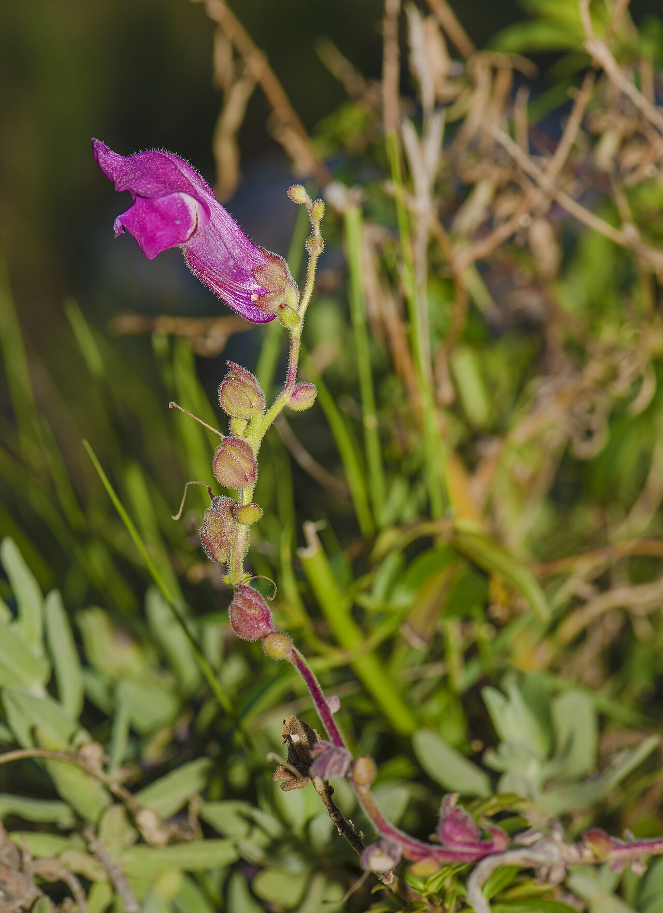
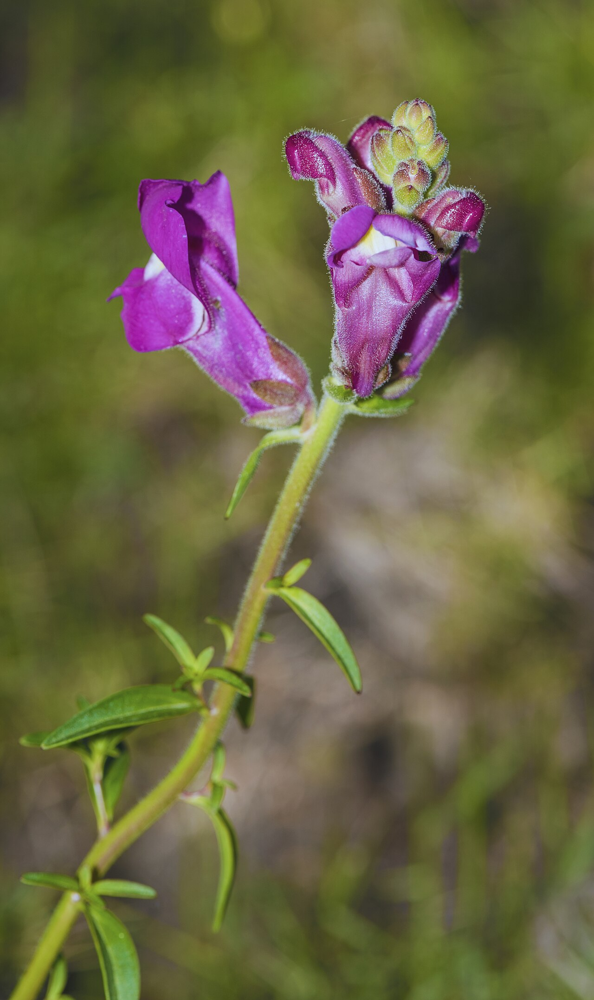
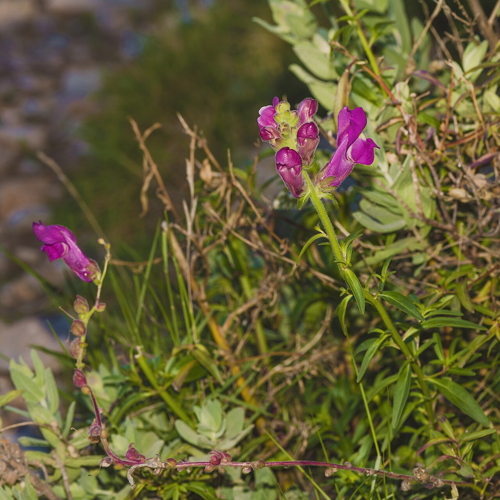

# Snapdragon

> The playful "dragon" spike whose florets snap open like a jaw — a flower of
> grace, strength, and, in old folklore, protection against deception.

## Botanical identity
- **Common name(s):** Snapdragon; dragon flower
- **Scientific name:** *Antirrhinum majus*
- **Family:** Plantaginaceae (formerly Scrophulariaceae)
- **Type:** Line flower (a tall vertical spike)

## Native region & origin
- **Native to:** The **Mediterranean region** — southwestern Europe and North Africa.
- **Now cultivated in:** Worldwide as a garden and cut flower.
- **Domestication / spread notes:** The name *Antirrhinum* is Greek for **"like a
  snout/nose"**; "snapdragon" comes from the way a floret, pinched at the sides,
  **opens and closes like a dragon's mouth**. Its dried seed pods eerily resemble
  tiny **skulls**, a source of old superstition.

## Visual identification (for reading a photo)
- **Bloom form:** A tall **spike** densely lined with **pouched, two-lipped
  florets** that open bottom to top.
- **Size:** Medium to tall stems; florets thumb-sized.
- **Petals:** Fused into a closed "mouth" that snaps open when squeezed.
- **Center:** Hidden inside the closed floret (pollinated by strong bees that
  force it open).
- **Color range:** White, yellow, pink, red, orange, purple, burgundy, and
  bicolors.
- **Foliage/stem cues:** Narrow lance-shaped leaves up a straight stem.
- **Look-alikes:** Stock and delphinium spikes; the snapdragon's **snapping
  pouched florets** and skull-shaped seed pods are unmistakable.

## History & cultural background
A cottage-garden and florist staple valued for its vertical line and cheerful
"dragon" florets. Long tangled in European folklore, where its skull-like pods
gave it associations with both **protection and deception**.

## Symbolism & meaning
- **General meaning:** Graciousness and strength (grace under pressure), but also
  — a genuine floriographic double — **deviousness and deception**.
- **By color:** Colors follow their general meanings (see color-symbolism.md);
  the plant's dual "grace vs. deception" reading is what makes it distinctive.

## Cultural meanings across the world
- **Europe (folklore):** Believed to hold **protective power against deceit,
  falsehood, and curses** — hidden a snapdragon and you concealed deception;
  grown by the door, it **warded off evil and witchcraft**. Women were said to
  wear them to appear gracious and fascinating.
- **Greco-Roman:** The snout/nose etymology; associated with hidden strength.
- **Western / Victorian:** Chiefly **strength and graciousness**, with the
  lingering shadow-meaning of **presumption or deception** — so context and
  companion flowers matter.
- **Note:** The skull-shaped seed pods feed a modern Halloween/gothic novelty
  association.

## Typical pairings
- **Arranged with:** Roses, stock, larkspur, and dahlias; provides height and a
  strong vertical line.
- **Greenery/fillers:** Its own foliage, light greens.
- **Anchors:** Tall garden-style and structured arrangements; a classic "line"
  flower alongside mass focal blooms.

## Occasions & events
- **Strongly associated with:** Garden bouquets, congratulations, strength/
  encouragement gifts, and (via the skull pods) gothic or Halloween designs.
- **Avoid for:** No strong taboos; the "deception" meaning is folkloric, not a
  common gifting concern.

## Seasonality & availability
- **Natural season:** Spring and autumn (a cool-season bloomer).
- **Commercial availability:** Much of the year.
- **Vase life / care notes:** ~5–8 days; **keep upright** — the tips bend toward
  light and continue growing; buds open up the spike.

## Quick facts
- **Birth month:** — (not a traditional birth flower)
- **Wedding anniversary:** — (no standard year)
- **Notable toxicity/allergy:** **Non-toxic**; the flowers are technically edible
  (bitter) and pet-safe.

## Reference images
<!-- IMAGES-START -->
Reference photos, all under reusable licenses (CC-BY / CC-BY-SA / CC0 / public domain) from Wikimedia Commons. Full attribution in [`image-manifest.json`](../images/image-manifest.json).

*Antirrhinum majus, Sète 02 — Christian Ferrer · CC BY-SA 4.0*

*Antirrhinum majus, Sète 04 — Christian Ferrer · CC BY-SA 4.0*

*Antirrhinum majus, Sète 01 — Christian Ferrer · CC BY-SA 4.0*

*Antirrhinum majus, Sète 03 — Christian Ferrer · CC BY-SA 4.0*
<!-- IMAGES-END -->

---
*Confidence / to-verify:* High on Mediterranean origin, the snapping-floret and
skull-pod facts, and the grace/deception + protective-folklore symbolism.
