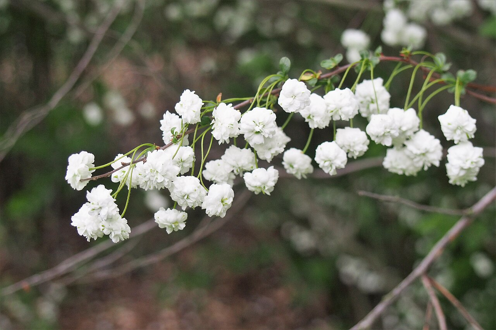
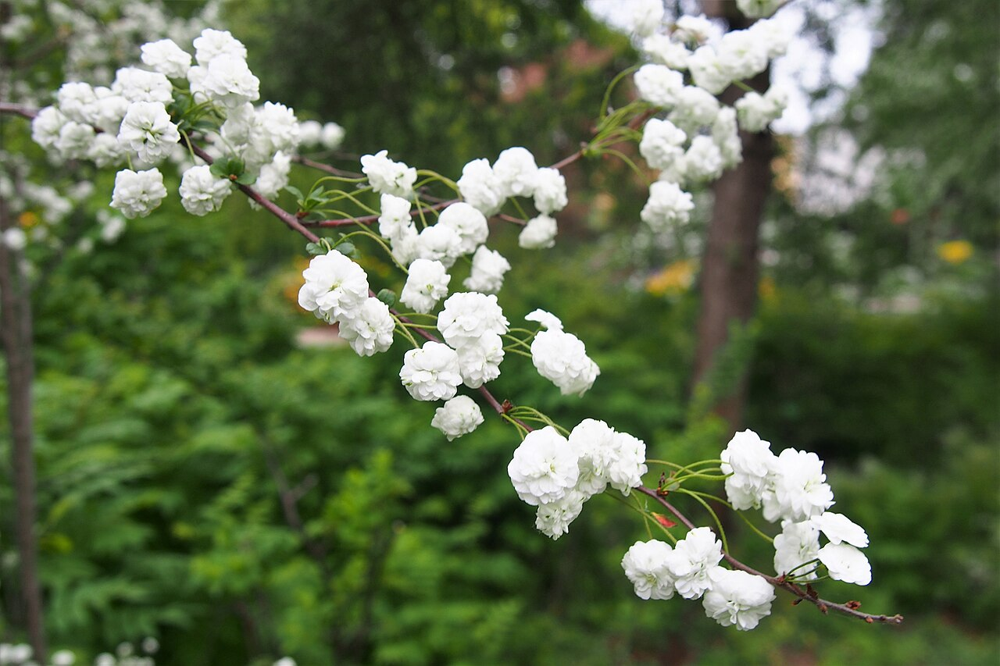
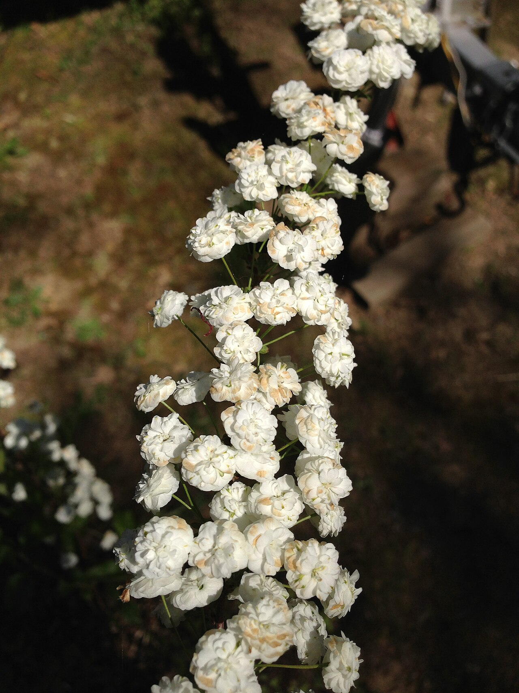
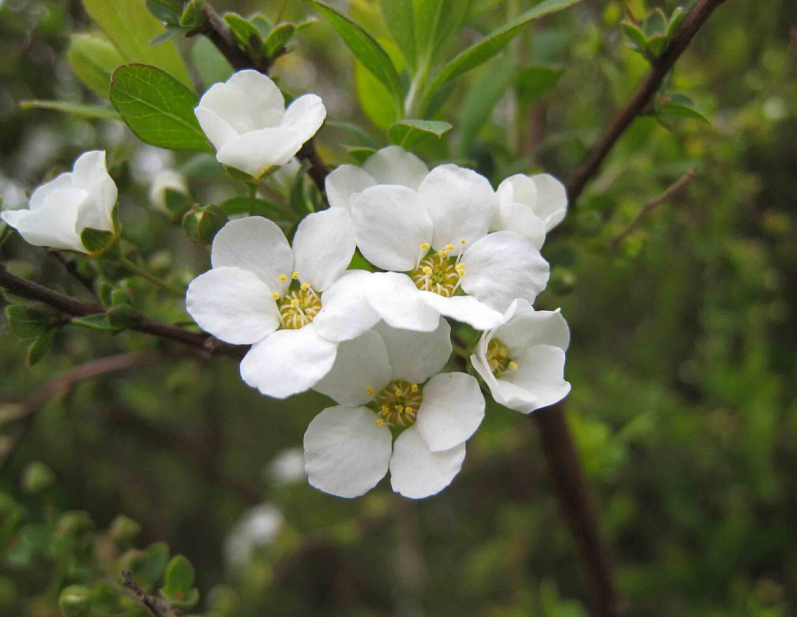

# Spirea (Bridal Wreath)

> Arching branches foaming with tiny white flowers — the "bridal wreath" shrub, a
> quietly perfect wedding flower whose very name means marriage and new beginnings.

## Botanical identity
- **Common name(s):** Spirea; bridal wreath (S. prunifolia, S. × vanhouttei);
  *yukiyanagi* ("snow willow," Japan)
- **Scientific name:** *Spiraea* spp.
- **Family:** Rosaceae
- **Type:** Spray / filler flower (arching, cascading)

## Native region & origin
- **Native to:** The **Northern Hemisphere**, with a center of diversity in **East
  Asia** (China, Japan, Korea).
- **Now cultivated in:** Worldwide as a garden shrub and cut branch.
- **Domestication / spread notes:** A classic cottage-garden shrub; the arching,
  flower-laden branches earned the name **"bridal wreath"** and a firm place in
  wedding work.

## Visual identification (for reading a photo)
- **Bloom form:** Long, **arching woody branches lined with dense clusters of
  tiny 5-petaled flowers**, creating a cascading foam.
- **Size:** Long branches; individual flowers are minute.
- **Petals:** Five small rounded petals per tiny floret; massed in clusters or
  along the stem.
- **Center:** Tiny tuft of stamens per floret.
- **Color range:** White (classic bridal wreath); some pink species.
- **Foliage/stem cues:** Small toothed leaves on slender arching woody stems.
- **Look-alikes:** Baby's breath (finer, cloud-like) and deutzia; spirea is
  confirmed by its **arching branches lined with clustered white flowers**.

## History & cultural background
A beloved spring shrub whose cascading white branches gave it the name "bridal
wreath" — tying it, aptly, to weddings, marriage, and new beginnings, and making
it a favorite for cascading bridal and installation work.

## Symbolism & meaning
- **General meaning:** **Victory** (the classical meaning) and, via "bridal
  wreath," **marriage, a happy union, and new beginnings.**
- **By color:** Almost always white — purity and new beginnings.

## Cultural meanings across the world
- **East Asia (origin/Japan):** *Yukiyanagi* ("snow willow") is a cherished
  **spring** flower in Japan — a symbol of **elegance and the arrival of spring**,
  its arching branches like drifts of snow.
- **Western / floristry:** The name **"bridal wreath"** ties it firmly to
  **weddings, marriage, and new beginnings** — a knowing, apt choice for bridal
  bouquets and cascades.
- **Classical:** *Spiraea* is linked to **victory garlands** (the genus name comes
  from the Greek for a wreath/garland).
- **Note:** A positive, celebratory flower with strong wedding associations.

## Typical pairings
- **Arranged with:** Garden roses, ranunculus, tulips, and peonies in soft,
  garden-style and bridal bouquets; adds airy, cascading movement.
- **Greenery/fillers:** Functions partly **as** an airy white filler.
- **Anchors:** Loose, romantic, "just-gathered" and cascading bridal arrangements.

## Occasions & events
- **Strongly associated with:** **Weddings** (the name says it all), spring
  bouquets, and new-beginning celebrations.
- **Avoid for:** Little to avoid; delicate and best enjoyed fresh in season.

## Seasonality & availability
- **Natural season:** **Spring** (a brief, prized window).
- **Commercial availability:** Best in spring, often from local growers.
- **Vase life / care notes:** ~5–7 days; woody stems benefit from a fresh angled
  cut and deep water; handle the delicate flowers gently.

## Quick facts
- **Birth month:** — (a spring flower)
- **Wedding anniversary:** — (no standard year; strongly wedding-associated)
- **Notable toxicity/allergy:** Generally **non-toxic**.

## Reference images
<!-- IMAGES-START -->
Reference photos, all under reusable licenses (CC-BY / CC-BY-SA / CC0 / public domain) from Wikimedia Commons. Full attribution in [`image-manifest.json`](../images/image-manifest.json).

*Spiraea prunifolia Tawuła śliwolistna 2019-04-28 01 — Agnieszka Kwiecień, Nova · CC BY-SA 4.0*

*Spiraea prunifolia Tawuła śliwolistna 2019-04-28 02 — Agnieszka Kwiecień, Nova · CC BY-SA 4.0*

*2013-05-04 15 01 33 Spiraea prunifolia flowers in Ewing, NJ — Famartin · CC BY-SA 3.0*

*笑靨花(李葉繡線菊)-單瓣 Spiraea prunifolia v simplicifolia -南京玄武湖公園 Nanjing, China- — 阿橋 HQ · CC BY-SA 2.0*
<!-- IMAGES-END -->

---
*Confidence / to-verify:* High on the bridal-wreath/marriage association, East
Asian origin and Japanese *yukiyanagi*, and the arching-clustered-flower ID.
