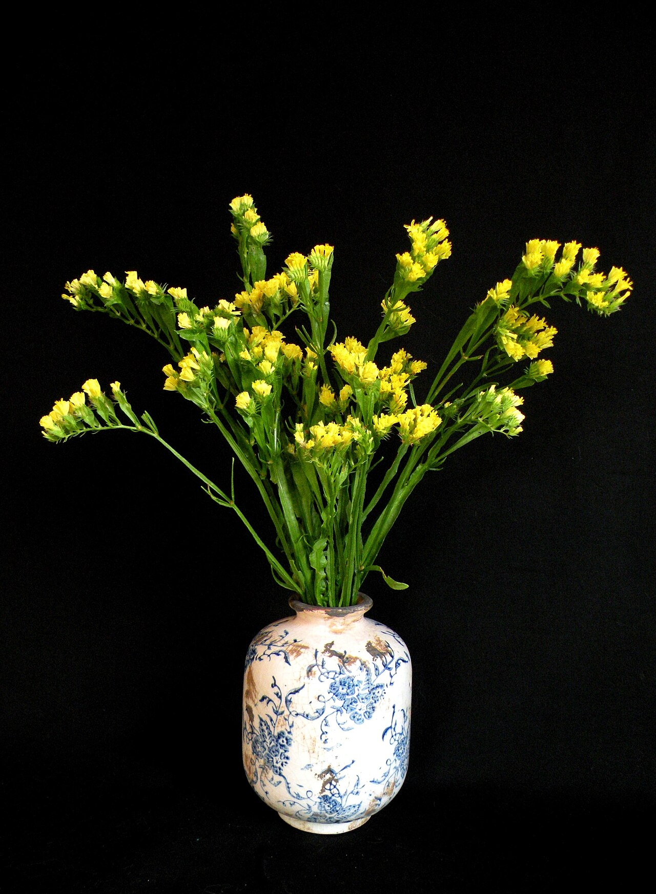
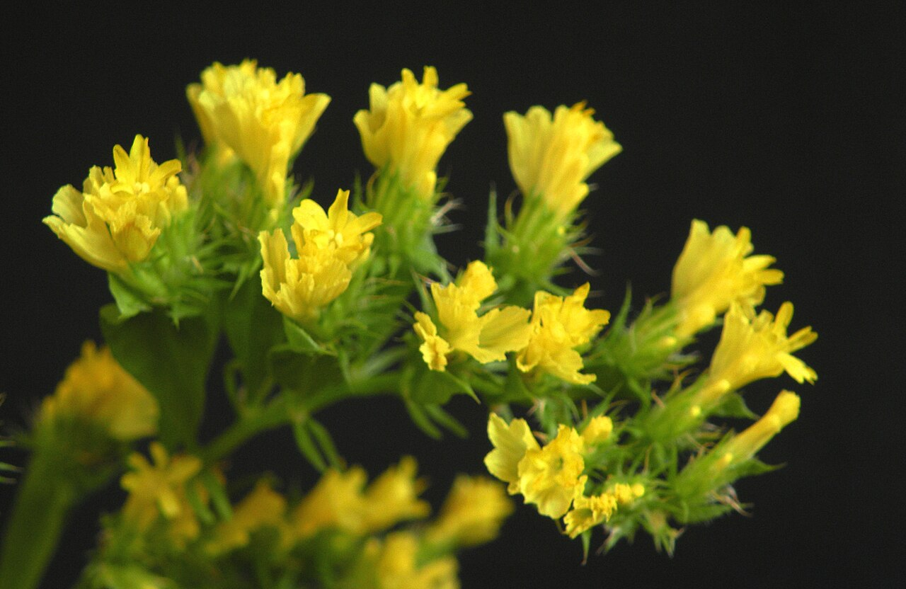
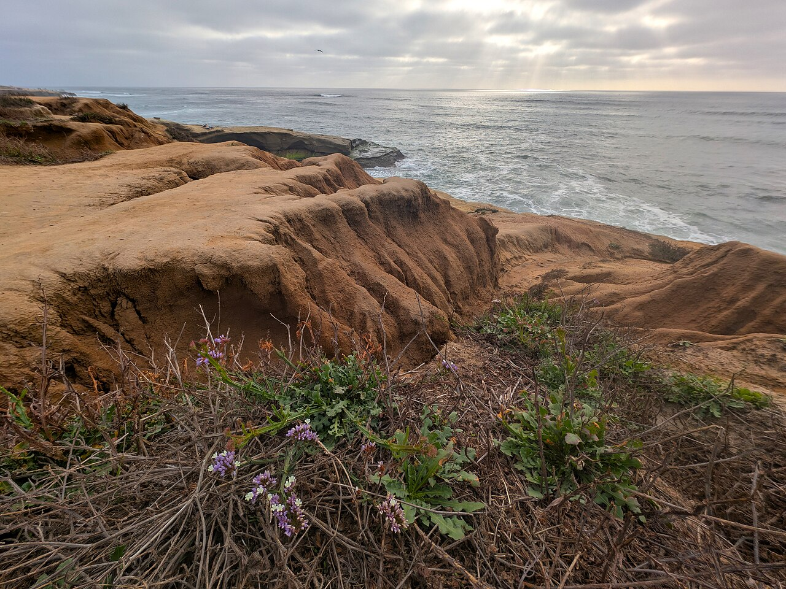
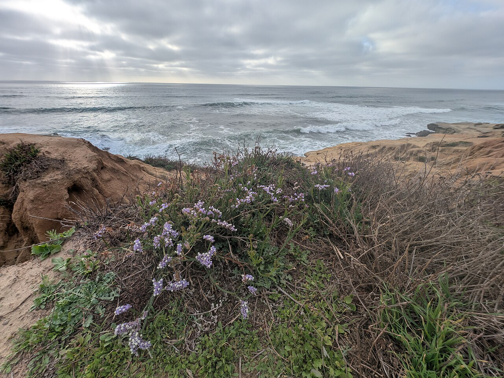

# Statice

> The crisp, papery "everlasting" flower — a Mediterranean sea lavender that holds
> its color forever, meaning remembrance and enduring memory.

## Botanical identity
- **Common name(s):** Statice; sea lavender; marsh rosemary; *Limonium*
- **Scientific name:** *Limonium sinuatum* (and other *Limonium* spp.)
- **Family:** Plumbaginaceae
- **Type:** Filler flower

## Native region & origin
- **Native to:** The **Mediterranean** coasts and salt marshes.
- **Now cultivated in:** Worldwide; naturalized in many coastal areas.
- **Domestication / spread notes:** A classic **"everlasting"** flower — it holds
  its color when dried almost indefinitely, which built its reputation for
  lasting memory.

## Visual identification (for reading a photo)
- **Bloom form:** Branching clusters of tiny, **papery, crisp florets** massed
  along **winged, angular stems**.
- **Size:** Small florets in airy sprays.
- **Petals:** Stiff, dry, papery — they feel and sound crisp.
- **Center:** Tiny; the color is in the papery calyces.
- **Color range:** Purple, blue, pink, white, yellow, and apricot.
- **Foliage/stem cues:** Distinctive **flattened, winged stems**; basal rosette
  of leaves.
- **Look-alikes:** Baby's breath (finer, rounder, softer) and wax flower; statice
  is confirmed by its **papery texture and winged stems**.

## History & cultural background
Prized for centuries as an everlasting — a flower that never seems to die — statice
became a natural emblem of **remembrance and enduring affection**, and a workhorse
filler and dried-flower staple.

## Symbolism & meaning
- **General meaning:** **Remembrance, lasting beauty, enduring memory, success,
  and sympathy** — "I will never forget you."
- **By color:** Colors follow their general meanings (see color-symbolism.md); the
  everlasting quality anchors the "remembrance" theme regardless of hue.

## Cultural meanings across the world
- **Mediterranean (origin):** A native of coastal salt marshes — "sea lavender" —
  long valued as a durable everlasting.
- **Western / Victorian:** Firmly **remembrance and lasting memory** — its
  refusal to fade made it the flower of **"never forgetting,"** used in sympathy
  and memorial work and in keepsake dried arrangements.
- **Note:** A gentle, positive filler with no strong negative or funerary-taboo
  weight beyond its remembrance association.

## Typical pairings
- **Arranged with:** Roses, sunflowers, and nearly any focal flower needing airy
  color; a staple filler and dried-flower base.
- **Greenery/fillers:** Functions **as** filler; pairs with baby's breath and
  greens.
- **Anchors:** Everlasting/dried arrangements; long-lasting mixed bouquets.

## Occasions & events
- **Strongly associated with:** Sympathy and memorial arrangements, keepsake and
  dried bouquets, and everyday filler.
- **Avoid for:** Little to avoid; too textural to carry a solemn statement alone.

## Seasonality & availability
- **Natural season:** Summer.
- **Commercial availability:** **Year-round**, fresh and dried.
- **Vase life / care notes:** Extremely long-lasting fresh; **dries beautifully**
  and holds color for years.

## Quick facts
- **Birth month:** — (not a traditional birth flower)
- **Wedding anniversary:** — (no standard year)
- **Notable toxicity/allergy:** Generally **non-toxic**.

## Reference images
<!-- IMAGES-START -->
Reference photos, all under reusable licenses (CC-BY / CC-BY-SA / CC0 / public domain) from Wikimedia Commons. Full attribution in [`image-manifest.json`](../images/image-manifest.json).

*Yellow Statice flowers arranged in vase — Nzfauna · CC BY-SA 4.0*

*Yellow Statice flowers, close up from top — Nzfauna · CC BY-SA 4.0*

*Limonium sinuatum kz06 — Krzysztof Ziarnek, Kenraiz · CC BY-SA 4.0*

*Limonium sinuatum kz05 — Krzysztof Ziarnek, Kenraiz · CC BY-SA 4.0*
<!-- IMAGES-END -->

---
*Confidence / to-verify:* High on Mediterranean sea-lavender origin, the
everlasting/dried quality, and the remembrance/"never forget" symbolism.
