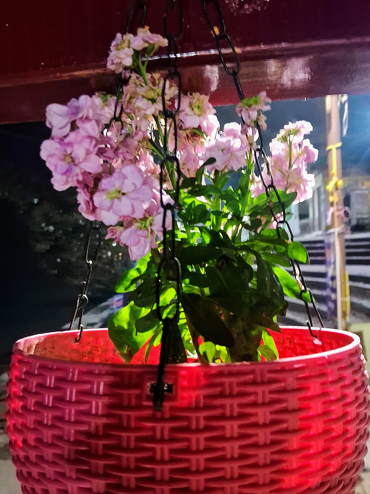
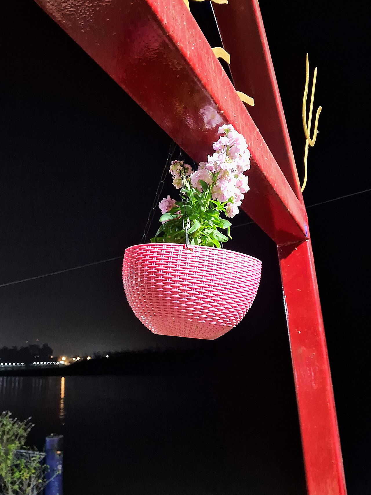
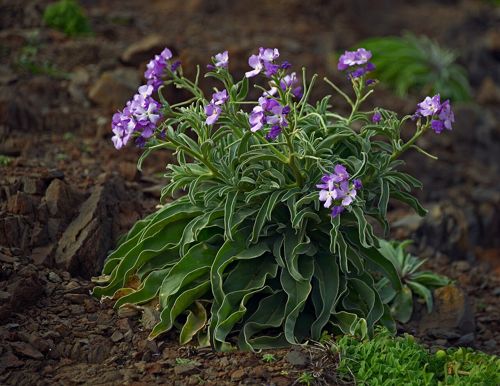
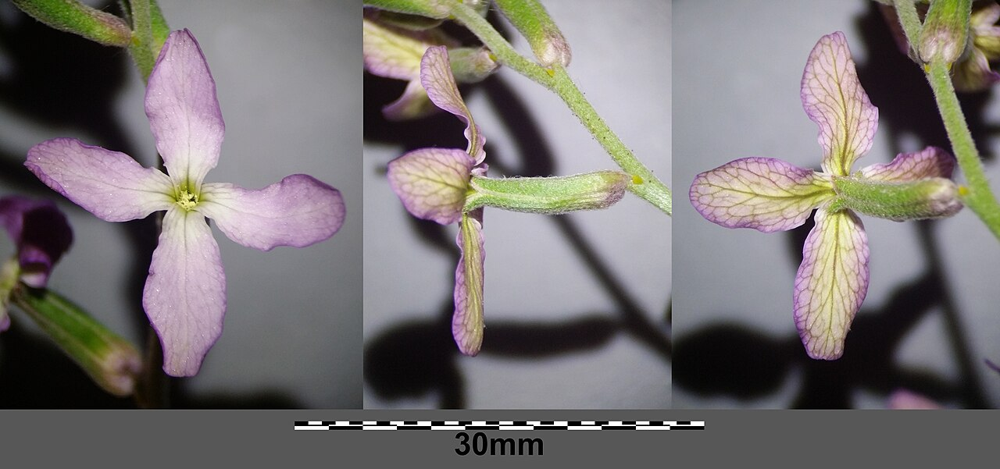

# Stock (Matthiola)

> A clove-scented cottage-garden spike meaning lasting beauty and a happy life —
> the fragrant filler that turns a bouquet into an experience.

## Botanical identity
- **Common name(s):** Stock; gillyflower; *Matthiola*
- **Scientific name:** *Matthiola incana*
- **Family:** Brassicaceae (the mustard/cabbage family)
- **Type:** Line flower (an upright, fragrant spike)

## Native region & origin
- **Native to:** The **Mediterranean** and coastal southern Europe.
- **Now cultivated in:** Worldwide as a cool-season cut flower.
- **Domestication / spread notes:** Named for the 16th-century Italian botanist
  **Pietro Andrea Mattioli**. A beloved old cottage-garden flower prized for a
  spicy, **clove-and-sweet fragrance**.

## Visual identification (for reading a photo)
- **Bloom form:** A dense **upright spike** of ruffled florets; often fully
  **double** and frilly, sometimes single with a clear cross of four petals.
- **Size:** Medium spikes with closely set blooms.
- **Petals:** Four-petaled (cruciform) florets — the cabbage-family signature —
  crowded and ruffled in doubles.
- **Center:** Small; hidden in doubles.
- **Color range:** White, cream, pink, lavender, purple, red, apricot, and yellow —
  usually soft, pastel tones.
- **Foliage/stem cues:** Soft, grey-green, slightly downy lance-shaped leaves.
- **Look-alikes:** Snapdragon and delphinium spikes; stock is confirmed by its
  **ruffled four-petaled florets, grey-green downy leaves, and strong sweet
  fragrance**.

## History & cultural background
An old-fashioned favorite of European cottage gardens, stock earns its place in
modern bouquets on scent alone. Its Victorian meaning centers on **enduring
beauty and a contented, happy life**.

## Symbolism & meaning
- **General meaning:** **Lasting beauty**, a happy life, contented existence,
  **bonds of affection**, and promptness ("you'll always be beautiful to me").
- **By color:** Colors follow their general meanings (see color-symbolism.md);
  soft pastels reinforce the gentle, affectionate reading.

## Cultural meanings across the world
- **Mediterranean (origin):** A native of southern Europe's coasts, long grown in
  cottage and monastery gardens.
- **Western / Victorian:** Firmly a message of **lasting beauty and a happy,
  affectionate life together** — a warm sentiment for weddings and anniversaries.
- **Fragrance culture:** Its clove-sweet scent makes it a favorite "experience"
  flower; historically strewn and grown for perfume.
- **Note:** A gentle, positive flower with little negative or funerary baggage.

## Typical pairings
- **Arranged with:** Roses, ranunculus, snapdragons, and larkspur in garden-style
  bouquets; adds scent, softness, and vertical volume.
- **Greenery/fillers:** Its own foliage; light greens.
- **Anchors:** Fragrant, romantic, cottage-garden arrangements.

## Occasions & events
- **Strongly associated with:** Weddings, anniversaries, spring bouquets, and any
  arrangement that wants a beautiful fragrance.
- **Avoid for:** Little to avoid; scent may be strong for the very sensitive.

## Seasonality & availability
- **Natural season:** **Spring** (a cool-season crop).
- **Commercial availability:** Best late winter through spring.
- **Vase life / care notes:** ~5–7 days; change water often (thick stems foul
  water fast) and remove lower leaves.

## Quick facts
- **Birth month:** — (a spring flower)
- **Wedding anniversary:** — (no standard year; a wedding staple)
- **Notable toxicity/allergy:** **Non-toxic** and considered pet-safe; petals are
  edible.

## Reference images
<!-- IMAGES-START -->
Reference photos, all under reusable licenses (CC-BY / CC-BY-SA / CC0 / public domain) from Wikimedia Commons. Full attribution in [`image-manifest.json`](../images/image-manifest.json).

*Matthiola incana in hanging basket — Krishnav25 · CC0*

*Matthiola incana in hanging basket - 2 — Krishnav25 · CC0*

*Matthiola incana. Madeira, Portugal — Ввласенко · CC BY-SA 3.0*

*Matthiola incana sl7 — Stefan.lefnaer · CC BY-SA 4.0*
<!-- IMAGES-END -->

---
*Confidence / to-verify:* High on Mediterranean origin, the Mattioli naming, the
cruciform-floret/fragrance ID, and the lasting-beauty symbolism.
