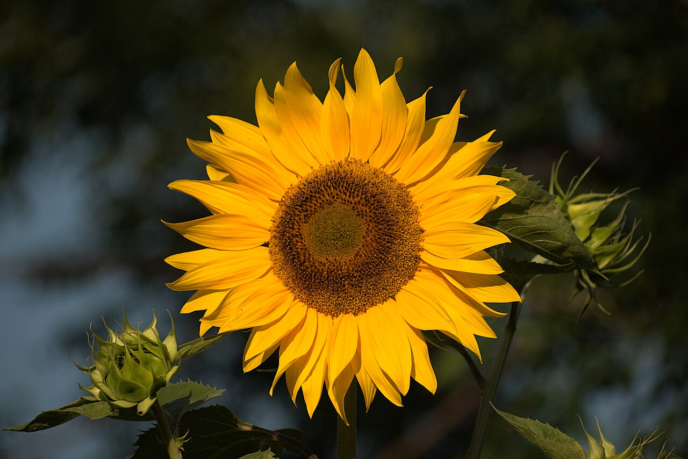
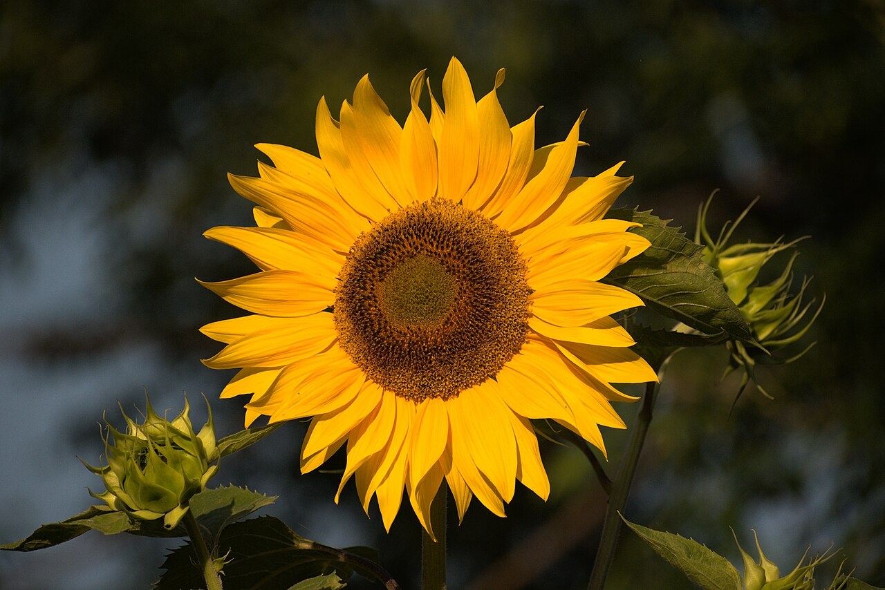
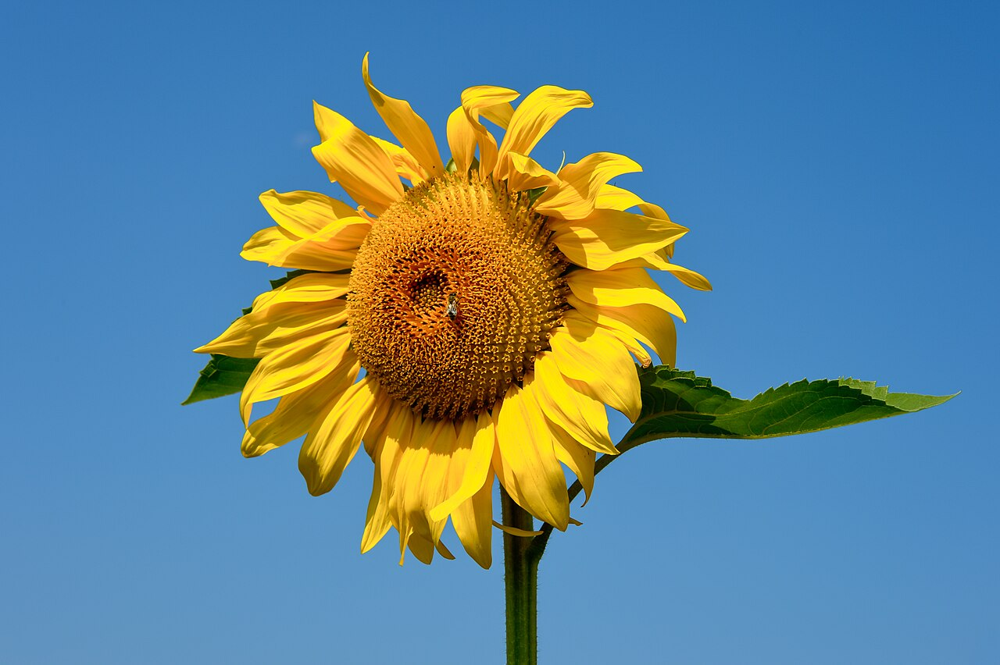
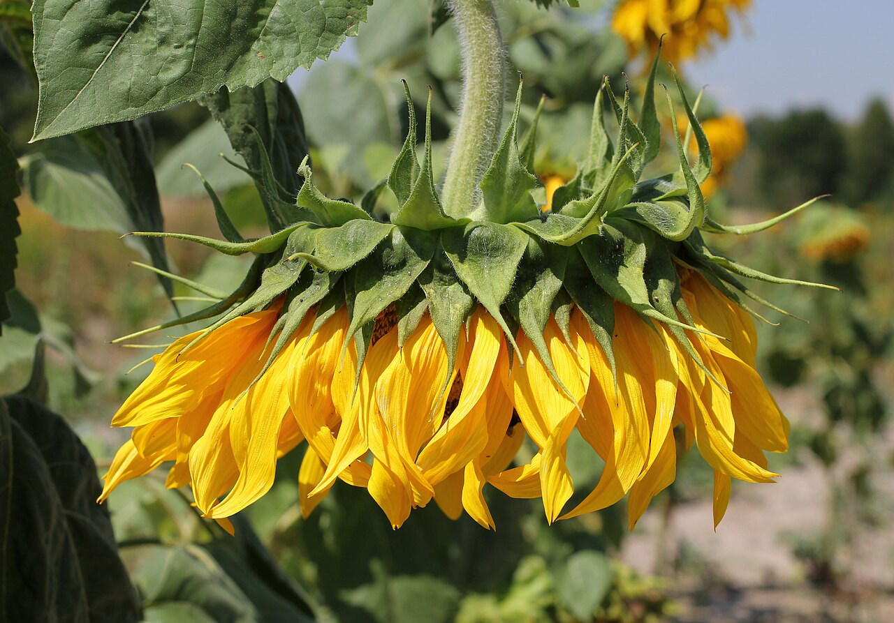

# Sunflower

> The face that follows the sun. An American native turned global symbol of
> adoration, loyalty, and — since 2022 — Ukrainian resistance.

## Botanical identity
- **Common name(s):** Sunflower; *girasol* / *tournesol* ("turns with the sun")
- **Scientific name:** *Helianthus annuus* (from Greek *helios* sun + *anthos*
  flower)
- **Family:** Asteraceae
- **Type:** Daisy-form / focal flower (also a dramatic line element when tall)

## Native region & origin
- **Native to:** **North America.** Domesticated by **Indigenous peoples** ~3,000–
  5,000 years ago for seeds, oil, dye, and food.
- **Now cultivated in:** Ukraine, Russia, Argentina, and worldwide — both as an
  ornamental and a major **oilseed crop**.
- **Domestication / spread notes:** Spanish explorers carried it to Europe in the
  16th century; **Russia and Ukraine** bred the large oilseed varieties that made
  it an agricultural staple, then re-exported those cultivars worldwide.

## Visual identification (for reading a photo)
- **Bloom form:** A large **daisy-form** head — a ring of broad ray petals around
  a big central **disc** packed with seeds (a spiral of hundreds of tiny florets).
- **Size:** Large to very large; dwarf florist types are smaller.
- **Petals:** Broad, pointed golden-yellow rays (some red/mahogany cultivars).
- **Center:** Prominent flat disc, green-to-brown, often huge.
- **Color range:** Yellow/gold dominant; also rust, bronze, and bicolor.
- **Foliage/stem cues:** Thick, hairy stem; large heart-shaped leaves. Young
  heads **track the sun (heliotropism)**; mature heads face east.
- **Look-alikes:** Gerbera (smaller, cleaner disc), rudbeckia/black-eyed Susan
  (smaller, dark cone). The big seed-packed disc says sunflower.

## History & cultural background
The heliotropism of the young flower — turning to follow the sun — is the root of
its symbolism of faith, loyalty, and adoration. From Indigenous American
agriculture to Van Gogh's canvases to Ukrainian fields, it is a flower of warmth
and steadfastness.

## Symbolism & meaning
- **General meaning:** Adoration, loyalty, longevity, warmth, positivity, and
  "you are my sunshine"; faith and devotion (turning toward the light).
- **By color:**
  - **Yellow/gold** — Happiness, warmth, adoration, friendship.
  - **Red/mahogany** — Deeper, autumnal warmth; passion.
  - **Orange** — Energy, vitality.

## Cultural meanings across the world
- **Ukraine:** The **national flower** and a symbol of **peace** (planted at a
  1996 nuclear-disarmament ceremony) and, since the 2022 invasion, of
  **resistance and solidarity** worldwide.
- **China:** **Long life, good fortune, vitality**, and — via 20th-century
  imagery — loyalty; given for graduations and to wish a bright future.
- **Indigenous North America:** A staple food/oil/dye crop with agricultural and
  spiritual significance; grown for millennia.
- **Inca (South America):** Sunflower imagery was associated with the **sun god**;
  gold sunflower forms adorned temples (per Spanish chroniclers).
- **Greco-Roman / mythological:** The myth of **Clytie**, a water nymph who pined
  for the sun god and was transformed into a sun-following flower — hence
  **unrequited love and devotion**.

## Typical pairings
- **Arranged with:** Roses, gerberas, alstroemeria, solidago, and wheat/grasses
  for rustic looks.
- **Greenery/fillers:** Eucalyptus, salal, seeded grasses.
- **Anchors:** Cheerful, rustic, and autumnal bouquets; a bold single-focal
  statement.

## Occasions & events
- **Strongly associated with:** Summer and autumn, congratulations, graduations,
  get-well, rustic/country weddings, and Thanksgiving-season décor.
- **Avoid for:** Formal sympathy (usually too bright/casual), unless the deceased
  loved them.

## Seasonality & availability
- **Natural season:** **Late summer to autumn.**
- **Commercial availability:** Best summer–fall; available year-round at a premium.
- **Vase life / care notes:** ~6–12 days; heavy heads need support and frequent
  clean water (they drink a lot).

## Quick facts
- **Birth month:** — (strongly a summer/autumn flower)
- **Wedding anniversary:** 3rd
- **Notable toxicity/allergy:** Non-toxic; pollen can stain and trigger allergies;
  seeds are edible (the crop).

## Reference images
<!-- IMAGES-START -->
Reference photos, all under reusable licenses (CC-BY / CC-BY-SA / CC0 / public domain) from Wikimedia Commons. Full attribution in [`image-manifest.json`](../images/image-manifest.json).

*Sunflower (Helianthus annuus) D35 5965 01 — Adarsh Patel · CC BY-SA 4.0*

*Sunflower (Helianthus annuus) D35 5966 01 — Adarsh Patel · CC BY-SA 4.0*

*Eberndorf Köcking Sonnenblumenfeld Biohof Tomic 18072014 0792 — Johann Jaritz · CC BY-SA 4.0*

*Sunflower head 2015 G1 — George Chernilevsky · Public domain*
<!-- IMAGES-END -->

---
*Confidence / to-verify:* High on North American origin, heliotropism, Ukrainian
symbolism, and the Clytie myth. Inca temple detail is from historical chronicles.
