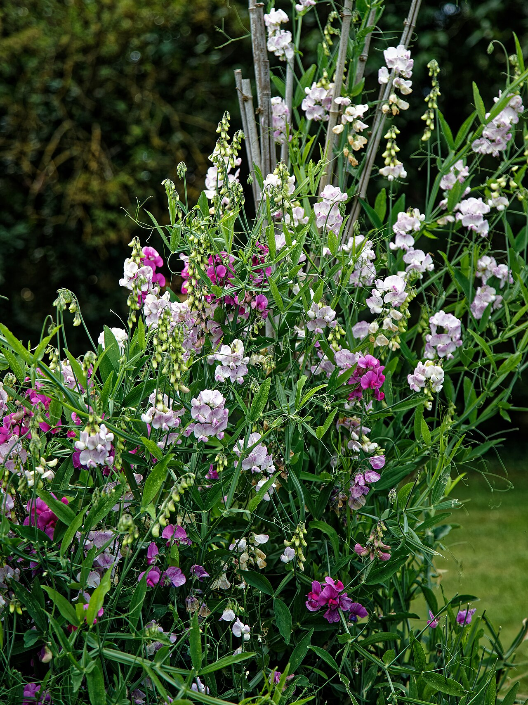
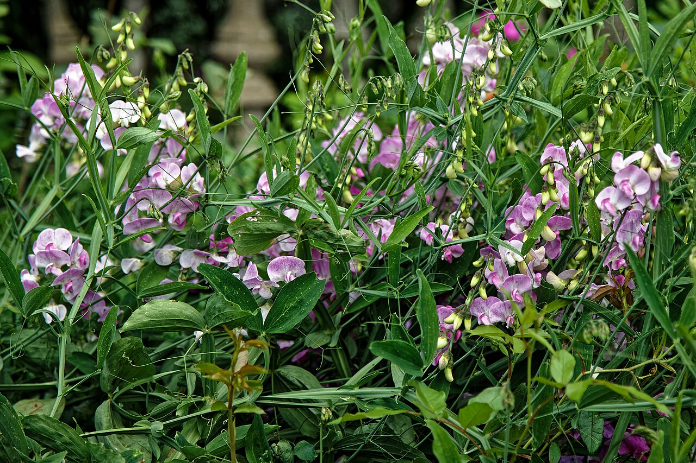
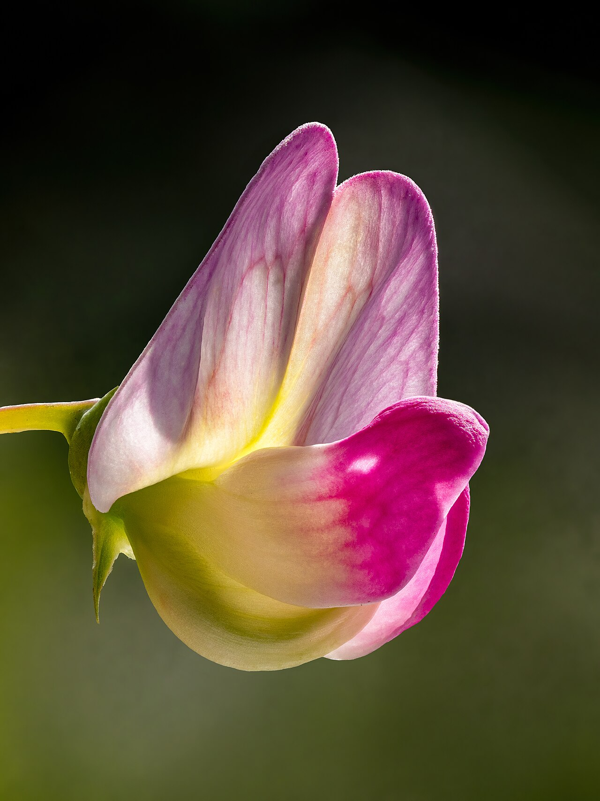
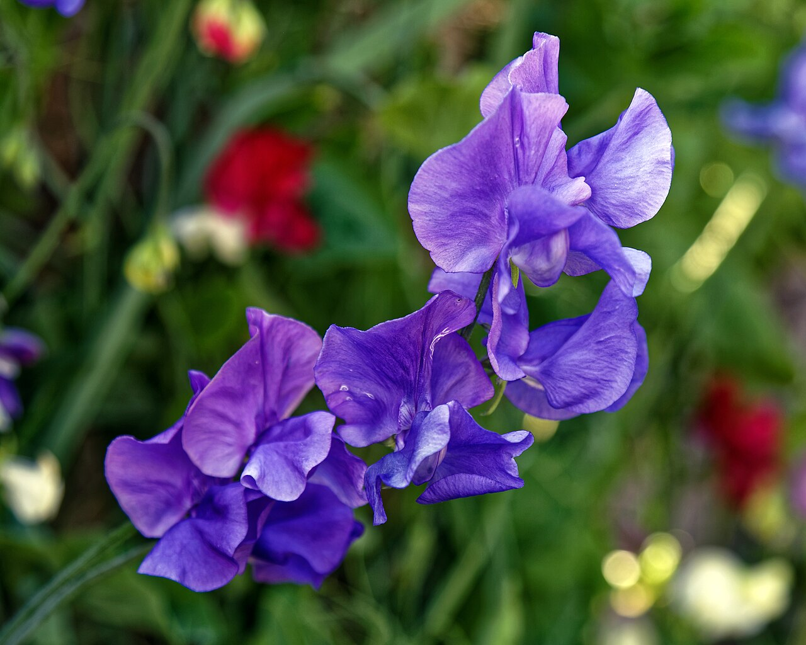

# Sweet Pea

> Ruffled, winged blossoms with a heavenly scent — the Edwardian flower of
> blissful pleasure and a gracious goodbye.

## Botanical identity
- **Common name(s):** Sweet pea
- **Scientific name:** *Lathyrus odoratus*
- **Family:** Fabaceae (the pea/legume family)
- **Type:** Spray flower (a fragrant climbing vine)

## Native region & origin
- **Native to:** **Sicily, southern Italy, and the Aegean.**
- **Now cultivated in:** The UK, the Netherlands, and worldwide.
- **Domestication / spread notes:** A Sicilian native that became an **Edwardian
  obsession**; the breeder **Henry Eckford** and the ruffled **"Spencer"**
  varieties (from the Countess Spencer) made it the flower of the era.

## Visual identification (for reading a photo)
- **Bloom form:** Delicate, ruffled **pea-family flowers** — an upright "banner"
  petal above winged side petals — several per stem.
- **Size:** Small, on slender wiry stems.
- **Petals:** Thin, crinkled, almost butterfly-like; softly ruffled.
- **Center:** The typical legume keel tucked within the wings.
- **Color range:** Pastel pinks, lavenders, whites, creams, and burgundy;
  bicolors.
- **Foliage/stem cues:** Climbing vine with curling **tendrils** and paired
  leaflets.
- **Look-alikes:** Other *Lathyrus* (the perennial "everlasting pea" is nearly
  scentless); the sweet pea is confirmed by its **powerful, sweet fragrance**.

## History & cultural background
Adored in the Edwardian era for scent above all, the sweet pea became the
signature flower of gracious gatherings — and its meaning, fittingly, is a warm
farewell and a thank-you for a lovely time.

## Symbolism & meaning
- **General meaning:** **Blissful pleasure**, delicate/tender goodbye, gratitude,
  and blissful memories; "thank you for a lovely time."
- **By color:** Colors follow their general meanings (see color-symbolism.md);
  the soft pastels reinforce a gentle, affectionate reading.

## Cultural meanings across the world
- **Sicily / Italy (origin):** A native of the Mediterranean, first noted by a
  Sicilian monk (Franciscus Cupani) who sent seeds abroad around 1700.
- **Britain (Edwardian):** The **flower of the Edwardian age** — bred into
  hundreds of ruffled "Spencer" varieties and prized for weddings and grand
  tables; a **gracious thank-you and farewell** flower.
- **Western / Victorian:** **Departure and blissful pleasure** — sent to say a
  fond goodbye or to thank a host.
- **Note:** A modern ornamental with light cultural baggage beyond the Edwardian
  and Victorian readings.

## Typical pairings
- **Arranged with:** Roses, ranunculus, peonies, and stock in soft, fragrant
  garden bouquets.
- **Greenery/fillers:** Its own tendrils and foliage; delicate greens.
- **Anchors:** Romantic, scented, cottage-and-wedding arrangements.

## Occasions & events
- **Strongly associated with:** Weddings, thank-you and farewell gifts, April
  birthdays, and fragrant spring bouquets.
- **Avoid for:** Little to avoid; delicate and short-lived, so not for long-haul
  displays.

## Seasonality & availability
- **Natural season:** **Spring to early summer.**
- **Commercial availability:** Best in spring; a favorite of local flower farms.
- **Vase life / care notes:** Short — ~3–5 days; keep cool and hydrated; enjoy
  the scent while it lasts.

## Quick facts
- **Birth month:** April (with daisy)
- **Wedding anniversary:** — (no standard year)
- **Notable toxicity/allergy:** **Toxic if the seeds/pods are eaten**
  (lathyrism); the ornamental sweet pea is not the edible garden pea.

## Reference images
<!-- IMAGES-START -->
Reference photos, all under reusable licenses (CC-BY / CC-BY-SA / CC0 / public domain) from Wikimedia Commons. Full attribution in [`image-manifest.json`](../images/image-manifest.json).

*Sweet pea Lathyrus odoratus at Easton Lodge Gardens, Little Easton, Essex, Engla — Acabashi · CC BY-SA 4.0*

*Sweet pea Lathyrus odoratus at Easton Lodge Gardens, Little Easton, Essex, Engla — Acabashi · CC BY-SA 4.0*

*Edelwicke (Lathyrus odoratus) Blüte focus stack-20200628-RM-175552 — Ermell · CC BY-SA 4.0*

*Sweet pea 'Lathyrus odoratus' violet flower at Boreham, Essex, England 4 — Acabashi · CC BY-SA 4.0*
<!-- IMAGES-END -->

---
*Confidence / to-verify:* High on Sicilian origin, the Eckford/Spencer Edwardian
history, the blissful-pleasure/goodbye meaning, and seed toxicity.
