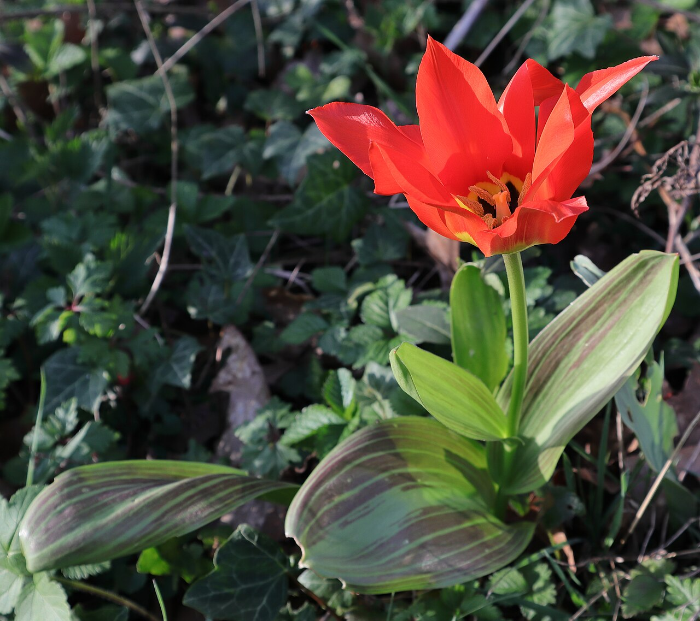
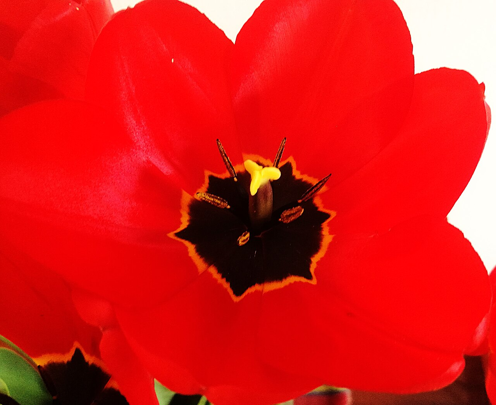
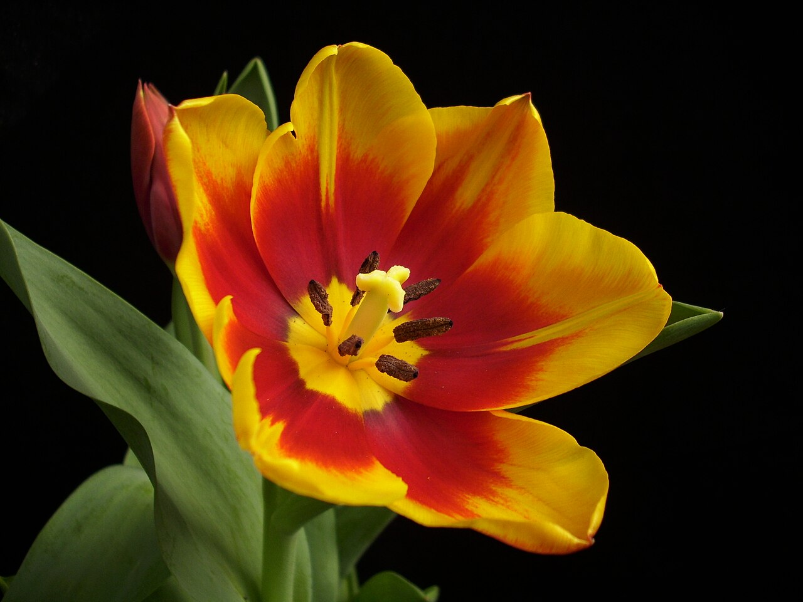
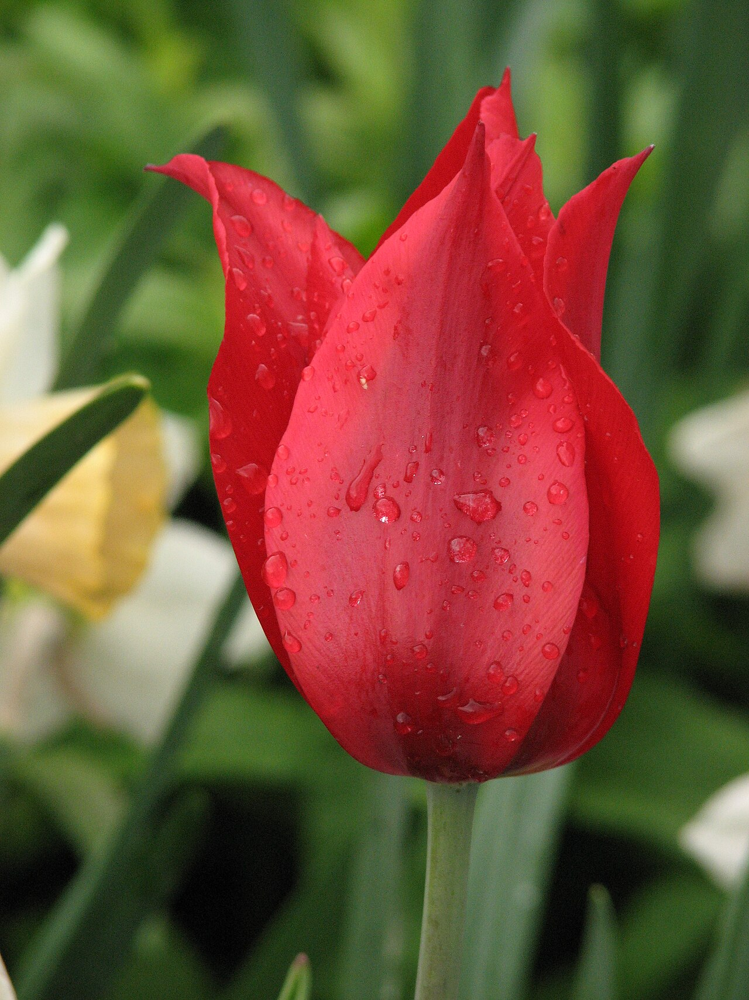

# Tulip

> The herald of spring, and the flower behind history's first speculative
> bubble.

## Botanical identity
- **Common name(s):** Tulip
- **Scientific name:** *Tulipa* spp. (~75 species; thousands of cultivars)
- **Family:** Liliaceae
- **Type:** Form / mass flower (a clean, cupped single bloom)

## Native region & origin
- **Native to:** **Central Asia** — the Tien Shan and Pamir mountain foothills —
  with wild species across a band from southern Europe to Central Asia.
- **Now cultivated in:** The **Netherlands** is the cultivation and export
  heartland; also grown widely across temperate regions.
- **Domestication / spread notes:** Prized by the **Ottoman Empire** (the name
  likely derives from a Persian word for turban), then carried to Europe in the
  16th century. In the Dutch Golden Age, **"Tulip Mania" (1630s)** saw bulb
  prices spike and crash — often cited as the first recorded asset bubble.

## Visual identification (for reading a photo)
- **Bloom form:** Smooth, symmetrical cup of six tepals on a single stem;
  closes at night, opens by day.
- **Size:** Medium; some cultivars are fringed, doubled ("peony tulips"), or
  parrot (ruffled, feathered).
- **Petals:** Six tepals, typically satiny and unmarked (parrot/fringed types
  are the exception).
- **Center:** Six stamens and a three-lobed stigma inside the cup.
- **Color range:** Nearly every color and many bicolors; famous "broken" streaks
  (historically caused by a virus) inspired the flamed cultivars.
- **Foliage/stem cues:** Broad, smooth, blue-green strappy leaves; stems keep
  growing and bending toward light after cutting.
- **Look-alikes:** Ranunculus and double tulips can blur; the six-tepal single
  cup and strappy leaves distinguish tulips.

## History & cultural background
From Ottoman court gardens (the "Tulip Era," *Lâle Devri*) to the Dutch trade,
the tulip is a symbol of both natural beauty and human speculation. It remains
an emblem of the Netherlands and of spring across the Northern Hemisphere.

## Symbolism & meaning
- **General meaning:** Perfect, deep love; spring, rebirth, and fresh starts.
- **By color:**
  - **Red** — True love, a declaration of love.
  - **Yellow** — Cheerful thoughts, sunshine, happiness. (Older meaning:
    hopeless or unrequited love.)
  - **White** — Forgiveness, purity, apology, respect.
  - **Purple** — Royalty, admiration.
  - **Pink** — Affection, caring, good wishes.
  - **Variegated/streaked** — "Beautiful eyes" (a Victorian reading).
- **Cultural variations:** A strong Turkish/Persian heritage as a symbol of
  paradise and perfect love, predating the Dutch association.

## Typical pairings
- **Arranged with:** Daffodils, hyacinths, ranunculus, muscari, and other
  spring bulbs; roses and peonies in mixed spring bouquets.
- **Greenery/fillers:** Their own foliage; light greenery.
- **Anchors:** Fresh, seasonal spring arrangements; clean single-variety bunches.

## Occasions & events
- **Strongly associated with:** Spring, Easter, Mother's Day, birthdays,
  "just because," and apologies (white).
- **Avoid for:** No strong taboos; a very seasonal, informal-to-elegant flower.

## Seasonality & availability
- **Natural season:** Spring (roughly March–May).
- **Commercial availability:** Widely available late winter through spring;
  forced bulbs extend the window.
- **Vase life / care notes:** ~5–7 days; note tulips keep elongating in the
  vase and bend toward light — arrange with that motion in mind.

## Quick facts
- **Birth month:** — (not a traditional birth flower)
- **Wedding anniversary:** 11th
- **Notable toxicity/allergy:** Bulbs are toxic if eaten; sap can irritate skin
  ("tulip fingers").

## Reference images
<!-- IMAGES-START -->
Reference photos, all under reusable licenses (CC-BY / CC-BY-SA / CC0 / public domain) from Wikimedia Commons. Full attribution in [`image-manifest.json`](../images/image-manifest.json).

*Tulipe des jardins (Tulipa gesneriana) — JackyM59 · CC BY-SA 4.0*

*Flower tulip Tulipa L. — BogTar201213 · CC BY-SA 4.0*

*Tulipa flower — Jorgebarrios · CC BY-SA 3.0*

*Tulip lily-flowered cv. 107 — Kor!An (Андрей Корзун) · CC BY-SA 3.0*
<!-- IMAGES-END -->

---
*Confidence / to-verify:* High confidence on identity, native range, and
Tulip-Mania history. "Broken"-color virus detail is well documented.
