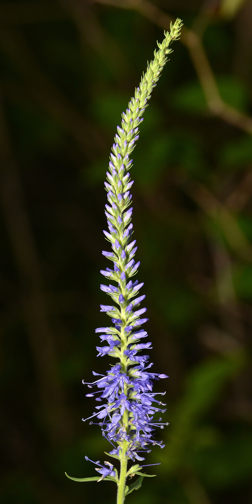
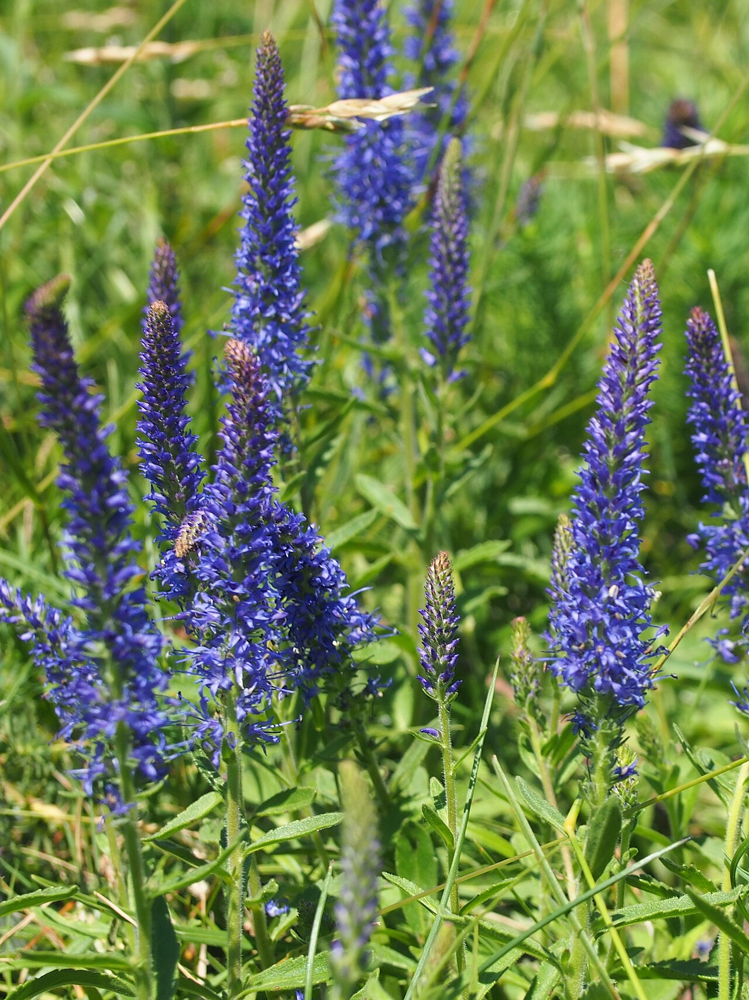
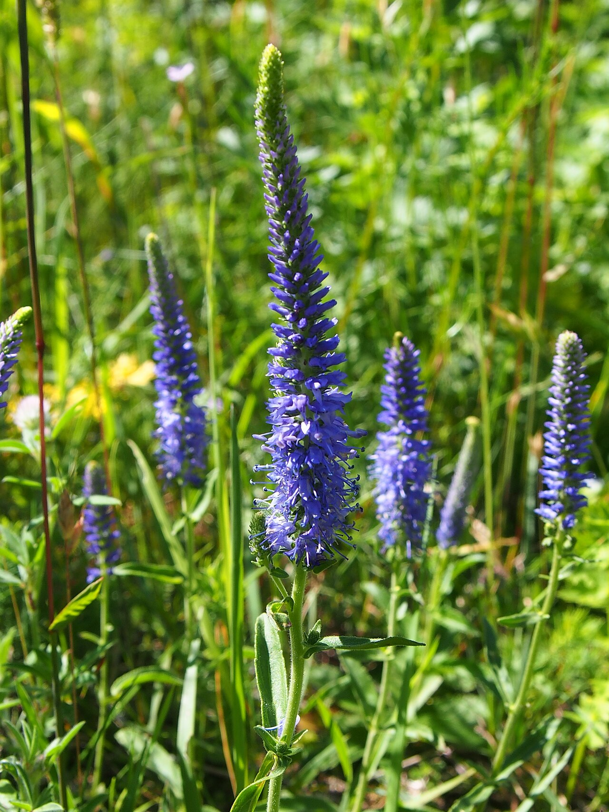
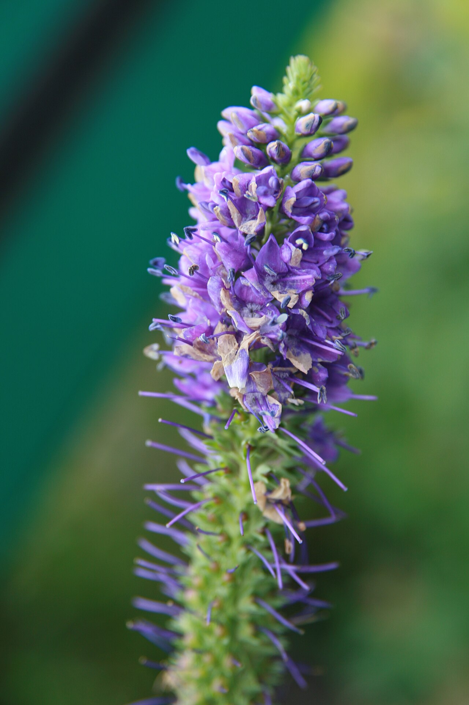

# Veronica (Speedwell)

> Slender tapering spires of tiny florets — a delicate line flower meaning
> fidelity, named for a saint and wishing travelers "speed well."

## Botanical identity
- **Common name(s):** Veronica; speedwell
- **Scientific name:** *Veronica spicata* / *V. longifolia*
- **Family:** Plantaginaceae
- **Type:** Line flower (a slim vertical spike)

## Native region & origin
- **Native to:** **Europe and Asia** (temperate).
- **Now cultivated in:** Worldwide as a garden perennial and cut flower.
- **Domestication / spread notes:** Traditionally named after **Saint Veronica**,
  who is said to have wiped Christ's face; the common name "speedwell" is a
  farewell — **"speed you well"** — a wish for a safe journey.

## Visual identification (for reading a photo)
- **Bloom form:** A **slender, tapering spike** densely packed with **many tiny
  florets** opening from the bottom up.
- **Size:** Slim spikes on wiry stems; a delicate vertical accent.
- **Petals:** Tiny four-lobed florets crowded up the spire.
- **Center:** Small; florets carry protruding stamens.
- **Color range:** Blue, purple, violet, pink, and white.
- **Foliage/stem cues:** Narrow, toothed leaves up slim stems.
- **Look-alikes:** Liatris and small salvia spikes; veronica is finer and more
  tapering, with tiny densely set florets.

## History & cultural background
A modest garden perennial whose name ties it to both Christian legend and the old
traveler's blessing "speed well" — giving it enduring meanings of fidelity and a
safe, well-wished journey.

## Symbolism & meaning
- **General meaning:** **Fidelity and loyalty** (especially female fidelity);
  healing; and a **good-luck farewell** ("go safely").
- **By color:** Colors follow their general meanings (see color-symbolism.md);
  the cool blues/purples reinforce constancy and calm.

## Cultural meanings across the world
- **Christian (Europe):** Named for **Saint Veronica**; associated with **faith,
  healing, and holy compassion**.
- **European folklore:** As **"speedwell,"** it carried a traveler's blessing —
  sprigs were sewn into departing travelers' clothes to wish them **safe passage
  ("speed you well")** and good luck.
- **Western / Victorian:** Chiefly **fidelity and loyalty** — a token of faithful,
  constant love.
- **Note:** A gentle, positive line flower with no strong negative associations.

## Typical pairings
- **Arranged with:** Roses, lisianthus, and dahlias, supplying vertical line and
  cool color; a garden-bouquet accent.
- **Greenery/fillers:** Its own foliage; airy greens.
- **Anchors:** Garden-style and cottage arrangements; a soft "line" element.

## Occasions & events
- **Strongly associated with:** Garden and cottage bouquets, faithful-love and
  bon-voyage gifts, and summer arrangements.
- **Avoid for:** Little to avoid; a supporting flower rather than a focal statement.

## Seasonality & availability
- **Natural season:** Summer.
- **Commercial availability:** Best in season.
- **Vase life / care notes:** ~5–8 days; florets open up the spike — buy with the
  lower florets just showing color.

## Quick facts
- **Birth month:** — (not a traditional birth flower)
- **Wedding anniversary:** — (no standard year)
- **Notable toxicity/allergy:** Generally **non-toxic** and pet-safe.

## Reference images
<!-- IMAGES-START -->
Reference photos, all under reusable licenses (CC-BY / CC-BY-SA / CC0 / public domain) from Wikimedia Commons. Full attribution in [`image-manifest.json`](../images/image-manifest.json).

*Spiked Speedwell (Veronica spicata) - Bærum, Norway 2021-07-14 — Ryan Hodnett · CC BY-SA 4.0*

*Veronica spicata Przetacznik kłosowy 2020-07-05 Olsztyn 05 — Agnieszka Kwiecień, Nova · CC BY-SA 4.0*

*Veronica spicata Przetacznik kłosowy 2020-07-05 Olsztyn 06 — Agnieszka Kwiecień, Nova · CC BY-SA 4.0*

*Veronica spicata Blue Charm 0zz — Photo by David J. Stang · CC BY-SA 4.0*
<!-- IMAGES-END -->

---
*Confidence / to-verify:* High on the St. Veronica naming, the "speedwell/speed
you well" farewell lore, and the fidelity symbolism.
