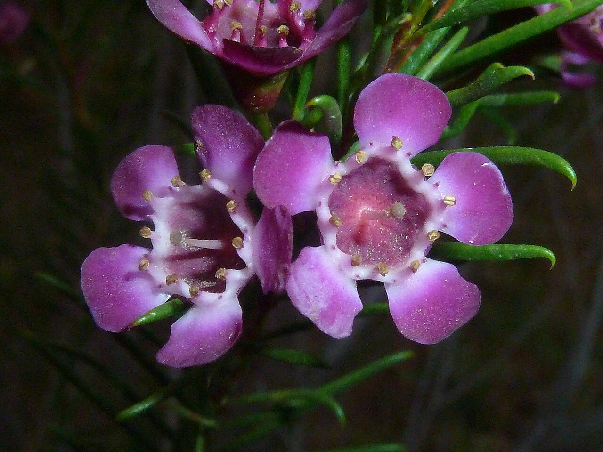
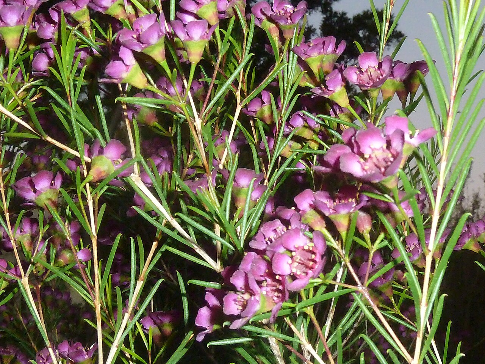
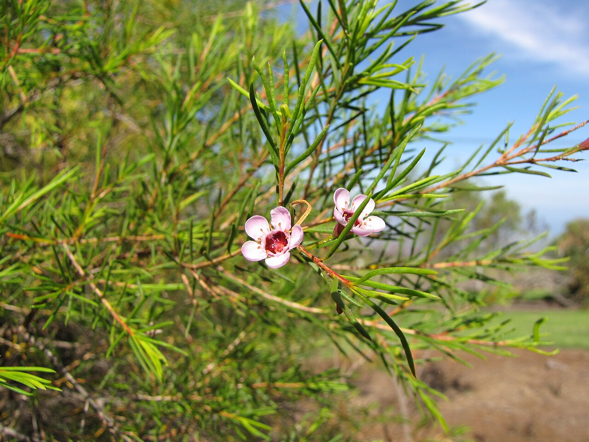
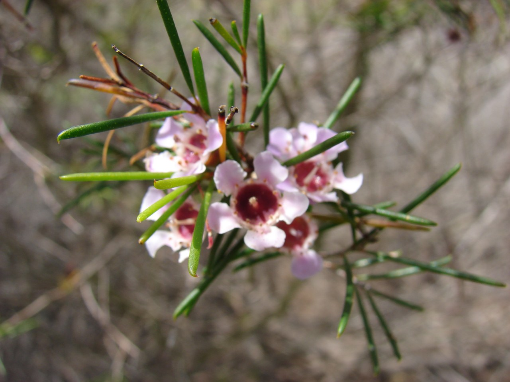

# Wax Flower

> Tiny, waxy, open blossoms on aromatic needle foliage — a Western Australian
> filler meaning lasting love and enduring freshness.

## Botanical identity
- **Common name(s):** Wax flower; Geraldton wax
- **Scientific name:** *Chamelaucium uncinatum*
- **Family:** Myrtaceae
- **Type:** Filler flower (with aromatic foliage)
- **Not to be confused with:** *Hoya* ("wax plant") or *Stephanotis*
  ("waxflower") — unrelated plants.

## Native region & origin
- **Native to:** **Western Australia** (the Geraldton region of the sandplains).
- **Now cultivated in:** Australia, Israel, California, and the Southern
  Hemisphere for the cut-flower trade.
- **Domestication / spread notes:** A tough, drought-hardy shrub of the Australian
  bush, prized as a **long-lasting filler** with fragrant, needle-like foliage.

## Visual identification (for reading a photo)
- **Bloom form:** Masses of small, **open, five-petaled waxy flowers** (like tiny
  tea-tree blossoms) with a darker center.
- **Size:** Small florets crowded along woody stems.
- **Petals:** Five rounded, **waxy** petals; a small cupped center.
- **Center:** A darker (often red/maroon) ring of stamens.
- **Color range:** White, pink, purple, red, and bicolor.
- **Foliage/stem cues:** **Fine, needle-like, aromatic leaves** (a citrus-resin
  scent when crushed).
- **Look-alikes:** Statice and baby's breath as fillers; the wax flower is
  confirmed by its **waxy open florets and needle foliage**.

## History & cultural background
A hardy native of the Western Australian sandplains turned prized florist filler,
the wax flower earns its meaning from its durable, waxy blooms — a symbol of
lasting love and enduring freshness.

## Symbolism & meaning
- **General meaning:** **Lasting/enduring love, patience, riches/success**, and
  long-lasting freshness (its durable, waxy blooms).
- **By color:** Colors follow their general meanings (see color-symbolism.md); the
  "lasting love" theme holds across hues.

## Cultural meanings across the world
- **Australia (origin):** A beloved native wildflower of Western Australia,
  associated with the rugged, enduring beauty of the bush.
- **Western / floristry:** Reads as **lasting love and patience** — its waxy,
  durable flowers symbolize a love that endures; a popular wedding filler.
- **Note:** A modern florist flower with light historical baggage; broadly
  positive and enduring in meaning.

## Typical pairings
- **Arranged with:** Roses, proteas, kangaroo paw, and native/textural blooms;
  softens and fills mixed bouquets.
- **Greenery/fillers:** Functions **as** filler; pairs with eucalyptus and native
  foliage.
- **Anchors:** Rustic, native, and long-lasting arrangements.

## Occasions & events
- **Strongly associated with:** Weddings (lasting love), everyday filler, and
  native/rustic designs.
- **Avoid for:** Little to avoid; the aromatic foliage can be strong for the
  scent-sensitive.

## Seasonality & availability
- **Natural season:** Winter to spring (Southern Hemisphere).
- **Commercial availability:** Much of the year via Southern-Hemisphere and
  counter-season supply.
- **Vase life / care notes:** Excellent — often **1–2+ weeks**; woody stems and
  waxy blooms hold up well.

## Quick facts
- **Birth month:** — (not a traditional birth flower)
- **Wedding anniversary:** — (no standard year)
- **Notable toxicity/allergy:** Generally **non-toxic**; aromatic oils may
  irritate very sensitive skin.

## Reference images
<!-- IMAGES-START -->
Reference photos, all under reusable licenses (CC-BY / CC-BY-SA / CC0 / public domain) from Wikimedia Commons. Full attribution in [`image-manifest.json`](../images/image-manifest.json).

*Chamelaucium uncinatum, blomme, Manie van der Schijff BT, a — JMK · CC BY-SA 3.0*

*Chamelaucium uncinatum, loof en blomme, Manie van der Schijff BT, a — JMK · CC BY-SA 3.0*

*Starr-091023-8551-Chamelaucium uncinatum-flowers and leaves-Kula Experiment Stat — Forest and Kim Starr · CC BY 3.0 us*

*Starr-120403-4117-Chamelaucium uncinatum-flowering habit-Kula-Maui — Forest and Kim Starr · CC BY 3.0 us*
<!-- IMAGES-END -->

---
*Confidence / to-verify:* High on Western Australian origin, the waxy-floret/
needle-foliage ID, the Hoya/Stephanotis name confusion, and lasting-love meaning.
