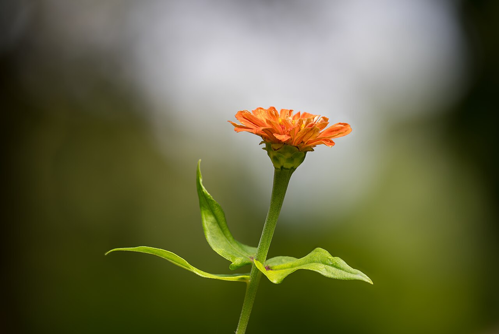
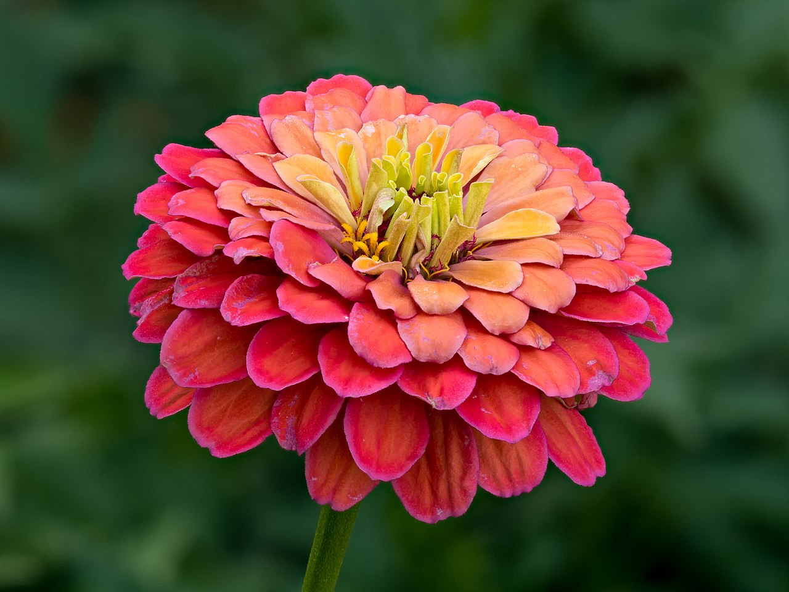
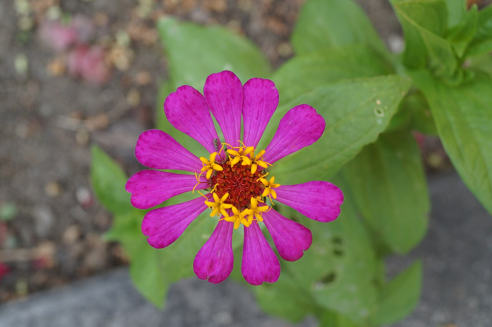
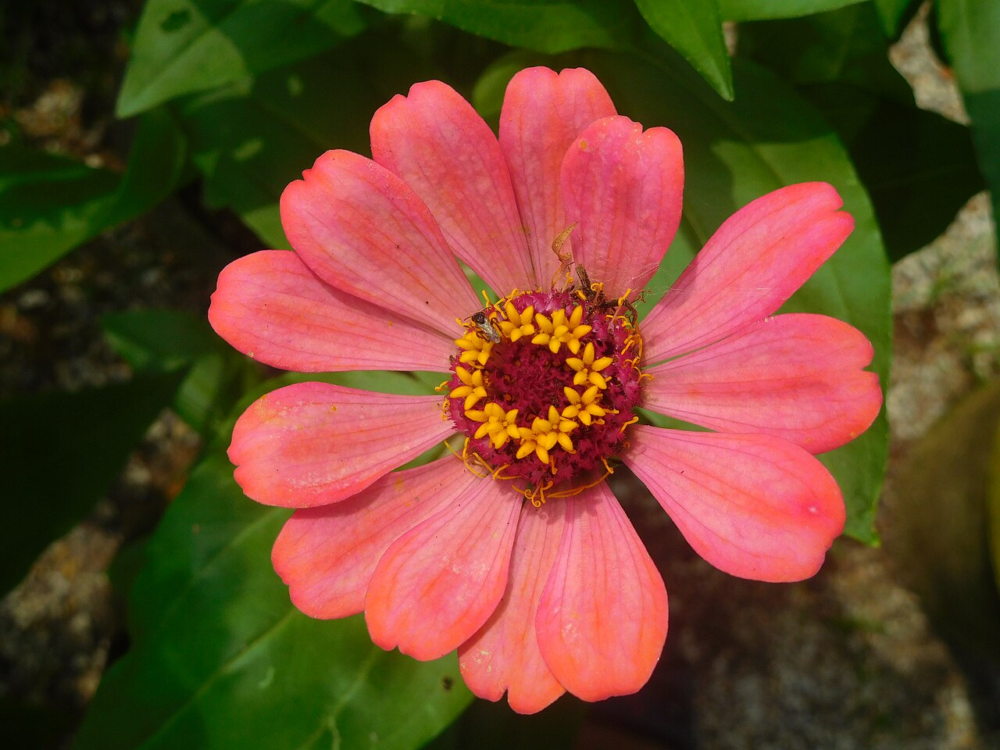

# Zinnia

> A cheerful, papery Mexican native that carries a tender meaning — thoughts of
> absent friends — and holds the distinction of being the first flower to bloom
> in space.

## Botanical identity
- **Common name(s):** Zinnia; "youth-and-old-age"
- **Scientific name:** *Zinnia elegans* (and hybrids)
- **Family:** Asteraceae
- **Type:** Daisy / mass form (varies with cultivar)

## Native region & origin
- **Native to:** **Mexico**, the southwestern US, and Central/South America.
- **Now cultivated in:** Worldwide as an easy garden and cut flower.
- **Domestication / spread notes:** Named after German botanist **Johann
  Gottfried Zinn**. The Aztecs reportedly found the wild plant plain; centuries of
  breeding turned it into the vivid, full-petaled cut flower of today.

## Visual identification (for reading a photo)
- **Bloom form:** From simple **daisy-form** to fully **double dahlia-like** heads.
- **Size:** Small to large; long, sturdy stems.
- **Petals:** Flat, slightly **papery** ray petals in neat rows.
- **Center:** A visible yellow disc (often star-tipped) in singles.
- **Color range:** Nearly every color and bicolor — but **no true blue**.
- **Foliage/stem cues:** Rough, clasping leaves on strong, upright stems.
- **Look-alikes:** Dahlias (larger, more geometric) and asters; the zinnia's
  papery petals, star-tipped center florets, and rough leaves distinguish it.

## History & cultural background
A humble Mexican wildflower bred into a cottage-garden and cutting favorite.
Beyond its cheer, it carries the tender Victorian meaning of **remembering an
absent friend** — and in 2016 became the **first flower to bloom aboard the
International Space Station**.

## Symbolism & meaning
- **General meaning:** **Thoughts of (and lasting affection for) absent
  friends**, endurance, daily remembrance, and constancy.
- **By color:**
  - **Scarlet** — Constancy.
  - **White** — Goodness.
  - **Yellow** — Daily remembrance.
  - **Magenta/mixed** — Lasting affection.

## Cultural meanings across the world
- **Mexico (origin):** A native wildflower long overlooked before ornamental
  breeding; now embraced in its homeland as a bright garden staple.
- **Western / Victorian:** Firmly a flower of **friendship and remembrance** —
  "I think of you (though we're apart)"; sent to distant friends and loved ones.
- **Modern / space history:** Famous as the **first flower grown and bloomed in
  space** (ISS, 2016), giving it a modern association with resilience and
  reaching new frontiers.

## Typical pairings
- **Arranged with:** Sunflowers, dahlias, cosmos, and marigolds in cheerful
  summer/cottage bouquets.
- **Greenery/fillers:** Grasses, its own foliage, baby's breath.
- **Anchors:** Bright, casual, "cutting-garden" arrangements.

## Occasions & events
- **Strongly associated with:** Friendship and thinking-of-you gifts, summer and
  late-summer bouquets, and cheerful everyday arrangements.
- **Avoid for:** Formal solemn occasions — it reads casual and cheerful.

## Seasonality & availability
- **Natural season:** Summer to first frost.
- **Commercial availability:** Best in season (a favorite of local flower farms).
- **Vase life / care notes:** ~5–7 days; a "dirty" stem that fouls water — change
  it often and keep foliage out of the vase.

## Quick facts
- **Birth month:** — (a summer flower)
- **Wedding anniversary:** — (no standard year)
- **Notable toxicity/allergy:** **Non-toxic** and pet-safe.

## Reference images
<!-- IMAGES-START -->
Reference photos, all under reusable licenses (CC-BY / CC-BY-SA / CC0 / public domain) from Wikimedia Commons. Full attribution in [`image-manifest.json`](../images/image-manifest.json).

*Common zinnia (Zinnia elegans) opening flower, Parque do Monteiro-Mor, Lisboa, P — Jules Verne Times Two · CC BY-SA 4.0*

*Zinnienblüte Zinnia elegans stack15 20190722-RM-7222254 — Ermell · CC BY-SA 4.0*

*Zinnia elegans 04 — Rjcastillo · CC BY-SA 3.0*

*Zinnia Elegans JNTBGRI 3 — Shishirdasika · CC BY-SA 4.0*
<!-- IMAGES-END -->

---
*Confidence / to-verify:* High on Mexican origin, the Zinn naming, the "absent
friends" meaning, and the first-flower-in-space fact (ISS, 2016).
